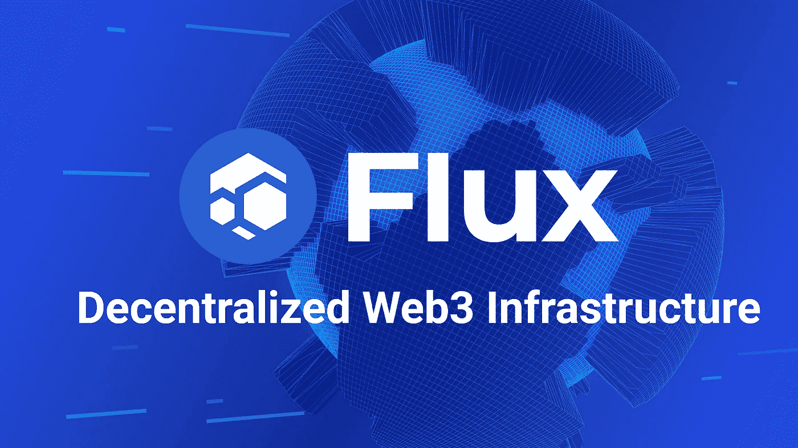
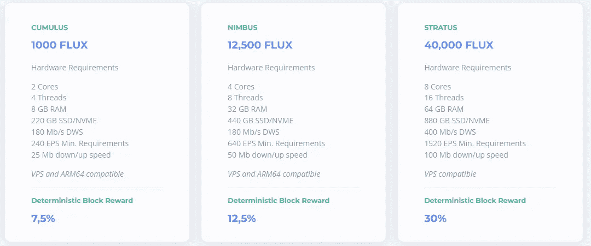
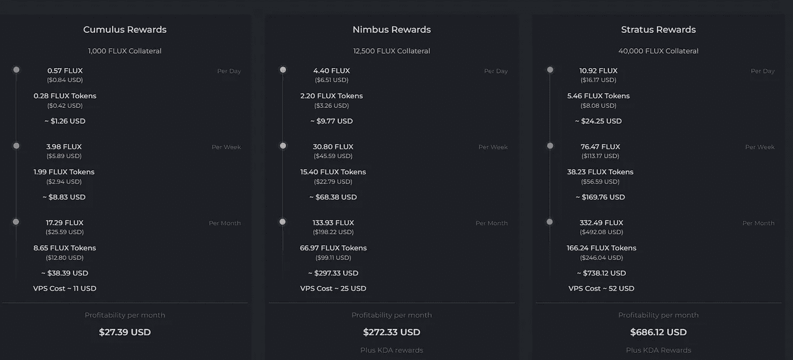

# 主节点系列:通量分析

> 原文：<https://medium.com/coinmonks/masternode-series-an-analysis-of-flux-bb692a538c5b?source=collection_archive---------12----------------------->

Image from [runonflux.io](https://runonflux.io)

欢迎来到我的 masternode 系列。在我的第一篇文章中，我写了如何投资 masternodes 而不被骗。现在我们将通过检查 Flux(以前的 ZelCash)来继续这个系列。是什么项目？它解决了什么问题？运营 Flux node 是否有利可图？我们开始吧！

**什么是通量？**

Flux 是 Web3 的去中心化计算。这么想吧，假设你是[的《加密突袭者》](https://cryptoraiders.xyz/)——一款使用 NFTs 的游戏。你需要游戏运行的处理能力，你有三种方法可以得到它。你可以购买服务器并自己运行，你可以使用像亚马逊网络服务(AWS)这样的服务，也可以使用像 Flux 这样的分散式网络。

让我们暂时把 Flux 的分散计算模型比其他两个选项更适合 Web3 的事实放在一边。我认为像 Flux 这样的服务对于像 Crypto Raiders 这样的公司来说是客观上更好的解决方案，原因有二:

1.  这比运行中央服务器要便宜。
2.  它比集中式服务器或集中式服务更健壮。

“但是等等，”我听到你说，“亚马逊是一家大公司。他们肯定能提供一致的服务。”没错，尽管当他们的数据中心出现问题时，他们仍然会有服务中断。另一方面，Flux 有你我这样的个体在世界各地运行的节点。上线的节点越多，网络就变得越健壮。

Flux 社区不仅能提供比 AWS 或微软 Azure 等服务更一致的产品，还能以更低的成本做到这一点。

**通量团队**

Flux 的团队是完全多元化的。一个完全多元化的团队让我对项目的寿命更有信心——尤其是一个专注于区块链即服务的项目。美国德根公司在不知道谁是幕后黑手的情况下在 JPEGs 上花费数万美元可能没问题，但公司仍然想知道他们在和谁做生意。对于与亚马逊和微软等公司同处一个领域的项目来说，一个多元化的团队至关重要。

**通量路线图**

说点实在的——路线图在加密领域没有任何预测价值。往好里说，它们是模棱两可的，往坏里说，它们是彻头彻尾的谎言。也就是说，我还是会看看路线图，看看一个项目取得了什么样的成就。[通量路线图](https://runonflux.io/roadmap.html)展示了稳定的成就和令人印象深刻的合作关系。

Q2 2022 及以后的路线图还有很多不足之处。令人难以置信的模糊，不幸的是，这在加密领域是正常的，可能是一个危险信号。鉴于 Flux 项目过去的成功，我愿意相信该团队有一个比他们 2022 年路线图显示的五个要点更全面的计划。不过，这是一种直觉。DYOR。

**流量节点有利可图吗？**

过去，一个节点至少需要 10，000 个通量。按照目前的价格，大约是 15000 美元。对我们这些平民来说幸运的是，Flux 最近大幅降低了运行一个节点所需的成本。你可以用 1000 通量赌注启动一个积云节点(最低层)。

您需要为通量节点投入的资金可能已经减少，但硬件需求却增加了。这意味着你的持续成本会更高。以下是运行 Flux 节点的当前硬件要求:

from [runonflux.io](https://runonflux.io/flux-nodes.html)

你可以以每月 20 美元的价格在虚拟专用服务器(VPS)上托管一个节点，或者以大约 300 美元的价格[用 Raspberry Pi 4B](https://fluxofficial.medium.com/fluxnode-on-raspberry-pi-4b-official-setup-guide-ae95f29dbe32) 构建一个流量节点。

以下是您在撰写本文时可以从每个节点获得的收益:

Image from my Flux Dashboard

让我们深入一个积云节点的盈利能力，看看通量节点的投资回报率(ROI)是多少。记住，你的硬币仍然是你的。您可以选择停止运行您的节点，并随时清算它们。

你的赌注:1500 美元

每月费用:20 美元(Flux 说是 11 美元，但我找不到这么便宜的价格)

月收入:38.33 美元

扣除费用后的年收入:219.96 美元

年投资回报率:14.66%

按照加密标准，14.66%的年回报率并不惊人，你当然可以找到更高的回报率。当然，你也必须接受更高的风险。在我看来，考虑到 Flux 项目的稳健性，14.66%已经相当不错了。

**结论**

Flux 是一个强大的项目，有着复杂的团队和令人印象深刻的合作历史。这个项目目前支持起来相对便宜，而且失败的风险非常低。然而，还有其他风险。较低的进入门槛意味着更多的节点将上线，这意味着每个节点所有者的回报较少。自从我一个月前开始这个节点以来，每月的奖励已经下降了大约 15 美元，而且有可能进一步下降。如果你预算有限，想找一个登月项目，这是值得考虑的。

如果你想投资一个高风险的项目，能给你 200%以上的年回报率，Flux 不适合你。但是如果你正在寻找一个支持 Web3 增长的蓝筹项目，Flux 可能正是你要找的。

在开始任何 masternode 项目之前，记得做自己的研究并阅读白皮书。

***如果你想继续对话，可以在 Twitter 上联系我***[***@ cryptedegenml***](https://twitter.com/cryptodegenfml)***或者***[***cryptedegenml***](/@cryptodegenfml)***这里上媒如果你喜欢这篇文章，请为它鼓掌(高达 50 倍)，让我知道你喜欢它。这对我意义重大。谢谢你，德根兄弟！***

> 加入 Coinmonks [电报频道](https://t.me/coincodecap)和 [Youtube 频道](https://www.youtube.com/c/coinmonks/videos)了解加密交易和投资

# 另外，阅读

*   [Bookmap 评论](https://coincodecap.com/bookmap-review-2021-best-trading-software) | [美国 5 大最佳加密交易所](https://coincodecap.com/crypto-exchange-usa)
*   最佳加密[硬件钱包](/coinmonks/hardware-wallets-dfa1211730c6) | [Bitbns 评论](/coinmonks/bitbns-review-38256a07e161)
*   [新加坡十大最佳加密交易所](https://coincodecap.com/crypto-exchange-in-singapore) | [购买 AXS](https://coincodecap.com/buy-axs-token)
*   [红狗赌场评论](https://coincodecap.com/red-dog-casino-review) | [Swyftx 评论](https://coincodecap.com/swyftx-review) | [CoinGate 评论](https://coincodecap.com/coingate-review)
*   [投资印度的最佳密码](https://coincodecap.com/best-crypto-to-invest-in-india-in-2021)|[WazirX P2P](https://coincodecap.com/wazirx-p2p)|[Hi Dollar Review](https://coincodecap.com/hi-dollar-review)