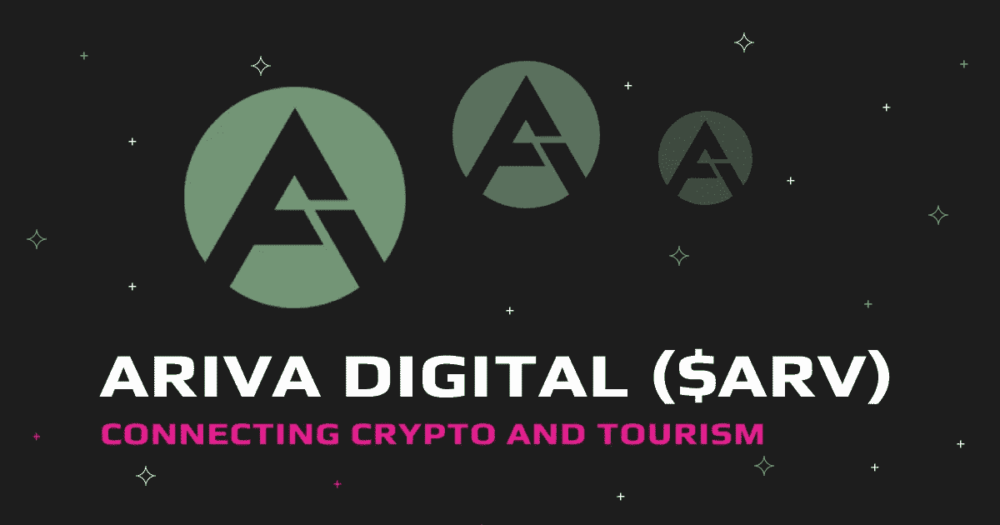
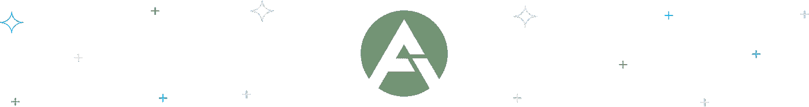

# 让旅游与加密相匹配:Ariva Digital (ARV)

> 原文：<https://medium.com/coinmonks/matching-tourism-with-crypto-ariva-digital-arv-974e1262a1ac?source=collection_archive---------34----------------------->

[Ariva Digital](https://swapzone.io/currencies/ariva) 是以 Ariva Coin (ARV)为原生加密货币的全球 B2C 旅游旅行平台。

开发者为当地的旅行和旅游网络创造了未来派的标志。通过 ARV，持有人和会员可以与当地和全球旅游服务提供商联系，进行预订，并从预订和他们共享的内容中赚取加密资金。

该项目的一个主要目标是消除旅游业国际大规模转移的高成本，旅游业是世界上大规模转移的行业之一。

该加密项目正致力于取代旅行中的信用卡和借记卡，允许用户在任何国家使用 ARV 代币进行交易，同时消除了大额交易成本的需求。

> 交易新手？试试[密码交易机器人](/coinmonks/crypto-trading-bot-c2ffce8acb2a)或者[复制交易](/coinmonks/top-10-crypto-copy-trading-platforms-for-beginners-d0c37c7d698c)

到目前为止，它为旅游空间承诺了一些伟大的事情；然而，它并不是没有一些早期的缺点。

# ARV 硬币的优点

*   用户可以与几家旅行社联系，通过区块链预订旅行，并支付旅行费用。
*   它在旅行和旅游领域提供低廉的交易费用
*   该平台的用户在通过它进行预订或提供数据时会获得奖励。

# ARV 硬币的缺点

*   与其他新密码一样，这是一项高风险的投资
*   疫情或战争等全球性危机带来的旅行和旅游限制会影响代币。

# ARV 生态系统集成

加密货币爱好者将 ARV 视为未来的数字旅游货币。它有望成为一种硬币，你可以在任何国家从你的加密钱包中安全地消费。

旅行者不需要携带大量现金、借记卡，甚至不需要纠结于复杂的快捷交易。为了实现这一点，Ariva 进行了一些生态系统集成。

# Ariva 项目

开发者建立 ARV 是为了在全球范围的 B2C 旅游网络中积极使用。以下是 Ariva 提出的一些改变国际和本地旅游的项目。

# 阿里瓦。世界

阿里瓦。World 是基于区块链技术构建的下一代分散式旅游和旅行门户网站。

这是一个网络，其成员可以与所有的全球和本地服务提供商联系起来，考虑到旅行者过去的分享和经历。

然后，旅行者可以用加密货币预订房间，并通过分享有价值的内容获得奖励。这是这个项目的一些部分:

*   **Business Dashboard:** 这是一个独特的产品和服务面板，面向汽车租赁、酒店、导游、航空公司等全球旅行服务提供商。
*   网上商店:网上商店是一个虚拟空间，游客和旅行者可以通过密码购买当地有价值的零售商品。
*   **设施和服务列表:**这是一个旅游门户，每个拥有 B2C 设施和服务详情的用户都可以使用。在这里，游客可以用密码预订。

# 阿里瓦。金融

阿里瓦。金融是另一个来自网络的令人兴奋的新项目。随着 crypto 变得更加主流，成为日常生活的一部分，用户可以使用 Ariva。获得全球性、快速、透明、安全、交易费用低廉的支付手段。

通过这项服务，人们可以在几分钟内轻松地在移动应用程序和网站上设置支付网关。该网络还将在 Github 上发布 API 和文档。

它承诺解决在线买家和卖家为传统银行系统的隐性费用和佣金支付的超额费用。

旅行者还可以获得免费的加密钱包，可以使用主要的钱包和硬币。总的来说，该项目承诺安全，简单，快速。

# 阿里瓦。俱乐部

阿里瓦。俱乐部是一个新的和创新的社会媒体网络。在这个网站上，用户可以分享他们关于餐馆、旅游、酒店、游艇、旅行社、博物馆和其他相关旅游主题的真实体验。

更重要的是，用户分享的内容会获得加密奖励。该项目旨在过滤骗局和促销活动，只显示用户通过照片、博客和视频在世界各地分享的真实个人经历。

# 阿里瓦仙境

这是世界上第一个旅游元宇宙——一个无限的和完全次世代的旅游体验，为游客提供远离现实世界的虚拟第二人生。

它允许用户在舒适的家中虚拟旅行到他们从未去过的新的和令人惊奇的景点。

用户可以体验许多丰富的文化，同时前往不同的地区，社交，建立自己的旅游中心，并以分散的方式赚钱。

# 为什么 ARIVA 瞄准了旅游业

Ariva 瞄准了旅游业，因为它是全球经济和投资增长的关键驱动力。

该部门是美国经济的主要贡献者，占 GDP 的 10.4%，同时为世界各国提供了超过 3 亿个就业岗位。

此外，梦幻假期是这种舒适的一部分，因为每个人，包括投资者、员工、社交媒体人物和金融家都赚钱过着舒适的生活。

与此同时，Ariva 知道如今大多数支付和预订都是通过互联网进行的，所以为什么不利用 cryptos 来做 fiat 所做的事情，只不过速度更快？

# 使命

该网络的使命是通过推出 Ariva 建立一个基于加密的全球 B2C/B2B 旅行和旅游平台。世界门户。

这将允许旅行者轻松安全地预订旅行，同时在全球范围内开创虚拟加密旅行支付。

# 视力

该网络希望其数字令牌可以消除昂贵的国际大额汇款，同时消除全球旅行和旅游领域的快速交易困难。

与此同时，它还旨在消除国际旅行对法定货币、信用卡和借记卡的依赖。

Ariva 希望消除游客在目的地国家使用当地货币的复杂性。

# 令牌组学

阿里瓦硬币的总供应量为 100 亿 ARV 代币，流通供应量为 62.98 亿 ARV。以下是其象征性的分类:

*   主钱包(34%):这是 ARV 的主钱包，目前占代币总供应量的 34%，为 34，008，004，439 个单位。
*   开发者基金(2.5%):开发者基金钱包占总额的 2.50%，即 25 亿单位。
*   营销基金(0.50%):它是网络的营销钱包，它构成总供应量的 0.50%——505，683，574 台。

# 如何以及在哪里购买 ARV 代币？

ARV 在几个加密交易所上市，但与其他一些主要货币不同，你不能用欧元或美元等货币购买它。

你首先要从主要交易所购买比特币、USDT 币、BNB 币、瑞士法郎和 BNB 币等受欢迎的硬币，然后将它们转移到交易 ARV 币的交易所。

Swapzone 有可靠的合作伙伴，他们允许您比较 ARV 交易所交易的最佳价格。您可以选择一个优惠的价格，按照以下简单的步骤将 anycrypto 换成 ARV:

1.  在“发送”部分，选择您想要交换为 ARV 的任何令牌。
2.  输入您希望交换的代币金额。
3.  在起床部分选择 ARV。
4.  查看可用的优惠及其提供商。
5.  选择一个出价以继续。
6.  输入您的钱包地址以接收加密。
7.  将您的币安硬币存款发送到生成的地址。
8.  评价您的 exchange 提供商。

> 加入 Coinmonks [电报频道](https://t.me/coincodecap)和 [Youtube 频道](https://www.youtube.com/c/coinmonks/videos)了解加密交易和投资

# 另外，阅读

*   [BigONE 交易所评论](/coinmonks/bigone-exchange-review-64705d85a1d4) | [CEX。IO 审查](https://coincodecap.com/cex-io-review) | [交换区审查](/coinmonks/swapzone-review-crypto-exchange-data-aggregator-e0ad78e55ed7)
*   [最佳比特币保证金交易](/coinmonks/bitcoin-margin-trading-exchange-bcbfcbf7b8e3) | [比特币保证金交易](https://coincodecap.com/bityard-margin-trading)
*   [加密保证金交易交易所](/coinmonks/crypto-margin-trading-exchanges-428b1f7ad108) | [赚取比特币](/coinmonks/earn-bitcoin-6e8bd3c592d9)
*   [WazirX vs coin dcx vs bit bns](/coinmonks/wazirx-vs-coindcx-vs-bitbns-149f4f19a2f1)|[block fi vs coin loan vs Nexo](/coinmonks/blockfi-vs-coinloan-vs-nexo-cb624635230d)
*   [BlockFi 信用卡](https://coincodecap.com/blockfi-credit-card) | [如何在币安购买比特币](https://coincodecap.com/buy-bitcoin-binance)