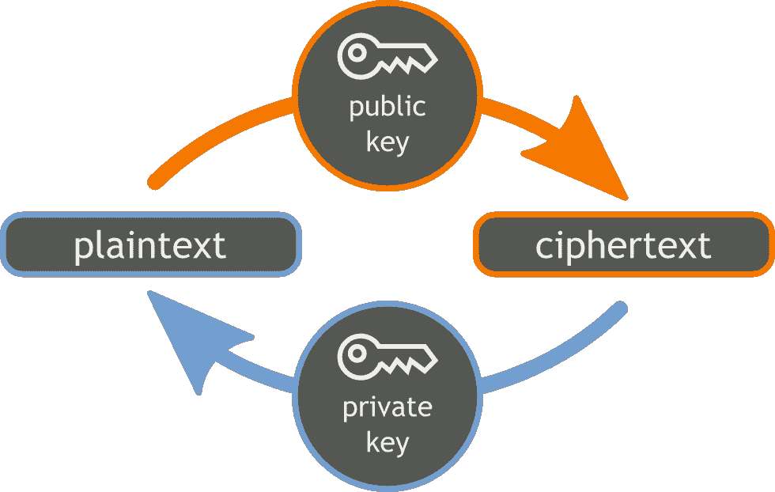
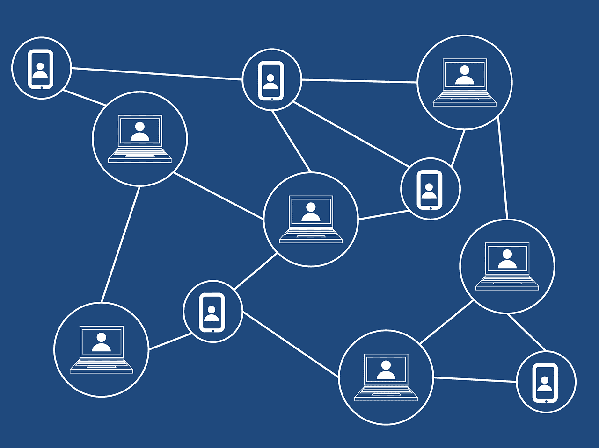
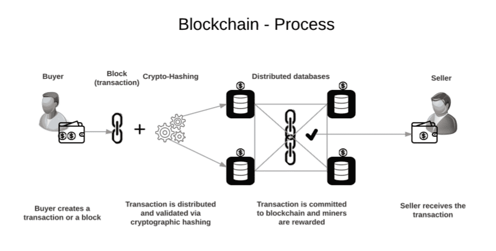
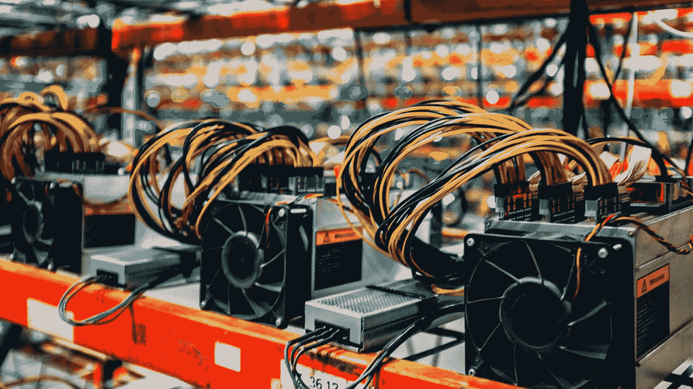
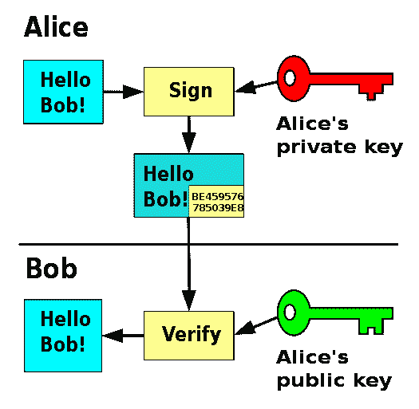

# 比特币背后的数学

> 原文：<https://medium.com/coinmonks/maths-behind-bitcoin-4af3a6fd75f2?source=collection_archive---------12----------------------->

## 公钥密码学、加密、区块链和挖掘入门。

# **公钥加密**

公钥加密的概念是人类历史上最伟大的发明之一。如果你想一想一战前和战争时期的密码，你会用相同的密钥加密和解密。如果你可以安全地将密钥传输给另一个人，并相信他们会保守秘密，那么这个想法是很棒的。

但它背后的绝妙想法是，我有一把钥匙，只有我可以用它以我的身份发送电子邮件，但有一种方法可以让你给我发电子邮件。应用在另一个上下文中，你可以给我寄钱或者加密一条只有我的私钥才能解密的消息。你可以向全世界公布你的公钥，并说，这是一条加密的消息，如果有私钥，任何人都可以阅读。这意味着只有邮件的目标用户——即使邮件被拦截——才是可以阅读邮件的人。

# **创造数字稀缺**

那么问题出在哪里？如果我给你发了一封邮件，你可以复制，也可以转发。我可以复制其他人的电子邮件。对电子邮件来说是好事，对金钱来说是坏事。我不希望你能寄给我 100 美元，但也复制别人的 100 美元，基本上花两倍的钱，三倍的钱，或一千倍的钱。这是一个没有人有好办法解决的问题。这就是比特币和中本聪解决方案的革命性之处。

软件领域的伟大想法——回想一下 Windows 95——是创造无限复制，创造丰富。微软以基本为零的边际成本打印了一份 Windows 95。他们把它放在盒子里。当然，还有分销成本，但是一次又一次的克隆这些片段创造了这个不可思议的商业模式。

然后互联网开始运转。突然间，你得到了零成本分配，这使得软件的零成本复制更加丰富。现在，制作一份拷贝不需要花费你任何东西，交付它也不需要花费你任何东西。

到目前为止，我们所知道的一切都是正确的，如果某样东西是数字化的，它可以在任何地方被快速复制。这个伟大的想法——完全是天才的想法，在比特币出现之前被认为是不可能的——是用互联网上的软件制造稀缺性。除非我们现在知道比特币是一种东西。如果不是在这篇长达九页的关于我们将如何去做的论文中，这听起来很可笑。

你是怎么做到的？Satoshi 提出的解决方案是一个“*”对等分布式时间戳服务器来生成事务时间顺序的计算证明。*

为什么时间顺序很重要？回到我给你发 100 美元的电子邮件，我在模仿别人的交易例子。谁先拿到 100 美元，它就花掉了。下一笔交易无效。

当然，这实际上的工作方式——我们讨论过公钥加密——是当我把它发送给你时，我用我的私钥签名。我取那个比特币，它是一个散列，里面有在它之前的所有其他签名。我知道这在技术上不完全正确，但这是合理的思考方式。我用我的私钥签名，然后发送出去。如果他们想从我的钱包里签些我拥有的东西，任何人都不行。他们只有我的公钥。我是唯一一个可以签名然后发给别人的人。

现在，当然，其他人可以证明是我发给他们的，因为他们有我的公钥。他们可以很快做一些工作，检查它，并说它来自你。但是他们不需要知道我的私钥来进行检查。

# **区块链**

如果这个系统存在的话，所有这些交易都会进入网络。如何追踪哪些是有效的、正确的、唯一的、稀缺的？Satoshi 建议你这样做的方法是，你有一个分布式的分类账系统。每个人都可以看到系统中发生的每笔交易的整个交易链。

这是一个非常有趣的概念，有点违反直觉，他说，在第三方系统中，你有一个造币厂或美联储，你把信息发送给他们，他们会跟踪它。这是确保钱不被重复使用的唯一方法。

他说，如果他发疯了——他，他们，她，不管是谁——并且说，如果每个人都有一本账本，每个人都有每一个比特币的完整交易历史，那会怎么样？这是我提出的解决方案。

如果你正在这样做，他建议人们选择抓住这些正在广播的交易，并生成计算证明，哪些是先出现的，哪些是正确的。如果有人试图多次发送比特币，哪些交易先发生，正确的交易应该添加到这个分类账中。

他说，有一大群人已经决定要在他们的电脑上保存整个交易历史。他们会做一些工作来验证。他们将返回，他们将说，我将做一些数学计算来做一些检查，并说，嘿，所有这些交易都有效吗？他们将运行他们的计算机来完成这项工作，并验证所有这些交易的完整性。

如果他们验证并说这是好的，他们会将它传播到网络上更多的计算机和更多的人。本质上，这里有一个规范的版本，每个人都在模仿它，并竖起大拇指说我已经检查过了。挺好的。

你如何设计这个系统，所以它不只是每个人都这样做的混乱？你使得在计算上很难证明你有正确的交易顺序。这意味着一旦这些超级用户中的一个，这些节点中的一个，广播一组交易，每个人都可以相当合理地确信它是正确的。

虽然你把这些交易串在一起放在一个分类账里，但这又回到了起点。假设你很难计算每个块。在这种情况下，你让任何人都不可能改变那个分类帐，因为这个块被加密链接到前一个块。这很难做到，系统会自动适应，这样每个人平均需要 10 分钟来创建一个这样的块。

要返回、更改和伪造以前的一些交易，您必须从头开始重新计算整个链条，这将成为一个指数级问题。如果你能做到这一点，你不仅要把它广播到网络的一个重要部分，不仅仅是在你的机器上，而且要告诉你的朋友，让他们告诉他们的朋友，等等。假设有人想在系统中拥有比其他矿工更强的计算能力。在这种情况下，他们可以从头开始重建所有的交易哈希，插入虚假交易，给自己 10 万个比特币，然后冒充新的比特币。

早期只有少数其他蹩脚的笔记本电脑这么做。当然，你计算能力会超过很多早期的产品。但这不会在它达到足够大的规模时就发生。它成为一种网络效应经济，因为发生的交易越多，创建的块就越多，处理该块的计算能力越强，就越难伪造它，直到你达到我们现在的地步。你需要从一开始就投入比特币的全部计算能力，再加上更多的计算能力来破解它。那是不可能的。

在这一点上没有办法，因为它已经运行了这么长时间，网络上有这么多的节点，这么多的交易发生，这么多的矿工开采。不可能的。现在你可以保证——这就是聪看到的。如果你能以这种密度、规模和运营历史进入这种网络，破解它将是不可能的。那么，我们刚刚谈到的传统金融系统的所有欺诈、重复计算和系统成本将不再适用。

我们正在讨论为一个账户系统打下基础，在这个系统中，如果你收到钱，你可以超级确定它是合法的。不存在他们实际上没有那笔钱的风险，你将不得不做一些退款。你知道这是合法的，因为你已经得到了我们刚才描述的一切，如果我收到我的地址的比特币，它不会被撤销，或者至少它极不可能被撤销，因为所有这些工作都在进行中。

# **矿工**

有人有一个完整的副本，区块链的整个交易分类账导致至今。它在他们的电脑上，他们在工作。他们通过运行加密算法来确保所有交易的真实性，并检查和确保这些都是正确的。

当然，他们需要为此得到补偿，因为他们在用电，运转他们的机器，风扇开得很高。十有八九，他们的 GPU 和现在更专业的采矿硬件存在于靠近河流的某个数据中心，以便轻松获得廉价的可再生能源。

也许回到 2009 年，像 Nakamoto 这样的研究人员和最初与他分享这个的人会出于他们内心的善良而这样做，因为这很酷，但这不会有规模。最初是一个副产品，现在是开采其中一个区块的动机是，区块上的第一个硬币会给你，作为对你验证这里完整性的感谢。

不要太深入地去了解它是如何工作的，它的意思是你的劳动得到了回报，或者至少你为帮助系统保持可验证性和真实性所付出的精力得到了回报。

不仅仅是第一枚硬币。它是一个积木上最初的几个硬币。一开始是 50。如果你开采一个区块，这又是每 10 分钟发生一次，开始时你会得到 50 个比特币。现在降到了六又四分之一。六又四分之一因为它每次都减半。

# 单向函数

有些类型的数学问题在一个方向上很容易解决，但在另一个方向上却很难解决。

一个经典的例子是两个质数的**乘积。如果你把质数 A 乘以质数 B，计算起来相当容易。你可以想象在纸上做。你可以想象写一个计算机程序来做这件事，把这些数字输入寄存器和汇编代码，把它们相乘。**

但是假设你得到了这两个数字的乘积，特别是当你处理的所有数字都非常大的时候。在这种情况下，你可以想象，试图找出创建该产品的最初两个质数是多少会变得极其困难，而且效率非常低。这个单向函数的神奇之处在于，将两个质数相乘很容易，但分解大质数却非常困难。

这里的含义是，当有人告诉你他们有这个产品的答案时，检查他们的工作是非常容易的。他们为你提供了一个因子或者一个初始素数。你可以很快地计算一下，然后说，是的，这是正确的。但是对于你来说，在不知道任何其他信息的情况下，偶然发现准确的两个初始数字是非常困难的。

让我们回到 1874 年。**威廉姆·斯坦利·杰文斯**在**科学原理**中写道——请记住，这距离个人电脑的发明还不到一百年。“读者能说出哪两个数相乘得出 8，616，469，799 这个数吗？除了我之外，不太可能有人会知道。”

他首先想到了单向函数的概念。现在，计算机可以通过蛮力很快地计算出这个数字的两个因子是什么——猜测和检查，猜测和检查，猜测和检查。但是你可以想象，如果这个数字非常大，现代计算机需要很长时间。或者坦率地说，如果你把它们做得足够大，今天的计算机不可能解决这个问题。这需要非常非常多的工作。如果你把它们变得更大，那么你可以说，假设计算机以一定的速度变得更好，这个问题永远不会被解决。这里存在一个可怕的事情，在某种程度上，我们还没有证明单向函数的存在。我们试图用许多不同的方法来解开它们，各地的数学家都试图证明这个问题。

依赖公钥/私钥加密、各种加密和散列是一件可怕的事情。比特币中的一切都基于它，你在任何地方登录的任何东西都基于它。你的邮件是基于它的。

一分钟前，当我们说你必须将比特币的所有计算能力用于伪造比特币时，如果你有办法破解这种加密，情况就不会是这样了。假设你发明了一种新的算法，从数学上来说，它可以正式地撤销这项工作，而不是无效地撤销。那样的话，我们现在知道怎么做了，基本就是蛮力。但关键是这将打破比特币。这也将打破所有的安全。你可以在任何地方登录任何账户。所以它也会打破传统的体系。

# **公钥加密**

另外一个小问题是**公钥加密**的概念:我可以广播我的公钥，所以任何人都可以给我发送东西，但只有我有私钥。我是唯一一个可以解密信息，发送给其他人，或者你决定利用它的人。这一概念产生于 1874 年发现 T2 质因数分解。

非常令人惊讶的是，大约在同一时间，即 1973 年，两个不同的群体接受了这个想法并将其转化为公钥/私钥发现，但他们对此保密，因为他们想将其用于防御。毕竟，你有在战场上更安全地传递信息的想法真是太棒了。完全相同的想法在同一时间被发现。它最终在 1977 年公开宣布——现在被称为 **RSA 加密**。

不可思议的是，私钥/公钥加密是在同一十年由互不相识的不同人发现的。第一批人拼命想把它作为国家安全的秘密。好像这个世界已经准备好迎接新的发现了。技术和现代数学已经发展到两个不同的小组可以在相同的基础上独立地做出相同的发明。

*要了解加密货币的完整历史、技术和未来，请阅读我们的书《我们信任的加密:一场文化革命的起源和未来* *》。*

> 加入 Coinmonks [电报频道](https://t.me/coincodecap)和 [Youtube 频道](https://www.youtube.com/c/coinmonks/videos)了解加密交易和投资

# 另外，阅读

*   [加密保证金交易交易所](/coinmonks/crypto-margin-trading-exchanges-428b1f7ad108) | [赚取比特币](/coinmonks/earn-bitcoin-6e8bd3c592d9) | [Mudrex 投资](https://coincodecap.com/mudrex-invest-review-the-best-way-to-invest-in-crypto)
*   [WazirX vs CoinDCX vs bit bns](/coinmonks/wazirx-vs-coindcx-vs-bitbns-149f4f19a2f1)|[block fi vs coin loan vs Nexo](/coinmonks/blockfi-vs-coinloan-vs-nexo-cb624635230d)
*   [比斯勒评论](https://coincodecap.com/bitsler-review)|[WazirX vs coin switch vs coin dcx](https://coincodecap.com/wazirx-vs-coinswitch-vs-coindcx)
*   [7 大顶级副本交易平台](https://coincodecap.com/copy-trading-platforms) | [BuyCoins 审核](https://coincodecap.com/buycoins-review)
*   [XT.COM 评论](https://coincodecap.com/profittradingapp-for-binance)币安评论 |
*   [SmithBot 评论](https://coincodecap.com/smithbot-review) | [4 款最佳免费开源交易机器人](https://coincodecap.com/free-open-source-trading-bots)
*   [杠杆代币](/coinmonks/leveraged-token-3f5257808b22) | [最佳密码交易所](/coinmonks/crypto-exchange-dd2f9d6f3769) | [Paxful 点评](/coinmonks/paxful-review-4daf2354ab70)