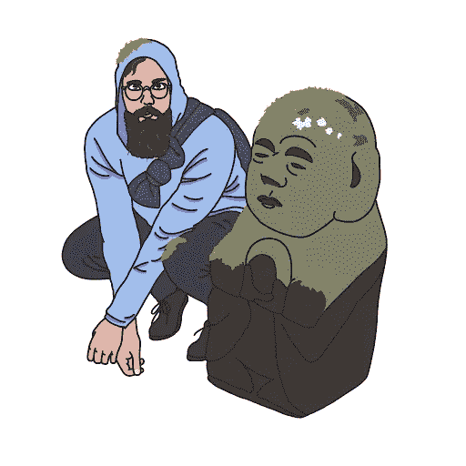
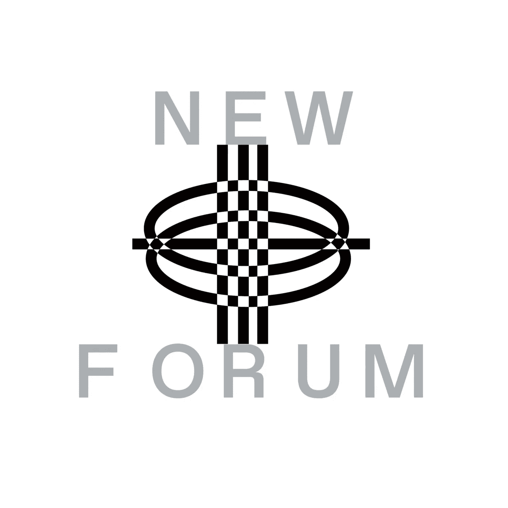

# Matt Condon 解释了 NFTs Vs DOTs，数字事物，数字客体&网络 3 中数字艺术的价值

> 原文：<https://medium.com/coinmonks/matt-condon-explains-nfts-vs-dots-digital-things-digital-object-ness-value-of-digital-art-in-216cbc20da50?source=collection_archive---------29----------------------->

在《新论坛》的这一集里，我们遇到了独一无二的马特·康登，他是我们在 Web3 中认识的唯一一个手里拿着芯片的人，只有在你找到他的时候，他才能分发罕见的数字马特贴纸。Web3 的 NFT·奥格和数字稀有播客的主持人，他和他的共同主持人乔纳森·曼探索了在区块链和其他领域拥有东西的意义。他还与谷歌和 Skillshare 等公司合作过。我们就 NFTs、区块链、智能合约、DAOs、创造者经济以及 Matt 如何利用他的声音和经验来帮助塑造和构建 Web3 空间进行了很好的交谈。

> 在 Web3 中，我感觉就像在四处游荡，就像那里有什么一样。那里还有更多。有点意外，我认为这真的很鼓舞人心；任何好奇的、有创造力的、批判性思考这些东西的人都会产生巨大的影响。有无穷无尽的机会。有激励作用的是不经意地做一些新的事情，而不是以前做过的事情。感觉很酷……”——马特

新论坛主持人急于以两个问题开始采访——谁是 NFT 奥组委，为什么他手里拿着芯片？所以，让我们从他在第三版中对 NFT·奥格的解释开始。

Matt 解释说,“NFT OG”这个名字是他和其他人在去年甚至更早之前为一个数字活动想出来的。

> “NFT·奥格的意思是，当我们编造 NFT 这个术语时，我在评论区；我仍然在努力，我认为我们应该称它们为点或数字拥有的东西，可能会使整个教育方面的事情变得容易得多，但 NFT 才是流行的……”—Matt

马特在 2017 年出现在加密现场。他分享说，类似于经典的加密故事，他已经看过白皮书，但没有得到它，最终在另一个时间阅读；这一次，Matt 充分理解并参与其中——他通过探索加密技术了解了智能合同。他第一次遇到智能合同这个词时，它看起来就像这个神秘的物体；他回忆说，直到他发现这是在几台电脑上运行的代码。

> “我当时想，哦，我知道该怎么做，于是我进入了以太坊，一旦你进入以太坊，所有这些不同的事情都会发生；最终我看到了 Cryptopunks，我想这真的很有趣。正是密码朋克让我想到了数字物品不仅仅是钱，也不是代币……”——Matt

马特表示，他的大脑还没有完全理解 DeFi 的概念，尽管由于他是一名收藏家，将它与物体联系起来有助于他更好地理解:收集经典故事、口袋妖怪和 YuGiOh。

> “NFT，特别是隐朋克生态系统，引起了我的共鸣，通过这个镜头，我最终学到了很多东西成为物体意味着什么；进入艺术理论和心理学领域……”——马特

Matt 带我们一起踏上了他的兔子洞之旅，在他的完整采访中分享了所有的兴奋、挑战、发现和收获。

# Matts 手里的这个芯片是做什么的，它是如何连接到 NFTs 的？

Matt 将芯片称为一个项目，他喜欢它的原因是它同时是现实的、超现实的和怪异的，然而，它迫使人们思考和提出问题。马特在他体内植入了 NFT。他向新论坛的主持人和社区展示了确切的地点，我们可以亲眼看到他的皮肤下有真实的东西。马特在他的节目中解释了芯片如何作为 NFT 工作，以及人们如何与它互动。不要错过！

> “我认为申请 NFTs 是一个很好的入职流程，尤其是在这条高速公路上。我是很多人的第一个 NFT，尤其是因为他们不需要 Eth。去得到它；如果这是你第一次介绍 Web3 的怪异之处，我认为这是 NFT 兔子洞的一个很好的开始。我认为与一些更商业化的东西相比，这是一个好现象……”—Matt

# 我们能把 NFTs 推进多远？

Matt 认为拥有一个数码产品的心理有一些新的东西。他认为，拥有数字事物的可能性改变了一切。

> “数字事物可以成为物品，这开启了整个数字艺术市场……”—马特

根据 Matt 的说法，数字艺术作为一种艺术形式在互联网上被断然忽视，因为作品固有的可复制性导致了人类对价值概念的物理工作的反常联系。

> “数字对象现在有一种叙事方式来拥有光环:拥有对象性，成为一个人可以拥有的东西，因为这就是所有权的全部。它是一个记录了拥有者的物品，作为拥有者，你唯一的权利就是把它送给别人，或者如果你想的话，毁掉它……”—Matt

他继续讨论数字对象和数字艺术之间的联系，以及数字艺术家现在如何作为艺术家茁壮成长。他甚至举了几个例子来支持他的观点。一个例子是他的动画师朋友，他不得不做广告、电影、VFX 和其他工作来维持生计，但现在随着新技术和 Web3 对创作者经济的破坏，他只制作让他开心的动画。

> “我觉得这太神奇了；这是目前正在发生的巨大变革之一，这是一个缓慢的认识，即在每个活着的人的头脑中，拥有数字事物是可能的，也是有意义的，也是我们生活的一部分，就像物理事物一样……”—Matt

马特热衷于剖析他的哲学联系；偶像迷因和喜剧，数字艺术，数字事物，数字客体，创造者经济中价值和光环背景下的非功能性传播。

# 如果你像新论坛社区一样思考，你已经很好奇 NFT 奥组委是如何定义 NFT 的？

> “我想说 NFT 是一个给数字事物一个光环的工具…我认为它是一个数字拥有的东西(点)…”—Matt

Matt 帮助我们的社区处理他的定义，解释说从点的上下文来看，它可以代表任何东西，不一定是图片，也不一定是视频；它可以是任何东西，他觉得不可思议，因为创新和探索是灵活的。

Matt 还在他的完整采访中分享了他对 NFTs 和加密货币之间的联系以及它们将如何帮助协调 Web3 的看法。

> “如果你想想这个世界，绝大多数东西都更像 NFT，钱是我们生活中唯一明显可替代的东西，但即使如此，美钞也是不可替代的；它们有一个序列号——每一个都是独一无二的物体，所以当你用那个镜头看它时，实际上有点惊讶，NFTs 花了太长时间才成为一个东西……”—Matt

马特分享说，通过这个镜头看世界更自然，因为它影响了一个人的生活，尽管 NFT 和加密货币在 Web3 和创造者经济中都扮演着重要角色。他表示，他对非功能性测试及其如何影响他的生活特别感兴趣。他认为，当谈到创造者经济时，Web3 已经回到了基础。

# 马特说的返璞归真是什么意思？

> “我们有数字物品；你看到有人卖艺术品，就这样，句号；比如文艺复兴风格和人们成为赞助人。我想买这个东西，这就是全部的体验。没有比这更奇怪的了……”——马特

用 oneofthemanymatts 看完整集！听听他关于 NFTs 和创造者经济的真知灼见。他还深入探讨了 NFTs 与 DOTs，讨论了他在这个数字时代的数字艺术背景下的价值的哲学概念。

[加入社区](https://twitter.com/newforum_nco)了解 [@1ofthemanymatts](https://twitter.com/1ofthemanymatts) 并发现 web3 社区中的其他创作者！

我是✨follow·马特·康登！

推特:[@ 1 ofthemanymatts](https://twitter.com/1ofthemanymatts)insta gram:[@ oneofthemanymatts](https://www.instagram.com/oneofthemanymatts/)

[# web 3](https://www.linkedin.com/feed/hashtag/?keywords=web3&highlightedUpdateUrns=urn%3Ali%3Aactivity%3A6895027524963753984)[# social 3](https://www.linkedin.com/feed/hashtag/?keywords=social3&highlightedUpdateUrns=urn%3Ali%3Aactivity%3A6895027524963753984)[# crypto](https://www.linkedin.com/feed/hashtag/?keywords=crypto&highlightedUpdateUrns=urn%3Ali%3Aactivity%3A6895027524963753984)# smart contracts # daos #去中心化#创造经济#所有权#nfts

爱 x 新论坛

# Twitter @newforum_nco

不和[@加入](https://discord.gg/DHepA4WTkN)

# 新论坛

[NEWFORUM](https://newforum.notion.site/newforum/Welcome-to-NEWFORUM-48f9661398ec4ec6a1af37fcc96dc926) 由 [Newcoin Foundation](https://newcoin.org/) 提供支持，专注于促进去中心化社交应用的扩展，也称为 Social 3.0，形成一个生态系统和一个由远见者、创造者和投资者组成的社区。它为思想者提供了一个安全的交流、传播和分享思想的空间，以确保一个新网络的自觉和道德发展，嵌入关怀、自由和创造力的价值观。✨每周新集！在 [Twitter](https://twitter.com/newforum_nco) 、 [Newlife](https://newlife.io/) 、 [Youtube](https://www.youtube.com/channel/UCWvHyau1nIJBffmaaj6FmbQ) 和 [LinkedIn](https://www.linkedin.com/showcase/newforum/) 上关注我们，了解 web3 的更多信息，认识生态系统！加入生态系统[不和](https://discord.gg/DHepA4WTkN)！

> 加入 Coinmonks [电报频道](https://t.me/coincodecap)和 [Youtube 频道](https://www.youtube.com/c/coinmonks/videos)了解加密交易和投资

# 另外，阅读

*   [BigONE 交易所评论](/coinmonks/bigone-exchange-review-64705d85a1d4) | [电网交易 Bot](https://coincodecap.com/grid-trading)
*   [氹欞侊贸易评论](https://coincodecap.com/anny-trade-review) | [CoinSpot 评论](https://coincodecap.com/coinspot-review)
*   [新加坡十大最佳密码交易所](https://coincodecap.com/crypto-exchange-in-singapore) | [收购 AXS](https://coincodecap.com/buy-axs-token)
*   [投资印度的最佳加密软件](https://coincodecap.com/best-crypto-to-invest-in-india-in-2021) | [WazirX P2P](https://coincodecap.com/wazirx-p2p)
*   [7 个最佳零费用加密交易平台](https://coincodecap.com/zero-fee-crypto-exchanges)
*   [最佳网上赌场](https://coincodecap.com/best-online-casinos) | [期货交易机器人](/coinmonks/futures-trading-bots-5a282ccee3f5)