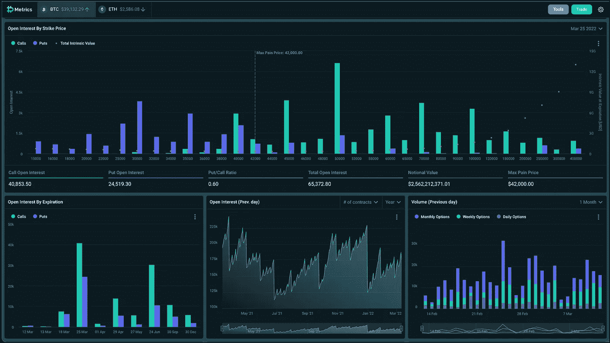

# 最大疼痛——BTC 42k 美元

> 原文：<https://medium.com/coinmonks/max-pain-btc-42k-efe544900b17?source=collection_archive---------27----------------------->

我在 Deribit 的网站上逛了逛，看了看最大疼痛程度。最大痛苦被定义为期权持有者(购买者)整体上感觉最痛苦的价格水平。一个公认的交易格言说，市场会去它会造成最大痛苦的地方，所以这个水平应该有点吸引力。

考虑到 Deribit 期权的当前未平仓合约和最大未平仓合约的到期日(3 月 25 日)，Max Pain 上涨了 42k 美元。您可以看到，它远低于未平仓利息最高的$50k 看涨期权。

我们离 3 月 25 日到期还有两周时间，因此从那时到现在，情况可能会发生巨大变化。我们走着瞧。你有什么想法？我们会发现 BTC 在 3 月 25 日拥抱 42k 美元吗？