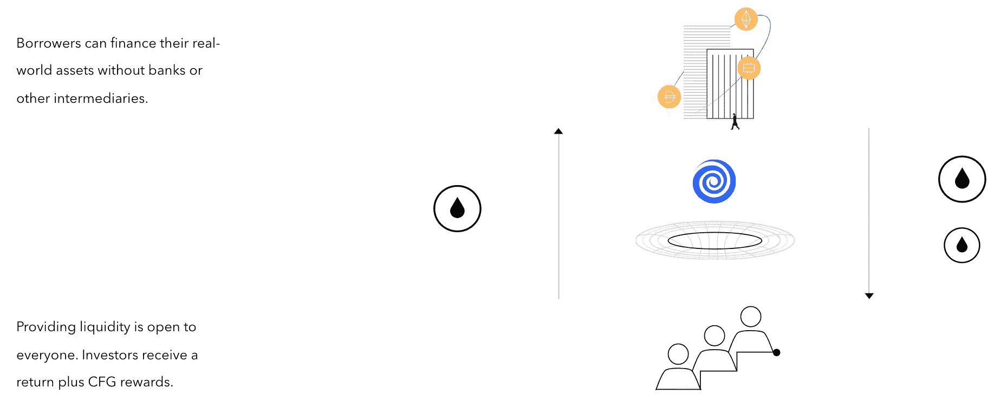

# 最大化 NFTs | open sky、离心机和价值电路的革命性合作方案

> 原文：<https://medium.com/coinmonks/maximizing-nfts-a-revolutionary-partnership-proposal-for-opensky-centrifuge-circuits-of-value-d1b0700a709d?source=collection_archive---------4----------------------->

## 不同的 DeFi NFT 项目如何结合在一起释放 NFTs 的全部潜力。

区块链技术公司的开源本质根植于对透明度内在价值的信念。**激进透明的效果是提高效率。**许多分散融资(DeFi)项目已经采取了协议优先的模式，在这种模式下，他们寻求与其他开发团队合作，并将项目整合到他们的核心职能中，并积极寻求与其他开发团队的合作。**与传统行业相比，这种开源开发的环境创造了一种更加友好的氛围——最终，每一个成功的项目都是从他人的行为中学习，并在高质量开发工作的基础上迭代。**

## 协同创新

有时在新的行业中，你会发现一些未被满足的需求，不同的团队在一个统一的想法下解决不同的问题。这其中的美妙之处在于，它具有协同价值。如果我告诉你，通过三个不同的创新 DeFi 项目的合作，你可以围绕你的 NFT 创建一个市场来获得流动性，会怎么样？如果你能把所有的非金融资产捆绑在一起，并以此为抵押进行借贷，会怎么样？哦，我不只是在谈论 NFT 艺术。我还在谈论能够令牌化你的房子，你的汽车和其他资产的所有权。

**想象一下，将现实生活和数字资产**捆绑在一起，并转化为非金融资产，然后利用这一捆绑，创建一个总的 NFT 金库，然后让市场为其定价，并**获得即时的流动性以进行借贷**。通过 OpenSky、离心机和 Circuits of Value 的合作，这将成为可能。让我们更深入地了解这意味着什么。

# 下一代 NFT 公用事业

为了理解为什么我的合作提议是有价值的，让我们通过 OpenSky、离心机和价值循环项目的镜头来检查我们在 DeFi 和现实世界中面临的问题。

## [开放天空](https://home.opensky.finance/#) ($OST)

OpenSky 在解释他们想要解决的痛点方面做得非常好；以下是他们提出问题的方式:

> 由于不可替代的代币(NFT)市场极度缺乏流动性和可交易性，在现有的加密贷款市场中，NFT 通常不被接受为抵押品，大量价值被低效地锁定在快速增长的 NFT 资产类别中，没有简单的方法来获取这些价值以实现多样化和借贷目的”( [OpenSky Medium](https://openskyfinance.medium.com/introducing-opensky-545f77523a8e) )。

从本质上说，很难找到一种方法从你的非金融资产中提取流动性，并以此为抵押进行借贷。

根据[非处方药市场分析，2021 年非处方药的销售额超过 140 亿美元。OpenSky 旨在通过创建一个平台，利用独特的债券价格曲线获得流动性，从而挖掘这一价值。](https://www.nonfungible.com/market/history)

[OpenSky Home](https://home.opensky.finance/#)

**这些债券曲线被嵌入智能合约，允许你(通过市场)评估你的 NFT，然后按需借入资金。**

> “如果价格跌破维持水平，NFT 赌注者将需要偿还部分或全部贷款，以防止锁定的 NFT 转移到清算池”( [OpenSky Home](https://home.opensky.finance/#) )。

在你的 NFT 被清算人抢走之前，你有 24 小时的时间来偿还部分贷款，以恢复健康的债务与贷款比率。OpenSky 目前的目标是 NFT 艺术市场。然而，他们有一个宏伟的愿景。愿景陈述如下:

> “我们的愿景是实现一个无国界的星球，在这个星球上，分散金融(DeFi)与集中金融(CeFi)处于公平竞争的环境中，任何人都可以在任何时间、任何地点进行交易、入股、借贷和投资”( [OpenSky Docs](https://home.opensky.finance/docs/OpenSky.Whitepaper.V1.3.pdf) )。

**本质上，OpenSky 是想降低借贷的准入门槛。**

除了 OpenSky 正在做的，还有 DeFi 项目，专注于通过区块链技术从实物资产(如房屋)中获取流动性。

**注***:open sky 的令牌是$ [OST](https://faq.opensky.market/opensky-token-ost) 。

## [离心机](https://centrifuge.io/) ($CFG)

**离心机的使命是释放现实世界资产的流动性。他们将现实世界的资产转化为 DeFi。这使得中小企业更容易直接进入流动资本市场。**

以下是离心机如何描述他们的模型:

> “离心机使用 NFT 作为现实世界资产的数字表示，如发票或抵押贷款，因此它们可以在 Tinlake(他们的协议之一)中用作抵押品。**这种从现实世界的资产中创造非金融资产的过程是传统金融获得非金融资产流动性的门票，并将对现实世界产生影响**:
> 
> 1.扩大资产融资渠道:无银行化降低了资产发起和投资的门槛
> 
> 2.扩大资产融资规模:这些资金池可以变得非常大，为非流动性资产创造流动性市场。
> 
> 3.在真实世界和 DeFi 之间架起一座桥梁:我们将真实世界的价值传递给 DeFi，从而增加新的流动性”([离心机文档](https://docs.centrifuge.io/getting-started/centrifuge-at-a-glance/))。

现实世界与 DeFi 的融合带来了前所未有的资本效率。最终，离心机正在扩大 NFTs 的效用，以增加社会的资本分配和生产力。你可以通过这里的讲解视频了解更多信息:

最近，一个新的[真实世界资产(RWA)市场](https://rwamarket.io/#/)建立在离心机和 Aave 之上。

> “RWA 市场由 [END_Labs](https://end-labs.io/) 提供服务，允许企业为其令牌化的房地产过桥贷款、贸易应收账款、货物&货运代理发票、品牌库存融资以及使用加密的基于收入的融资进行融资。**它允许用户通过不相关的稳定资产**”([RWA 市场媒介](/centrifuge/rwa-market-the-aave-market-for-real-world-assets-goes-live-48976b984dde))来分散投资组合。

**RWA 市场让离心机梦想成真。它正在将传统金融(TradFi)与 DeFi 合并。**它的工作方式如下:

> “发行者为他们的资产创建资产池。投资者通过将稳定的硬币存入池中，从这些池中购买代币。发行者然后可以用这些资产借入稳定的债券，并将其转化为现实世界借款人的法定货币。”

现在想象一下，如果这些令牌化的资产池可以与其他类别的 NFT 捆绑在一起。这就是价值回路发挥作用的地方。

**注*** :离心机令牌为$ [CFG](https://centrifuge.io/cfg_token_summary.pdf) 。

## [值电路](https://circuitsofvalue.com/#coval-platform) ($COVAL)

价值循环项目发明了一种独特的符号化流程。他们的徽章金库是一个分散的，**复合代币，能够存储任意数量的代币和各种类型的代币**——这意味着你可以将你的替代币和 NFT 组合成一个代币。

这些徽章金库可以存在于任何以太坊虚拟机(EVM)兼容的区块链——因此最受欢迎的区块链。您可以同时交易徽章金库中的所有代币，就像交易一个代币一样。这意味着你可以创造不同的风险调整，对冲任何已被标记的投资组合。数字文件也可以储存在这些保险库里。

**注*** :价值回路的令牌为$ [COVAL](https://circuitsofvalue.com/) 。

# 合作关系

我们还处于实现非功能性测试全部潜力的早期阶段。但是，如果 OpenSky、离心机和价值电路能够合作，我们将会看到非功能性测试的实用性大大提高，并得到更广泛的采用。

想象一下，将 NFT 艺术品、令牌化的、有收益的现实世界资产和代用币捆绑在一起，放入各种徽章金库。**现在你可以拿着徽章金库，把它押在 OpenSky 或者离心机**(取决于金库中包含的资产类型)。从那里，如果市场发现你的金库有价值，它将提供流动性，你可以立即获得它。你可以把这些流动资金用于定义或将现金投资于现实世界，然后及时还清借款。

请记住，离心机想让你的房子或汽车股权变得更容易，并允许它立即用作抵押品。在 DeFi 中，你通常有无限的时间来偿还非常低或 0%利息的贷款。

中小企业和 NFT 投资者可以用代币进行大规模借贷。这将释放包含在真实和数字资产中的数十亿美元的价值。

# 结论

通过这种三方合作，OpenSky、离心机和价值电路将在彼此之间建立优化的互操作性，**社会将变得更加高效**。如果流动性容易获得，那么就有更多的资本配置机会。作为回报，生产力和创新蓬勃发展。

所有这一切都是可能的，因为独特的区块链应用程序几乎同时在一个统一的理念下构建，这为协同创新铺平了道路。统一的想法是**相信获得流动性的民主化，以及需要更有效和更广泛的非金融交易区块链流程。**将这一计划的推动与区块链协议的开源、以开发者为中心的文化结合起来**，现在您已经拥有了创建下一代 NFT 公用事业的催化元素**。

我很高兴看到 NFTs 的潜力如何发展，我希望作为一个社区，我们可以更好地传达 NFTs 的价值，以帮助普通人、监管者和传统金融机构认识到他们可以在加密领域利用的新机会，以增加他们自己生活中的满足感，并实现曾经被视为无法实现的目标。

感谢阅读这篇文章！如果你认为我应该调查任何与密码相关的事情，那么通过 Twitter DM([**@ kyled Collins**](https://twitter.com/kyledcollins)**)告诉我。我总是在寻找好机会。另外，如果您有任何问题，请随时联系我们**。****

*请注意，我写的都不是金融建议——只是我对投资机会的看法。*

电子邮件:kyledanielcollins@gmail.com

> 加入 Coinmonks [电报频道](https://t.me/coincodecap)和 [Youtube 频道](https://www.youtube.com/c/coinmonks/videos)了解加密交易和投资

## 也阅读

 [## 2021 年最佳加密交换平台| CoinCodeCap

### 如果我们看看今天的场景，许多加密货币交换平台提供了广泛的功能和深度…

blog.coincodecap.com](https://blog.coincodecap.com/best-swap-platforms)  [## 10 大最佳网上赌场[2021] |赢取免费 BTC | CoinCodeCap

### 接收、支付和赚取加密货币| |有各种各样的最佳在线赌场可供选择，有可能…

blog.coincodecap.com](https://blog.coincodecap.com/best-online-casinos)  [## 2021 年最佳加密借贷平台| 6 大比特币借贷平台

### 获得比特币和其他加密货币的最佳贷款利率

medium.com](/coinmonks/top-5-crypto-lending-platforms-in-2020-that-you-need-to-know-a1b675cec3fa)  [## 2021 年 6 大最佳硬件钱包|顶级加密硬件钱包[更新]

### 最好的加密货币硬件钱包是绝对必要的。我们将在 NGRAVE、Ledger Nano X 和…

medium.com](/coinmonks/the-best-cryptocurrency-hardware-wallets-of-2020-e28b1c124069)  [## 2021 年最佳免费加密交易机器人

### 2021 年币安、比特币基地、库币和其他密码交易所的最佳密码交易机器人。四进制，位间隙…

medium.com](/coinmonks/crypto-trading-bot-c2ffce8acb2a)  [## 最佳 4 个加密交易信号电报通道

### 这是乏味的找到正确的加密交易信号提供商。因此，在本文中，我们将讨论最好的…

medium.com](/coinmonks/best-crypto-signals-telegram-5785cdbc4b2b)  [## 获取信号、交易机器人和套利

### 编辑描述

blog.coincodecap.com](https://blog.coincodecap.com/bitsgap-review)  [## 40 个最佳电报频道，用于加密、电影、表演和演讲| CoinCodeCap

### 随着我们周围无限的信息，我们很难筛选和了解有价值的信息。电报有…

blog.coincodecap.com](https://blog.coincodecap.com/best-telegram-channels)  [## 5 个最佳社交交易平台[2021] | CoinCodeCap

### 困惑于社交交易和副本交易哪个平台最好？本文将带您了解各种…

blog.coincodecap.com](https://blog.coincodecap.com/best-social-trading-platforms)  [## BlockFi 评论 2021:利弊和利率| CoinCodeCap

### 今天，我们提出了一个全面的 BlockFi 评论，这是一个成立于 2017 年的加密贷款平台，拥有其…

blog.coincodecap.com](https://blog.coincodecap.com/blockfi-review)