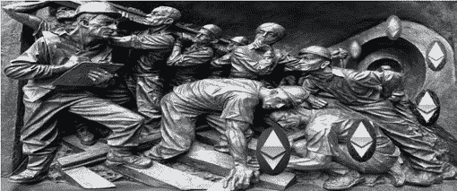

# 以太坊上的最大可提取值(MEV)

> 原文：<https://medium.com/coinmonks/maximum-extractable-value-mev-9a969f324ff6?source=collection_archive---------2----------------------->

## 文章作者 [Sixte C.](https://www.linkedin.com/in/sixte-c-a72b47173/)

Photo: Pexels.com

# **概述**

在复杂的区块链技术背后，隐藏着许多不为公众所知的问题。我们今天要讨论的是矿工可提取价值(MEV)。在以太坊区块链，采矿者对开采的每个区块的交易顺序有完全的自由，他们利用这一地位赚取额外收入。

更详细地说，这个概念指的是通过在块内重新排序、插入和审查交易，从以太坊用户那里提取价值。挖掘者可以通过包含提议支付更高费用的事务(在内存池中等待)来利用其包含、排除和排序块事务的能力。因此，矿工可以利用这种技术从网络中获得额外的利润。这不是协议最初计划的，协议不要求交易根据费用排序。这种非法收入流被称为 MEV。

在交易的另一方，寻找 MEV 机会的网络参与者被称为搜索者。他们运行算法程序，寻找向矿商支付更高费用会有利可图的情况。

# **例 1**

搜寻者发现了两个指数之间的套利机会。他使用链外通信渠道，以快速、无风险的方式要求一名矿工处理他的交易，收取高额费用。为此，搜索者不在区块链网络上结算天然气费用，而是在外部专业平台(如 Flashbots)上结算。然后，搜索者与挖掘者共享他的事务散列(事务 ID ),挖掘者在其他人之前处理它。在公共分类账上，汽油费是 0，但实际上，搜索者支付了一笔不入账的汽油费。如果他的交易被拒绝，搜索者将节省他本应支付的费用，并且矿工将获得比链上更高的回报。值得注意的是，搜索者永远不会支付高于套利机会的费用。

Ethereum.org 给我们举了一个此类活动的[例子](https://etherscan.io/tx/0x5e1657ef0e9be9bc72efefe59a2528d0d730d478cfc9e6cdd09af9f997bb3ef4)[1]。搜索者利用了两个指数期货的套利机会，总共支付了 0 美元的汽油费。他赚了大约 45 美元，这肯定比付给矿工的未知费用要高。

# **例 2**

另一个例子是一个搜索者使用他的机器人“三明治交易”dex 上的一个交易者。他的机器人识别出一个大到足以提高资产价格的订单。他设置了一个比交易者的订单更高的汽油费，以便看到他的交易在他面前被处理。一旦交易者平仓，价格上涨，搜索者就卖出代币。搜索者夹住了交易者。三明治交易大多发生在 dex 上，因为交易在完成前有一段时间是可见的。

# **例三**

自比特币诞生以来，所有与区块链相关的生态系统都紧密相连。事实上，NFT 也不能幸免于 MEV 的势力范围。搜索者也可以支付更高的费用或运行复杂的协议，成为第一个购买他们有价值的 NFT 的人。例如，twitter 上的@0x650d 在一个[主题](https://twitter.com/0x650d/status/1431816218709798914)中解释了“为什么”他投资 700 万美元以底价购买每一个被出售的 CryptoPunk。真正有趣的是“如何”，因为他使用了一种称为挖掘道的协议来秘密地一次处理所有的交易。

# 以太坊如何解决 MEV 的不良副作用？

首先，我们来看看以太坊网络升级。EIP-1559(2021 年年中推出的烧钱通缩措施)旨在以牺牲矿商奖励为代价，提高费用的可预测性。降低矿商的利润可能会刺激他们通过 MEV 从网络中获取更多来补偿。

然后，还有合并对 MEV 的影响。我们可以说，拥有最多股份的验证者将有更多的 MEV 机会，而最富有的人将变得更富有。在《区块链利益证明》中，它可能会通过创建异常庞大的验证器，导致更高的集权度。例如，区块链 PoS 的 AVAX 看到它的一个验证者独自利用 dex 上的每一个现有的套利机会[2]。然而，这足以让这个项目稍微改变一下它的共识机制，威胁就消失了。说明一旦合并有效，以太坊在这样的情况下也不会完全束手无策。我们甚至可以说，如果向 PoS 的过渡增加了 MEV 收入，它将促进分散化。据 Flashbots 的研究人员称，合并后，验证者将获得更高的回报[4]。更多的网络参与者将被激励成为验证者，分散化将增加。

以太坊研究员菲尔·黛安认为，MEV 是不可避免的。然而，已经实施了具体的 MEV 措施来减少其负面影响。例如，在矿工方面，最大的以太坊矿池(20%的以太坊杂凑电力)以太坊正在通过 MEV 将所有利润平均分配给矿池中的所有矿工。

从开发人员的角度来看，目前最好的提议可能是公平地对事务进行排序的协议。例如，Chainlink 实验室开发了公平测序服务(FSS) [3]。它分散了交易订购的过程。交易被发送到合同。oracle 接收事务，然后 oracle 节点根据到达时间(不是支付的汽油费)对事务进行排序。最后，oracle 节点将订购的事务发送回合同。在某种程度上，它可以比作索拉纳的历史证明机制。

最后，从 2021 年开始，MEV 确实导致了网络拥堵和更高的油价。然而，搜索者的机器人对 MEV 机会的密集利用导致天然气价格拍卖失控，并大大降低了 MEV 对常规网络参与者的天然气价格的影响。此外，通过利用市场的低效率，MEV 活动正在修复它们。例如，在 dex 上，由于机器人执行的强烈套利，用户在给定平台上获得了尽可能公平的价格。因此，在某种程度上，MEV 是可取的，并使市场更加有效。

# 它存在于其他区块链吗？

MEV 存在于所有的区块链，在那里保护网络安全的行为者有能力以他们想要的方式安排交易。因此，我们可以在工作证明区块链(如比特币)和股份证明区块链(如 BSC)上找到 MEV 相关活动。事实上，虽然 MEV 主要记录在以太坊区块链，但搜索者现在正在探索币安智能链，以利用竞争较少的相同 MEV 机会。

# **结论:我们需要担心吗？**

根据 flashbot.net[的消息，到目前为止，矿工们已经从网络中获取了 5 . 85 亿美元的 MEV。](https://explore.flashbots.net/)

最后，我们可以说以太坊基金会提到的最大威胁如下:“如果区块中可用的 MEV 显著超过标准区块奖励，矿工可能会被激励重新开采区块并为自己获取 MEV，导致区块链重组和共识不稳定。”我们认为，在实践中，这是极不可能发生的，因为矿工需要考虑以下障碍:

*   改变过去的交易需要 51%的攻击和异常的计算能力，这在当今的技术中是不存在的。越古老的街区越难改变。
*   51%的机器控制网络的通信成本会使攻击者高度不知所措( [https://www.crypto51.app](https://www.crypto51.app) )
*   如果成功，攻击将导致对系统完全失去信任，系统将崩溃。那么，从攻击中获得的所有收入是否都大于所有潜在的未来收入？

[1]阿加瓦尔。(2022 年 2 月)。矿工可提取值(MEV)。以太坊组织。

[2]Timothy Craig(2021 年 10 月)MEV 和与 Eden Network 的 Caleb Sheridan 的利害关系证明。加密简报。

[3]chain link(2021 年 3 月)。什么是矿工可提取价值(MEV)？

[4] GitHub。闪光机器人。

# 放弃

本材料的内容未经任何监管机构审查。建议您对本材料的内容保持谨慎。虽然本材料中包含的信息是从据信可靠的来源汇编的，但 JKL 不代表或保证本材料中包含的信息的准确性、完整性或可靠性。如果您对本材料的任何内容有任何疑问，您应该获得独立的专业意见。JKL 或其任何关联公司，或其任何或其各自的董事、高级职员、员工和代表都不会对因使用或依赖本材料中包含的任何信息而导致的任何直接、间接或后果性损失承担任何责任或义务。本材料不构成认购或购买任何金融产品的要约或邀请。其目的不是提供任何信贷或其他评估的基础，也不应被视为购买任何金融产品的建议。

> 加入 Coinmonks [电报频道](https://t.me/coincodecap)和 [Youtube 频道](https://www.youtube.com/c/coinmonks/videos)了解加密交易和投资

## 也阅读

 [## 杠杆代币[多头代币]终极指南

### 杠杆化令牌是具有杠杆化风险敞口的 ERC20 令牌，不考虑保证金、要求、管理…

medium.com](/coinmonks/leveraged-token-3f5257808b22)  [## 最佳加密交易所| 2022 年十大加密货币交易所| CoinCodeCap

### 哪一个是最好的加密交换？在本文中，我们将根据多种加密货币列出 10 大加密货币交易所

coincodecap.com](https://coincodecap.com/crypto-exchange)  [## 10 大最佳在线赌场|赢得并赢取免费 BTC 2022 | CoinCodeCap

### 接收、支付和赚取加密货币| |有各种各样的最佳在线赌场可供选择，有可能…

coincodecap.com](https://coincodecap.com/best-online-casinos)  [## 2021 年最佳加密借贷平台| 6 大比特币借贷平台

### 获得比特币和其他加密货币的最佳贷款利率

medium.com](/coinmonks/top-5-crypto-lending-platforms-in-2020-that-you-need-to-know-a1b675cec3fa)  [## 2021 年 6 大最佳硬件钱包|顶级加密硬件钱包[更新]

### 最好的加密货币硬件钱包是绝对必要的。我们将在 NGRAVE、Ledger Nano X 和…

medium.com](/coinmonks/the-best-cryptocurrency-hardware-wallets-of-2020-e28b1c124069)  [## 加密交易机器人——19 款最佳免费加密交易机器人

### 2022 年，币安、比特币基地、库坎和其他密码交易所的最佳密码交易机器人。四倍，Bitsgap…

medium.com](/coinmonks/crypto-trading-bot-c2ffce8acb2a)  [## 最佳 4 种加密交易信号电报频道

### 找到合适的加密交易信号提供商是很乏味的。所以，在本文中，我们将讨论最好的…

medium.com](/coinmonks/best-crypto-signals-telegram-5785cdbc4b2b)