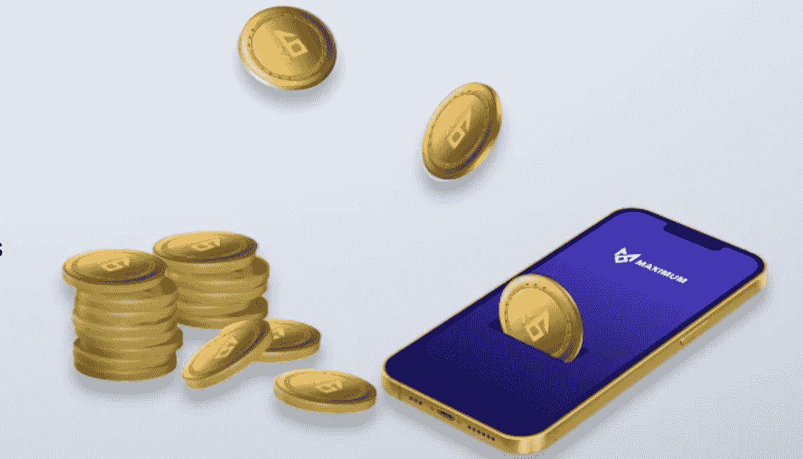
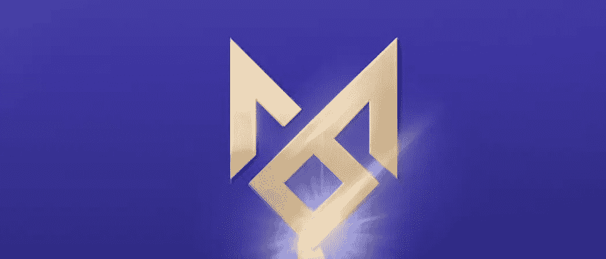

# Maximum 通过自动下注以固定的复利回报其用户。

> 原文：<https://medium.com/coinmonks/maximum-rewards-its-users-with-a-fixed-compound-interest-payback-from-auto-staking-62c4c939c39b?source=collection_archive---------54----------------------->

Maximum 是另一个有趣且丰富的加密货币平台，部署在币安智能链(BSC)中，通过自动下注以固定复利回报其用户。最大限度的自动赌注系统使赌注能够得到有效和高效的渲染，最大限度的代币用户/持有者通过他们的平台获得乐观的回报，$最大限度的代币自动赌注和复利使您达到 **10'019'148%** 固定 APY。这很令人惊讶，对吗？是的它是。有了最大的平台，这一切都成为可能，如果你可以毫无阻碍地开始旅程，那么你一定会到达你的 APY。

**最大生态系统**
最大生态系统是由一个创新的系统来支持其价格和 rebase 奖励。它包括最大覆盖基金(MCF)，该基金作为一项保险基金，通过向所有令牌持有者**发放一致的 0.000001096% **再基准利率**3 秒，来维持减少价格波动和最大协议的长期可持续性。** Maximum further development 团队设计了一个系统，该系统将在后台远程无缝运行。他们的持有人只会看到一个优雅的赌注和奖励系统，与你和你的工作。

**常规令牌销毁**；最大生态系统的最具创新性的特点是一个名为“黑洞”的自动令牌燃烧系统，它可以防止流通供应的膨胀。在每笔交易中，黑洞消耗了所有最高代币市场销售额的 2.5%。

**pink sale 的预售工作将如何进行？** 这将是一个公平的发布会，以确保所有参与者获得平等的价格。软帽是 50 BNB，没有硬帽。

最大值是去 KYC 吗？
是的，KYC 流程将在预售前完成。

**有白名单吗？** 没有，没有白名单。他们希望给所有社区成员一个参与预售的公平机会。

APY 利息收益率何时开始累积？
当每个人都从 PinkSale 领取了他们的预售金额并且合同生效后，奖励将开始累积。人们声称，如果销售延长到 10 天，奖励将在销售结束后开始，协议启动。

他们计划确保所有投资者都在 PinkSale 上认领了他们的代币，这样他们的$MAXIMUM 代币就在他们的钱包里，并将获得 APY 利息奖励。一旦他们启动了最大化协议来启动 APY 循环，它就不能被暂停或停止，这就是最大化的美妙之处。

你如何维持这么大的 APY？
MAXIMUM 团队以可持续发展和增长为理念打造了一款产品。由于其 325，000 的低代币供应量、2.5%的自动烧录费和 3 秒钟的重置基础时间表，他们预计会呈指数级增长。

他们鼓励交易量，因为这为协议提供了 2.5-4.5%的税收入国库，另外 5%进入最大保险基金(MCF)钱包。这抵消的不仅仅是判给的每日利息。他们期望这些措施能够维持 APY。每日交易的最大值越多，国债和 MCF 余额自动增长越大，以帮助长期可持续性和未来增长。他们还有一个最大自动流动性引擎(MALE ),每 48 小时自动注入 4%的额外流动性，以保持方案的稳定性，并确保 APY 在最大值的整个生命周期内得到维持。

**Rebases 是如何工作的？** Rebase 是流通供给扩大的一种机制。在这种情况下，最大值根据持有人的应得利息增加其$最大供应量。

**我如何下注？** 最大自动下注为用户提供了一种获得下注奖励的简单方法。在您的钱包中最多持有$美元，您将自动获得直接存入您钱包的赌注奖励。

**我如何获得我的 Rebase 奖励？** 换基奖励，简单来说就是赌注奖励。您只需在钱包中最多放入$美元，就可以获得 Rebase 奖励。

**美元最大供应量是多少？** 美元最大代币的总最大供给量为 3.25 万亿。请点击下面的详细链接，了解项目最新进展、[路线图](https://maximumdao.finance/#roadmap)等更多信息。

[网站](http://maximumdao.finance/) | [白皮书](https://docs.maximumdao.finance/) | [电报](https://t.me/maximum_token) | [推特](https://twitter.com/maximum_token) | [用户名:Rigmoney](https://bitcointalk.org/index.php?action=profile;u=3380226) | [POA](https://bitcointalk.org/index.php?topic=5396636.msg60077005#msg60077005) |