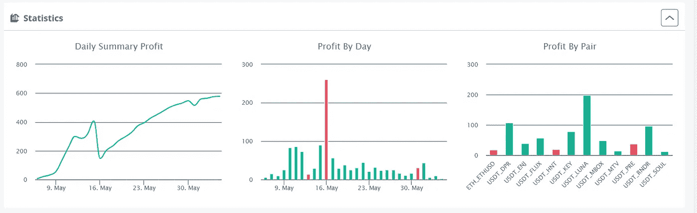

# 阿美:从机器人、矿工和一些新项目中获得 1400 美元的被动收入！

> 原文：<https://medium.com/coinmonks/may-1-400-in-passive-income-from-bots-miners-a-couple-of-new-projects-3c824d798f7b?source=collection_archive---------2----------------------->

从上个月开始，我已经能够将通过 Crypto 获得的被动收入翻倍。上个月我赚了 705.80 美元——你可以在这里找到链接

你可能注意到了上一段被动旁边的(种)…原因？有两个。

*   机器人——鉴于目前的市场状况，我不得不在这个月对短期机器人进行几次干预。一些红色日子后的反弹填补了我的安全订单，让我蒙受了相当大的损失。
*   Stepn——我决定加入 Stepn，在跑步的同时获得一些密码。这将是被动的，如果我在跳下去之前经常跑步，但是，嗯…..我没有在 Stepn 之前跑，所以可以说，不是被动，而是有点被动？没关系！它能赚 100 万美元.

因此，让我们将五月份的数字进行细分(底部为高水平数字)。

1.  **M2 职业矿工**

这是我最喜欢的被动收入矿工手到擒来！我上个月提到我可能会再买一个，我也买了。我在这里有一篇关于矿工[的完整评论](https://realisticcrypto.medium.com/my-highest-paying-2-electric-per-month-plug-play-crypto-miner-makes-me-around-12-per-day-per-375ccc604988)，文章中还有一个 50 美元折扣的链接。

这个月，通过这两个矿工，我赚了 653.09 美元。总的来说，我已经从 6000 美元的投资中获得了 1390.13 美元。

这些矿工将在总共 10 个月内获得投资回报。这当然是一个我会继续投资的项目。

**2。氦矿工**

这是新增加的。上个月，我有点不耐烦地等待一些山猫 300(将在未来几周内到达)，当我看到一些 Sensecap M1 可用时，我冒险买下了它们。我还买了一些售后 5dBi RAKWireless 天线，因为该设备附带的 2.8dBi 天线在我所在的地区表现不太好。我总共为矿工和天线花费了大约 1200 美元。

一人总共获得了 5.65 HNT，另一人获得了 2.73 HNT，总计约 73 美元。

注意，在我们回到历史之前，我不打算出售任何 HNT。这个月总共是 460 美元。

**3。Stepn**

这也是一个新增加的项目，现在我要宣布，我的初始投资减少了！我会在接下来的几周写一篇关于这个的文章，但是我现在有 4 双运动鞋。拥有 3 个或更多能给我 4 个能量，让我跑 20 分钟。我的初级球鞋是 9 级，超过 20 分钟可以赚 21 GST。修理鞋子后，我通常会剩下大约 17 GST。以目前的价格，我每天可以赚 14 美元，我已经跑了 6 天了，总共 84 美元。

我计划继续再投资的收入，并拉平这双运动鞋，以获得更多的奖励。

我还计划运行一个造币策略，以获得最多 9 双运动鞋，这将增加能量，让我跑 45 分钟，这也将使奖励加倍(在这个过程中我的健康！)

**4。DCA 机器人**

这是一个有趣的月份，卢纳和 UST 的情况以及加密市场的广泛回调。

有几天，我手动接受了亏损，5 月 16 日明显亏损了 261 美元。我们总要承受一些损失，对吗？

我还利用这个机会在 LUNA 上运行了大约一个星期的长机器人，因为 LUNA/UST 的混乱让我这个月赚了大约 200 美元。

我还为预搜索(PRE)添加了一个新的机器人，这是一个分散的搜索引擎。这里的[条](/coinmonks/do-you-want-a-good-search-engine-that-pays-you-in-crypto-to-use-it-a545f11df840)。还有其他方式从这个项目中赚钱，包括运行一个实际的节点(不是庞氏节点！)或通过标桩 PRE 来做广告。如果这是一个被动的收入来源，我会在下一次更新中添加。

我如何设置机器人的指南可以在[这里](/coinmonks/dca-bots-do-they-actually-work-and-are-they-actually-passive-income-im-undecided-90846b04db2a)找到。

机器人的总利润——574 美元

**5。SCPrime**

这是一个我非常看好的长期项目。一篇深入的文章可以在[这里](https://realisticcrypto.medium.com/scprime-long-term-investment-providing-your-own-storage-c2ab374c754a)找到。除了我赚了 13.5 SCP，我没有更多要说的了。按现价 4.82 美元。

**6。行星观察&区块创建**

PlanetWatch 收益= 0.00 美元

区块创造收益= 0.92 美元/4，480 区块

长话短说，这些矿工不适合我。对于 PlanetWatch，我有一个 Awair 元素，但 Awair & PlanetWatch 掉出来了，因此 Awair 不再是 PlanetWatch 认可的设备。我在其他设备的等待名单上，所以当机会出现时，我会回到 PlanetWatch。

对于 Blockcreate，我会持有代币，也许有一天它们会有价值，嗯？

总数

M2 专业版——653.09 美元

氦气——73 美元

stepn——84 美元

DCA 机器人——574 美元

黄金——4.82 美元

植物手表——0.00 美元

block create——0.92 美元

**总计:1389.83 美元**

**附属链接**

更多优惠还可以在这里找到:[https://linktr.ee/RealisticCrypto](https://linktr.ee/RealisticCrypto)

还有，如果你想请我喝杯咖啡或者啤酒:) :

BTC—BC 1 qaxaq 2 q 9 js 89 gyzhr 0202 sxt 6 hgchprqjga 5 px

基于 ETH、BNB、AVAX、SOL 和 FTM 的令牌—0 x3b 7b 843d 8125 Fe 7 EBA 541 e 1d 751 a4 a 73 f 0 cfad 4c

**免责声明**

这不是财务建议，我不是财务顾问或会计或税务专家。这是我对帮助过我的软件工具的体验，以及我使用它们的经历。

我在本指南中使用了推荐链接。使用这些工具有助于以后的文章，所以如果你觉得这篇文章有用，并且想看看我提到的工具，请使用它们。我还会叫出你在哪里打折——双赢对吧？

> 加入 Coinmonks [电报频道](https://t.me/coincodecap)和 [Youtube 频道](https://www.youtube.com/c/coinmonks/videos)了解加密交易和投资

# 另外，阅读

*   [Bookmap 点评](https://coincodecap.com/bookmap-review-2021-best-trading-software) | [美国 5 大最佳加密交易所](https://coincodecap.com/crypto-exchange-usa)
*   最佳加密[硬件钱包](/coinmonks/hardware-wallets-dfa1211730c6) | [Bitbns 评论](/coinmonks/bitbns-review-38256a07e161)
*   [新加坡十大最佳加密交易所](https://coincodecap.com/crypto-exchange-in-singapore) | [购买 AXS](https://coincodecap.com/buy-axs-token)
*   [红狗赌场评论](https://coincodecap.com/red-dog-casino-review) | [Swyftx 评论](https://coincodecap.com/swyftx-review) | [CoinGate 评论](https://coincodecap.com/coingate-review)
*   [投资印度的最佳密码](https://coincodecap.com/best-crypto-to-invest-in-india-in-2021)|[WazirX P2P](https://coincodecap.com/wazirx-p2p)|[Hi Dollar Review](https://coincodecap.com/hi-dollar-review)
*   [加拿大最佳加密交易机器人](https://coincodecap.com/5-best-crypto-trading-bots-in-canada) | [库币评论](https://coincodecap.com/kucoin-review)