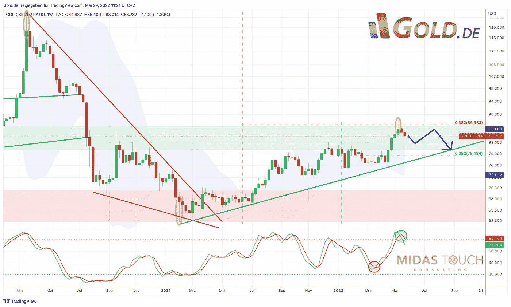

# 2022 年 5 月 29 日，银牌——第一次恢复，然后第二次站起来

> 原文：<https://medium.com/coinmonks/may-29th-2022-silver-first-recovery-then-second-leg-to-stand-on-3081c5e76d45?source=collection_archive---------19----------------------->

正如四周前所料，在恐慌的市场环境下，银价继续下跌。尽管通胀数据创下新高，但美元走强和股市暴跌也给贵金属行业造成了巨大的抛售压力。直到 5 月 13 日才达到 20.46 美元的恐慌性低点。此后，白银价格回升了 8.5%，至 22.20 美元。这种复苏仍可能有更大的上涨空间。然而，季节因素在仲夏之前仍然是不利的。因此，在持续的复苏浪潮结束后，低价格甚至更低的价格肯定会再次出现。**银牌——先恢复，再站第二腿。**

## 黄金/白银比率表明白银将出现反转

*Gold/Silver-Ratio, weekly chart as of May 29th, 2022\. ©Gold.de & Midas Touch Consulting*

自 2021 年 2 月 1 日以来，白银投资者几乎没有任何理由庆祝，因为白银价格从未能够跟上黄金价格的良好发展。因此，**黄金/白银比率**在 15 个月内从 62.51 的低点升至 88.35 的高点。虽然金价仅略低于 3 月初的历史高点，但白银大多顽强地在大约 21 美元至 30 美元的大区间内横盘整理。去年 30 美元左右的高点在任何时候都不可能达到。相反，在 5 月份，在经典的牛市陷阱中，白银也暂时跌破了 21.50 美元至 23.00 美元之间的广泛支撑区。因此，自 2021 年 2 月以来，敏感的白银越来越多地预期到全球流动性紧缩在最近几个月对所有市场造成的破坏！

然而，自 5 月 12 日以来，黄金/白银比率现在预示着有利于白银价格的可能趋势逆转。至少比值已经对 38.2%的回撤做出了反应，并在周线图上形成了反转蜡烛线。只有未来的几周和几个月才能显示这是否会发展成一些更积极的因素。然而，白银投资者在未来几年的耐心最终会得到回报的机会仍然存在，这一点毋庸置疑。然而，这需要稳定金融市场。鉴于投资者情绪低落，未来几周出现重大复苏的可能性相当大。当然，贵金属也将从中受益，因为它们通常会在货币政策变化的早期就开始定价。强烈超买的美元的调整也可能给贵金属带来支撑&中期动力。

## 假设金融市场只是暂时复苏

尽管如此，目前形势依然紧张，因为到目前为止，股市暴跌是逐渐展开的。到目前为止，还没有观察到极度恐慌的高峰。然而，通常情况下，只有这种投降式的让步才能让回调或熊市持续结束。在这方面，目前最好假设金融市场只是暂时复苏。对于贵金属来说，这最初意味着持续复苏的机会。但随后，在 7 月或 8 月应该会有另一次明显的回调，这可能会提供第二个立足点。这可能还需要一两个月的时间，因为股市很可能在 9 月份最终崩盘，并可能再次拖垮市场上的所有板块。一般来说，低于 20 美元的银价将会打开更大的下跌空间。

## 以美元计价的白银——充其量是朝着 200 毫安的方向回升

*Silver in US-Dollar, daily chart as of May 29th, 2022\. ©Gold.de & Midas Touch Consulting*

5 月 13 日，白银价格跌至 20.45 美元的低点，短暂跌破了过去两年的所有低点，因此可能再次摆脱了许多弱势手。在这一牛市陷阱之后，银价在过去两周内得以回升至广阔的支撑区域。但是这次的回升还没有达到 22.50 美元附近的最低目标(上一波下跌的 38.2%回撤位)。然而，日线随机指标已经开始再次到达超买区，因此提供了关于反弹持续性的第一个警告信号。鉴于高度的悲观情绪以及期货市场相对有利的形势(CoT 报告)，朝着下跌的 200 天移动平均线(23.55 美元)或多或少的直接复苏也是很有可能的。但不要忘记，白银的季节性趋势只会从 7 月/8 月开始放缓。

**综上所述，银价仍处于大约。20.50 英镑左右。30 美元。已经开始的复苏在短期内仍有空间。然而，在仲夏之前，第二个立足点在 21 美元左右或更低一点也不奇怪。中期而言，尤其是长期而言，白银价格“只能”持续突破 30 美元关口，然后才能朝着 50 美元左右的历史高点快速起飞。然而，在那之前，银粉们必须耐心等待。**

## 欧元白银——20.20 欧元的新买入限额

白银的季节性模式通常会在 6 月至 8 月间出现重要低点。因此，白银的买入限制终于又有了意义。运气好的话，白银将至少回到 21 美元的水平或更低。由于美元的修正，我们可以看到白银略低于 20 欧元。因此，我们在 20.20 欧元设置了新的买入上限，以确保我们在夏季低点时买入。

那些仍然需要大幅增加实物贵金属持有量的人(建议最低。5%和最大值。总资产的 25%)确实已经在当前水平找到了好价格。最终，最优惠的价格并不重要，重要的是你把它握在自己手中。

*分析最初发表于 2022 年 5 月 27 日，作者*[*www . gold . de*](https://www.gold.de/artikel/silber-erst-erholung-dann-zweites-standbein/)*。翻译成英文，2022 年 5 月 29 日部分更新。*

*随时加入我们的* [*我们的免费电报频道*](https://www.midastouch-consulting.com/services/newsletter-telegram) *获取每日实时数据和一个伟大的社区。如果您喜欢获得我们的黄金模型、贵金属和加密货币的定期更新，您还可以订阅我们的* [*免费简讯*](http://bit.ly/1EUdt2K) *。*

*声明:本文及其内容仅供参考，不包含投资建议或推荐。每一次投资和交易都有风险，读者在做决定时应该进行自己的研究。此处表达的观点、想法和意见仅属于作者个人。它们不一定反映或代表 Midas Touch Consulting 的观点和意见。*

> 加入 Coinmonks [电报频道](https://t.me/coincodecap)和 [Youtube 频道](https://www.youtube.com/c/coinmonks/videos)了解加密交易和投资

# 另外，阅读

*   [3 商业评论](/coinmonks/3commas-review-an-excellent-crypto-trading-bot-2020-1313a58bec92) | [Pionex 评论](https://coincodecap.com/pionex-review-exchange-with-crypto-trading-bot) | [Coinrule 评论](/coinmonks/coinrule-review-2021-a-beginner-friendly-crypto-trading-bot-daf0504848ba)
*   [莱杰 vs n rave](/coinmonks/ledger-vs-ngrave-zero-7e40f0c1d694)|[莱杰 nano s vs x](/coinmonks/ledger-nano-s-vs-x-battery-hardware-price-storage-59a6663fe3b0) | [币安评论](/coinmonks/binance-review-ee10d3bf3b6e)
*   [Bybit 交易所评论](/coinmonks/bybit-exchange-review-dbd570019b71) | [Bityard 评论](https://coincodecap.com/bityard-reivew) | [Jet-Bot 评论](https://coincodecap.com/jet-bot-review)
*   [3 commas vs crypto hopper](/coinmonks/3commas-vs-pionex-vs-cryptohopper-best-crypto-bot-6a98d2baa203)|[赚取加密利息](/coinmonks/earn-crypto-interest-b10b810fdda3)
*   最好的比特币[硬件钱包](/coinmonks/hardware-wallets-dfa1211730c6) | [BitBox02 回顾](/coinmonks/bitbox02-review-your-swiss-bitcoin-hardware-wallet-c36c88fff29)
*   [block fi vs Celsius](/coinmonks/blockfi-vs-celsius-vs-hodlnaut-8a1cc8c26630)|[Hodlnaut 审核](/coinmonks/hodlnaut-review-best-way-to-hodl-is-to-earn-interest-on-your-bitcoin-6658a8c19edf) | [KuCoin 审核](https://coincodecap.com/kucoin-review)