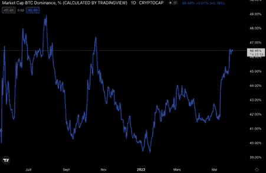

# 五月概览

> 原文：<https://medium.com/coinmonks/may-overview-54c1f4f3231c?source=collection_archive---------26----------------------->

## 您对数字资产世界的每月简报

> 文章作者 [Sixte CP](https://www.linkedin.com/in/sixte-c-a72b47173/)

## 市场更新

## 地球生态系统崩溃

## 金融机构

*   *野村加入摩根大通和高盛，开始向客户提供比特币衍生品*
*   *传统投资者在 crypto 中寻找什么？*

## 公司

*   随着其 BTC 贷款接近追加保证金通知，MicroStrategy 股票暴跌

## 监管者

# 市场更新

在图表上，比特币正在建立自 2021 年 11 月以来的更低低点，跌破 2021 年 7 月的水平，并结束了有史以来最长的红色周蜡烛线(5 月 29 日)。美联储对通胀的强硬态度以加息 50 个基点和加快资产负债表流失步伐而告终。随着乌克兰战争似乎没有结束，地缘政治的不稳定性不断增加，这促使投资者降低其所持资产的风险。Terra 生态系统的崩溃加剧了比特币的抛售，LUNA 280 亿美元的市值在几天内蒸发。

5 月，crypto 的情况看起来很糟糕。熊市(如果还没有开始的话)似乎就在眼前。然而，如果我们后退一步，不仅加密市场在萎缩，股票市场也是如此。有人可能会问，比特币崩盘是因为新的相关信息影响了市场，还是仅仅因为与股票的相关性增加(或者两者都有)？

*Source: JKL Capital research*

相关性图表显示，比特币与股票市场的相关性最近创下新高。比特币的交易似乎更像是一种风险投资，而非储备资产。事实上，比特币与黄金的负相关性达到历史高点，意味着投资者不再将比特币视为可靠的货币，而是将其视为一种新的投机投资类别，就像股票一样。

比特币像风险资产一样交易，也是因为新的机构参与者进入了市场。现在，随着各国央行开始量化紧缩，市场收缩，机构开始寻找流动性出口，并首先关闭它们的加密头寸。交易员还对比特币和股票之间日益增长的相关性负有责任，因为他们通过平仓加密头寸来弥补传统市场上的亏损/利润。因此，crypto 受益于机构采用，这加剧了 2021 年的牛市，但也将在下行周期中看到更多的资本外逃。机构采用仍处于初级阶段，我们尚未看到它对比特币的长期影响。有一点是肯定的:为了让比特币与股票脱钩，市场参与者应该进一步了解比特币的基本面及其作为避险资产的本质。

# 地球生态系统崩溃

那么泰拉发生了什么？在我们三月的时事通讯中，我们解释了 UST 的机制——Terra 的算法稳定中心。

UST 是一种算法稳定的货币，而卢娜是帮助其保持盯住汇率的一种象征。得益于套利激励和协议机制，UST 维持了人民币盯住美元的汇率制度。任何市场参与者都可以铸造价值 1 美元的卢纳，然后烧掉 1 个 UST(案例 1)，或者铸造 1 个 UST，然后烧掉价值 1 美元的卢纳(案例 2)。

*   案例 1:当 UST 处于钉住汇率(例如 0.98 美元)时，用户可以用 1 UST 兑换 1 美元的卢纳(套利机会= 1 美元的卢纳——1 UST 价值 0.98 美元= 2 美分)。然后，他将通过出售价值 1 美元的 LUNA 来套现。在这个过程中，用户每交换一个 UST 将获得 2 美分，该协议将燃烧 1 UST 和造币厂价值 1 美元的月神。UST 的供应量将减少，因此其价格将回升至 1 美元。
*   案例 2:当 UST 超过挂钩汇率(例如 1.02 美元)时，用户可以用价值 1 美元的卢纳兑换 1 UST(套利机会=价值 1.02 美元的 1 UST——价值 1 美元的卢纳= 2 美分)。然后，他将通过卖出 1 UST 套现。在这个过程中，用户每交换价值 1 美元的月神将获得 2 美分，协议将燃烧价值 1 美元的月神和薄荷 1 UST。UST 的供应量将增加，因此其价格将回落至 1 美元。

理论上，有人说在熊市条件下，LUNA 的价格可能会贬值。如果 LUNA 被用来保持 UST 挂钩，用户自然可以推测挂钩可能失败，因此他们出售他们的 UST。如果 UST 的供给不能被充足的需求所满足，UST 将会被钉住。协议将继续铸造更多的卢娜来留住佩格。月神将失去更多的价值，一个“死亡螺旋”诞生了。

*Source: Twitter @Westie*

实际上，Terra 生态系统的死亡螺旋略有不同。事实上，它并非始于 Luna 的价值缩水，而是始于 UST 的银行挤兑。在 UST 失去 1 美元的挂钩汇率之前，75%的 UST 都存在锚定协议中。Anchor 为 UST 存款提供近 20%的 APY，是采用 UST 的主要驱动力，但也是它的一个失败点。从 5 月 7 日开始，主播用户开始提取存款。由于对他们中的大多数人来说，购买这些地下证券的唯一原因是 Anchor 承诺的高固定利率，用户自然会在公开市场上出售他们的地下证券。然后开始了上面提到的死亡螺旋。

对死亡螺旋的恐惧是 Terra 在过去几个月增加 BTC 储备的原因。

理论上，用户可以与 BTC 储备银行互动，而不是与铸造新月神来保持联系的协议互动。BTC 储备银行将向任何提供 1 UST 的用户赠送价值 0.98 美元的 BTC。因此，如果 UST 交易低于 0.98 美元，市场参与者将被激励使用 UST 折价购买 BTC。UST 需求的增加将使其价格恢复到与美元挂钩的水平。因此，BTC 不是用来铸造或焚烧 UST，而只是恢复其与美元的挂钩。

实际上，Luna Foundation Guard (LFG)不仅动用了全部比特币储备来捍卫联系汇率，还向做市商借出了 15 亿美元的比特币和 UST，最终试图恢复联系汇率。两次尝试都失败了，LFG 的 BTC 和美元储备被清空，UST 没有恢复挂钩，Luna 损失了 100%的价值。那么，之后发生了什么？

该社区希望得到回报，Terra 的首席执行官 Do Kwon 希望继续他在加密货币领域的冒险。两个阵营都走进了死胡同，因为整个 LFG 保护区已经化为乌有，而社区也不再想听到道权的名字。因此，权道和他的团队找到了一个折中的办法:

1.  分叉当前链
2.  放弃 UST 稳定币
3.  目前的 LUNA 持有者成为“经典”链的 LUNC 持有者
4.  新链的令牌持有者成为新的月神持有者
5.  新链发行 10 亿 LUNA，空投给 LUNC 持有者、UST 持有者和开发商

“妥协”是因为新的 LUNA 网络完全由社区所有，所以 Do Kwon 和他的团队较少参与该项目。这可能会取悦那些对他们完全失去信任的利益相关者。“妥协”也是因为，现在 LFG 储备是空的，空投可能是老特拉连锁利益相关者的唯一选择是完整的，或者至少得到他们美元的体面的美分。

在建立生态系统复兴计划的整个过程中，由 Vitalik Buterin，CZ 和 Justin Sun 支持的社区将小散户投资者在鲸鱼之前获得退款作为一个荣誉点。相反，由于以下几点，跆拳道复兴计划使社区非常沮丧:

1.  鲸鱼和零售之间只有一个区别:在 depeg 活动之前拥有超过 100 万 LUNA 的钱包将有一个持续 4 年的归属计划，而不是 2 年。
2.  露娜空投的数量将按比例分配，不会优先支持小股东。
3.  对于 UST 持有者空投资格和令牌授予时间表，鲸鱼和零售之间没有区别。
4.  空投将基于启动时的快照，而不是 depeg 时的快照——这意味着以折扣价购买 UST 邮报 depeg 的投资者也将有资格获得空投的份额。

在以 65%的支持率进行治理投票后，名为的复兴计划得以推进。成功通过的另一项治理投票将通过燃烧机制减少 11%的 UST 供应量。新的分叉链 Terra 2.0 不支持 UST 和 LUNC 令牌。最初支持 LUNC 和 UST 的 Terra 区块链在 5 月 13 日被叫停。因此，尚不清楚 LUNC 和 UST 在新生态系统中的效用，以及它们的价值。

JKL 资本对 UST 和露娜没有风险敞口。事实上，我们的产品——套利和定向量化交易策略——旨在最大限度地利用这一事件引发的市场波动。

# 金融机构

## 野村加入摩根大通和高盛，开始向客户提供比特币衍生品

继 JP 摩根和高盛之后，第三家主要投资银行开始向其客户提供比特币期货和期权交易。尽管市场动荡，机构收养似乎仍在继续。

野村最近成立了一家新的子公司，专门负责数字资产。随着 TradFi 巨头进入这一领域，新的资本正在流入；但最重要的是，它有助于投资者对 crypto 越来越信任。就像熊市通过消灭弱小的参与者来净化市场一样，机构采纳同样降低了生态系统的风险。事实上，机构将支持经过适当审计并严格遵守法规的项目。这些项目将蓬勃发展，在熊市中幸存下来，并使该领域的投资更加安全。根据野村证券数字资产部门首席执行官 Jen Mohideen 的说法，机构“将致力于将信任带入这个生态系统”。

在 DeFi 中，机构采用有助于推动 Aave Arc 等反洗钱和 KYC 合规项目。在元宇宙，它是通过购买土地来实现的，就像 JP 摩根在分散土地上所做的那样。机构收养是一把双刃剑。如上所述，一方面，它增加了比特币与股票的相关性，赋予其风险资产的特征。另一方面，它增强了对加密市场的信任，增加了其作为安全投资的合法性，从而降低了风险。

## 传统投资者在 crypto 中寻找什么？

随着当前市场情绪的转变，我们将调查在这种情况下传统投资者在寻找什么。在 2021 年的上一轮牛市期间，我们看到传统投资者青睐高投资回报率的数字资产，如 Solana 或 Avalanche 等以太坊杀手。现在，大多数市场分析师都有信心宣布熊市，传统投资者正在将兴趣转向高质量的数字资产——比特币和以太坊。事实上，这解释了为什么我们目前正在目睹比特币市场主导地位的飙升。

*Source: Trading View*

从历史上看，在熊市期间，比特币表现出比高贝塔替代币更强的支撑力。因此，投资者试图避免接住落下的刀子，而更愿意增加对比特币的配置。

在长期下跌趋势中关注加密的传统投资者也在交易所公用事业代币中找到了安宁。事实上，运用 DCF 模型等传统方法对交易所进行估值的能力，使得代币定价对传统投资者来说更加可靠(和相关)。因此，我们看到传统投资者在当前市场中也青睐 BNB。

这与一般的 web3 早期项目相反，后者做出了许多长期承诺，但没有提供短期绩效指标。投资者对赌注的了解越少，他投机的空间就越大。因此，在当前的市场条件下，传统投资者倾向于回避这类项目。我们目前正在见证早期估值的重大调整，因为顶级基金正在放缓资本部署。

**进一步阅读**

> 高盛首次发放比特币支持贷款。([阅读更多](https://www.coindesk.com/business/2022/04/28/goldman-sachs-makes-its-first-bitcoin-backed-loan-report/))
> 
> 复合国债获得 S&P 全球评级公司的 B 级信用评级。这是第一次主要信用机构对 DeFi 协议进行评级。([阅读更多](https://cointelegraph.com/news/compound-treasury-receives-b-credit-rating-from-s-p-global-ratings))
> 
> 由于交易量下降，比特币基地的 Q1 收入低于预期

# 公司

## MicroStrategy 股票暴跌，因其 BTC 贷款接近追加保证金

本月迄今为止，MicroStrategy (MSTR)的股票下跌了 40%，继续跟随比特币自由落体。该公司最近关闭了一笔 2.05 亿美元的比特币抵押贷款，以购买比特币，其整体比特币投资现在已经出局。像一个真正的霍德勒一样，首席执行官迈克尔·塞勒知道，如果他不出售 MSTR 的比特币股份，也不会造成真正的损失。然而，由于 MSTR 必须为其贷款保留 4.1 亿美元的抵押价值，如果 BTC 达到 2.1 万美元，该公司将被要求追加保证金。

许多媒体传播 FUD，暗示这样的事件将要求 MSTR 出售一些 BTC。如果这种情况发生，对比特币的信任将受到巨大打击，并可能加剧当前的熊市。然而，很明显，MSTR 无意出售任何一辆 BTC。根据 MSTR 2022 年 Q1 的[财务结果，只要比特币不跌破 3562 美元，其 BTC 财政部就足以支付贷款的保证金，在这种情况下,“公司可以提供一些其他抵押品”。目前，MSTR 比特币的未来似乎相当安全。然而，MSTR 的未来本身看起来并不乐观。其市值低于其 BTC 持股价值，收入停滞不前，自 2020 年第三季度以来，其 EBITDA 为负。MSTR 过度暴露于高度不稳定的资产，财务结果不确定。](https://www.microstrategy.com/content/dam/website-assets/collateral/financial-documents/events-presentations/Q1-2022_microstrategy-earnings-presentation.pdf)

进一步阅读

> 一些古驰商店将接受比特币、Dogecoin 和其他加密货币([阅读更多](https://www.theblockcrypto.com/post/145188/select-gucci-stores-to-accept-bitcoin-dogecoin-and-more-as-part-of-ongoing-experiments-in-web3)

# 监管者

> 萨尔瓦多总统推动新兴国家采用比特币([阅读更多](https://www.coindesk.com/policy/2022/05/17/el-salvadors-nayib-bukele-promotes-bitcoin-adoption-by-emerging-countries/))
> 
> 比特币在中非共和国成为法定货币，中非共和国是世界上最贫穷的国家之一。([阅读更多](https://www.bloomberg.com/news/articles/2022-04-28/bitcoin-is-declared-a-legal-currency-in-central-african-republic-l2isppnb))
> 
> 纽约州议会通过法案，阻止使用不可再生能源的新煤矿
> 
> 加州州长发布的区块链行政命令。([阅读更多](https://cointelegraph.com/news/california-governor-issues-blockchain-executive-order-building-on-us-president-s-regulatory-efforts))
> 
> 美国证券交易委员会的加密团队又增加了 20 名官员参与破解

**免责声明**

本材料的内容未经任何监管机构审查。建议您对本材料的内容保持谨慎。虽然本材料中包含的信息是从据信可靠的来源汇编的，但 JKL 不代表或保证本材料中包含的信息的准确性、完整性或可靠性。如果您对本材料的任何内容有任何疑问，您应该获得独立的专业意见。JKL 或其任何关联公司，或其任何或其各自的董事、高级职员、员工和代表都不会对因使用或依赖本材料中包含的任何信息而导致的任何直接、间接或后果性损失承担任何责任或义务。本材料不构成认购或购买任何金融产品的要约或邀请。其目的不是提供任何信贷或其他评估的基础，也不应被视为购买任何金融产品的建议。

