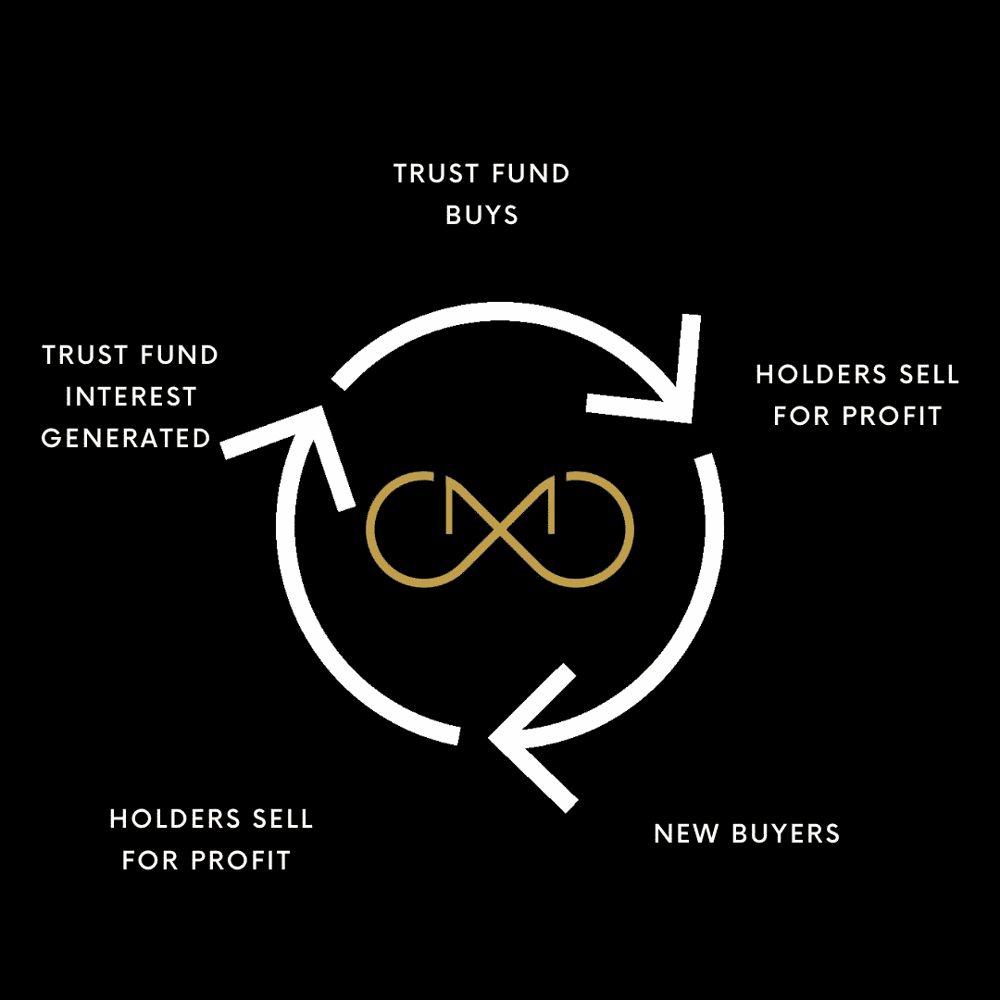
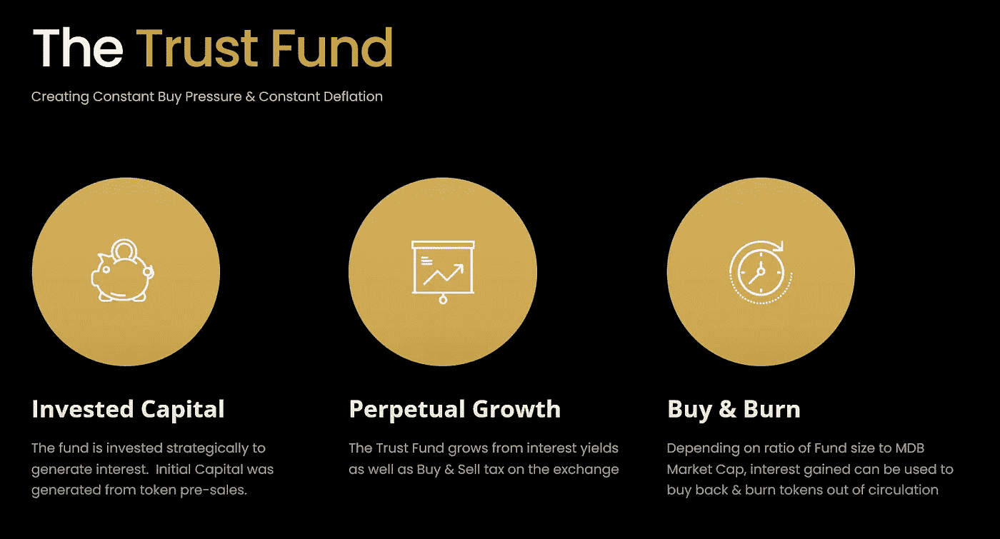
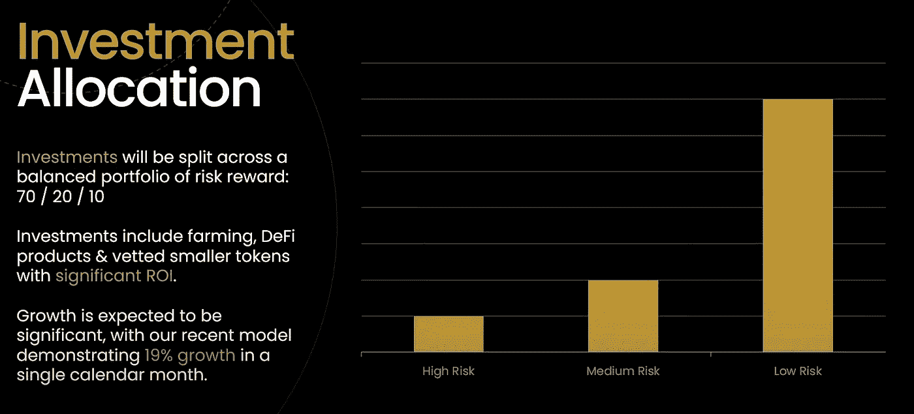

# MDB DeFi——动摇加密的未来

> 原文：<https://medium.com/coinmonks/mdb-defi-shaking-up-the-future-of-crypto-dc94f78da97a?source=collection_archive---------14----------------------->

Capital Synergy

百万美元宝贝(MDB)是最近在 BSC 网络上推出的一个全新的令牌，它将震撼 DeFi 的世界。怎么会？数学证明的永久增长。

听起来像是另一个 BSC 令牌，对吗？不对。

MDB 由一个独特的信托基金支持，该基金在成立之初就有一笔*的巨额投资*，因此在总市值中占据了一个非常健康的百分比。信托基金明智地投资于**低风险**然而**高回报**的资金池、农场和代币，赚取高额利息。 ***当前投资列表可在*** [***不和谐投资频道***](https://discord.com/channels/952941612592410664/967357636335009813) ***查看。***

投资产生的利息不仅用于信托基金的进一步增长(随着基金的增长，进而产生更高的利息),更重要的是用于回购和焚烧代币。

这种**持久的通货紧缩机制**确保持有者的价值**持久增长。卖出压力已成为过去，因为利息为持续的买入压力创造了机会。**信托基金与流动性是分开的，它不能出售，*它本质上是一份保险单*。

让我们深入了解更多…

# **什么是资本协同效应，它是如何工作的？**

什么是资本协同效应，它将如何使 MDB 持有者受益？首先，让我们来看一些定义:

*   *资本:增加公司长期净值的资产*
*   *协同作用:两个或多个组织、物质或其他媒介的相互作用或合作，以产生大于其单独效果总和的综合效果*

独特和原始的机制，资本协同作用，创造了一个循环效应，项目中的众多组成部分聚集在一起，创造了一个持久的增长效应。

**资本协同**是我们的**信托基金**(及其产生的利息)被一起利用以创造 MDB 令牌内在价值的指数增长的过程。

**简而言之，MDB 设计了一个集增长引擎和保险单于一身的系统**。信托基金是一种*高息投资*，用利息回购和焚烧代币，产生持续不断的购买压力。简而言之，这就是资本协同效应；MDB 的独特资产共同创造复合效应，带来永久增长。

***由于资金协同作用，即使交易量为零，代币的价值仍会增加。***

# **什么是信托基金？**

The Trust Fund

*信托基金是资本协同的驱动力*。**信托基金本质上是一笔(大额)资金，用于战略性投资以产生利息。**

这些利息随后被用来回购代币，并通过燃烧来制造通缩。这个方面被称为**凤凰**。

**这导致价格上涨，原因有二:**

1.  **恒买压**
2.  **持续通货紧缩**

信托基金将始终产生利息，从而始终对价格产生积极影响。信托基金启动时的规模与流动性之比为 5:1；这意味着它对价格的影响是巨大的。

Perpetual Growth

巧妙的外交辞令确保了信托基金总是在增长。

*   产生的一部分利息进入信托基金以增加其价值
*   买卖税也为信托基金带来额外收入

大规模抛售，或者说大规模抛售，只会增加信托基金的价值，这意味着信托基金对流动性的比率变得更加有利。

# **信托基金如何投资？**

信托基金是战略性投资，以确保高利息和低风险。最初的风险敞口将在风险/回报之间产生 70/20/10 的分配。投资需要灵活，以获得收益和尽可能高的回报。

**投资包括:农业、DeFi 产品&经过审核的投资回报率较高的小额代币。**预计增长会很显著，最近的模型显示单个日历月的增长率为 19%。

*   低风险——农业和算法代币的贬值风险最小，提供稳定的回报。(40%+4 月)
*   中等风险——风险略高，但回报显著较高的 DeFi 产品。(80%+每年 4 月)
*   高风险——混合了符合 MDB 审计标准的高利息 Defi(早期进入)以及较小的营销引导投资。

Investment Allocation

**买入&烧钱:**根据**信托基金和市值之间的比率**决定买入&烧钱何时发生。当**信托基金为市值的+20%时**，买入的概率很高。可以使用在此期间积累的部分或全部利息。这叫**“凤凰解锁。”在后面的文章中会有更多的介绍。**

*   ****当前投资列表可在*** [***不和谐投资频道***](https://discord.com/channels/952941612592410664/967357636335009813) 查看

别忘了关注社交活动，了解最新消息！👇

*   Youtube: [MDB DeFi](https://www.youtube.com/channel/UCNZ8ZADUtu-zHhvQJm-hilw)
*   推特:[https://twitter.com/mdb_defi](https://twitter.com/mdb_defi)
*   网址: [https://www.mdb.fund](https://www.mdb.fund/)
*   电报:[https://t.me/mdbtoken](https://t.me/mdbtoken)
*   文件:[https://million-dollar-baby.gitbook.io/mdbwhitepaper](https://million-dollar-baby.gitbook.io/mdbwhitepaper)

> 加入 Coinmonks [电报频道](https://t.me/coincodecap)和 [Youtube 频道](https://www.youtube.com/c/coinmonks/videos)了解加密交易和投资

# 另外，阅读

*   [印度最佳 P2P 加密交易所](https://coincodecap.com/p2p-crypto-exchanges-in-india) | [柴犬钱包](https://coincodecap.com/baby-shiba-inu-wallets)
*   [8 大加密附属计划](https://coincodecap.com/crypto-affiliate-programs) | [eToro vs 比特币基地](https://coincodecap.com/etoro-vs-coinbase)
*   [最佳以太坊钱包](https://coincodecap.com/best-ethereum-wallets) | [电报上的加密货币机器人](https://coincodecap.com/telegram-crypto-bots)
*   [交易杠杆代币的最佳交易所](https://coincodecap.com/leveraged-token-exchanges) | [购买弗洛基](https://coincodecap.com/buy-floki-inu-token)
*   [3 commas vs Pionex vs Cryptohopper](https://coincodecap.com/3commas-vs-pionex-vs-cryptohopper)|[Bingbon Review](https://coincodecap.com/bingbon-review)