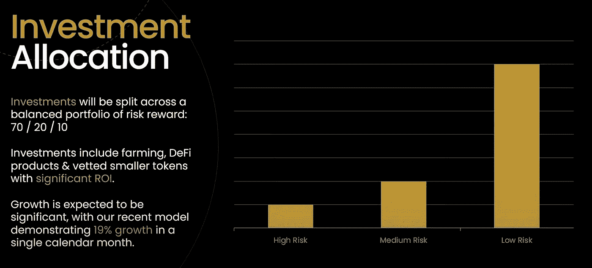

# MDB 投资组合

> 原文：<https://medium.com/coinmonks/mdb-investment-portfolio-77fc4e4af327?source=collection_archive---------15----------------------->

MDB Investment Strategy

** *本文将持续更新以反映所有 MDB 投资，因此请经常查看以了解这些投资如何支持 MDB 信托基金。* ( **最后更新 2022 年 5 月 6 日** )**

MDB 投资组合支持信托基金，并进行战略性投资，以确保**高利率和低风险**。最初的风险敞口将在风险/回报之间产生 70/20/10 的分配。投资需要灵活，以获得收益和尽可能高的回报。

***MDB Multi Sig 钱包地址如下:*0x 45 F8 F3 a7 a91e 302935 EB 644 f 371 bde 63d 0 B1 BAC 6**

# **风险等级:低**

***投资:BUSD/USDT bis WAP 农场***

金额:30 万美元

回报率:10.9% APY

风险类别:低

信托基金的百分比:20% *(大约。购买时)*

***投资:BNB /USDT 比斯 wap 农场***

金额:30 万美元

回报率:22.48% APY

风险类别:低

信托基金的百分比:20% *(大约。购买时)*

***投资:USDT/BSW bis WAP 农场***

金额:13 万美元

回报率:122.69% APY

风险类别:低

信托基金的百分比:8% *(大约。购买时)*

***投资:XUSD***

金额:15 万美元

回报率:约 22% APY

风险类别:低

信托基金的百分比:9.5% *(大约。购买时)*

“XUSD 提供了两个世界的最佳选择——相对而言，稳定资产的激进价格增长，价格贬值的可能性为零。完全去中心化，并接受 Certik 和 Solidproof 的审计。”

# **风险等级:中等**

***投资:BNB/BSW 比斯 wap 农场***

金额:15 万美元

回报率:135% APY

风险类别:中等

信托基金的百分比:10% *(大约。购买时)*

***投资:PancakeSwap 农场蛋糕/BNB***

金额:20 万美元

回报率:59% APY

风险类别:中等

信托基金的百分比:13% *(大约。购买时)*

# **风险等级:高**

***投资:环球金融***

金额:109 468.16 美元

回报:99，900% APY

风险类别:高

信托基金的百分比:7%(大约。在购买点)

***投资:萨富***

金额:30 000 美元

回报率:382，945.41% APY

风险类别:高

信托基金的百分比:2% *(大约。购买时)*

***投资:Titano***

金额:45 000 美元

回报率:102，483.58% APY

风险类别:高

信托基金的百分比:3% *(大约。购买时)*

别忘了关注社交活动，了解最新消息！👇

*   Youtube: [MDB DeFi](https://www.youtube.com/channel/UCNZ8ZADUtu-zHhvQJm-hilw)
*   推特:【https://twitter.com/mdb_defi 
*   网址: [https://www.mdb.fund](https://www.mdb.fund/)
*   电报:[https://t.me/mdbtoken](https://t.me/mdbtoken)
*   文件:[https://million-dollar-baby.gitbook.io/mdbwhitepaper](https://million-dollar-baby.gitbook.io/mdbwhitepaper)

> 加入 Coinmonks [电报频道](https://t.me/coincodecap)和 [Youtube 频道](https://www.youtube.com/c/coinmonks/videos)了解加密交易和投资

# 另外，阅读

*   [5 款最佳加密交易终端](https://coincodecap.com/crypto-trading-terminals) | [最佳 DeFi 应用](https://coincodecap.com/best-defi-apps)
*   [比特币基地 vs 瓦济克斯](https://coincodecap.com/coinbase-vs-wazirx) | [比特鲁点评](https://coincodecap.com/bitrue-review) | [波洛涅克斯 vs 比特鲁](https://coincodecap.com/poloniex-vs-bittrex)
*   [德国最佳加密交易所](https://coincodecap.com/crypto-exchanges-in-germany) | [Arbitrum:第二层解决方案](https://coincodecap.com/arbitrum)
*   [币安交易机器人](/coinmonks/binance-trading-bots-d0d57bb62c4c) | [OKEx 审查](/coinmonks/okex-review-6b369304110f) | [Atani 审查](https://coincodecap.com/atani-review)
*   [最佳加密交易信号电报](/coinmonks/best-crypto-signals-telegram-5785cdbc4b2b) | [MoonXBT 评论](/coinmonks/moonxbt-review-6e4ab26d037)
*   [如何在 Bitbns 上购买柴犬(SHIB)币？](https://coincodecap.com/buy-shiba-bitbns) | [买弗洛基](https://coincodecap.com/buy-floki-inu-token)