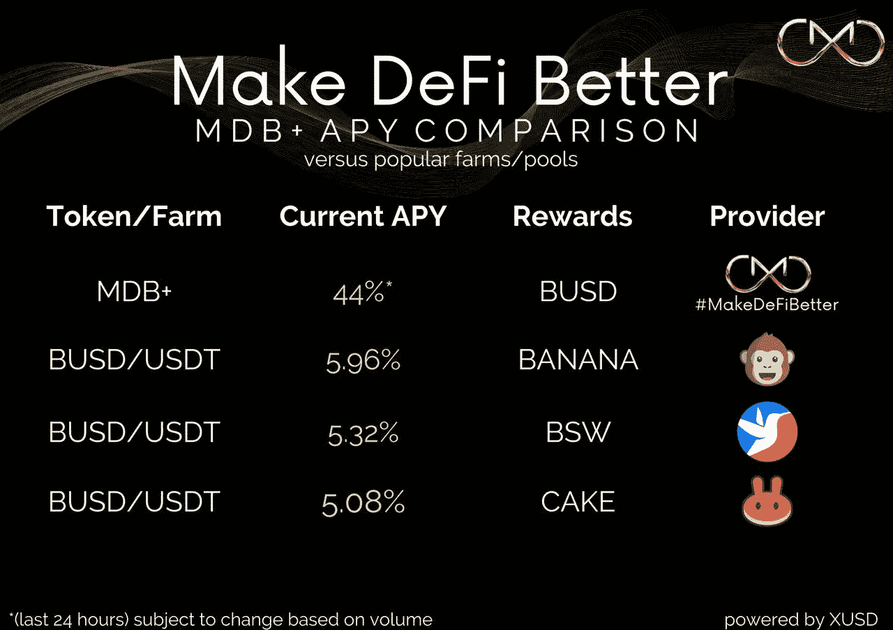
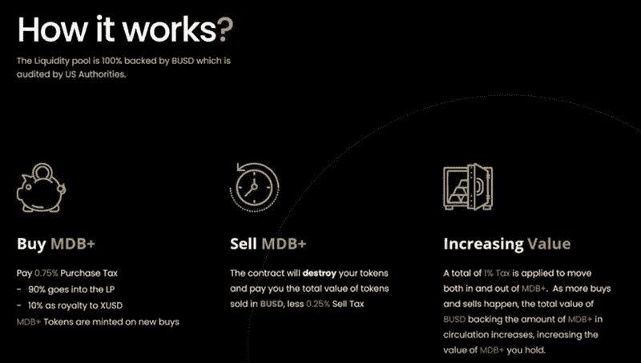

# MDB+:具有秘密力量的新稳定硬币

> 原文：<https://medium.com/coinmonks/mdb-the-new-stable-coin-with-a-secret-power-63579282b8c0?source=collection_archive---------8----------------------->

*(last 24 hours) 20 May 2022

DeFi 空间中最新的稳定硬币现已向公众开放！如果你正在寻找一个稳定的代币来储存你的资金，同时增值，MDB+提供了一个解决方案。

**什么是 MDB+**

[**MDB+**](https://www.mdb.fund/mdb-plus) 从根本上说是一个稳定的令牌和耕作机制融为一体。 [**MDB+**](https://www.mdb.fund/mdb-plus) 由 BUSD 100%支持，**不能**贬值！

但是，价格怎么会永远降不下来呢？从数学上讲，流动性池中 BUSD 的价值总是大于流通中 MDB+的价值。合同价格总是会增加，随着交易量的增加会产生复合效应。

**稳定的代币怎么升值？**

‍Each 的 MDB+买入和卖出收取小额税(买入和卖出合计 1%)，直接进入流动性池。MDB+代币在购买时铸造，在销售时燃烧，这意味着流动性始终稳定增长，高于流通中的代币数量。‍

**我们预计 APY 可以轻松达到两位数，尽管这取决于销量，因此投资回报率不是一个固定的数字。‍**

How MDB works?

**如何购买？**

MDB+可以在 PancakeSwap 上获得，也可以使用合约本身购买。**合同地址:0x 9 F8 bb 16 f 49393 EEA 4331 a 39 b 69071759 e 54 e 16 ea**

购买:把 BNB 送到合同地址，直接把相当于 MDB+的钱打到你的钱包里。

**出售:发送 MDB+给你自己，你就可以直接从你的钱包里收到等值的 BUSD 货币。**

* *一如既往-从少量测试开始，以确保一切正常运行。

**MDB 是 DeFi 的未来，它提供了一种经过数学证明的永续增长的象征，一种产生高利息的独特信托基金，支持超过 570%的流动性。百万富翁俱乐部只是为 MDB 持有者提供价值的一长串创新中的一个！**

通过 PancakeSwap 或 Bogged 购买 MDB 合同:[**0x 0557 a 288 a 93 ed 0 df 218785 f 2787 da C1 CD 077 F8 f 3**](https://pancakeswap.finance/swap?outputCurrency=0x0557a288a93ed0df218785f2787dac1cd077f8f3)

别忘了关注社交活动，了解最新消息！👇

*   Youtube: [MDB DeFi](https://www.youtube.com/channel/UCNZ8ZADUtu-zHhvQJm-hilw)
*   推特:[https://twitter.com/mdb_defi](https://twitter.com/mdb_defi)
*   网址: [https://www.mdb.fund](https://www.mdb.fund/)
*   电报:【https://t.me/mdbtoken 
*   文件:[https://million-dollar-baby.gitbook.io/mdbwhitepaper](https://million-dollar-baby.gitbook.io/mdbwhitepaper)

> 加入 Coinmonks [电报频道](https://t.me/coincodecap)和 [Youtube 频道](https://www.youtube.com/c/coinmonks/videos)了解加密交易和投资

# 另外，阅读

*   [3 商业评论](/coinmonks/3commas-review-an-excellent-crypto-trading-bot-2020-1313a58bec92) | [Pionex 评论](https://coincodecap.com/pionex-review-exchange-with-crypto-trading-bot) | [Coinrule 评论](/coinmonks/coinrule-review-2021-a-beginner-friendly-crypto-trading-bot-daf0504848ba)
*   [莱杰 vs Ngrave](/coinmonks/ledger-vs-ngrave-zero-7e40f0c1d694) | [莱杰 nano s vs x](/coinmonks/ledger-nano-s-vs-x-battery-hardware-price-storage-59a6663fe3b0) | [币安评论](/coinmonks/binance-review-ee10d3bf3b6e)
*   [Bybit Exchange 审查](/coinmonks/bybit-exchange-review-dbd570019b71) | [Bityard 审查](https://coincodecap.com/bityard-reivew) | [Jet-Bot 审查](https://coincodecap.com/jet-bot-review)
*   [3 commas vs crypto hopper](/coinmonks/3commas-vs-pionex-vs-cryptohopper-best-crypto-bot-6a98d2baa203)|[赚取加密利息](/coinmonks/earn-crypto-interest-b10b810fdda3)
*   最好的比特币[硬件钱包](/coinmonks/hardware-wallets-dfa1211730c6) | [BitBox02 回顾](/coinmonks/bitbox02-review-your-swiss-bitcoin-hardware-wallet-c36c88fff29)