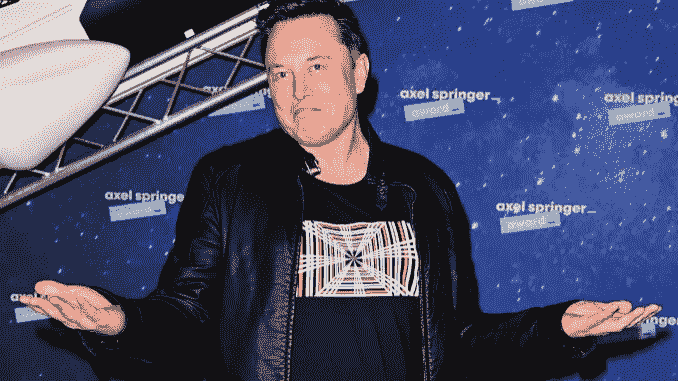
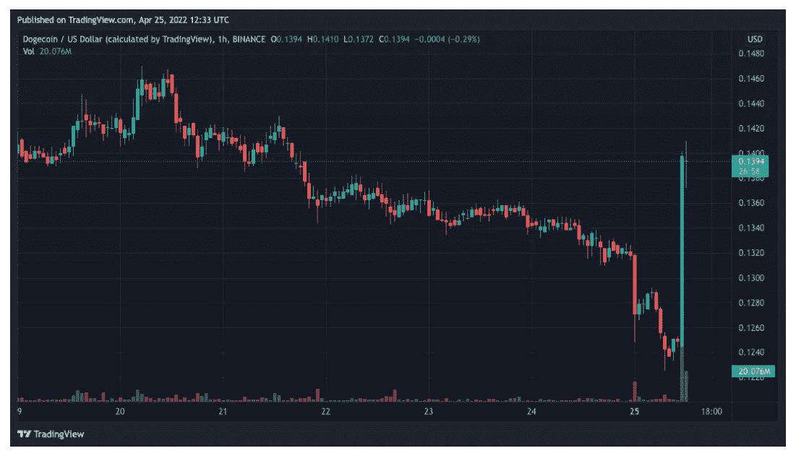
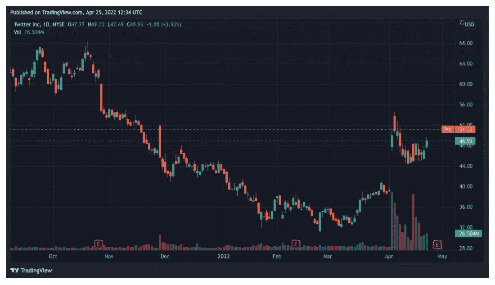

# 媒体:Twitter 修改了埃隆·马斯克的收购要约

> 原文：<https://medium.com/coinmonks/media-twitter-revised-elon-musks-takeover-offer-14aaeec72eae?source=collection_archive---------9----------------------->

Twitter 领导层已经改变了对埃隆马斯克(Elon Musk)收购这家社交网络的提议的态度。这是由[华尔街日报](https://www.wsj.com/articles/twitter-re-examines-elon-musks-bid-may-be-more-receptive-to-a-deal-11650822932)、[、](https://www.nytimes.com/2022/04/24/technology/twitter-board-elon-musk.html?)纽约时报和[美国消费者新闻与商业频道](https://www.cnbc.com/2022/04/24/twitter-is-reportedly-taking-another-look-at-musk-takeover-bid.html)援引消息来源报道的。

据该频道称，Twitter 管理层可能会在周四之前提交最终决定——这一天，该公司将公布第一季度的财务业绩。

报纸报道说，双方于 4 月 24 日会面。据称，修改立场的原因是 SEC 关于吸引这位亿万富翁 465 亿美元融资的[文件](https://www.sec.gov/Archives/edgar/data/0001494730/000110465922048128/tm2213229d1_sc13da.htm)。

媒体声称，4 月 25 日，该公司董事会与马斯克讨论了“其他细节，包括完成[交易]的时间表。”据记者称，这不是最终决定，企业家的提议可能不会被接受。对此，当事人据称提出了费用赔偿的问题——如果当事人不同意，特斯拉负责人会支付。

马斯克此前以 28.9 亿美元收购了 Twitter 9.2%的股份，成为 Twitter 的最大股东。他发起了一项倡议，以降低 Twitter 蓝色订阅的费用，并增加 Dogecoin 支付。

4 月 14 日，马斯克提出以超过 430 亿美元的价格收购这家社交网络。他解释说，这是为了创造一个“自由言论的包容性舞台”，而不是为了赚钱。

Twitter 管理层并不欣赏这位企业家的提议，批准了收购保护计划。它允许股东在未经董事会批准的情况下，在任何组织或个人收购至少 15%的公司证券的情况下，以折扣价购买额外股份。

马斯克“最喜欢的加密货币”Dogecoin 对收购 Twitter 的谈判达成共识的传言反应积极。根据 CoinGecko 的数据，它在过去的一个小时里上涨了 7.5%。

Hourly DOGE/USD chart on Binance exchange. Data: Trading View.

Twitter 在盘前交易中上涨了 5%以上。

NYSE TWTR daily chart. Data: Trading View.

让我提醒你，以太坊的联合创始人维塔利克·布特林(Vitalik Buterin)支持马斯克收购 Twitter，但怀疑从媒体平台转移到亿万富翁所有权的总体积极效果。

FTX 首席执行官 Sam Bankman-Fried 宣布，他准备与特斯拉的负责人讨论社交网络和比特币交易所之间互动的可能性。

> 加入 Coinmonks [电报频道](https://t.me/coincodecap)和 [Youtube 频道](https://www.youtube.com/c/coinmonks/videos)了解加密交易和投资

# 另外，阅读

*   [南非的加密交易所](https://coincodecap.com/crypto-exchanges-in-south-africa) | [BitMEX 加密信号](https://coincodecap.com/bitmex-crypto-signals)
*   [MoonXBT 副本交易](https://coincodecap.com/moonxbt-copy-trading) | [阿联酋的加密钱包](https://coincodecap.com/crypto-wallets-in-uae)
*   [Remitano 审查](https://coincodecap.com/remitano-review)|[1 英寸协议指南](https://coincodecap.com/1inch) | [购买 Floki](https://coincodecap.com/buy-floki-inu-token)
*   [MoonXBT vs Bybit vs 币安](https://coincodecap.com/bybit-binance-moonxbt) | [Arbitrum:第二层解决方案](https://coincodecap.com/arbitrum)
*   [买 PancakeSwap(蛋糕)](https://coincodecap.com/buy-pancakeswap)|[matrix export Review](https://coincodecap.com/matrixport-review)