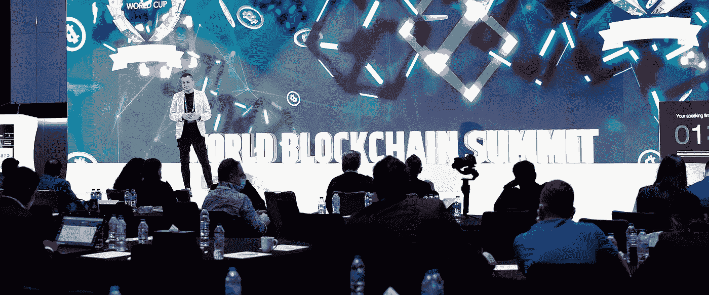
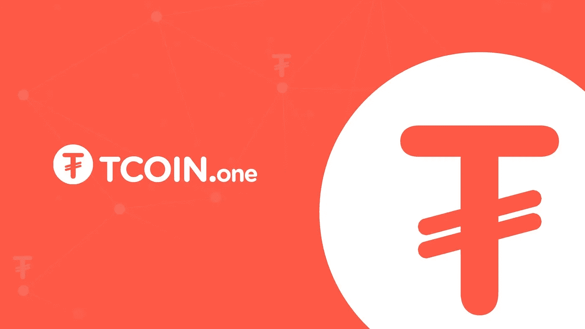
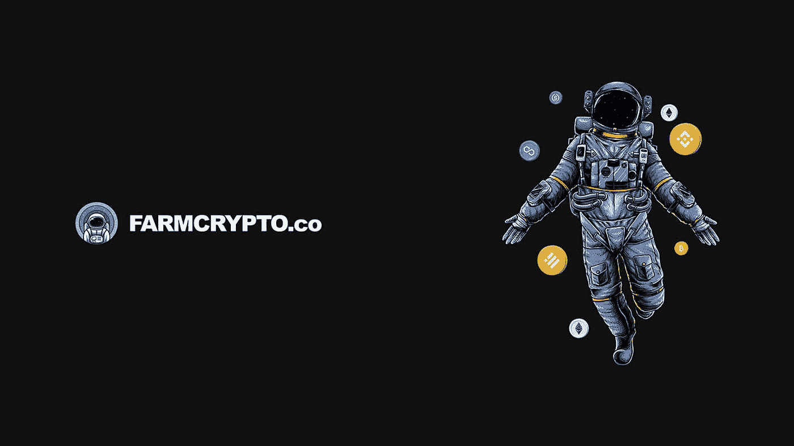

# 结识 4 位经验丰富的区块链顾问。我们在这里帮助您开发您的加密项目到最高水平！

> 原文：<https://medium.com/coinmonks/meet-4-experienced-blockchain-advisors-3f3c0d83ea4a?source=collection_archive---------50----------------------->

点击此处获取报价:[https://teamcrypto.eu/form/](https://teamcrypto.eu/form/)

*Dan Sebastian talking about DeFi at World Blockchain Summit in Dubai.

# 关于我们的团队。

与我们在**区块链**、 **IT** 、在**欧盟立法**获得许可的专家团队、各种**加密货币峰会和会议**的参与者和发言人见面，与投资者、上市平台和不同加密项目的首席执行官直接接触。

# 我们所做的。

凭借在 DeFi 所有领域的丰富经验，我们在这里帮助您将您的加密项目发展到最高水平，发展您的社交社区，并在加密领域的所有法律方面为您提供指导。

*   整个项目开发的顾问。
*   加密货币令牌& NFT 造币厂/创造。
*   DEX 和 CEX 加密交易所的令牌列表。
*   项目欧盟法律意见。
*   代币标桩和养殖平台。
*   向 CoinMarketCap 和 CoinGecko 提交令牌。
*   社区成长。电报、推特和其他。
*   网站、白皮书、路线图和其他相关设计。
*   球场甲板。向全球投资者展示你的项目。
*   移动应用开发。在 AppStore 和 Google Play 中发布。
*   令牌安全审计。项目评审。

# 会见您的加密项目的完美团队。

**Dan Sebastian |** [LinkedIn](https://www.linkedin.com/in/dan-sebastian/) | [Telegram](https://t.me/dan_sebastian) | [Email](mailto:sebastian@tcoin.email)

从 1999 年开始建立成功的团队和公司，一路走来，不断创新，不断拓展，不断积累经验。IT、区块链、创意设计、电子商务和企业对企业平台领域各种业务的创始人和联合创始人。

**Dan Popa** | [LinkedIn](https://www.linkedin.com/in/dantcoin) | [Telegram](https://t.me/Dan_FarmCrypto) | [Email](mailto:dan@tcoin.email)

从 2007 年开始构建软件产品。多个创业公司的技术高管和(联合)创始人，参与产品开发、电子商务和数据架构。不同公司的顾问，这些公司希望借助区块链技术改变其行业的工作方式。

**Ruxandra Grigore** | [LinkedIn](https://www.linkedin.com/in/ruxandra-grigore-b506ab20a/) | [Telegram](https://t.me/g_ruxandra) | [Email](mailto:ruxandra@tcoin.email)

17 年的销售和营销经验，与顶级公司的顶级团队合作，创办了 3 家公司，管理着 100 多名员工。负责招聘、培训、指导和发展团队。利用各种媒体支持营销传播计划的实施，以提高知名度。

**Octavian Ganea** | [LinkedIn](https://www.linkedin.com/in/octavian-ganea-5761b6212/) | [Telegram](https://t.me/samyosemite) | [Email](mailto:octavian@tcoin.email)

就新的区块链法律法规、新市场、新产品和产品开发提供法律建议和帮助。确保新项目符合欧盟的适用法律法规。为合作伙伴、用户和协作者建立合同条款。

# 我们做的区块链项目。

旅行币(TCOIN) |分散的代币，用作餐馆、酒店等的奖励。

*   网址: [https://TCOIN.one](https://TCOIN.one)
*   推特:[https://twitter.com/traveltcoin](https://twitter.com/traveltcoin)
*   电报组:[https://t.me/tcoino](https://t.me/tcoino)
*   YouTube:【https://www.youtube.com/channel/UCZln5JG_Fx8Qc7EHL9vdD8g 

https://FarmCrypto.co 的 farm crypto || farm crypto 是一个平台，加密项目为他们的令牌提供赌注，并提供空投&赠品。

*   网址:[https://farmcrypto.co](https://farmcrypto.co)
*   推特:[https://twitter.com/crypto_g01](https://twitter.com/crypto_g01)
*   电报组:[https://t.me/crypto_g02](https://t.me/crypto_g02)
*   电报通知:[https://t.me/crypto_g03](https://t.me/crypto_g03)

> 加入 Coinmonks [电报频道](https://t.me/coincodecap)和 [Youtube 频道](https://www.youtube.com/c/coinmonks/videos)了解加密交易和投资

# 另外，阅读

*   [WazirX vs coin dcx vs bit bns](/coinmonks/wazirx-vs-coindcx-vs-bitbns-149f4f19a2f1)|[block fi vs coin loan vs Nexo](/coinmonks/blockfi-vs-coinloan-vs-nexo-cb624635230d)
*   [本地比特币评论](/coinmonks/localbitcoins-review-6cc001c6ed56) | [加密货币储蓄账户](https://coincodecap.com/cryptocurrency-savings-accounts)
*   什么是融资融券交易
*   [维护卡审核](https://coincodecap.com/uphold-card-review) | [信任钱包 vs 元掩码](https://coincodecap.com/trust-wallet-vs-metamask)
*   [Exness 评测](https://coincodecap.com/exness-review)|[moon xbt Vs bit get Vs Bingbon](https://coincodecap.com/bingbon-vs-bitget-vs-moonxbt)