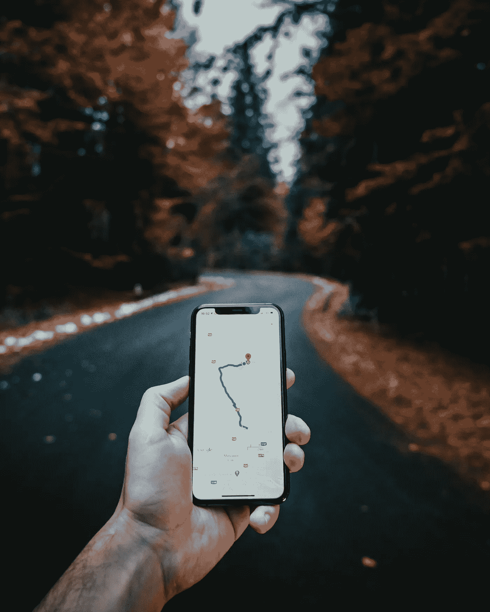
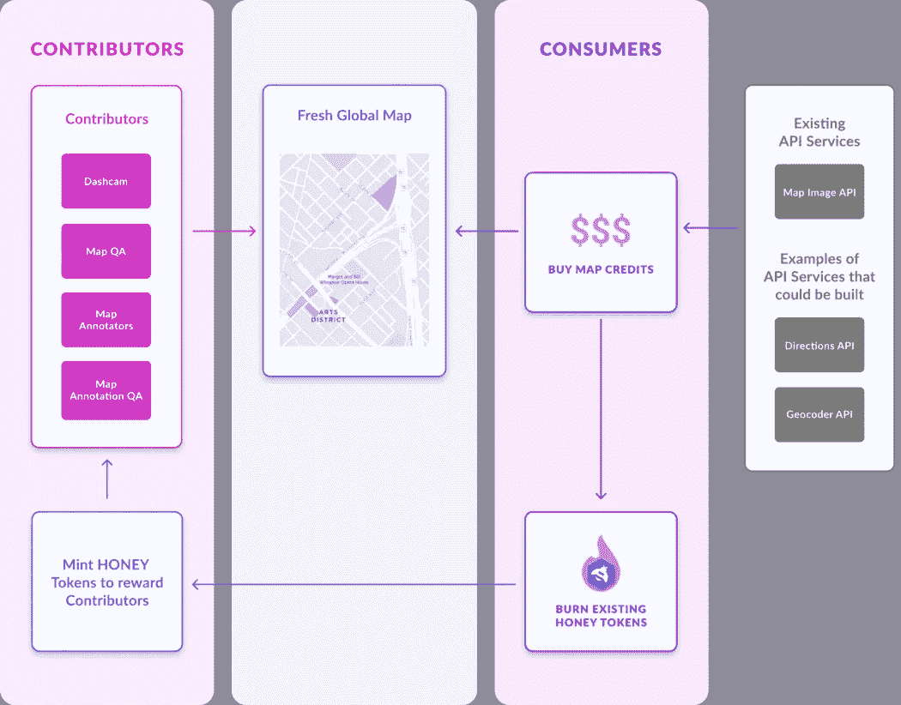
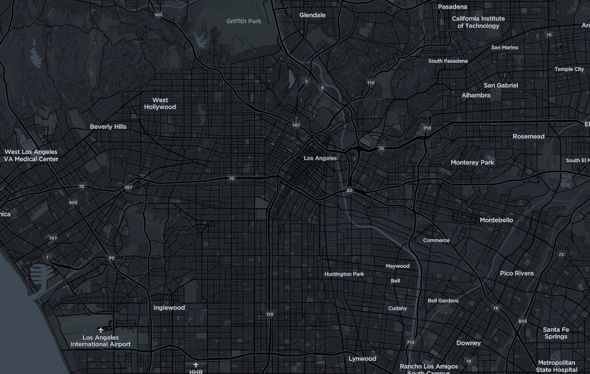

# 见见付钱给你绘制世界地图的公司

> 原文：<https://medium.com/coinmonks/meet-the-company-that-will-pay-you-to-map-the-world-5bca7c5cd680?source=collection_archive---------19----------------------->

Photo by [Tamas Tuzes-Katai](https://unsplash.com/@tamas_tuzeskatai?utm_source=unsplash&utm_medium=referral&utm_content=creditCopyText) on [Unsplash](https://unsplash.com/s/photos/maps?utm_source=unsplash&utm_medium=referral&utm_content=creditCopyText)

几千年来，地图为人类提供了如何到达特定目的地的知识。当我们迷路时，它们帮助我们，告诉我们在哪里，它们指示我们周围有什么，是陆地还是水，它们甚至帮助预测天气。

早期，地图是画在洞壁上的，然后探险家把它们画在纸上，现在我们有了包含 GIS(地理信息系统)技术的数字设备。像谷歌地图这样的应用程序是一个地理信息系统，它帮助我们在日常生活中到达我们想去的地方。见鬼，它甚至告诉我们到达那里需要多长时间。

毫无疑问，地图彻底改变了我们的旅行方式，但这是怎么做到的呢？现在，绘制地图是一个非常复杂和昂贵的过程，而且非常耗时。如今，大多数科技公司都拥有能够轻松完成数字地图绘制的必要资源。然而，大多数来自世界不同地区的图像并没有像需要的那样经常更新。

在 2022 年，当他们可以简单地打开他们的谷歌地图应用程序时，没有人会想到去当地商店购买地图。默认情况下，应用程序通常安装在设备上，因此用户可以直接访问它。它已经变得如此普遍，以至于我们甚至不再意识到它的价值。

但问题是…

# **谷歌地图是垄断**

谷歌地图实际上是在线地图行业的垄断者，他们将谷歌地图与其他谷歌软件“捆绑”在一起的事实敲响了警钟。

根据最近[路透社的报道](https://www.reuters.com/article/tech-antitrust-google-maps-idCNL2N2VQ2OT)，美国司法部最近对最初于 2020 年对 Alphabet Inc .进行的调查进行了新的调查。该调查试图确定这些捆绑服务是否非法抑制竞争。

> 一部分侧重于应用程序，包括导航应用程序，这些应用程序通过车辆中的信息娱乐屏幕提供。在其面向汽车制造商的谷歌汽车服务包中，这家搜索公司将地图、Google Play 应用商店、谷歌助手和其他服务捆绑在一起。一位消息人士称，汽车公司被禁止将谷歌地图与规模较小的竞争对手开发的语音助手混合使用。— [路透社](https://www.reuters.com/article/tech-antitrust-google-maps-idCNL2N2VQ2OT)

还有一点:

> 另一个部分侧重于应用程序和网站开发者。具体来说，该部门正在研究谷歌的要求，即如果一个网站或应用程序使用谷歌的一种技术，比如谷歌的位置搜索，该网站或应用程序开发商不能使用谷歌竞争对手开发的地图或其他技术，两位消息人士说。— [路透社](https://www.reuters.com/article/tech-antitrust-google-maps-idCNL2N2VQ2OT)

谷歌本质上是告诉开发者，如果他们不使用他们所有的地图服务，他们就不能使用任何服务。问题在于它变得有多贵，以及谷歌是如何提高其地图费用的。在这一点上，开发人员基本上被逼到了墙角。

# **解决方案**

介绍 [**Hivemapper**](https://hivemapper.com/) ，世界上第一个基于加密的地图网络。我在 Twitter 上偶然发现了这个项目，非常喜欢这个想法和这家公司的使命。他们准备通过创建一个分散的地图网络，并允许每个人帮助共同创建它，来彻底改变地图经济。

> 利用区块链技术，有可能在对基于加密的网络做出贡献的每个人之间分配价值和所有权。Hivemapper 网络永远不会成为一个垄断者，它的根本目的是制作和更新社区拥有的地图。它是地图贡献者和地图消费者在区块链上错综复杂地连接在一起的网络，参与交换有价值的地图数据。— [Hivemapper](/hivemapper-blog/introducing-the-hivemapper-network-the-worlds-first-blockchain-based-mapping-network-ec67df38cca4)

# **工作原理**

Image by [Hivemapper](https://hivemapper.com/mapping-network#introduction): **Tokenomics & Governance**

得益于区块链技术，Hivemapper 的目标是用蜂蜜(他们的本地令牌)补偿地图贡献者，以换取高质量的 4K 街道级图像。地图编辑也是如此，他们的主要职责是处理数据、质量保证和注释贡献者影像。除了接收网络本地令牌之外，它们还被提供集体所有权以对网络做出贡献。

除了像你我这样的特定个人之外，地图消费者还包括保险公司、房地产提供商、送货应用程序等等。Hivemappers API 易于实现，更重要的是；价格实惠。

基本上，一旦网络确定了一个需要地图的特定区域，他们将在该区域设立奖金，允许贡献者认领。想象一下，在你每天上下班的路上这样做，或者如果你周末要去公路旅行，你因为在路上为网络做贡献而得到补偿。

> Hivemapper 比现有的地图绘制公司具有结构性成本优势，因为它不必购买或维护昂贵的地图绘制车辆——每辆车的成本可能超过 100 万美元——也不必付钱让人驾驶这些车辆。— Tushar Jain，Multicoin Capital 管理合伙人。

# 加密仪表板摄像头

Los Angeles metro area — Hivemapper

他们创造了世界上第一个与 Hivemapper 网络集成的加密挖掘器 dashcam，安装在您的汽车上几乎不费吹灰之力。由于他们的移动应用程序，你所要做的就是在你的车上安装 dashcam，然后开车！制图和上传影像是自动完成的，因此您可以专注于道路并享受赚钱的乐趣。

## 迄今已绘制了 167 万多公里的道路！

Hivemapper 网络仅在 10 个月的时间内就绘制了超过 160 万公里的地图，而这仅仅是在 9 个市场。他们计划在 2022 年末扩展到 30 多个市场，并将在 2023 年走向全球。你可以想象还有多少映射工作要做！

# 分散映射

Hivemapper 认为，拥有一个分散的地图比拥有一个垄断的地图要好得多。他们的论点是，一个贡献者受到激励的网络将允许不断更新和最先进的地图。

> 参与 Hivemapper 网络的每个人不仅可以分享网络产生的价值，还可以在地图上显示哪些地理区域方面拥有发言权。— Hivemapper

他们最近在首轮融资中筹集了 1800 万美元，其中很多资金来自 Multicoin Capital、Craft Ventures、Solana Capital、Shine Capital 以及斯潘塞·拉斯科夫的 75 和 Sunny Ventures 等大型公司。

# 结论

2022 年夏天对 Hivemapper 来说将是一个大日子，我个人将密切关注这个项目的进展。

我恳请您访问 [Hivemapper 网站](https://hivemapper.com/mapping-network#introduction)，在那里他们会深入解释他们的网络是如何工作的。它们涵盖了从扩展网络所需的里程碑到 HONEY 如何激励贡献者的方方面面。

让我知道你对这个项目的想法，以及你认为这个项目会走多远？你会尝试他们的制图技术吗？大家在评论里说说吧！

*免责声明:我不是财务顾问，这个故事中的所有信息都来自我自己的研究和个人观点。你对上述信息所做的任何事情都完全是你的责任。这不是理财建议！*

> *加入 Coinmonks* [*电报频道*](https://t.me/coincodecap) *和* [*Youtube 频道*](https://www.youtube.com/c/coinmonks/videos) *了解加密交易和投资*

# 另外，阅读

*   [Bookmap 点评](https://coincodecap.com/bookmap-review-2021-best-trading-software) | [美国 5 大最佳加密交易所](https://coincodecap.com/crypto-exchange-usa)
*   最佳加密[硬件钱包](/coinmonks/hardware-wallets-dfa1211730c6) | [Bitbns 评论](/coinmonks/bitbns-review-38256a07e161)
*   [新加坡十大最佳加密交易所](https://coincodecap.com/crypto-exchange-in-singapore) | [购买 AXS](https://coincodecap.com/buy-axs-token)
*   [红狗赌场评论](https://coincodecap.com/red-dog-casino-review) | [Swyftx 评论](https://coincodecap.com/swyftx-review) | [CoinGate 评论](https://coincodecap.com/coingate-review)
*   [投资印度的最佳密码](https://coincodecap.com/best-crypto-to-invest-in-india-in-2021)|[WazirX P2P](https://coincodecap.com/wazirx-p2p)|[Hi Dollar Review](https://coincodecap.com/hi-dollar-review)