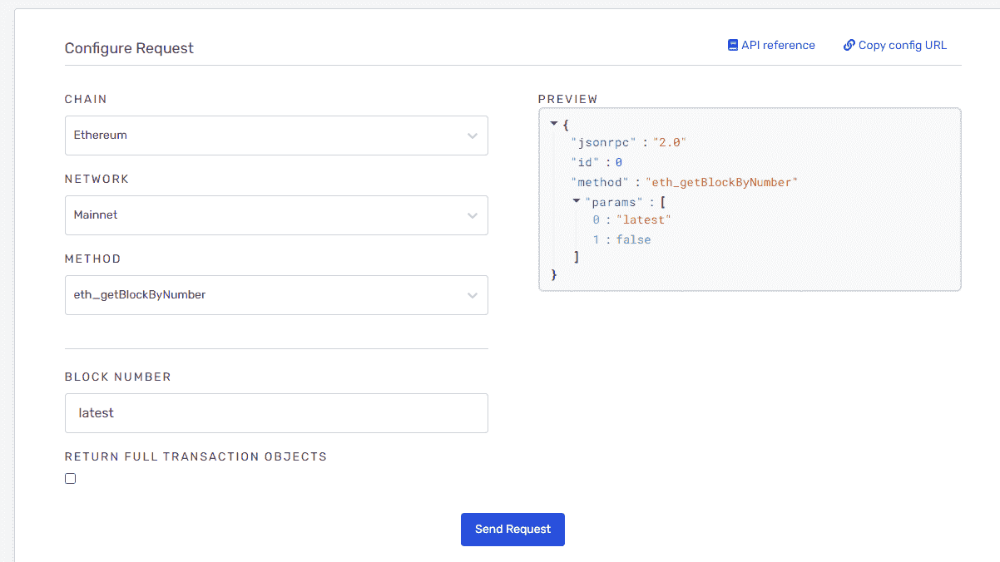

# 了解为世界上最大的区块链项目提供基础设施的公司

> 原文：<https://medium.com/coinmonks/meet-the-firm-providing-infrastructure-to-the-worlds-biggest-blockchain-projects-63a6f0450f1f?source=collection_archive---------85----------------------->

炼金术会成为 Web3 的 AWS 吗？

2022 年 2 月

世界上估值最高的区块链公司之一既不是 L1 连锁店，也不是 NFT 工作室。相反，它是一个区块链开发者平台，提供从节点到原型到营销的一系列服务，努力成为 Web3 世界的 AWS。

即使你没有听说过它，你肯定知道项目炼金术的力量。

# 什么是炼金术

2017 年，Nikil Viswanatha 和 Joe Lau 共同创立了 Alchemy，它很快获得了包括 Lightspeed、Silver Lake 和 a16z 在内的风投资金。

[据官方网站](https://www.alchemy.com/)报道，Alchemy 目前为全球领先的区块链公司 99%的产品提供动力。支持将创建的应用程序直接部署到 6 个链，包括以太坊、Flow、Arbitrum、Crypto.org、乐观和多边形。AAVE、OpenSea 和 Dapper 只是炼金术支持的几个项目。

# 炼金术是如何工作的

Alchemy 为区块链开发者提供各种服务。以下是最值得注意的。

## 炼金术超级节点

在区块链的上下文中，超节点是为用户事务提供记账服务的挖掘器。例如，当在以太坊上进行交易时，交易的细节由矿工记录在节点上。当然，你需要付给矿工汽油费。

在像 Alchemy 这样的服务出现之前，区块链的开发者为了他们的协议的安全，与协议扩展斗争。

然而，Alchemy 的超级节点允许协议保持缩放。这解决了协议拥塞的问题。

负载平衡器是 Web2 基础设施的重要组成部分，它不加选择地在许多服务器和应用程序之间分配流量。但是与 Web2 应用程序不同，区块链应用程序不能不加区别地对待节点。否则会导致数据错位。

Alchemy Supernode 允许节点加载大量信息，这很重要，因为区块链协议存储了大量数据。因此，分布式系统允许区块链项目扩展。

Alchemy Supernode 的专有协调服务器确保协议的准确、实时数据。

[*Alchemy Supernode Infrastructure Diagram*](https://www.alchemy.com/supernode)

## 炼金术建筑

Alchemy Build 是一套开发工具，通过为开发人员提供 Web3 基础框架，他们可以在多个项目中重用该框架，从而让开发人员快速启动应用程序。

由于应用程序需要不断的调整和迭代，Alchemy Build 的 Explorer 和 Mempool 特性可以帮助开发人员找到错误和需要调整的地方。

Dapper Labs ，CryptoKitties，以及像 [0x](https://www.alchemy.com/case-studies/zeroex) 这样的顶级应用都使用炼金术构建。

*Alchemy Build Composer- Configuration Request Board*

## 炼金术监视器

Alchemy Monitor 允许用户报告 bug 反馈，允许开发人员及时发现错误并做出调整。

为了释放开发资源，Alchemy Monitor 提供了对应用程序性能、使用和用户行为的监控和分析。

## 炼金术通知

Alchemy Notify 是一个提醒系统，它在开发者和用户之间架起了一座桥梁。

它允许开发人员向用户推送关键信息，如挖掘的交易、钱包地址的变化和汽油费的变化。

它类似于一个股票应用程序，将股票价格相关信息实时推送给用户。

除了这四个强大的特性之外，还有许多其他特性可以帮助构建 Web3 项目。

*   炼金术放大，应用营销。
*   增强的 Web3 APIs 建立在 Alchemy Supernode API 的基础上，以更少的请求获得更多的数据，进一步增强了 API。
*   NFT API 使开发人员能够快速构建自己的 NFT 应用程序。

# Alchemy 的估值在 4 个月内翻了三倍

根据 Footprint Analytics 收集的融资数据，Alchemy 已经关闭了 6 轮融资。

*   【2018 年 1 月:完成了 Velocity Canada 投资的种子轮融资。
*   【2019 年 4 月:完成 1890 万美元股权融资。
*   【2019 年 12 月:完成了 1500 万美元的 A 轮融资，潘迪拉资本和三星风险投资均参与其中。
*   **2021 年 4 月**:完成 8000 万美元 B 轮融资。
*   **2021 年 10 月**:完成 2.5 亿美元 C 轮融资，估值 35 亿美元，由 a16z 领投。
*   **2022 年 2 月**:完成 2 亿美元 C-1 轮融资，估值 102 亿美元，由光速和银湖领投。

# 摘要

在 Web1 中，微软的 Windows 为互联网提供了动力，而在 Web2 中，则是 iOS、Android 和谷歌。

Web3 是一个建立在链条上的世界，具有非常不同的基础设施需求。启动的应用程序不仅要好，还要快。

目前，Alchemy 可以满足 Web3 快速可靠地启动应用程序的基本要求。

***此片由*** [***足迹分析***](https://www.footprint.network) ***社区供稿。***

> 加入 Coinmonks [电报频道](https://t.me/coincodecap)和 [Youtube 频道](https://www.youtube.com/c/coinmonks/videos)了解加密交易和投资

# 另外，阅读

*   [印度加密交易所](/coinmonks/bitcoin-exchange-in-india-7f1fe79715c9) | [比特币储蓄账户](/coinmonks/bitcoin-savings-account-e65b13f92451)
*   [OKEx vs KuCoin](https://coincodecap.com/okex-kucoin) | [摄氏替代品](https://coincodecap.com/celsius-alternatives) | [如何购买 VeChain](https://coincodecap.com/buy-vechain)
*   [币安期货交易](https://coincodecap.com/binance-futures-trading)|[3 comas vs Mudrex vs eToro](https://coincodecap.com/mudrex-3commas-etoro)
*   [如何购买 Monero](https://coincodecap.com/buy-monero) | [IDEX 评论](https://coincodecap.com/idex-review) | [BitKan 交易机器人](https://coincodecap.com/bitkan-trading-bot)
*   [CoinDCX 评论](/coinmonks/coindcx-review-8444db3621a2) | [加密保证金交易交易所](https://coincodecap.com/crypto-margin-trading-exchanges)
*   [红狗赌场评论](https://coincodecap.com/red-dog-casino-review) | [Swyftx 评论](https://coincodecap.com/swyftx-review) | [CoinGate 评论](https://coincodecap.com/coingate-review)
*   [Bookmap 评论](https://coincodecap.com/bookmap-review-2021-best-trading-software) | [美国 5 大最佳加密交易所](https://coincodecap.com/crypto-exchange-usa)
*   [如何在 FTX 交易所交易期货](https://coincodecap.com/ftx-futures-trading) | [OKEx vs 币安](https://coincodecap.com/okex-vs-binance)
*   [CoinLoan 评论](https://coincodecap.com/coinloan-review) | [YouHodler 评论](/coinmonks/youhodler-4-easy-ways-to-make-money-98969b9689f2) | [BlockFi 评论](https://coincodecap.com/blockfi-review)