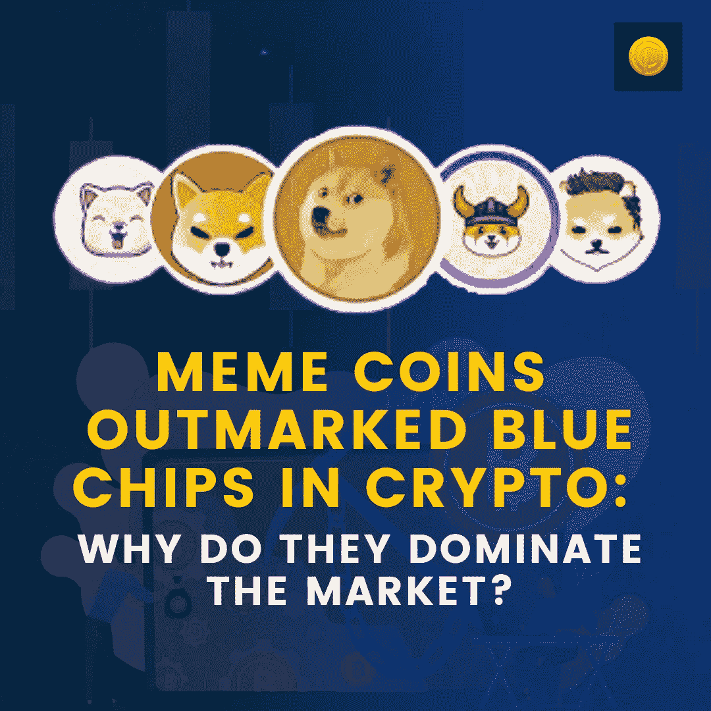

# 迷因币在加密领域胜过蓝筹股:为什么它们主宰了市场？

> 原文：<https://medium.com/coinmonks/meme-coins-outsmarted-blue-chips-in-crypto-why-they-dominated-the-market-68f8c67314b9?source=collection_archive---------31----------------------->

新 ATH、一夜暴富的百万富翁和随处可见的绿色蜡烛——当你谈论蓝筹股投资加密时，所有这些情景都是完全可能的。然而，当没有用例，只是由喜欢娱乐的社区支持的令牌爆炸时，你就会拼命按下求知欲的按钮。在这篇博客中，我们将看到为什么像[柴犬](https://www.coindhan.com/trading/shibinr)这样的 memecoins 会如此疯狂，以至于它们被列入市值最高的 10 种加密货币之列。

# 迷因币:背景

这些硬币完全是为了娱乐目的而创造的，它们没有基于用途的用例。然而，其中一些硬币的回报率高达 14000%。有人投资了 4000 美元，并在几个月内赚了 2000 万到 3000 万美元的消息吸引了眼球。因此，错过机会、目前正在 FOMO 的投资者想知道是什么让这些代币爆炸到无穷大！

# Meme 爆红背后的秘密是什么？

**趋势波**

潮流是把迷因放到月球上的主要原因之一。这些主要是由有影响力的人推动的。例如，Doge 从一文不名的加密投资公司一飞冲天，成为数百万的 bagger 投资组合。在疫情期间，这枚硬币上涨了 14000%，达到 0.74 美元。它主要是由像马克·库班和埃隆·马斯克这样的技术影响者推动的。与他们一起，Doge 甚至见证了娱乐行业前所未有的支持，像史努比·道格，里尔·游艇，凯文·乔纳斯和吉恩·西蒙斯支持令牌。

**社会交往**

2022 年还见证了支持社交交易的加密货币交易所的另一个趋势。在社交交易中，他们允许投资密码，但要通过社区讨论。根据这一倡议，对密码知之甚少或一无所知的新用户可以通过其同伴的帮助很容易地进入该领域。这样，分享教育工具和经验变得非常容易。因此，允许更好的参与。迷因加密的成长大部分归功于 FOMO。例如，在 SNL 或周六夜现场之前，Elon Musk 作为嘉宾谈到了加密货币、它们迫在眉睫的未来以及他对 Doge 的迷恋。大量的交易量主要是由于预期埃隆会说“Doge to Moon”或“特斯拉接受 Doge”之类的话，从价格角度将令牌推向无穷大。

**结论**

2021 年，FOMO 处于巅峰，大多数投资者都在寻找进入加密市场的方法。他们中的大多数人是第一次，他们希望代币的入门成本非常低，并有前途的投资回报率。对于这样的要求，迷因币非常有意义，迫使他们投资于它。因此，迷因确实是 2021-2022 年的一个[秘密](https://blog.coindhan.com/2022/06/25/how-to-identify-scammy-crypto-projects/)泡沫是有道理的。

> 加入 Coinmonks [电报频道](https://t.me/coincodecap)和 [Youtube 频道](https://www.youtube.com/c/coinmonks/videos)了解加密交易和投资

# 另外，阅读

*   [加密交易的最佳 VPNs】](https://coincodecap.com/best-vpns-for-crypto-trading)
*   [印度最佳 P2P 加密交易所](https://coincodecap.com/p2p-crypto-exchanges-in-india) | [柴犬钱包](https://coincodecap.com/baby-shiba-inu-wallets)
*   [八大加密附属计划](https://coincodecap.com/crypto-affiliate-programs) | [eToro vs 比特币基地](https://coincodecap.com/etoro-vs-coinbase)
*   [最佳以太坊钱包](https://coincodecap.com/best-ethereum-wallets) | [电报上的加密货币机器人](https://coincodecap.com/telegram-crypto-bots)
*   交易杠杆代币的最佳交易所 | [购买弗洛基](https://coincodecap.com/buy-floki-inu-token)
*   [3Commas 对 Pionex 对 Cryptohopper](https://coincodecap.com/3commas-vs-pionex-vs-cryptohopper) | [Bingbon 评论](https://coincodecap.com/bingbon-review)