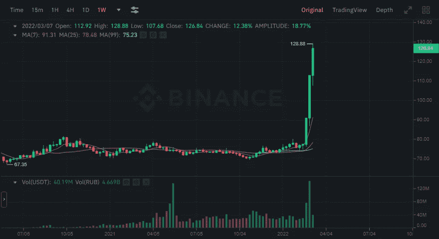

# 备忘录:如果对俄罗斯的制裁继续，比特币可能会飙升

> 原文：<https://medium.com/coinmonks/memo-if-the-sanctions-on-russia-continue-bitcoin-could-jump-3af45cc6823e?source=collection_archive---------92----------------------->

USDT/RUB Trade as of 08:25 AM, 08/03/2022

*这是一个观察结果，而不是一个预测，我之前就已经错了*

这似乎是由于对俄罗斯的持续制裁，由于乌克兰正在进行的战争。许多俄罗斯人正在将他们的卢布转换成加密货币，USDT 似乎是目前的主要货币，但如果比特币大幅上涨，我不会感到惊讶。尤其是如果欧洲、英国甚至美国禁止进口俄罗斯石油的话。

替代可能性尽管不太可能，但如果币安试图取消俄罗斯银行的任何支付，这种飙升可能是暂时的。不太可能，但也不是不可能。但这只是一个观察。

我会留意的，我建议你这么做。即使不是出于投资的原因，而只是为了适度的娱乐。