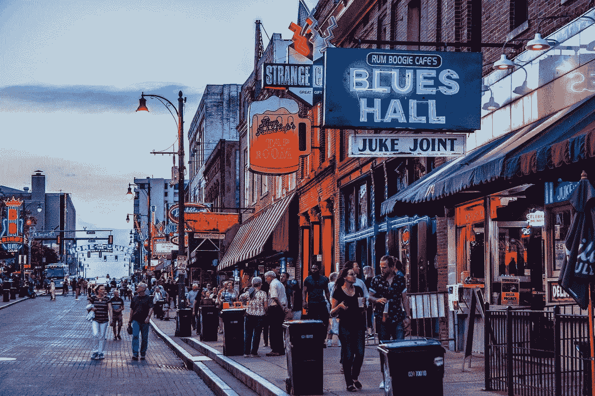

# 田纳西州孟菲斯

> 原文：<https://medium.com/coinmonks/memphis-tn-31cf2964c7ae?source=collection_archive---------55----------------------->

# 关于田纳西州孟菲斯

孟菲斯这个词意味着成熟和美丽，可能没有比它更好的名字了。强大的密西西比河流经这个充满活力的大都市，这里不缺乏音乐、美味的食物(带上有弹性的衣服:这里的食物分量有“哇”和“哦，我的天哪，好吧”)以及大量的历史——其中一些令人心碎，因为只有人类历史的下腹部才会如此。

约翰·奥弗顿、安德鲁·杰克逊和詹姆斯·温彻斯特于 1818 年创建了孟菲斯(大概是这样)，他们并不知道他们正在建立的这个城镇会比世界上任何其他城市被更多的歌曲提及。接招吧，巴黎！抱歉，纽约！游客和居民也不会对此感到惊讶；空气中有种特殊的东西很难表达出来。也许这是一种坚韧不拔的精神，一种创造美丽、音乐和食物的意愿，一种即使在你的城市范围内发生了影响整个世界的难以想象的心碎事件时也继续庆祝的意愿。

1968 年 4 月 4 日，小马丁·路德·金牧师在孟菲斯遇刺，就在他发表“我曾登上山顶”演讲的第二天。孟菲斯为那些希望更多了解民权运动的人提供了一个探索的纽带。

但是，正如已经提到的，它是一个激发灵感、联系、吃饭的场所，对一些人来说，是生活和/或投资的场所。南方气候温和，一年平均有 238 个晴天，几乎总是寻找音乐或冒险的好日子。

# 关于田纳西州孟菲斯的有趣事实

*   毫无疑问，作为“布鲁斯之父”，W.C. Handy 把孟菲斯当成了自己的家。乔治·格什温曾经告诉 W.C. Handy“你的作品是我的祖父”不算太寒酸！
*   第一个来自南方的黑人百万富翁罗伯特·丘奇来自孟菲斯。
*   孟菲斯被称为“好莱坞南部”许多电影都在这里拍摄，其中一些亮点包括《坚定》、《21 克》、《一往无前》和《人民与拉里·弗林特》
*   自二战结束以来，工业发展一直是孟菲斯经济的重要组成部分。

# 关于孟菲斯的事实和数据

根据美国人口普查局的数据，孟菲斯人口从 2010 年的 646，889 人略微下降到 633，104 人。值得推测的是，随着纳什维尔继续其房地产繁荣，最终人们开始寻找附近具有相同良好气候和音乐驱动的生活方式的城市，这种趋势可能会逆转。只有未来孟菲斯房地产市场的趋势和时间会告诉肯定。

住房仍然非常便宜，这对于那些想要投资我们认为被低估的宝石的投资者，以及那些想要成为拥有大量增长空间的城市的一部分的租房者来说，都是一个优势。我们特别兴奋地看到孟菲斯房地产市场如何继续发展。

# 生活费用

*   定价中值:10.59 万美元
*   家庭收入中位数:41228 美元
*   人均收入:25605 美元
*   每月业主成本中位数(包括抵押贷款):1，191 美元
*   每月业主成本中位数(无抵押贷款):450 美元
*   一套三居室的平均租金:1500 美元

# 雇用

孟菲斯已经实施了重大举措来支持当地和新来的企业家，以帮助他们发展当地的就业经济。这导致了本土的填充项目，在城市的邻近地区创造有吸引力的当地目的地。此外，任何迁移到孟菲斯的公司都会在许可证、法规、税收和其他方面得到优惠。更重要的是，福特汽车公司一直在推动建立一个电动汽车工厂，距离孟菲斯不到一个小时的路程，预计将以非常积极的方式影响更大的地区。再加上位于孟菲斯的联邦快递总部，失业率从 2020 年 12 月的 6.9%下降到 2021 年 12 月的 4.1%，这一趋势并不令人惊讶。

主要行业包括:

*   先进制造业。
*   农业综合企业和农业技术。
*   供应链和物流。
*   医疗保健和医疗创新。
*   公司总部和技术部。
*   食品和饮料。

# 田纳西州孟菲斯市住房市场趋势

孟菲斯仍然是一个负担得起的，但不断增长的城市，并被认为是一个卖方市场。

*   定价中值:10.59 万美元
*   每平方英尺价格:80 美元
*   平均上市天数:66 天
*   一套三居室的平均租金:1500 美元

# 孟菲斯的顶级景点和活动

从轻松的酒吧爬行到发人深省的纪念馆和历史遗址，孟菲斯是一个多层次的城市，游客和居民都有丰富的体验。

# Tour Sun 工作室

这个工作室被认为是摇滚乐的发源地。报名参加有导游的旅程，了解蓝调的历史，发现猫王和其他蓝调英雄。旅行在传奇录音室结束，音乐爱好者一定会喜欢站在传奇录制一些最著名的音乐时站在相同的破旧地板上。

# 参观格雷斯兰

格雷斯兰是著名的猫王的家。如果你能在休赛期的一周内赶到那里，那是最理想的，因为它是美国访问量最大的私人住宅之一，仅次于白宫。

# 我是一个男人广场

孟菲斯体验不可或缺的一部分是探索民权历史。很多事情都发生在这里。你可以参观民权步道上的各个站点，其中一个不容错过的是“我是男人广场”。它坐落在克莱本寺周围，该寺是环卫工人罢工的总部，罢工是在两名非裔美国环卫工人在一次城市卡车事故中丧生后开始的。

# 参观洛林汽车旅馆，马丁·路德·金博士遇刺的地方

这是民权之路的又一站。这是马丁·路德·金牧师被枪杀的地方，汽车旅馆现在作为民权博物馆。

# 见证皮博迪鸭子的行进

拿一杯鸡尾酒，在皮博迪酒店观看皮博迪鸭子的行进，提醒你世界上所有美好的事物。每天，住在皮博迪顶层公寓的鸭子都由他们自己的鸭子主人护送，通过红地毯到达大厅喷泉。当他们溅起水花，玩耍，嬉戏，回到他们顶楼的红地毯上。这真是一种愚蠢的快乐。

# 比尔街上的派对

你不会有困难找到信息，在哪里可以找到这个著名的蓝调酒吧，你可以走进任何一家酒吧，见证你一生中见过的最好的吉他手一次又一次。

> 加入 Coinmonks [电报频道](https://t.me/coincodecap)和 [Youtube 频道](https://www.youtube.com/c/coinmonks/videos)了解加密交易和投资

# 另外，阅读

*   [如何开始用加密贷款赚取被动收入](https://coincodecap.com/passive-income-crypto-lending)
*   [加密货币储蓄账户](/coinmonks/cryptocurrency-savings-accounts-be3bc0feffbf) | [加密交易机器人](https://coincodecap.com/best-crypto-trading-bots)
*   [BigONE 交易所评论](/coinmonks/bigone-exchange-review-64705d85a1d4) | [CEX。IO 审查](https://coincodecap.com/cex-io-review) | [交换区审查](/coinmonks/swapzone-review-crypto-exchange-data-aggregator-e0ad78e55ed7)
*   [最佳比特币保证金交易](/coinmonks/bitcoin-margin-trading-exchange-bcbfcbf7b8e3) | [比特币保证金交易](https://coincodecap.com/bityard-margin-trading)
*   [加密保证金交易交易所](/coinmonks/crypto-margin-trading-exchanges-428b1f7ad108) | [赚取比特币](/coinmonks/earn-bitcoin-6e8bd3c592d9)