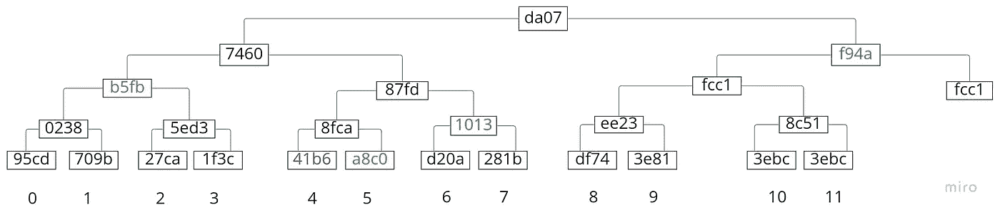

# Merkle 树，简单的解释和实现

> 原文：<https://medium.com/coinmonks/merkle-tree-a-simple-explanation-and-implementation-48903442bc08?source=collection_archive---------2----------------------->

# Merkle 树，简单的解释和实现

本文的目的是对 Merkle 树及其实现有一个基本但完整的理解。
由于我找不到一篇以简单的方式介绍 Merkle 树创建、Merkle 根、Merkle 证明和验证实现的文章，我决定实现一个基本的解决方案，并用我的发现创建这篇文章，与社区分享。

# Merkle 树

Merkle 树是散列的树数据结构(通常是二叉树),其中每个叶节点包含数据块的散列(例如:区块链中的事务散列),每个父节点包含由其子节点的散列的串联和散列产生的散列。

该树用于以有效的方式验证和展示叶节点的散列是根节点的散列的一部分，因为我们只需要该树的一小组散列来执行该验证。

这种数据结构通常用于分布式系统，如比特币和其他区块链，以一种轻量级、高效和快速的方式验证交易哈希是否属于块头的 Merkle 根。

在比特币中使用 Merkle Tree/Root/Proof 允许实现简单支付验证(SPV)，这是轻量级客户端检查交易是否实际上是块的一部分的一种方式，而无需客户端下载整个块或整个区块链。
通过仅拥有带有 Merkle root 的块头、它想要验证的交易以及从可信比特币节点获得的 Merkle 证明结构，它可以尝试重建 Merkle root 哈希并验证交易。

Ralph Merkle 在 1979 年申请了哈希树的专利，后来以他的名字命名。

> 交易新手？尝试[加密交易机器人](/coinmonks/crypto-trading-bot-c2ffce8acb2a)或[复制交易](/coinmonks/top-10-crypto-copy-trading-platforms-for-beginners-d0c37c7d698c)

**Merkle 树的例子**

从哈希列表中:

```
[95cd, 709b, 27ca, 1f3c, 41b6, a8c0, d20a, 281b, df74, 3e81, 3ebc]
```

它的 Merkle 树应该是这样的:


(这 4 个字符的散列简称为长散列，即 64 个字符的散列，将在本文后面显示)

注意最后一个散列`3ebc`是如何被复制并添加到列表末尾的。这是需要的，以便能够将其与自身连接并散列它，因为我们成对散列，如果散列列表长度是奇数，那么我们复制它并将其添加到列表的末尾，以使散列列表是偶数。同样的情况也发生在`fcc1`身上。
树的每一层被称为一个散列表。

**墨角根**

Merkle 根是树的根节点。在上面的例子中，它是带有`**da07**`散列的节点。

**Merkle 校样**

Merkle 证明(也称为 Merkle 路径)是这样一种结构，其保存了能够通过仅用该信息重新创建 Merkle 根来证明散列属于 Merkle 根所需的最少散列/树分支节点。

例如:


如果我们有兴趣验证散列`*41b6*`是否真的包含在 Merkle 根(`**da07**`)中，那么我们只需要散列的颜色:

```
[41b6, a8c0, 1013, b5fb, f94a]
```

有了`41b6`，我们需要`a8c0`来重建`8fca`。
有了`8fca`，我们需要`1013`来重构`87fd`。
有了`87fd`，我们需要`b5fb`来重构`7460`。
使用`7460`我们需要`f94a`来重建`**da07**`，即 Merkle 根。

如果在将我们的散列(`*41b6*`)应用于 Merkle 证明之后，我们得到了预期的`**da07**` Merkle 根，那么我们知道我们的散列是 Merkle 根的一部分。

在这种情况下，对于 11 个散列，我们只需要 4 个散列，以及我们的散列`*41b6*`就能够重建 Merkle 根`**da07**`。

有了这些信息，我们注意到一个模式，我们可以确定我们只需要大约 log(n)个散列就能够检查一个散列是否属于某个 Merkle 根，这是非常有效的，而不是必须对它们全部进行散列或者让所有的散列来验证这一点。

例如，如果比特币中的一个块有大约 1000 次交易，我们只需要从一个可信的比特币节点检索大约 10 次交易散列的 Merkle 证明，而不是具有 1000 次交易的整个块。

当我们在散列之前创建和使用 Merkle 证明时，我们需要记住散列的连接顺序:


`*41b6*`需要与`a8c0`串接，`41b6`在左侧，`a8c0`在右侧:

因为`41b6`是左孩子，`a8c0`是右孩子。

从先前的连接和散列得到的散列`8fca`需要与`1013`、`8fca`连接，在左侧，`1013`在右侧，因为`8fca`是左孩子，`1013`是右孩子。

由于`87fd`是一个右孩子而`b5fb`是一个左孩子，所以从先前的连接和散列得到的散列`87fd`需要与`b5fb`连接，其中`87fd`在右侧而`b5fb`在左侧。

由于`7460`是一个左孩子而`f94a`是一个右孩子，所以从之前的连接和散列得到的散列`7460`需要与`f94a`连接，`7460`在左侧，`f94a`在右侧。

我们需要在 Merkle 证明结构中指定每个节点散列应该连接的方向:

连接顺序如下:

```
41b6 + a8c0 => 8fca
8fca + 1013 => 87fd
b5fb + 87fd => 7460
7460 + f94a => **da07**
```

有了这个，我们的 Merkle 证明是完整的，并准备转移和使用。

# 基本实现

像比特币一样的区块链使用 Merkle 树来检查交易是否属于块头中的 Merkle 根。每个使用 Merkle 树结构的软件都可以自由地使用他们认为合适的任何实现。

例如，比特币在散列之前，首先将串联散列转换为二进制。
比特币也使用双 sha256 哈希，类似于:

我们将使我们的实现尽可能简单，只是试图容易地看到和理解这个概念，只是最低限度的。

我们的实现将在 nodejs 中。

我们将使用`sha256`来散列我们的散列的连接。因此，我们将有 64 个字符哈希。

每个函数都有一些文档来帮助阐明它做什么。

你可以在这里找到完整的代码。

首先，我们导入`crypto`模块:

定义几个方向常数:

定义要使用的随机 sha256 哈希列表:

定义一个实用函数来帮助我们用加密模块抽象 sha256 哈希:

定义一个效用函数来计算叶节点是左子节点还是右子节点:

定义一个实用函数来检查哈希列表的长度是否为奇数，如果是，复制最后一个哈希并将其添加到哈希列表的末尾:

定义将接收散列列表并递归计算和返回 Merkle 根的函数:

我们可以通过使用哈希列表调用`generateMerkleRoot`来测试这段代码:

这将打印:

```
merkleRoot: 68e6cdf0cae7fb8eef39cc899c8882e34dd1727a2d08f2303811886949c539e6
```

现在让我们生成 Merkle 树:

我们可以通过使用哈希函数调用这个函数来尝试一下:

这将长类似于:

现在让我们生成 Merkle 证明结构:



例如，如果我们想找到`41b6`的父节点，我们首先需要知道它的索引。我们知道`41b6`的指数是 4，所以如果除以 4 / 2，对结果进行四舍五入，就可以求出它的父代:4 / 2 = > 2。所以，2 在下一级`41b6`的父节点的索引中。

如果我们想找到`a8c0`的父节点，我们做同样的事情。它的索引是 5，所以 5 / 2 = > 2(用 Math.floor 向下舍入)。然后我们看到`41b6`和`a8c0`共享同一个父节点。

这同样适用于查找树中任何节点的所有父节点，但根节点除外，因为它没有父节点。

让我们用一个散列和散列列表来调用函数:

它记录了:

现在，让我们添加一个函数，通过从 Merkle 证明结构重建 Merkle 根来验证散列是否是 Merkle 根的一部分:

让我们调用它，并对照我们期望的 Merkle 根检查它的结果:

这将记录:

```
merkleRootFromMerkleProof:  68e6cdf0cae7fb8eef39cc899c8882e34dd1727a2d08f2303811886949c539e6
merkleRootFromMerkleProof === merkleRoot:  true
```

很好。

点击此处查看完整代码:

[](https://github.com/jeremythen/simple-merkle-tree-implementation/blob/main/index.js) [## main Jeremy then/simple-merkle-tree-implementation/index . js

### 此文件包含双向 Unicode 文本，其解释或编译可能与下面显示的不同…

github.com](https://github.com/jeremythen/simple-merkle-tree-implementation/blob/main/index.js) 

更多区块链相关话题请关注我。

参考资料:

[https://learnmeabitcoin.com/technical/merkle-root](https://learnmeabitcoin.com/technical/merkle-root)T9[https://en.wikipedia.org/wiki/Merkle_tree](https://en.wikipedia.org/wiki/Merkle_tree)