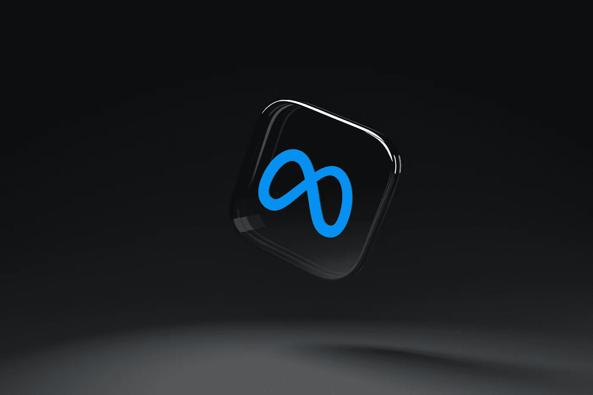

# Meta 给脸书和 Instagram 带来了 3D 广告，看起来像是来自元宇宙

> 原文：<https://medium.com/coinmonks/meta-brings-3d-ads-to-facebook-and-instagram-that-look-like-they-came-from-the-metaverse-c5abd8628414?source=collection_archive---------42----------------------->

Photo by [Dima Solomin](https://unsplash.com/@solomin_d?utm_source=unsplash&utm_medium=referral&utm_content=creditCopyText) on [Unsplash](https://unsplash.com/s/photos/meta?utm_source=unsplash&utm_medium=referral&utm_content=creditCopyText)

Meta 正在脸书和 Instagram 频道进行智能 3D 推广，这是由该组织自更名以来开始执行的元宇宙转向引起的。这是可以想象的，因为 Meta 的 AR(增强现实)分发库中的另一个组合与一个名为 Vntana 的组织的改进相结合。

## Vntana 将 3D 广告集成到 Meta 的应用程序中

分销商现在可以在脸书和 Instagram 等平台上将 3D 模型纳入他们的促销活动，这些平台在 Meta 上也有一席之地。这一进步将允许任何分销商在 feeds 阶段纳入这些元宇宙推动的促销活动，客户可以选择与这些项目合作。这项进步是由一个名为 Vntana 的组织推出的，该组织是一个专业合作组织，因此不同的组织可以记住他们的 3D 资源进行社交。

正如该组织发表的公开声明所指出的，Vntana 允许精英进入 Meta 的 AR API，以协调他们的管理部门，选择实现这一目标。“与常规广告非常相似，3D 促销出现在客户的脸书和 Instagram 频道上，展示直观的 3D 模型，客户可以点击并与之合作——移动项目以查看所有点，”交付的微妙之处。

## 元宇宙货币化

这种进步对于记忆类元宇宙成分的主要适应过程来说可能是必不可少的。对此，Ventana 的主要支持者兼首席执行官 Ashley Crowder 表示:

> 基于互联网的促销中的 3D 和 AR 创新是希望与电脑化购买者联系的品牌的下一个荒野，是进入元宇宙的令人难以置信的第一步。

她进一步表示，这种交付可以在这些阶段将民主化带入推广空间，考虑到目前更多的组织可以将它们的项目带给可能的客户。客户也同样受益，因为他们可以在类似元宇宙的 3D 视图中看到这些项目的更逐点的模型。

Meta 的增强现实业务开发和合作伙伴关系主管克里斯·巴伯(Chris Barbour)宣布:

> 3D 和 AR 为零售和在线商业品牌打开了另一个宣传机会的入口，进一步发展了安全标志的客户体验。

Meta 的领先 AR 应用程序 Horizon Worlds 为客户提供了一系列元宇宙邂逅，但目前没有被该组织采用。这种创新可以在未来被利用，以允许 Meta 为这些空间改编和记忆来自各种品牌的广告。

> 加入 Coinmonks [电报频道](https://t.me/coincodecap)和 [Youtube 频道](https://www.youtube.com/c/coinmonks/videos)了解加密交易和投资

# 另外，阅读

*   [币安交易机器人](/coinmonks/binance-trading-bots-d0d57bb62c4c) | [OKEx 评论](/coinmonks/okex-review-6b369304110f) | [阿塔尼评论](https://coincodecap.com/atani-review)
*   [最佳加密交易信号电报](/coinmonks/best-crypto-signals-telegram-5785cdbc4b2b) | [MoonXBT 评论](/coinmonks/moonxbt-review-6e4ab26d037)
*   [如何在 Bitbns 上购买柴犬(SHIB)币？](https://coincodecap.com/buy-shiba-bitbns) | [购买弗洛基](https://coincodecap.com/buy-floki-inu-token)
*   [CoinFLEX 评论](https://coincodecap.com/coinflex-review) | [AEX 交易所评论](https://coincodecap.com/aex-exchange-review) | [UPbit 评论](https://coincodecap.com/upbit-review)
*   [十大最佳加密货币博客](https://coincodecap.com/best-cryptocurrency-blogs) | [YouHodler 评论](https://coincodecap.com/youhodler-review)
*   [AscendEx 保证金交易](https://coincodecap.com/ascendex-margin-trading) | [Bitfinex 赌注](https://coincodecap.com/bitfinex-staking)