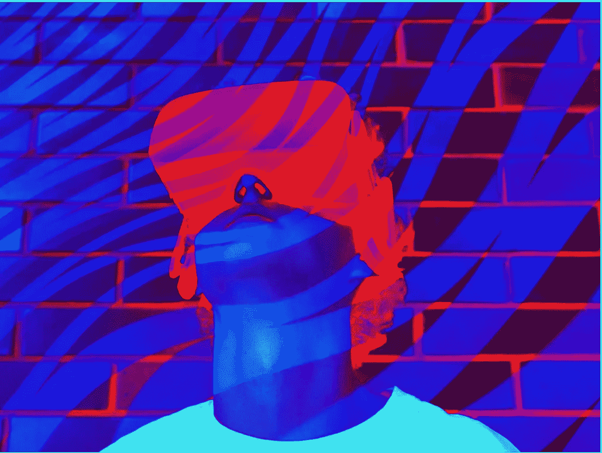

# 元心态

> 原文：<https://medium.com/coinmonks/meta-state-of-mind-cee8af8b119e?source=collection_archive---------25----------------------->

“真正的”人际关系是不可替代的，它们是神奇的，没有什么可以取代它们。互联网、社交媒体、ZOOM 的兴起帮助人们以数字方式保持联系，但没有什么能比得上真实存在的人类带来的快乐。疫情已经证明了这一点，如果你是一个厌世者，那就不适合你。随着数字化的下一步发展，元宇宙问世了。每个人(专业的和个人的)都在谈论的诗句。这种炒作是被创造出来的——但如何创造呢？

Iryna Veklich/Getty Images

对于那些不熟悉这个术语的人来说，元宇宙是一个身临其境的数字环境，虚拟化身代表专注于社交联系的真实人物。还不清楚这是什么意思吗？想想游戏《两周》,这是一款虚拟现实游戏，游戏中的虚拟角色互相战斗，并实时参加在特定的诗句——元宇宙——中举行的活动。每个在现实生活中玩游戏的人都有他们的虚拟角色，一个个性化的数字表现。

**需求元诗句** 面对大量元诗句可供选择，普通人不知该加入哪一首，该留下哪一首。因此，元诗之战开始了。为了保持相关性和吸引更多的成员，metaverses 正在各个行业开展活动。最近一次是时装周。

Jonathan Simkhai’s Show on the metaverse, Second Life

在纽约时装周实物展示的前一天，设计师 Jonathan Simkhai 在元宇宙元宇宙展示了他 2022 春夏系列的 11 个设计。来自时尚、科技和生活方式行业的模特、有影响力的人、名人和记者都是贵宾，他们穿着乔纳森·辛哈伊的个性化头像出现。这引起了轰动，每个像我一样的时尚爱好者都想——***我想去那里***

另一个主要的元宇宙宣布将于 2022 年 3 月下旬举办第一届也是最大的元宇宙时装周[，届时将有时装秀、时尚体验、弹出式商店和后续派对，来自伦敦、巴黎、纽约和米兰的一些全球时尚界最知名的名字将亮相。听到这些我很敬畏，想象着像杜嘉班纳、Elie Saab、法兰克·穆勒这样的品牌出现，我想——***我需要出现在那里***](https://hypebeast.com/2022/2/decentraland-first-metaverse-fashion-week-info?utm_source=affiliates&utm_medium=commissionjunction&utm_campaign=Skimlinks&utm_content=HBX+Homepage+tracking+link&cjevent=2dce6d00968711ec83d83af40a82b832&cjdata=MXxOfDB8WXww)

**市场的元诗句** 这种“想要”和“需要”的变化是通过信息传递产生的，通过创造意识、兴趣、欲望并最终带来希望。行动的希望——加入某个特定的元宇宙。作为一个相当保守的人，我并不热衷于加入元宇宙，但我对某个特定行业的兴趣驱使我走向它。元宇宙目前高度依赖于可从付费媒体、口碑和付费媒体获得的感知价值。

Andrush/Shutterstock.com

**话虽如此** 这个话题引起了我的注意，因为物理事件向数字的转变可能意味着很多变化，尤其是对营销人员而言。战略、受众、渠道和品牌的变化。这也改变了品牌信息的格局，因为我们正在数字化品牌的情感和灵魂。

元宇宙可能会长期存在，也可能只是一种时尚，但我不禁想知道这些技术进步是否离现实越来越远——因为这里更强的“联系”是互联网，而不是人类。

**来源:** [元宇宙时装周](https://hypebeast.com/2022/2/decentraland-first-metaverse-fashion-week-info?utm_source=affiliates&utm_medium=commissionjunction&utm_campaign=Skimlinks&utm_content=HBX+Homepage+tracking+link&cjevent=2dce6d00968711ec83d83af40a82b832&cjdata=MXxOfDB8WXww)
[纽约时装周走上元宇宙](https://www.businessoffashion.com/articles/technology/new-york-fashion-week-took-on-the-metaverse-with-mixed-results/)
[深入元宇宙营销](https://influencermarketinghub.com/metaverse-marketing/#toc-1)