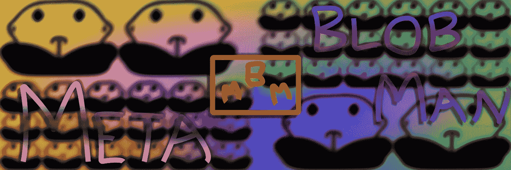

# 最新的被动收入德根发挥

> 原文：<https://medium.com/coinmonks/metablobman-the-newest-passive-income-degen-play-3179fba55bdb?source=collection_archive---------63----------------------->

在这篇文章中，我将告诉你代谢人的要点。

# 年代 **摘要-**

变形人和平地居住在一个叫做 *Innhaus* 的遥远星球上，与世无争。BlobMan 的任务只是收集尽可能多的战利品，同时尽可能少做体力劳动，因为他是一个大家伙，相当懒惰。

将会有 3333 个 MBM 721 代币上传到以太坊(可能是雪崩)网络。你为什么三三三三地问？3 只是我最喜欢的数字，我觉得这个系列对于 333 来说太酷了。该团队将被 doxxed，因为现在只有我是这一切背后的艺术家/创始人/梦想家(我的名字是凯瑞英语二为 doxing folk，图片后，如果你不事先跟踪)。希望积极增加 solidity/web3 开发人员和营销人员/推广人员到团队中，尽管如此，请随意联系。 ***考虑在 Launchpad 上推出该系列只是为了绕过目前的这个*** 。

唯一的短期目标是简单的 MBM，被动收入，有更大的长期目标计划(我有多个收集计划，检查“关于”页面)。目标是日回报率从 0.3%到 2%。

# 简短路线图-

1-铸造你的 NFT (.033 ETH)

2-下注你的 NFT，赚取$MBM(每日国库奖励的 0.3%)

3-通过在 LP 中添加 NFT/$美元(或不同的货币对)进行组合(每天增加 0.7-1.7%)

4-根据您的喜好申领或离开，并让累积为未来的$MBM 使用(merch/NFTs/game/more)

*日后更，享受* …

*   不是承诺，更多的是猜测

> 加入 Coinmonks [电报频道](https://t.me/coincodecap)和 [Youtube 频道](https://www.youtube.com/c/coinmonks/videos)了解加密交易和投资

# 另外，阅读

*   [CoinDCX 评论](/coinmonks/coindcx-review-8444db3621a2) | [加密保证金交易交易所](https://coincodecap.com/crypto-margin-trading-exchanges)
*   [红狗赌场评论](https://coincodecap.com/red-dog-casino-review) | [Swyftx 评论](https://coincodecap.com/swyftx-review) | [CoinGate 评论](https://coincodecap.com/coingate-review)
*   [Bookmap 评论](https://coincodecap.com/bookmap-review-2021-best-trading-software) | [美国 5 大最佳加密交易所](https://coincodecap.com/crypto-exchange-usa)
*   [如何在 FTX 交易所交易期货](https://coincodecap.com/ftx-futures-trading) | [OKEx vs 币安](https://coincodecap.com/okex-vs-binance)
*   [CoinLoan 评论](https://coincodecap.com/coinloan-review) | [YouHodler 评论](/coinmonks/youhodler-4-easy-ways-to-make-money-98969b9689f2) | [BlockFi 评论](https://coincodecap.com/blockfi-review)
*   [XT.COM 评论](https://coincodecap.com/profittradingapp-for-binance)币安评论 |