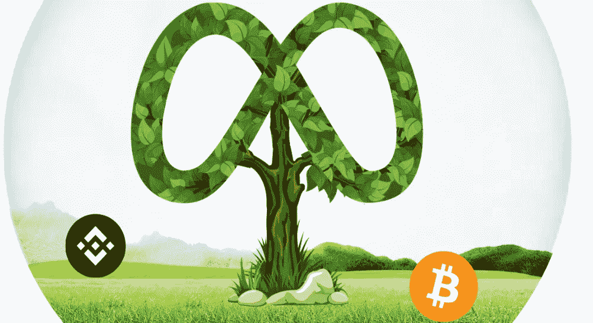
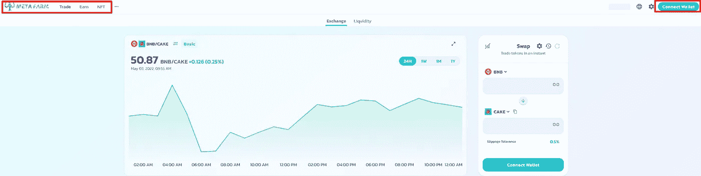

# Metafarmverse 是另一个你需要展示的有趣的农业项目

> 原文：<https://medium.com/coinmonks/metafarmverse-is-another-interesting-farming-venture-you-need-to-unveil-b8d80d667e8b?source=collection_archive---------52----------------------->

猜猜这个成功的项目背后是谁？马丁·史密斯是 [Metafarmverse](https://docs.metafarmverse.finance/) 的首席执行官和创始人。他是一名经验丰富的区块链开发专家，Martin 获得了计算机科学和软件工程硕士证书。他还在 2011 年开始了区块链技术，他努力将农业建设和整合到元宇宙，这可能会被部署到 Metafarmverse 中。有了这样的想法和经验，我坚信 Metafarmverse 将是一个让每个人都钦佩的平台，我希望每个读者都能进入并使他们的发现产生许多预期的结果。

**什么是 Metafarmverse？**
[Metafarmverse](https://docs.metafarmverse.finance/) 是一种设计到元宇宙中的协议，通过通常称为(BSC)的币安智能链(Metafarmverse vision)进行配置和部署，以构建并提供标桩、产量农业、生成和渲染 NFT，其中包括构建一个发射台，该发射台将在即将到来的区块链和 crypto waves 上轻松访问元宇宙。此外，在 Metafarmverse 中，个人可以生成和创建，甚至赚取一些 Metafarmverse 本地货币(MEFV)。大多数项目设计师和艺术家可能会在 MEFV 市场的 Metafarmverse 平台上通过不可替换的令牌(NFT)展示他们的创作者。

**是什么让 Metafarmverse 非常有趣**
1。NFT 市场，2。产量农业，3 和他们的发射台。
在 Metafarmverse 中，赌注让你赚取或多或少的 MEFV 本地货币或其他代币，这有助于你的另一个多种收入来源，而不会感到压力，这减轻了压力，比使用 [Metafarmverse](https://docs.metafarmverse.finance/) 产量农场更容易，因为与农场相比，这里需要的只是为了从收入中受益而下注货币，尽管你更需要下注 MEFV 代币。

**令牌信息**
令牌名称:Metafarmverse
令牌符号:MEFV
令牌小数:18
令牌总供应量:20.5 亿
令牌合约地址:0x FB 3386912 a 15 C4 e 9230 b 520156 ce 2 b 029 c 92 f 91 b

**Metafarmverse 市场和交换**。
Metafarmverse Marketplace 更多的是交换 DEX，良好的 UI 看起来更像 Pancakeswap。用户可以使用 DEX ( Metafarmverse Finance)在来自[的 BSC 令牌之间交换。首先，你只需要连接你的钱包，在你需要的货币之间进行兑换，因为 NFT 可以通过市场解开所有的谜团。](https://exchange.metafarmverse.finance/swap)

上面的图片显示了赌注，收入和 NFT 市场也在左边如何连接你的钱包，开始利用他们的指数。

Metafarmverse 的独特之处
**开放性✔** Metafarmverse 是一个完全去中心化的项目，由一些密码巨头开创。他们使你很容易与他们交流，表达你的想法和感受，他们是透明的，并开始建立 3 个主要的东西，包括:

**信任/透明✔** 加密货币信任的内外是我们的主要目标。委托你自己或公司是主要问题，这就是为什么他们是完全透明的，不仅在他们的社区中，而且在许多安全工作的发展中。你猜怎么着？
Metafarmverse 已成功通过审核，正在接受技术审核，并已完全销毁和锁定大部分流动性提供商令牌。

**Community✔
从他们的声明中，他们说社区就是一切，Metafarmverse 致力于包括全球的每个人。他们有多个专用于其国际社区的社交媒体渠道，可以随时联系到这些渠道。**

长寿✔他们说 Metafarmverse 将长期存在。分散的社区正致力于采用他们的生态系统和基金会的长期发展，努力推动真正的用例，并获得比任何其他风险投资更大的回报。

从 [Metafarmverse](https://docs.metafarmverse.finance/) 中还有更多的功能可以解锁，我将展示一些有用的链接，以便与项目所有者和设计师取得联系，用于合作和赞助目的。
[网站](https://www.metafarmverse.finance/) | [白皮书](https://docs.metafarmverse.finance/) | [电报](https://t.me/metafarmverse) | [推特](https://twitter.com/metafarmverse) | [不和](https://discord.gg/D8cqZN9muD) | [媒体](https://metafarmverse.medium.com/) | [用户:rig money](https://bitcointalk.org/index.php?action=profile;u=3380226)|[POA](https://bitcointalk.org/index.php?topic=5396012.msg60028014#msg60028014)# MEFV # MetaFarmVerse

> 加入 Coinmonks [电报频道](https://t.me/coincodecap)和 [Youtube 频道](https://www.youtube.com/c/coinmonks/videos)了解加密交易和投资

# 另外，阅读

*   [如何购买 Monero](https://coincodecap.com/buy-monero) | [IDEX 评论](https://coincodecap.com/idex-review) | [BitKan 交易机器人](https://coincodecap.com/bitkan-trading-bot)
*   [CoinDCX 评论](/coinmonks/coindcx-review-8444db3621a2) | [加密保证金交易交易所](https://coincodecap.com/crypto-margin-trading-exchanges)
*   [红狗赌场评论](https://coincodecap.com/red-dog-casino-review) | [Swyftx 评论](https://coincodecap.com/swyftx-review) | [CoinGate 评论](https://coincodecap.com/coingate-review)
*   [Bookmap 评论](https://coincodecap.com/bookmap-review-2021-best-trading-software) | [美国 5 大最佳加密交易所](https://coincodecap.com/crypto-exchange-usa)
*   [如何在 FTX 交易所交易期货](https://coincodecap.com/ftx-futures-trading) | [OKEx vs 币安](https://coincodecap.com/okex-vs-binance)
*   [共贷审核](https://coincodecap.com/coinloan-review) | [友德勒审核](/coinmonks/youhodler-4-easy-ways-to-make-money-98969b9689f2) | [BlockFi 审核](https://coincodecap.com/blockfi-review)