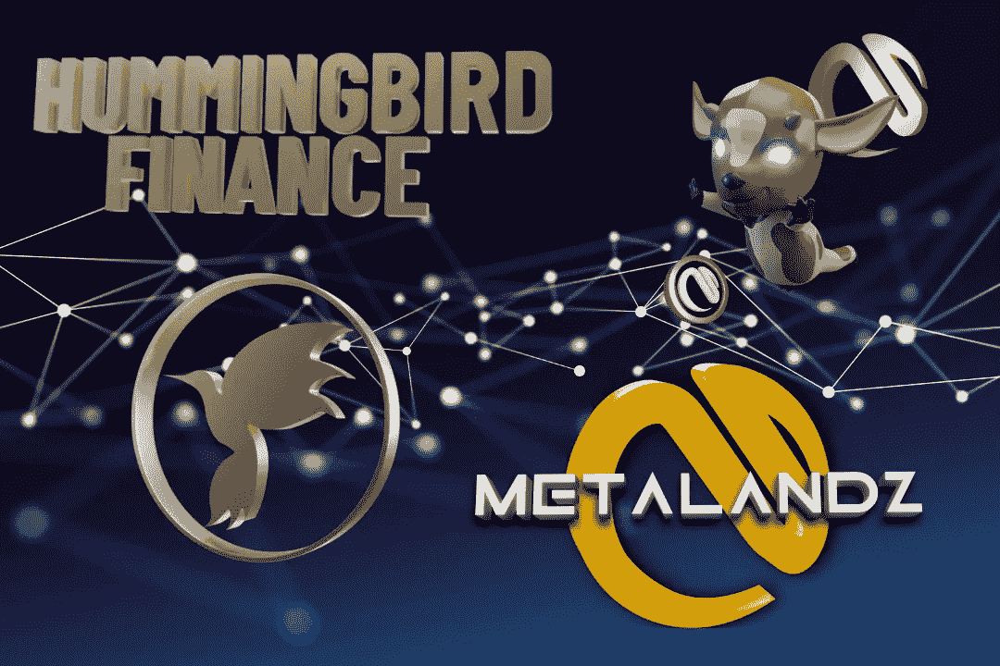

# Metalandz 加入 NestSwap，为持有者提供高产农业和赌注池

> 原文：<https://medium.com/coinmonks/metalandz-joins-nestswap-to-offer-yield-farming-and-a-staking-pool-for-holders-aa0cb16996cb?source=collection_archive---------35----------------------->

## Metalandz 和 Hummingbird Finance 在其分散化平台 NestSwap 上建立了长期合作伙伴关系

# Metalandz，这是怎么回事？

Metalandz 是一个基于 BNB 链的游戏平台。他们的愿景是提供一个深度沉浸式平台，玩家将在其中创建自己的不可替代令牌(NFT ),并通过玩 Poly Jungle 用我们的治理和效用令牌(METAZ)奖励他们的参与。

METALANDZ 旨在将区块链带入主流游戏，通过提供真实所有权、数字稀缺性、货币化能力和互操作性的优势，吸引加密和非加密游戏爱好者。他们坚信，数字稀缺将在游戏的未来扮演最重要的角色。这是一个至关重要的转折点，即大规模采用 NFTs、区块链和加密货币。

交易费:反射 3%，游戏费 2%，营销费 1%

电报:[https://t.me/MetalandzEnglish](https://t.me/MetalandzEnglish)

网址:【https://metalandz.tech/ T3

metalandz docs:【https://metalandz.tech/metalandz-docs.html 

# 赌注:$HEGG "赚取$METAZ

发行时长:30 天
总奖励:45 亿 Metaz 代币
开始时间:3 月 31 日
METAZ 合约:[**https://bscscan . com/token/0x DD 26 a 25 f 872d 87 da 9f 0 de 9652085 bcc 8c 1923 DDC**](https://bscscan.com/token/0xdd26a25f872d87da9f0de9652085bcc8c1923ddc)

# 奖金:没有象征性的收获税

在 NestSwap 上购买 METAZ:
[**https://nestswap.app/swap?output currency = 0x DD 26 a 25 f 872d 87 da 9f 0 de 9652085 bcc 8c 1923 DDC**](https://nestswap.app/swap?outputCurrency=0xdd26a25f872d87da9f0de9652085bcc8c1923ddc)

**向下滚动查看 METAZ 高产养殖信息**

# 蜂鸟金融(HMNG) & NestSwap 是谁？

NestSwap 由 HMNG 团队于 2021 年 8 月创建，由它的治理令牌蜂鸟蛋(HEGG)提供支持。
HMNG 团队派生了 PancakeSwap，并添加了新的面向区块链社区的功能，这些功能帮助推动了创新技术的发展，并在价格、奖励和合作伙伴关系方面充分提供了用户友好的实时优势。

HEGG 地址:0x 778682 c 19797d 985 c 595429 FBC 51d 67736013 a86
购买 HEGG 入股

分散森林中的新事物；股份、农场、贸易和互换

# 如何向池中添加令牌？

如果你已经拥有$HEGG，太棒了！如果没有，请查看上面的链接并储备。有关赌注的任何问题，请加入 [NestSwap 电报组](https://t.me/nestswapnews)或访问我们的其他官方小组。

*   去 https://nestswap.app/pools[的](https://nestswap.app/pools)
*   在 HEGG/METAZ 池上单击“启用”
*   然后点击赌注按钮
*   在立桩、移除桩和收割时，需要少量 BNB 作为交易费
*   添加金额并确认交易
*   在你的日历上设定收盘日期，记得在收盘后撤掉你的股份。

# 梅塔兹农场

# 怎么种田？

1.先看视频

2.添加流动性对(LP)，您需要梅塔兹和 BNB
直接链接流动性对

[**https://www . nest swap . app/add/BNB/0x DD 26 a 25 f 872d 87 da 9 f0d e 9652085 bcc 8 c 1923 DDC**](https://www.nestswap.app/add/BNB/0xdD26a25F872D87dA9F0de9652085BcC8c1923dDC)

匹配梅塔兹& BNB
合同的等值:0x DD 26 a 25 f 872d 87 da 9 F0 de 9652085 bcc 8 c 1923 DDC

3.前往[https://nestswap.app/farms](https://nestswap.app/farms)并将 LP 存入 Metaz 农场。

4.将 HEGG 合同添加到您的钱包中查看并领取奖励:
0x 778682 c 19797d 985 c 595429 FBC 51d 67736013 a86

5.还不拥有$METAZ？在 NestSwap 或 PancakeSwap
[**https://nestswap.app/swap?上安全购买 output currency = 0x DD 26 a 25 f 872d 87 da 9f 0 de 9652085 bcc 8c 1923 DDC**](https://nestswap.app/swap?outputCurrency=0xdd26a25f872d87da9f0de9652085bcc8c1923ddc)

6.欢迎来到农场！

# 成为合伙人

增加项目的流动性，用流动性农场奖励持有人，或用赌注池找到更多持有人 HEGG > >您的令牌持有人喜欢令牌的额外用例。

[合伙申请表](https://docs.google.com/forms/d/e/1FAIpQLSfcZ0B_DQ19h3OjKLH2rqLkAQgRoFU2CcSa1ITqRB-6rusqFQ/viewform?usp=sf_link)

# 加入我们了解更多信息:

电报:[https://t.me/hummingbirdbsc](https://t.me/hummingbirdbsc)

网址:https://[hummingbirdbsc.org/](http://www.hummingbirdbsc.org/)

推特:https://twitter.com/HmngBsc

https://www.reddit.com/r/HmngBsc/

YouTube:[http://bit.ly/YouTubeHummingbird](http://bit.ly/YouTubeHummingbird)

免责声明:所提供的信息不构成投资建议、财务建议、交易建议或任何其他类型的建议。购买加密货币时，做自己的研究是很重要的。

> 加入 Coinmonks [电报频道](https://t.me/coincodecap)和 [Youtube 频道](https://www.youtube.com/c/coinmonks/videos)了解加密交易和投资

# 另外，阅读

*   [OKEx vs KuCoin](https://coincodecap.com/okex-kucoin) | [摄氏替代品](https://coincodecap.com/celsius-alternatives) | [如何购买 VeChain](https://coincodecap.com/buy-vechain)
*   [ProfitFarmers 回顾](https://coincodecap.com/profitfarmers-review) | [如何使用 Cornix Trading Bot](https://coincodecap.com/cornix-trading-bot)
*   [如何匿名购买比特币](https://coincodecap.com/buy-bitcoin-anonymously) | [比特币现金钱包](https://coincodecap.com/bitcoin-cash-wallets)
*   [瓦济里克斯 NFT 评论](https://coincodecap.com/wazirx-nft-review) | [比茨盖普 vs 皮奥克斯](https://coincodecap.com/bitsgap-vs-pionex) | [坦吉姆评论](https://coincodecap.com/tangem-wallet-review)
*   [如何使用 Solidity 在以太坊上创建 DApp？](https://coincodecap.com/create-a-dapp-on-ethereum-using-solidity)