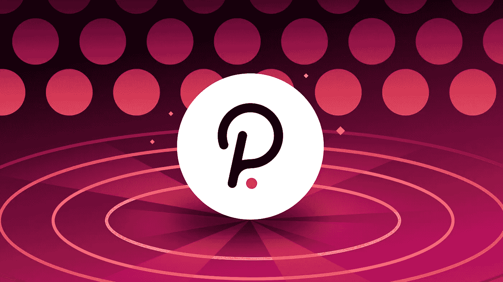

# Metamask，Infura，JP Morgan，一个以太坊阴谋？波尔卡多特道的替代品。

> 原文：<https://medium.com/coinmonks/metamask-infura-and-jp-morgan-a-ethereum-conspiracy-polkadot-dao-alternatives-94cb58e5d80e?source=collection_archive---------6----------------------->

~dwulf

Polkadot DAO

我真的不希望这个阴谋成真。Metamask 和 Infura 并不像大多数人认为的那样分散。这很伤人，尤其是那些不做加密交易的新手，手动到第 1 层和第 2 层的 API。

虽然这不是加密货币的死亡，但它确实停滞不前，适应不了。它只是迫使人们转向更安全、单一用途的钱包，如 Polkadot.js、Keplr 等。

那么 ETH 有什么用呢？

以太坊可能太去中心化了。因此，虽然我的投资组合中仍有 ETH，但目前我不太愿意运行任何 ETH 验证器。32 ETH 和 J.P. Morgan，ConsenSys 的 Joseph Lubin，甚至，遗憾的是 Vitalik Buterin 之间的勾结，尽管公平地说 Vitalik Buterin，我认为他的参与与其说是阴谋，不如说是扩展他的以太帝国。让我感到不安。

以太坊仍然是加密生态系统的一部分，而且是其中的一大块。用它来支付汽油或流动性总是好的。我正在重新调整我的加密投资，从我的投资组合中减少而不是消除 ETH，以支持我的主要加密驱动程序(Polkadot 和 Cosmos mostly)。)

**我们出局了……**

在扑克术语中,“出局”是指在牌局中出现的选项。以太坊非常沉重，并可能与旧世界经济的摩根大通和其他监管机构纠缠不清。向前看，有出局是件好事。

毫无疑问，以太坊最终将会扩大规模，并成为一项可靠的投资，为流动性池和其他产生区块链的资产做出贡献。但是其他的区块链正在被建造来竞争，并且当计算出盒子外的非碰撞隐私时，一些比其他的更适合。我的赌注是波尔卡多特和宇宙，其他选项也在地平线上。

**Metamask 和 Infura 启示录**

因此，缓慢而有计划地转移到 Polkadot 和 Cosmos 的本地钱包，并从它们开始工作，似乎是最好的工作理论。Metamask 对我来说仍然是可用的，但事实是 Infura 拥有 kill 开关，我不能让任何人或 DAO bot 受制于它。明智的做法是准备好新钱包，挑选几个喜欢的，其中一个是分类账硬件钱包。

软件钱包可能是安全的，但随着更多功能的增加和第三方参与促进交流变得集中和受监管，您需要用他们的 Github 库旋转自己的库或回家。您不必从源代码构建它，但是您应该知道如何构建。

至于 Metamask，我将保留它用于特定的目的，并试验什么将触发 Metamask 上的任何覆盖或关闭帐户。将我的大部分密码排除在外，进入更多已知的数量，如底物和 Polkadot (Acala、Astar 和 Nodle)。

**波尔卡多特(dot)生态系统**

因此，由加文·伍德博士建造的 Substrate 是最好的选择，他也创造了 Solidity 语言。在波尔卡多特生态系统中正在建造副链和桥梁，这提供了一个主场优势。

我一直在争取至少成为波尔卡多特的大使，并密切关注事态的发展。

他们为学院准备的最接近的东西是从平价到基底的 3 轨课程。

**链条轨道:核心开发、托盘、构建副链条**

**应用追踪:dap 级别，智能合约**

**下部结构轨道:完工，节点基础结构**

分而治之。在这 3 个中，我在*链轨道*和*应用轨道*上，我是 Greenwitch DAO 的主要目标，以具有修改自身(以及在 DAO 自己的链上)的能力。

用 Rust 解决不用说，所以学习曲线是存在的。但由于是 Rust，它在内存管理上比较吃紧。没有 *sig 故障*、*内存泄漏*或*竞争条件*。实际上建立在测试中，并通过借用和借用内存概念来要求所有编译中的责任。

**阿卡拉 Defi**

在 Acala 生态系统上堆积您的点，并铸造您的 aUSD 以购买更多硬币/代币，冲洗，洗涤，重复。杠杆风险与可接受的比率，铸造你的稳定澳元硬币，但不要浪费它们。如果你重新投资的资产没有给你带来收益，它们就是费用，不是赚钱机器的一部分。

**Acala ACA 旁系。**

现在，人们可以使用 ACA，Acala 的本地令牌来支持澳元稳定硬币贷款，同时押注 ACA。将 ACA 押在 Acala 上的通缩资产，鼓励 ACA 所有者等待忠诚赌注奖金，并将 ACA 排除在可用和流通 ACA 市值池之外。

当然，最终游戏是点的积累，LCDOT 硬币/代币，目前打折，但在租期结束时将达到 1:1 的平价。

有了 DOT，抵押(和赌注)的 LDOT 就可以产生并用于其他投资。

**结论:**

许多事情正在发生，战争和监管的不确定性直接影响着经济，天然气和食品的价格以及交付的货物。这抬高了所有东西的价格，削弱了美元购买力。

不要依赖这一点，建立一个道来抵消这一点，仍然保持独立于民族国家，免于关税，什一税和税收。当需要相互作用或相互作用具有战略优势时，组建一个有限责任公司，并根据道的 KYC 而不是你的个人身份，只注入你希望投入的资本。

隐私是重要的，应该认真对待，你的身份和/或公民身份不应该成为让自己卷入加密生态系统的因素，事实上，你的身份应该始终保持独立于你的加密资产。用你的助记词，你可以在没有合法所有权的情况下拥有控制权，这使你对非法和越权的关税、什一税和税收负有责任。

将所有权转移给道是保留你所有主权财富的关键。如果当道被要求支付关税，什一税，税，这将是从一个博弈论的方法，而不是强制勒索税吏。

> 加入 Coinmonks [电报频道](https://t.me/coincodecap)和 [Youtube 频道](https://www.youtube.com/c/coinmonks/videos)了解加密交易和投资

# 另外，阅读

*   [Bookmap 点评](https://coincodecap.com/bookmap-review-2021-best-trading-software) | [美国 5 大最佳加密交易所](https://coincodecap.com/crypto-exchange-usa)
*   最佳加密[硬件钱包](/coinmonks/hardware-wallets-dfa1211730c6) | [Bitbns 评论](/coinmonks/bitbns-review-38256a07e161)
*   [新加坡十大最佳加密交易所](https://coincodecap.com/crypto-exchange-in-singapore) | [购买 AXS](https://coincodecap.com/buy-axs-token)
*   [红狗赌场评论](https://coincodecap.com/red-dog-casino-review) | [Swyftx 评论](https://coincodecap.com/swyftx-review) | [CoinGate 评论](https://coincodecap.com/coingate-review)
*   [投资印度的最佳密码](https://coincodecap.com/best-crypto-to-invest-in-india-in-2021)|[WazirX P2P](https://coincodecap.com/wazirx-p2p)|[Hi Dollar Review](https://coincodecap.com/hi-dollar-review)