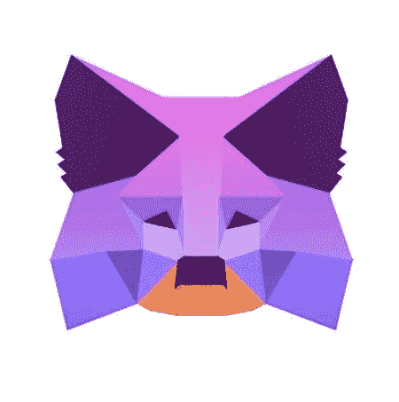

# MetaMask 现在允许 Iphone 用户通过 Apple Pay 购买密码

> 原文：<https://medium.com/coinmonks/metamask-now-allows-iphone-users-to-purchase-crypto-via-apple-pay-acc25514a000?source=collection_archive---------26----------------------->

基于以太坊的 Web3 钱包元掩码正在推出更新，将 Iphone 和 iOS 用户的加密钱包与 Apple Pay 集成，支持加密货币购买。

然而，有一个小警告，因为此时苹果不支持通过自己的平台直接购买加密货币。解决方法是通过 Wyre 购买加密软件，该软件可以与 Apple Pay 集成并支持加密。

新的更新还将允许用户使用信用卡和借记卡购买加密，因此用户将无需向 [MetaMask](https://bumblebeecrypto.com/2022/03/21/what-is-metamask-and-how-to-use-it/) 应用程序发送基于以太坊或以太坊的 ERC-20 令牌。通过 Wyre API，Apple Pay 用户将能够向他们的 MetaMask 钱包中发送最多 400 美元。

*MetaMask 宣布 iOS 更新，允许 Apple Pay 用户购买加密软件*

# 关于元掩码的重要说明:

*   MetaMask 是一个 web 浏览器扩展或插件，提供以太坊和 ERC-20 兼容钱包的使用。
*   MetaMask 的用户可以在钱包里放以太坊(ETH)和许多其他 ERC-20 代币。
*   MetaMask 最近每月活跃用户超过 3000 万，成为最受欢迎的加密钱包之一。
*   MetaMask wallet 可用于连接分散式应用程序(dapps)。
*   MetaMask 钱包持有者通常可以用他们的 MetaMask 钱包认证进入 dapps，并且可以通过钱包中的资金购买诸如 NFT 或服务之类的项目
*   物品可以通过 dapp 通过钱包地址发送到元掩码钱包，例如 NFTs 或令牌(如果您正在出售物品)。
*   BumbleBeeCrypto.com 在这里整理了 [MetaMask 安装和配置](https://bumblebeecrypto.com/2022/03/21/metamask-guided-instructions-to-install-and-configure/)说明以便于设置:

来源:[BumbleBeeCrypto.com](https://bumblebeecrypto.com/2022/03/30/metamask-now-allows-iphone-users-to-purchase-crypto-via-apple-pay/)

> 加入 Coinmonks [电报频道](https://t.me/coincodecap)和 [Youtube 频道](https://www.youtube.com/c/coinmonks/videos)了解加密交易和投资

# 另外，阅读

*   [SmithBot 评论](https://coincodecap.com/smithbot-review) | [4 款最佳免费开源交易机器人](https://coincodecap.com/free-open-source-trading-bots)
*   [比特币基地僵尸程序](/coinmonks/coinbase-bots-ac6359e897f3) | [AscendEX 审查](/coinmonks/ascendex-review-53e829cf75fa) | [OKEx 交易僵尸程序](/coinmonks/okex-trading-bots-234920f61e60)
*   [如何在印度购买比特币？](/coinmonks/buy-bitcoin-in-india-feb50ddfef94) | [WazirX 评论](/coinmonks/wazirx-review-5c811b074f5b)
*   [CryptoHopper 替代品](/coinmonks/cryptohopper-alternatives-d67287b16d27) | [HitBTC 审查](/coinmonks/hitbtc-review-c5143c5d53c2)
*   [CBET 评论](https://coincodecap.com/cbet-casino-review) | [库科恩 vs 比特币基地](https://coincodecap.com/kucoin-vs-coinbase)
*   [折叠 App 审核](https://coincodecap.com/fold-app-review) | [Kucoin 交易机器人](/coinmonks/kucoin-trading-bot-automate-your-trades-8cf0ca2138e0) | [Probit 审核](https://coincodecap.com/probit-review)