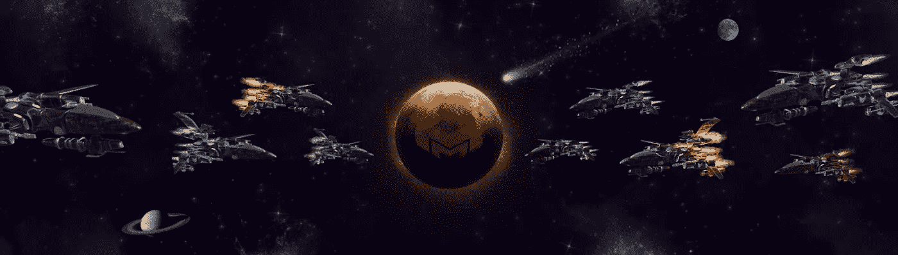

# MetaMetaverse 在 Opensea 上提供了它的 MetaShip Drop:获得独家车辆以开拓 Metaverses

> 原文：<https://medium.com/coinmonks/metametaverse-offers-its-metaship-drop-on-opensea-get-exclusive-vechicles-to-pioneer-metaverses-acf800c335b4?source=collection_archive---------15----------------------->

MetaMetaverse 是一个创建你自己的元宇宙的平台。每个元宇宙都是一个虚拟社会，有自己的游戏、互动体验、经济和治理。这些元数据是用 metameta lang 构造的，meta meta lang 是元宇宙互操作性的第 1 层协议。

**目录**

*   元船卸货详细信息
*   元 Ship 的好处
*   元体系结构层
*   结论

期待已久的 MetaShip drop 今天在 Opensea 上线[！Metaverse 为其早期用户提供了一个独特的机会，通过拥有元飞船先于任何人加入生态系统。](https://opensea.io/collection/metashipsbymetametaverse)

如果你在我们之前的战役中没有赢得基本元飞船，你现在有机会得到一个。要快，记住，一旦土地出售可用，那些拥有元船的用户将被自动列入白名单。第一个知道我们即将推出的优惠和特别优惠！

**元舰空投详情**

5000 艘元船可以在 300-350 美元之间买到，取决于元船的等级。

> Metaships 投放于太平洋标准时间 5 月 9 日上午 8 点在 [Opensea](https://opensea.io/collection/metashipsbymetametaverse) 开始

>空投将于 5 月 13 日结束**。**

在 Metaverse 网站[这里](https://www.metametaverse.io/drop)了解所有细节。

**转移的好处**

元飞船是元宇宙中的数字载体。使用元飞船，你可以旅行和探索元诗句。由于元元世界的土地彼此分离，你需要方便的设备以音速引擎的速度四处旅行并到达你想去的地方。使用元级，您可以在短时间内探索尽可能多的内容。每一个元 Ship 都可以根据您的想象和目标进行定制和改进。

每个元船都是一个 NFT 令牌，具有实用性，在区块链上有自己单独的 ID，这意味着您可以现在购买它，在 Metaverse 平台上使用它，并在以后任何时候出售它以获取利润。

所以，这是你获得并拥有一艘独一无二的超级飞船的独特机会，你可以自豪地将它展示在你的其他秘密艺术品和收藏品中。请记住，所有的 MetaShips 都有资格参加即将到来的区块链游戏，并且所有者将能够从 MetaMetaverse 获得未来的 NFT 奖励和奖励。

那些现在获得转让权的用户将是第一批被告知土地出售的用户，也是第一批有资格购买土地的用户。

总结所有的好处，通过拥有一个元 Ship，您可以:

*   拥有实用的 NFT，并提前获得额外的 MetaMetaverse 独家优惠。
*   通过添加或增强曲速驱动、硝基、能力和声波武器来升级元飞船。
*   穿越元诗句。
*   元宇宙(次元宇宙)的索赔权。
*   购买元宇宙的权利(Tier0 或父母，距离 7)。

购买土地的机会将在转让结束后的 1-3 个月内提供，并将在第一手基础上提供给转让持有人。

**元级层级**

所有的超飞船都有不同的等级，颜色、稀有度、曲速引擎、声波武器和亚硝基都不同。当前放置中有四层元级:

**常见:**有蓝色和灰色，占总供应量的 50%。

**不常见:**有绿、黄、红三种颜色，占总供应量的 45%。

**稀有:**有黑色和银色，占总供应量的 4.54%。

**超稀有:**黄金，仅占总供应量的 0.55%。

**4 种元船类型的总供应量为 5016** 。这使得**每种类型**有 1254 种型号。

在当前拖放中，所有四层元级都可用。您可以升级您的座驾，以获得更快的行驶速度、更强的性能、更多的功能，当然还有更多的风格。

**结论**

我们很高兴欢迎新用户进入 MetaMetaverse 世界，让他们探索机会。这是每一个元宇宙开拓者进入充满机遇的光明世界的激动人心的一步！

[**现在就做好你的最佳投资，获得转移**](https://opensea.io/collection/metashipsbymetametaverse) **。**

您需要的所有信息，请在[媒体](/@metametaverse)、[推特](https://twitter.com/m2verse)、[脸书](https://www.facebook.com/meta2verse/)、 [Instagram](https://www.instagram.com/m2verse/) 、[抖音](https://www.tiktok.com/@m2verse)、[不和](https://discord.gg/TzTpmmSGXG)、[电报](https://t.me/metametaversechat)上关注我们，并在下方留下您的电子邮件，加入我们的邮件列表。

> 加入 Coinmonks [电报频道](https://t.me/coincodecap)和 [Youtube 频道](https://www.youtube.com/c/coinmonks/videos)了解加密交易和投资

# 另外，阅读

*   [3 商业评论](/coinmonks/3commas-review-an-excellent-crypto-trading-bot-2020-1313a58bec92) | [Pionex 评论](https://coincodecap.com/pionex-review-exchange-with-crypto-trading-bot) | [Coinrule 评论](/coinmonks/coinrule-review-2021-a-beginner-friendly-crypto-trading-bot-daf0504848ba)
*   [莱杰 vs n rave](/coinmonks/ledger-vs-ngrave-zero-7e40f0c1d694)|[莱杰 nano s vs x](/coinmonks/ledger-nano-s-vs-x-battery-hardware-price-storage-59a6663fe3b0) | [币安评论](/coinmonks/binance-review-ee10d3bf3b6e)
*   [Bybit Exchange 审查](/coinmonks/bybit-exchange-review-dbd570019b71) | [Bityard 审查](https://coincodecap.com/bityard-reivew) | [Jet-Bot 审查](https://coincodecap.com/jet-bot-review)
*   [3 commas vs crypto hopper](/coinmonks/3commas-vs-pionex-vs-cryptohopper-best-crypto-bot-6a98d2baa203)|[赚取加密利息](/coinmonks/earn-crypto-interest-b10b810fdda3)
*   最好的比特币[硬件钱包](/coinmonks/hardware-wallets-dfa1211730c6) | [BitBox02 回顾](/coinmonks/bitbox02-review-your-swiss-bitcoin-hardware-wallet-c36c88fff29)