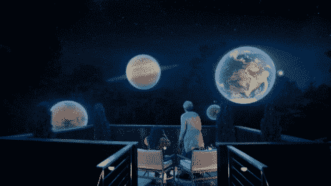
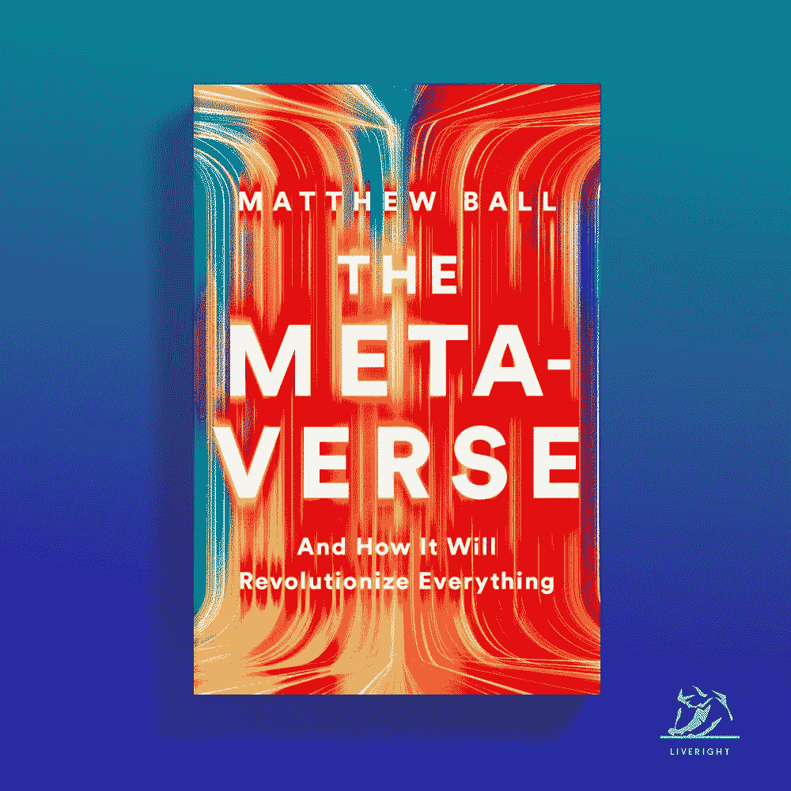
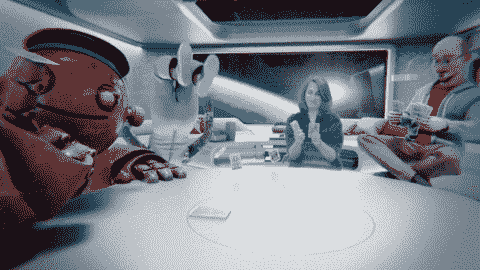
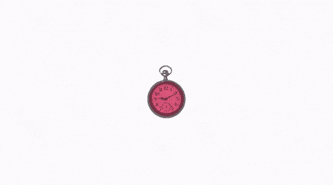
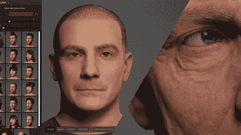
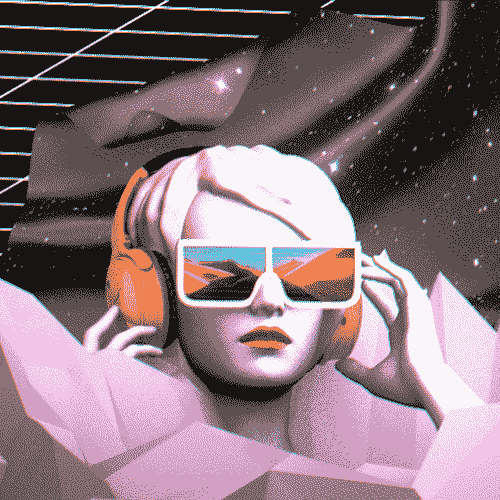

# 元宇宙 101 大楼

> 原文：<https://medium.com/coinmonks/metaverse-101-828995d453c7?source=collection_archive---------24----------------------->

## 这是[赛克里希纳 V](https://twitter.com/5aitec) 在[产品屋](https://twitter.com/0xTPH) web3 社区上对元宇宙 101 会议的细分。赛是 [Polygon](https://polygon.technology/) 的顾问，也是被 [Flipkart](https://www.flipkart.com/) 收购的虚拟&增强现实无代码平台 [Scapic](https://www.scapic.com/) 的创始人。这篇文章是以一种推特友好的方式写的，享受吧。

对大多数人来说，元宇宙是一些难以理解的高科技、古怪的概念。在现实中(或者我应该说虚拟现实😎)，元宇宙没那么复杂。

Courtesy: meta.com

> “元宇宙是一个大规模、可互操作的实时渲染 3D 虚拟世界网络，用户可以通过身份、历史、权利、物品、通信和支付等数据同步体验个人的现场感。”——[@ ball Matthew](https://twitter.com/ballmatthew)

简单来说:元宇宙是一个互联的 3D 虚拟世界🌎我们可以在这里生活、互动、联系、购物、工作和娱乐。正如我们所知，这是互联网发展的下一个阶段。

元宇宙和互联网有什么不同？

📠在互联网上，有链接和内容。在元宇宙，你是积极的参与者，而不是消极的旁观者。

📱你用手机/台式机上网。元宇宙在 VR 头戴设备上体验最好

# **让我们了解一下构成元宇宙的 7 层。**

为什么你今天没有在元宇宙体验到这一点呢？因为这些层仍然是 WIP。元宇宙成为主流还需要一段时间。

Courtesy: meta.com

## ⚒️Layer 1:基础设施。

原始的计算和连接解决方案仍在构建中，用于处理和渲染大量的三维逼真世界。今天的 GPU 必须扩展一个数量级才能跟上。

处理必须在服务器上进行，然后传输到可穿戴设备。在这方面，快速的 5G、6G 和 WiFi6 将有助于实现流入 VR 和 AR 所需的纯粹带宽。

## 👓第二层:人机界面。

我们如何让这些海量信息渗透到我们的日常生活中？智能眼镜/耳机可能是我们目前最好的答案。

VR 将帮助我们进入一个不同的现实，而 AR 将提供更多关于我们当前环境的信息。触觉和基于手势的计算将改变我们与数字世界互动的方式。

Ready Player One

## ☘️Layer 3:权力下放。

边缘计算是一种分布式计算模式，它使计算和数据存储更靠近数据源。边缘计算将使我们能够在本地处理信息，然后将其传输到可穿戴设备。

多家公司将能够创建他们自己的 3D 世界，你的虚拟形象将能够无缝地穿越各个领域(前提是有一个共同的协议，如 web2 的 HTML)。钱变成代币；在元宇宙，可拥有的东西变成了非食物。

[https://twitter.com/doodles](https://twitter.com/doodles)

## 📹第 4 层:空间计算。

地理空间制图，就像谷歌为地图所做的一样，将创造一个真实的元宇宙。想象一下虚拟广告牌上的 3D 广告的广告拦截器。🤯将需要强大的 3D 引擎来计算和创建一个感觉真实的虚拟世界。

## ✍️Layer 5:创造者经济。

由于元宇宙是 3D 的，因此必须构建构成这个 3D 世界的数字资产。3D 资产的新设计工具、工作流程和市场存在巨大的机会。皮条客正在制造和销售元宇宙现成的人工制品(NFT)

Unreal Engine

## 🔎第六层:发现。

你将如何在元宇宙发现新事物？通过社交、策展、反馈和评级，就像在 web2 中一样。虚拟商店将出售闪亮的 3D 资产。这就是用户可以消费的内容的呈现方式。

## 😍第七层:体验。

元宇宙最重要的一面。最重要的是，元宇宙应该很有趣。游戏应该是 AAA &有吸引力的。你的虚拟化身将欣赏的音乐会和你将在你的虚拟家中展示的 NFT 应该是一流的质量。

Courtesy: meta.com

在元宇宙你能做什么？你可以买一个虚拟的🏠，参加课程，制作和装饰您的 avatar🕺🏽，聊天，寻找和遇见你的 tribe🧑🏾‍🤝‍🧑🏻，在 projects🛠️上合作和工作，参观博物馆或音乐会，甚至结婚！

元宇宙建在什么上面？像加密和区块链这样的酷技术？是的。云计算正在向边缘计算发展。我们正处于等待发生的先进技术革命的初级阶段。

🎮博彩业在元宇宙扮演着至关重要的角色。游戏促进社区参与。已经有了现场赚取游戏。企业可以通过订阅、广告和 NFTs 来获得游戏收入。👩‍🏫学习将变得更具沉浸感、互动性和社会性。

> 这是我最喜欢的一段话——“元宇宙在定义上是流动的，在视觉上是可怕的，因为它需要做大量的工作，但也令人兴奋，因为有很多问题需要解决，也有机会建造一些东西”——[@ 5 aitec](https://twitter.com/5aitec)

> 加入 Coinmonks [电报频道](https://t.me/coincodecap)和 [Youtube 频道](https://www.youtube.com/c/coinmonks/videos)了解加密交易和投资

# 另外，阅读

*   [美国最佳加密交易机器人](https://coincodecap.com/crypto-trading-bots-in-the-us) | [经常性回顾](https://coincodecap.com/changelly-review)
*   [A-Ads 审查](https://coincodecap.com/a-ads-review) | [Bingbon 审查](https://coincodecap.com/bingbon-review) | [Mudrex 投资](https://coincodecap.com/mudrex-invest-review-the-best-way-to-invest-in-crypto)
*   [瓦济里克斯 NFT 评论](https://coincodecap.com/wazirx-nft-review)|[Bitsgap vs Pionex](https://coincodecap.com/bitsgap-vs-pionex)|[Tangem 评论](https://coincodecap.com/tangem-wallet-review)
*   [如何使用 Solidity 在以太坊上创建 DApp？](https://coincodecap.com/create-a-dapp-on-ethereum-using-solidity)
*   [最好的卡达诺钱包](https://coincodecap.com/best-cardano-wallets) | [Bingbon 副本交易](https://coincodecap.com/bingbon-copy-trading)