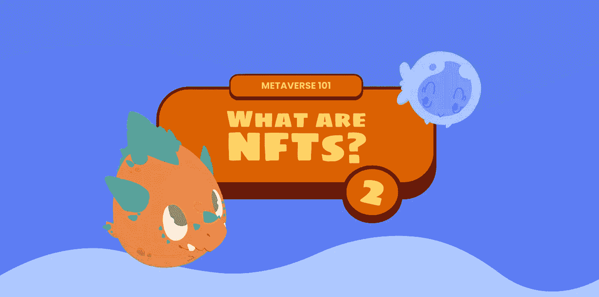
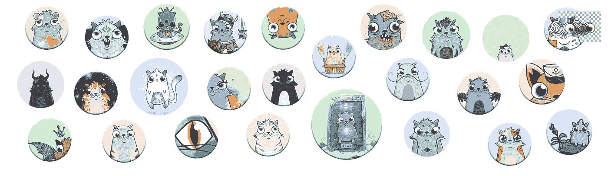

# 什么是 NFT？元宇宙 101

> 原文：<https://medium.com/coinmonks/metaverse-101-what-are-nfts-995fa91be19b?source=collection_archive---------64----------------------->

NFT(不可替换令牌的首字母缩写)是区块链技术最有趣的应用之一。“不可替代”表示它是不可复制和不可替代的东西。NFT 是证明数字作品(如图片、视频、歌曲甚至推特)真实性、唯一性和所有权的证书。这个证书写在区块链上，因此是不可变的。

# 它们是干什么用的？他们为什么要接管游戏行业？

因此，NFTs 可以用来证明数字产品的销售。与可以在网上复制的图像不同，如果这种资产与 NFT 相关联，其价值和所有权对持有者来说仍然是有保障的。

具体来说，NFT 被认为在视频游戏世界中非常有用，因为它们允许更有效地恢复和管理“游戏中”要购买的虚拟游戏元素。

它们首次出现在 2017 年的 [CryptoKitties](https://www.cryptokitties.co) 游戏中。其概念是创造一种独特的数字资产，不能被复制或破坏。

今天，这项技术的使用几乎已经成为一个视频游戏的“竞争优势”，确保了玩家的“**所有权**”、“**稀缺性**”和“**独特性**”感。所有这些使得花时间玩电子游戏不仅有趣，而且可能有利可图。

迄今为止，我们在许多游戏中都发现了这种技术，包括炉石和魔法:聚会。

因此，我们必须将这种技术视为真正的优势，这种优势不仅可以确保“真正拥有”一个人的时间果实，而且是一种潜在的投资，可以创造数字资产和视频游戏投资的混合体。

此外，在游戏世界，我们将使用 NFT 的技术，但**的方式与视频游戏市场**不同，放弃了市场上许多游戏都有的“*玩赚*的概念，而是采用了“**玩造**的方法，通过玩来创造机会。

 [## Gushi land——algrand 上第一个从玩到建的游戏生态系统

### 元宇宙最疯狂的游乐园即将开放，为休闲游戏玩家提供新的游戏体验…

medium.com](/@gushiland/gushiland-the-first-play-to-build-gaming-ecosystem-on-algorand-6ce0f6ee14b2) 

# 我如何购买 NFT？

要购买一个 NFT，你需要一个**数字钱包**，它可以让你保存你的加密货币和你的 NFT。它们可以根据市场价值进行购买、收藏或转售。

数字钱包是一种工具，它允许我们跟踪我们在加密货币领域的所有财产，几乎就像是一个活期账户，而不是银行账户，并且通常依赖于区块链技术。为了了解更多关于区块链技术的信息，我们撰写了一篇专题文章:

 [## Metaverse101:什么是区块链？

### 《孤岛惊魂》是一个以区块链为基础的游戏项目，这是一种创新的技术，其运营…

medium.com](/coinmonks/metaverse101-what-is-the-blockchain-f263193dbec) 

也可以**创建自己的不可替换令牌。**要做到这一点，有必要使用区块链网络，并拥有一个数字钱包，其中有加密货币来支付*汽油费*，或处理和验证交易所需的特定税收。根据加密货币的价值和使用的平台,*汽油费*的成本可能会有所不同。

在网络上有平台，真正的市场，你可以点击几下鼠标，将你的创造力转化为不可替代的象征。

# 数字资产的未来

越来越多的公司选择推出 NFTs，这是一项不断扩展的技术。所有这些都表明，不可替代的代币代表了数字资产的未来，带来了巨大的好处，尤其是在视频游戏中。

你呢，你已经有一辆 NFT 了吗？下一个故事再见。

# 关于古士兰

古士兰是元宇宙最疯狂的游乐园，是阿尔格兰德[上一种新的区块链游戏体验。从玩到建的生态系统中的策略、动作和乐趣对于休闲游戏玩家和专业玩家来说都是可行且有利可图的。在我们的](https://medium.com/u/bb4a269b69c3?source=post_page-----6ce0f6ee14b2--------------------------------)[第一个故事](/@gushiland/gushiland-the-first-play-to-build-gaming-ecosystem-on-algorand-6ce0f6ee14b2)中发现更多。

我们才刚刚开始。通过在 [Discord](https://discord.gg/68Tu6k7MHr) 、 [Twitter](https://twitter.com/gushi_land) 和 [Instagram](https://www.instagram.com/gushi.land/) 上加入部落，第一个听到令人兴奋的消息和发展。

> 加入 Coinmonks [电报频道](https://t.me/coincodecap)和 [Youtube 频道](https://www.youtube.com/c/coinmonks/videos)了解加密交易和投资

# 另外，阅读

*   [最佳期货交易信号](https://coincodecap.com/futures-trading-signals) | [流动性交易所评论](https://coincodecap.com/liquid-exchange-review)
*   [火币的加密交易信号](https://coincodecap.com/huobi-crypto-trading-signals) | [Swapzone 审查](/coinmonks/swapzone-review-crypto-exchange-data-aggregator-e0ad78e55ed7)
*   最佳[密码交易机器人](https://coincodecap.com/best-crypto-trading-bots) | [购买索拉纳](https://coincodecap.com/buy-solana) | [矩阵导出评论](https://coincodecap.com/matrixport-review)
*   [Coldcard 评论](https://coincodecap.com/coldcard-review) | [BOXtradEX 评论](https://coincodecap.com/boxtradex-review)|[uni swap 指南](https://coincodecap.com/uniswap)
*   [比特币基地评论](/coinmonks/coinbase-review-6ef4e0f56064) | [德里比特评论](/coinmonks/deribit-review-options-fees-apis-and-testnet-2ca16c4bbdb2) | [FTX 评论](/coinmonks/ftx-crypto-exchange-review-53664ac1198f)