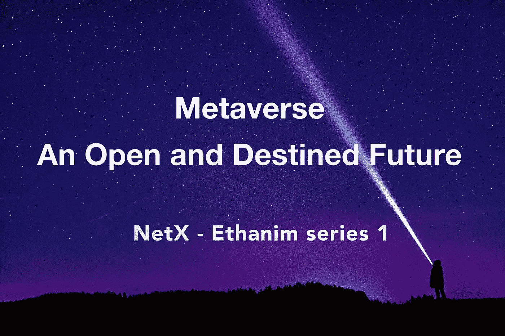

# 元宇宙:一个开放和注定的未来

> 原文：<https://medium.com/coinmonks/metaverse-an-open-and-destined-future-b652734fbdf2?source=collection_archive---------6----------------------->

TL；速度三角形定位法(dead reckoning)

*   元宇宙正在重新定义技术世界。
*   元宇宙席卷了生活的方方面面，被广泛认为是互联网发展的下一个阶段。
*   Web 3.0 以及传统行业都争相提出元宇宙总体规划。

T 何“元宇宙”一词最早出现在 1992 年出版的科幻小说*雪灾*中。这是一个组合词，来自希腊语“meta”，意为“超越”和“宇宙”，所以字面意思是超越这个宇宙的世界。随着人们陷入网络热潮，对身临其境的体验的渴望激增。与此同时，随着虚拟现实技术的发展，一个游戏化的虚拟世界正在逐渐形成。

# 下一代人机界面

2003 年推出的“第二人生”标志着第一个元宇宙的诞生。这个划时代的程序允许人们在 3D 多媒体平台上拥有第二次生命，在那里他们永远不会失去探索的地方和见面的人。除了《第二人生》,早期项目还包括《活跃世界》、《宫殿》以及一些受欢迎的游戏，如《哈博酒店》、《魔兽世界》、《《我的世界》》、《堡垒之夜》、VRChat 和游戏创作平台 Roblox。

在接受《连线》*采访时，《第二人生》创作者菲利普·罗斯戴尔(Philip Rosedale)将元宇宙描述为一个充满活生生的人的三维互联网，这与我们相符。我们相信元宇宙不仅仅是一个虚拟的社交网络。感觉更真实，满足人类下一阶段交流的需求。类似的社交模式也可以在许多非元宇宙 MMO 游戏中看到。此外，3D 技术是虚拟世界中现实体验的几个关键之一。元宇宙将改变人机交互。更重要的是，元宇宙是一个居住着一群活生生的人的社交网络，而不仅仅是一个像迟钝的电脑一样的工具。它超越了所有其他通信渠道，如互联网，在人与人之间以及人与物之间实现了更快的下一代交互。*

# *元宇宙继续前进*

*2019 年，脸书推出了虚拟现实社交平台脸书地平线。两年后，脸书首席执行官马克·扎克伯格透露了公司的新名字 *Meta* ，该公司致力于开发元宇宙技术。其官方网站写道，*

> *“元宇宙是社会联系的下一次进化。我们公司的愿景是帮助创造宇宙，因此我们更名以反映我们对未来的承诺”。*

*谷歌、Roblox、腾讯和其他公司也竞相展示他们对元宇宙的愿景。微软已经收购了 AltspaceVR，而微软团队用户也可以作为定制的 3D 虚拟化身等加入虚拟会议。在元门户上。元宇宙热正在上升。近年来，随着物理世界与虚拟世界的碰撞，互联网自然获得了新生。当被疫情隔离的世界迫切需要在线工作和生活时，元宇宙出现了。这个 3D 虚拟空间被公认为淘金者投资和创新的天堂。*

*然而，当谈到元宇宙蓝图时，传统公司远远落后于 Web 3.0 元宇宙项目。在这些项目中，有一个著名的沙盒，底价为 1.6ETH，交易量为 15 万 ETH。许多顶级项目和传统行业领袖都在沙盒中购买了土地。此外，还有规模迅速扩大的分散土地，其底价达到 2.2ETH，交易量在推出后仅半年内飙升至 171，000 ETH。我们可以说 Web 3.0 是元宇宙的发展方向，也是元宇宙的发展基础。*

*传统企业的大量资金流入和不断增长的流量都预示着一个更加广阔的蓝海。随着元宇宙被 Web 3.0 拖入互联网的第三次大迭代，它也将定义一个重构的社会系统。*

*无论是在元宇宙还是 Web 3.0，只要涉及到在线活动，数据隐私、成瘾和安全始终是突出的问题。只有深刻的改革才能帮助我们解决这些根深蒂固的问题。改革是全方位的，包括生产力、生产关系、社会、政治和经济形式等。因此，元宇宙的战略意义远远超出了作为游戏或虚拟空间的 Web 3.0 项目，而是被广泛认为是互联网发展的下一个阶段。*

> *加入 Coinmonks [电报频道](https://t.me/coincodecap)和 [Youtube 频道](https://www.youtube.com/c/coinmonks/videos)了解加密交易和投资*

# *注定的未来*

*我们相信人类社会将在元宇宙得到反映和重建。随着我们所有的工作、生活和休闲转移到这个空间，我们可以过上我们渴望的生活，成为我们想成为的人，建设我们梦想的世界，甚至创造新的文明形式。这标志着人类社会从物理现实到虚拟体验的巨大飞跃。随着这些虚拟元素率先进入我们的日常生活，世界将成为一个任何机构或个人都无法操纵或关闭的地方，在这里，资产所有权永远不会被篡改或剥夺。区块链只是被挑出的众多驱动力之一。最终的目标是让整个世界向虚拟空间迁移，在虚拟空间中，无论是个人、团体还是企业，每个人都会效仿。*

****NetX，面向数字生活的可信、可靠的智能自治系统链原生互联网(***[***Trias***](https://www.trias.one/)***)****

*[***铁人三项***](https://www.triathon.space/#/)***|***[***Ethanim***](https://www.ethanim.network/)***|***[***tu Sima***](https://www.tusima.network/#/)***| behemotius | Leviatom | Divina****