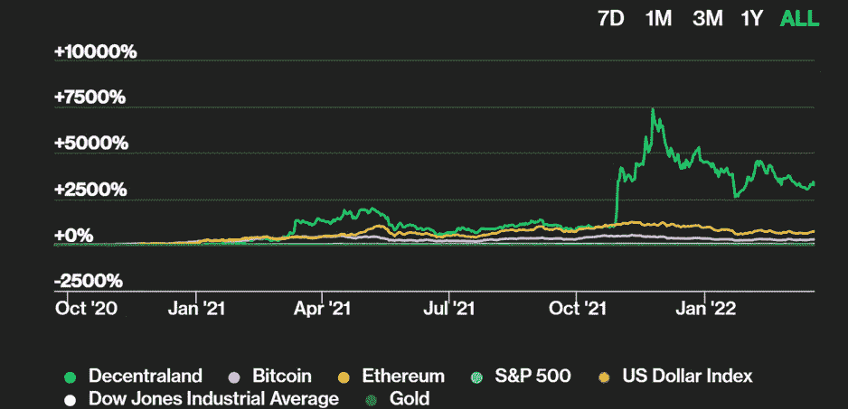
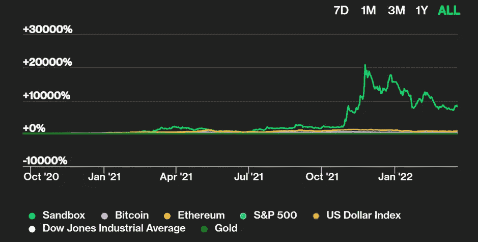
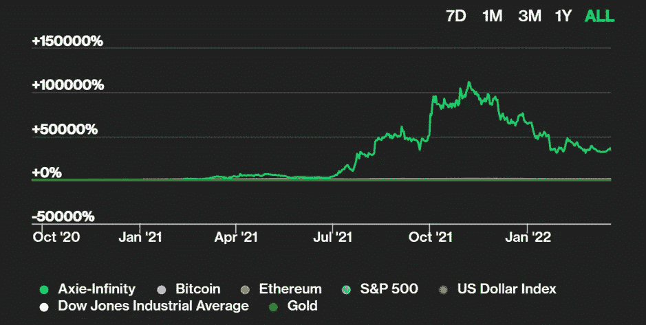

# 元宇宙分析

> 原文：<https://medium.com/coinmonks/metaverse-analysis-e2c284b25464?source=collection_archive---------32----------------------->

**加密货币概述(2003 年 14 月至 2003 年 21 月):**

随着加密货币进入我们的生活，其使用领域与日俱增，并受到创新的监管。元宇宙就是这些地区之一。在虚拟世界中创造我们自己的世界时，使用真实世界的钱没有多大意义。因此，每个项目都发行自己的令牌，并提供不同的用途，这些项目中的硬币根据预期用途，市场的预期和用户的需求和要求形成价格曲线。

根据一些估计，元宇宙世界有望创造约 15 万亿美元的市场价值。那么，在这个非常新但充满希望的世界中，我们现在可以使用什么加密货币来消费呢？自最初发行以来，这些硬币带来了多少投资回报？

在这篇文章中，我将接触和分析一些元宇宙世界的硬币。

**行业概况:**

简而言之，元宇宙是移动网络、增强现实、社交媒体、游戏、虚拟现实、电子商务、加密货币和工作空间的几乎互动、自给自足的生态系统中沉浸式存在的集成。

根据 Coinmarketcap 的数据，目前元宇宙相关加密技术的市值超过 350 亿美元。
我们可以在元宇宙世界找到熟悉的开发者公司，如苹果、Meta、Snapchat、微软、Epic Games、Unity、分散式公司。

我们可以看一些在元宇宙世界使用代币的例子。

分散之地:分散之地是一个创造性的出口，创作者可以在柜台空间创造和租赁财产，同时赚取法力令牌。MANA 是分散地的当地货币。
这是一个 ERC-20 令牌，为分散式虚拟现实平台提供动力，使用户能够创建、体验和货币化应用和内容。

**Gala Games(Gala):**Gala Games 旨在通过让玩家重新掌控自己的游戏来改变游戏行业。
Gala Games 的使命是制作你想玩的“区块链游戏”。
GALA 可以作为 GALA 游戏生态系统中用户之间的交流手段。例如，它可以用来支付游戏中的物品。
用户可以在他们之间传送 GALA，并完全控制如何使用它。

**风险呢？**

在数字世界使用数字货币是有意义的。但对于加密货币这样的支付系统，存在巨大的欺诈风险。用户在导航支付时可能会受到商业授权(ATO)、多账户欺诈、关联欺诈、拒付等的伤害。

2020 年至 2021 年间，加密货币盗窃增加了 516%，达到价值 32 亿美元的加密货币。高盛预测，区块链将是改善其元数据库的关键。不幸的是，即使在区块链的环境中，也有黑客钱包、洗钱和无数的骗局，让专家和分析师对这个数字世界保持警惕。

名人支持的秘密资金项目，消费者可能会感到困惑。从 2020 年 10 月到 2021 年 3 月，美国人在加密货币骗局中损失了 8000 万美元，增幅惊人，达到 1000%。随着身份识别变得完全数字化，企业面临的挑战将是为加密货币交易创建无缝而有效的身份检查。

加密领域还存在高波动性的风险。交易者应该始终保持谨慎，意识到波动性。当人们第二天醒来时，他们可以发现他们的一半资产或账户中有更大的损失。

**元宇宙最佳表演标志**

**分散之地(法力)**

当前市值:4412412770.63 美元

基于浏览器的 3D 虚拟世界平台

法力的投资回报率如下图；

**沙盒**

市值:3525758785.04 美元

博彩业

沙盒的投资回报率如下图:

**无限轴(AXS)**

市值:3040022868.49 美元

博彩业

Axie Infinity 的投资回报率如下:

**金恩(ENJ)**

市值:1262443703.04 美元

博彩业

金恩的投资回报率如下图所示:

**沙盒审查**

沙盒是一个位于区块链的虚拟世界，允许用户以游戏的形式创建、购买和出售数字资产。结合分散自治组织(DAO)和独特令牌(NFT)的力量，沙盒为不断发展的游戏社区提供了一个分散的平台。

入门价格:0.04 美元

历史最高价:8.40 美元

令牌组学:通过为游戏中的令牌化资产提供一个生态系统，沙盒生态系统利用了几种不同的令牌。沙子是 ERC 20 的象征，为生态系统的所有交易和互动提供动力。例如，玩游戏、购买装备或定制您的头像需要花费沙币。在未来，SAND 还将作为治理令牌，允许其持有者在沙盒 DAO ( [去中心化自治组织](https://www.gemini.com/cryptopedia/decentralized-autonomous-organization-dao))建立时对生态系统的变化有所投入。

沙子也可以用来购买资产和土地，即由 [ERC-721 代币](https://www.gemini.com/cryptopedia/glossary#erc-721-tokenization-standard)代表的数字房地产，它们是 NFT。玩家可以使用他们的土地，一个 96x96 米的数字地块，来容纳游戏和资产。只有 166，464 块土地将永远存在。当玩家将多块地组合成一个地产时，称为地产。

**总结**

加密货币融入了元宇宙的世界，允许我们使用那个世界的货币来创造我们想要的世界。不难看出，元宇宙的世界是未来的购物、游戏和娱乐世界。元宇宙货币已经获得的投资回报相当诱人。在新的虚拟世界的基础正在奠定之际，投资于一个潜力如此之大的领域，或许是本世纪最好的投资机会之一。

杰姆·凯莱斯

> 加入 Coinmonks [电报频道](https://t.me/coincodecap)和 [Youtube 频道](https://www.youtube.com/c/coinmonks/videos)了解加密交易和投资

# 另外，阅读

*   [CryptoHopper 替代品](/coinmonks/cryptohopper-alternatives-d67287b16d27) | [HitBTC 审查](/coinmonks/hitbtc-review-c5143c5d53c2)
*   [CBET 评论](https://coincodecap.com/cbet-casino-review) | [库科恩 vs 比特币基地](https://coincodecap.com/kucoin-vs-coinbase)
*   [折叠 App 审核](https://coincodecap.com/fold-app-review) | [Kucoin 交易机器人](/coinmonks/kucoin-trading-bot-automate-your-trades-8cf0ca2138e0) | [Probit 审核](https://coincodecap.com/probit-review)
*   [如何匿名购买比特币](https://coincodecap.com/buy-bitcoin-anonymously) | [比特币现金钱包](https://coincodecap.com/bitcoin-cash-wallets)
*   [币安 vs FTX](https://coincodecap.com/binance-vs-ftx) | [最佳(SOL)索拉纳钱包](https://coincodecap.com/solana-wallets)
*   [比诺莫评论](https://coincodecap.com/binomo-review) | [斯多葛派 vs 3Commas vs TradeSanta](https://coincodecap.com/stoic-vs-3commas-vs-tradesanta)