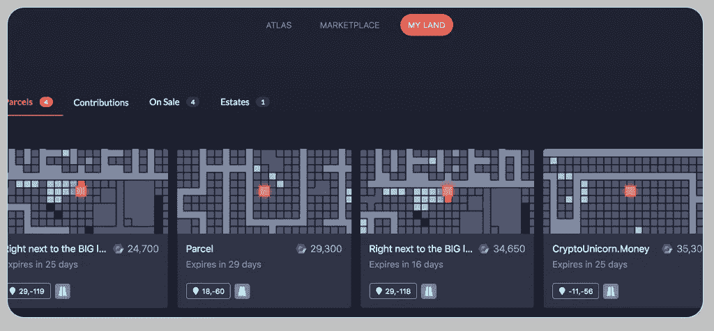

# 元宇宙指南——互联网的发展

> 原文：<https://medium.com/coinmonks/metaverse-guide-4cc4893435c6?source=collection_archive---------21----------------------->

不可否认，元宇宙是一个令人兴奋的前沿。这是一个全新的世界，你可以通过穿上一些装备并启动一个应用程序来探索。但元宇宙也可能看起来复杂得令人生畏。

*通读这本元宇宙指南，你将了解什么是元宇宙，涉及哪些玩家，哪些设备用于进入元宇宙，应用程序示例等等。*

# 元宇宙解释道

但是刚刚的[元宇宙](https://metamandrill.com/metaverse-meaning/)是什么？事实上，元宇宙本质上是另一个你可以与之互动的宇宙。但它如此独特的部分原因是你可以用不同的方式与元宇宙互动。

虚拟现实(VR)设备可以让你用元宇宙的景色取代你对模拟世界的看法。而增强现实(AR)将元宇宙置于标准离线世界之上。

还有其他与元宇宙合作的方式。从手机应用程序到电脑和游戏机都可以访问它。两个世界之间的不断重叠使元宇宙成为一个完全沉浸式的体验。元宇宙的这一方面消除了物质世界的界限，创造了一个新的无限现实。

这也是你社交生活中的一个现实。你不必独自踏入元宇宙。亲朋好友可以一个人来，总有新的人在那里认识。

元宇宙有着非凡的历史。元宇宙的未来令人鼓舞。它在不断成长和变化。元宇宙的指数增长意味着没有人确切知道它将如何演变。

# 元宇宙的早期版本和时代

元宇宙指南的一个重要部分是这个主题的历史。今天所理解的元宇宙是相当新的。但是更早的版本从淘气年代就已经存在了。第二人生在 2007 年拥有 90 万活跃用户，是原型元宇宙的最佳代表。

一些现在被认为是元宇宙重要组成部分的东西，如 Roblox 或堡垒之夜，开始时是与它截然不同的东西。这些原诗逐渐成为今天更大的元宇宙的一部分。游戏开发成元宇宙组件并不罕见。但是，即使像脸书这样的社交网络，现在 meta，也在朝着这个方向发展。

Image attribution: [Second Life](https://secondlife.com/)

# 元宇宙的特点

定义元宇宙有点像定义标准的离线世界。这更多的是一个两个人都关注哪一部分的问题。元宇宙太大了，很难严格定义它。但是有些特征将永远是元宇宙的一部分。

## 这是一个无限的环境

元宇宙是一个无限的 3D 环境。你基本上可以永远探索它，永远不会到达终点。不同的实现在它们的系统中可能有界限。但是所有这些限制都是武断的。这些都是未开发的地区，而不是由于缺乏可用空间而形成的边界。

## 没有中央集权

没有任何一个实体或组织拥有元宇宙。人们可以在元宇宙中持有单个元素，如土地或土地所有权。但是元宇宙本身是分散的。没有任何人可以控制元宇宙的整体。它本质上是一个分散的、用户控制的系统。

## 元宇宙永远开着

事实上，在元宇宙没有一个中心点可以控制，这也意味着没有一个主要点可以关闭它。它在许多方面与线下世界相似。并不是你所在城镇的每个区域都可以随时进入。但它从未真正“关闭”。

## 它有一个有效的经济

元通用实现通常反映了离线世界。真实世界的经济对大多数人的日常生活至关重要。因此，难怪跨文化有经济。区块链通常支持元宇宙经济。这使得加密货币的使用和独特物品的创造成为可能。

## 元宇宙是一个身临其境的世界

元宇宙是一个天生的沉浸式环境。当你走进元宇宙，你会完全感受到自己是它的一部分。这要归功于强大的扩展现实工具和软件，它们可以恰当地利用它。最终的结果是一个你真正生活在其中的元宇宙。

## 元宇宙的环境是社交和有趣的

大多数人会把社交列为他们生活中必不可少的一部分。多元活动有潜力成为社交活动。元宇宙地理位置通常与标准地理位置相似。任何人都可以探索或进入元宇宙。这种开放性导致了社会化和群体活动。

# 元宇宙的 7 层是它的基础

你已经看到了元宇宙的特点。[乔恩·拉多夫](https://jradoff.medium.com/)也提出了被接受为元宇宙的七个要点。这些类似于地球的地壳、地幔、外核和内核。

用户可能不会总是注意到这 7 层。但它们本质上是你登录时站在上面的数字地面。你可以在乔恩·拉多夫[的](https://jradoff.medium.com/) [*【元宇宙价值链】*](/building-the-metaverse/the-metaverse-value-chain-afcf9e09e3a7) 中找到对这七个层次的详细考察。但是你可以通过下面的总结得到一个扎实的认识。

1.  去物质化的体验:元宇宙不仅仅是在你面前看到一个 3D 的广阔空间。元宇宙的真实本质被非物质化了。它把你所知道的关于真实世界的一切都转化为原始数据，而不需要材料表面。例如，一本书可以被数字化为文本字符串。和物质现实转化为空间表现。所有这些都可以在元宇宙中以模拟材料的形式出现。但它们本质上都是非物质化的物品。
2.  **发现和探索的刺激:**发现是一种能为个人和企业带来价值的东西。元宇宙的发现可能来自探索 3D 环境。但也从整体上描述了对内容的探索。这包括社区和企业创造的商品或服务。这种发现可以是向外的，各种营销人员向用户传播信息。或者它可以是向内的，其中个人主动搜索与商品和服务相关的信息。
3.  **以创作者经济为中心的经济基础:**创作者经济层由元宇宙最新的内容创作系统组成。创建数字空间过去需要编码和设计方面的专业知识。但是这一层中的创作者经济描述了一种方法，通过这种方法，人们可以轻松地为元宇宙制作内容并将其货币化。这通常由提供特殊系统内工具的元宇宙实现来辅助。所有这些意味着人们可以很容易地创造和销售元宇宙商品。
4.  **空间计算消除了边界:**空间计算描述了元宇宙如何与离线世界共存。线下世界的元素可能会被带到线上。或者在线系统可以整合到离线世界的各个方面。物联网是这种合并最容易看到的例子之一。它将我们日常生活中的物品放到网上，变成一个网络。增强现实提供了另一个例子。AR 利用位置数据在视觉上融合了元宇宙和线下世界。
5.  **去中心化确保了没有一个所有者的数字世界:**去中心化层强调任何单个实体都不拥有元宇宙。它可以更好地被看作是一个更大的单个组件的集合。一些组件可能是公司所有的。私人拥有他人。由于计算机辅助，区块链使集体所有制和决策变得更加容易。没有人拥有整个元宇宙。缺乏单一所有权也意味着没人能关掉元宇宙。
6.  **作为终极计算机接口设备的人类:**这一层描述了人类是如何成为计算机接口设备的。这在很大程度上得益于可穿戴技术和智能手机等超便携产品。技术越来越小，传感器越来越完善，甚至语音接口也变得无处不在。VR 护目镜甚至变得更轻，不再依赖外部硬件。人类可以用比以往更自然的方式与计算机交流。而且这种现象一天比一天高级。
7.  **强大的基础设施让一切成为可能:**基础设施层指的是构成通用网络并为其提供动力的技术。其中最重要的一个方面是蜂窝数据网络的效率不断提高。5G 已经使高速便携式互联网连接成为现实。和 6G 网络将最终减少延迟，同时进一步提高速度。除此之外，新的工程技术使得便携式电子设备更加高效。甚至为移动设备供电的电池也在不断改进。

# 人们如何使用元宇宙的例子

一本元宇宙指南需要既说明理论又说明实践。你已经看到了构成现代元宇宙的各种特征和层次。但是这些想法是如何形成的呢？下面的例子突出了元宇宙的一些最重要的用途。

## 赌博

在很多方面，游戏是元宇宙的过去、现在和未来。许多古老的网络游戏演变成了真实的元宇宙体验。Roblox、Sandbox 和堡垒之夜就是最好的例子。

元宇宙的灵活性适合于游戏。当用户完全控制他们的环境时，他们通常会从头开始创建游戏。Roblox 就是这种现象最好的例子之一。但是像“第二人生”和“地平线”这样的平台表明，人们会在有脚本和开放世界的地方制作游戏。游戏元素也有助于元宇宙的发展，因为玩家会跳到网上和朋友一起玩。

Image attribution: [Roblox](https://www.roblox.com/)

要了解更多关于元宇宙游戏的信息，请阅读文章[“现在就要探索的十大元宇宙游戏”](https://metamandrill.com/metaverse-games/)。

## 虚拟世界和社交

虚拟世界是广阔的 3D 计算机模拟环境。虚拟世界本质上是以数字形式对离线世界的再创造。这往往是人们第一次听说元宇宙时的想法。

虚拟世界让你探索广阔的环境。你可以通过改变代表你的头像来改变你的外貌。你甚至可以参与现实世界中相同类型的社交活动。地平线世界是最好的例子之一。它是由 Meta，前脸书创建的，作为一个完全虚拟的世界。它是如此的完整，以至于人们甚至在里面做游戏。

Image attribution: [Sandbox](https://www.sandbox.game/)

更多关于虚拟世界的深入信息，请阅读文章[“元宇宙虚拟世界；体验元宇宙的最佳方式](https://metamandrill.com/metaverse-virtual-worlds/)。

## 公司的

越来越多的公司正在向网上转移。新冠肺炎迫使许多公司首次尝试虚拟会议和工作空间。结果是领导层和员工都发现他们非常喜欢虚拟模型。Meta 凭借其 Horizon 工作室系统成为这一新现象的领导者之一。

几十年来，微软一直是生产力和电话会议系统的行业领导者。因此，他们与微软团队的 Mesh 一起进入企业元宇宙也就不足为奇了。Mesh 尤其令人印象深刻，因为它能够将现有的基础设施利用到元宇宙空间中。

Image attribution: [Microsoft Mesh](https://www.microsoft.com/en-us/mesh)

## 事件

元宇宙的社交元素甚至延伸到聚会和大型活动。Sensorium Galaxy 是元宇宙的一个实现，主要用于这些项目。因此，像大卫·盖塔、阿明·范·布伦和史蒂夫·青木这样的艺术家参加 Sensorium Galaxy 活动也就不足为奇了。

堡垒之夜也因其大型社交活动而特别出名。爱莉安娜·格兰德和崔维斯·史考特只是和堡垒之夜合作过的几个名人。甚至电影和电视特许经营，如星球大战，都与堡垒之夜合作，为他们即将上映的电影造势。

Image attribution: [Travis Scott](https://youtu.be/wYeFAlVC8qU)

## 房地产

元宇宙房地产交易的规模可能令人吃惊。元宇宙广阔的 3D 世界充满了潜力。一个虚拟的房地产市场围绕着它成长起来。例如，分散土地上的一块虚拟土地最近以 240 万美元的价格售出。但元宇宙存在房地产交易这一事实几乎是一个既定事实。

甚至像“第二人生”这样的亲元诗也有很多重要的房地产交易。由于加密货币和区块链的元宇宙，现代数字房地产交易变得更加容易。

Image attribution: [Decentraland](https://docs.decentraland.org/market/land-manager/)

# 正在开发元宇宙基础元素的公司示例

元宇宙经常被框定在使用它的人的背景中。该系统基于创作者的经济意味着用户通常是主要的内容创作者。但几家公司也在帮助推动元宇宙向前发展。这些是一些与元宇宙有关的重要公司。

## 梅塔(原脸书)

脸书在通过技术联系人们方面有着悠久的历史。该公司确信，元宇宙是正式更名为 Meta 的下一步。Meta 正在通过开发 Oculus 和更具实验性的项目 Cambria 来研究 VR 硬件。

Meta 也在用 Horizon 开发基于元宇宙的系统。Horizon 系统在不断发展并增加新功能。这包括市场甚至游戏。

关于脸书元宇宙的更多信息，请阅读文章[“脸书元宇宙；解释、例子、装置、设想&批评家](https://metamandrill.com/facebook-metaverse/)。

## 微软

微软非常重视元宇宙的商业方面。几十年来，微软已经成为生产力软件的行业标准。但在新冠肺炎早期的居家办公(T2)潮流中，它获得了一次关于元宇宙的大规模民意投票。

新解决方案的市场显而易见，微软为团队推出了 Mesh，作为用基于元宇宙的模型补充他们当前产品的一种方式。Mesh for Teams 为用户提供了探索虚拟区域和工作场所的虚拟形象。它本质上创造了一个随处可达的完美办公环境。

## 罗布乐思

Roblox 既是一家公司，也是其最受欢迎产品的名字。Roblox 最初是一家游戏公司。但随着时间的推移，这个平台演变成了一个远比创造者们想象的社会和经济更加丰富的世界。这种指数级的增长导致了一个完全 3D 的世界，在这个世界中，用户可以创建视觉上独特的化身、服装和完整的游戏，并可以与他人分享。Roblox 不断增加新功能。

最大的增加之一是空间语音聊天，模拟离线世界的对话方式。此外，它还在开发各种新的服装选择。

## 尼安蒂克

Niantic 是增强现实领域的大腕之一。他们通过《精灵宝可梦 GO》让人们注意到了元宇宙的这一面。这款增强现实游戏以一种新颖的方式融合了元宇宙和离线世界，让人们离开沙发，同时探索虚拟和物质世界。

如今，Niantic 已经筹集了 3 亿美元来建造一个“真实世界的元宇宙”。Niantic 首席执行官约翰·汉克(John Hanke)将其描述为“现实变得更好”。他补充说，他们加入元宇宙将是一个充满数据和互动创作的真实世界的元宇宙。

## 英伟达

Nvidia 的硬件是元宇宙的基本元素之一。该公司研究并创造了各种各样的设备来渲染或处理 3D 图形。然而，他们也在推进元宇宙的软件方面。该公司最近承诺向数字艺术家提供免费版的 Omniverse 软件。

该软件对公司客户的许可费为每年 9000 美元。但是个别艺术家将免费用它来试验元宇宙。这为想要了解元宇宙的数字艺术家创造了一个有价值的切入点。

## 在元宇宙工作的其他公司

元宇宙的巨大潜力意味着有很多公司对此感兴趣。元宇宙本质上是无限的，无国界意味着与之合作的公司数量没有限制。像谷歌这样的大公司建立了新的研究部门与之合作。行业专家正在密切关注苹果等公司，它们已经暗示了相关计划。

元宇宙公司的数量在不断增长。你可以在文章[“元宇宙公司建设未来；](https://metamandrill.com/metaverse-companies/)概述。

# 形成元宇宙的装置

这本元宇宙指南探究了你在元宇宙能找到的东西。但是用来访问它的实际设备呢？您可以通过几种不同的方式访问元宇宙。但是大多数元宇宙技术都属于以下类别之一。

## 虚拟现实耳机(VR)

虚拟现实耳机是最容易识别的元宇宙硬件形式。它们是非常大的耳机，用数字显示器覆盖用户的眼睛。耳机会跟踪用户的视线，并在元宇宙软件中不断更新。虚拟现实中元宇宙体验的质量通常与其显示器的分辨率和屏幕质量有关。每只眼睛的显示效果越好，就越有身临其境的感觉。

## 增强现实装备

增强现实通常让你看到放置在元宇宙中的选定元素，如人工智能实体或物品。增强现实设备将元宇宙覆盖在离线世界的顶部。它一般使用可穿戴但轻便的耳机或智能眼镜。但在某些情况下，即使是移动设备，在与正确的应用程序配对时，也可以被视为增强现实设备。一些增强现实设备与智能手机接口，以提供 GPS 数据和处理能力。

## 游戏控制台

元宇宙的许多实例都是从电子游戏开始的。因此，游戏机可以作为进入元宇宙的入口也就不足为奇了。尤其是索尼，它以支持虚拟现实而闻名。Playstations 为用户提供了可靠的虚拟现实耳机。索尼已经测试了完全社会化的虚拟环境。即使是缺少 VR 配件的 Xbox，也确实有一些元宇宙选项。例如，用户可以访问 Roblox。

## 计算机

计算机长期以来一直处于元宇宙的前沿。个人电脑几乎总是支持大多数其他元宇宙硬件。例如，你可以用 PC 使用大多数 VR 硬件。这通常是升级您的计算机以提供适当级别的支持的问题。例如，VR 支持通常需要更高性能的图形处理单元(GPU)。谢天谢地，如今添加新硬件相对容易。软件也是如此。

## 移动的

移动设备上的元宇宙支持通常落后于 PC 和游戏控制台。但随着时间的推移，蜂窝数据和 GPU 的改进使智能手机成为访问元宇宙的更具吸引力的平台。许多 [VR 头戴设备](https://metamandrill.com/vr-headsets/)提供了与智能手机配对的选项。而像谷歌 Cardboard 这样的平台，让低成本的 VR 创作变得很容易。移动平台也擅长像 Pokémon GO 这样的 AR 游戏。但即使是领先的 metaverses，如 Roblox，也支持移动。

## 对元宇宙设备的深入探究

这本元宇宙指南研究了最重要的几个类别。但重要的是要记住，每个类别只是元宇宙理工大学的一个总体概述。每个类别都有多个实现。寻找完美的元宇宙体验意味着精确地研究每种设备的优势。

你可以在文章[“元宇宙设备”中全面深入地了解用于进入元宇宙的设备；进入元宇宙的最佳装备](https://metamandrill.com/metaverse-devices/)。

# 元宇宙品牌指南及一些重要例子

硬件和软件公司是元宇宙最明显的公司元素。但它们本质上只是迈向更大目标的第一步。最终，元宇宙将会拥有和线下世界一样多，甚至更多的商业机会。以下品牌已经从线下世界进入元宇宙。

## 古驰在多个领域都很时尚

古驰是高级时装的同义词。100 多年来，它一直是创意和高质量设计的代名词。公司在元宇宙庆祝了周年纪念日。他们在 Roblox 中创建了一个令人印象深刻的虚拟花园展览。

古驰利用这个机会在元宇宙提供几种独特的虚拟商品出售。这些商品只能在有限的时间内买到。它们作为不寻常的数字商品的独特地位意味着它们的价值迅速上升。有趣的是，有这样的例子，古驰作品的数字版本卖得比它们所基于的线下商品还要高。

Image attribution: [Roblox](https://blog.roblox.com/2021/05/gucci-garden-experience/)

## 耐克提供了一个基于元宇宙的运动

耐克是世界上最著名的运动品牌之一。但该公司也在努力成为元宇宙最知名的品牌之一。耐克最近的努力之一是与强调积极生活方式的 Roblox 合作。这个名为 Nikeland 的项目让用户有机会购买耐克品牌的数码产品。

用户可以在 Nikeland 享受各种各样的体育活动。这包括跑道，障碍跑道，甚至公园。但 Nikeland 也让人们有机会在穿着它的时候保持活跃。它提供了耐克生活方式的体验。

## 文斯滑进了元宇宙

Vans 是全球最具影响力的动作运动品牌之一。和耐克一样，他们也将这种精神带入了 Roblox。该公司正在努力让人们有机会在线购买 Vans 产品，以类似于他们在离线世界中的体验。

例如，考虑一个严肃的溜冰者的情况。他可能会在离线实践中使用文斯。他也想在网上做同样的事情。Vans 通过在 Roblox 中提供许多产品使这成为可能。他们甚至创建了虚拟滑板公园，在元宇宙练习动作。

## 博柏利专注于普世荣誉

博柏利是世界著名的时装品牌。但是他们在元宇宙也建立了良好的声誉。这很大程度上得益于与王者荣耀游戏设计师的合作。博柏利将其一些时装系列引入国王的荣誉。这包括从大衣等单品到全套服装。

这种营销策略的一个有趣之处在于，这些商品在元宇宙和线下世界都有售。有人在元宇宙的博柏利发现了一个很棒的造型，也可以通过他们的产品在线下世界复制它。

## 斯特拉·阿托伊斯让人们在赛马中扮演更积极的角色

斯特拉·阿托伊斯是世界上最大的啤酒酿造厂——百威英博的一部分。也是赛马的知名赞助商。可以肯定地说，如果有人喜欢斯特拉·阿图瓦，他们可能会喜欢赛车。Stella Artois 决定与虚拟人类工作室合作，与这一共同兴趣一起工作。

这两家公司在元宇宙创建了一个名为 Zed Run 的赛车平台。Zed Run 赛事允许人们在比赛中繁殖和购买虚拟马匹。用户也可以尝试斯特拉阿图瓦品牌的马品种和皮肤。

Image attribution: [OpenSea](https://opensea.io/collection/stella-artois-art)

## 更多元宇宙品牌的例子

这些例子显示了受欢迎的品牌在元宇宙能取得多大的成就。数字领域为公司提供了一个利用用户兴趣的机会，这在现实世界中是不可能的。但这仅仅是开始。

从雅达利(Atari)这样的游戏公司到拉夫·劳伦(Ralph Lauren)这样的时尚偶像，一切都在涌入元宇宙。每一个品牌都让元宇宙经济对用户和投资者变得更具吸引力。

您可以在文章[“数字化销售产品的 12 大元宇宙品牌”](https://metamandrill.com/metaverse-brands/)中了解元宇宙最令人兴奋的品牌案例。

# 五大元宇宙博客的具体例子

元宇宙正在飞速发展。这本元宇宙指南提供了无数定期改进和创新技术的例子。关注专业博客可以更容易地掌握元宇宙的最新发展。以下是其中的佼佼者。

## 建造元宇宙

《建造元宇宙》是约翰·拉多夫写的。你可能还记得，拉多夫画出了元宇宙的 7 层。他的博客涵盖了这 7 层和各种其他元宇宙主题。拉多夫擅长用通俗易懂的术语解释与元宇宙相关的通常很复杂的概念。但他从不牺牲这些主题应有的深度和广度。

[点击此处](https://medium.com/building-the-metaverse)进入博客《建设元宇宙》。

## Metamandrill.com

Metamandrill.com 是一个相对较新的元宇宙资源，提供实用和解释性信息。它以给出清晰的解释和说明主题的例子而闻名。

这很重要，因为元宇宙完全处于开发阶段，仍然处于试验阶段。元宇宙还以不断变化的方式融合了线上和线下世界。它通常看起来很复杂。但是 Metamandrill 让元宇宙的世界变得清晰。

[点击这里](https://metamandrill.com/)进入 Metamandrill.com 的元宇宙博客。

## MatthewBall.vc

MatthewBall.vc 由 MatthewBall 运营。他是元宇宙商界的大人物之一。他是少数几个能够理解该行业商业方面并与相关人员交谈的人之一。这种以商业为导向的观点经常出现在 Ball 博客的主题中。这甚至延伸到像脸书的马克·扎克伯格这样有影响力的人物。

[点击这里](https://www.matthewball.vc/the-metaverse)进入 MatthewBall.vc 的博客

## 瑞安·舒尔茨

自元宇宙诞生之初，瑞安·舒尔茨就对其着迷。在《第二人生》中，他第一次爱上了元宇宙开放的一面。这种最初的兴趣反映在他的博客上。Schultz 提供关于所有类型的虚拟世界、社交虚拟现实和元宇宙的突发新闻。他悠久的历史进一步扩大了他的写作范围。

[点击这里](https://ryanschultz.com/)进入 Ryan Schultz 的博客。

## 伯纳德·马尔

伯纳德·马尔是一名作家和未来学家，他写了几本不同主题的亚马逊畅销书。他还获得了许多与他的作品相关的奖项。这种文学思维赋予了他的博客一种在其他地方看不到的特殊基调。马尔对元宇宙充满热情。由于他写作的广度，他给这个主题带来了独特的视角。

[点击这里](https://bernardmarr.com/all-articles/)进入 Bernard Marr 的博客。

## 更多元宇宙博客关注

阅读元宇宙从未如此简单。这些是一些最好的元宇宙博客。但它们远不是唯一的高质量选择。许多科技行业的精英都对元宇宙着迷。每个人都带来了自己的专业知识和特殊兴趣。

你可以在文章[“追踪最新信息的 9 个高质量元宇宙博客”](https://metamandrill.com/metaverse-blogs/)中找到更多元宇宙最佳博客的详细信息。

# 通过元宇宙与 Web 3.0 的比较来说明类似的技术

此时，您可能想知道 Web 3.0 在元宇宙中的位置。 [Web 3.0](https://metamandrill.com/web-3-0/) 可以被认为是它自己的元宇宙。但这是一个以互联网为基础进行建设的元宇宙。Web 3.0 本质上是一个元宇宙，没有像模拟离线现实的 3D 空间或世界那样的常见抽象。

例如，[NFT](https://metamandrill.com/nft-guide/)通过区块链与元宇宙紧密相连。但是标准的 3D 元宇宙并不是访问这些元素的唯一方式。您还可以使用 Web 3.0 技术来访问 NFT 信息、销售或创建工具。除了 3D 环境之外，还有各种各样的方式与区块链互动。

Web 3.0 也大量使用机器学习。这些元素渗透到元宇宙更传统的 3D 实现中。本质上，Web 3.0 强调了元宇宙的非物质化层。

# Web 1.0、2.0、3.0 有什么区别？

如果 Web 3.0 是元宇宙，那么 Web 2.0 和 1.0 呢？Web 1.0 本质上只是带有一些脚本标签的纯文本。这个版本在当时是一个技术奇迹。但是它甚至不能胜任重新设计杂志版面的任务。

Web 2.0 带来了人们在谈论互联网时会想到的创新。Web 2.0 引入了动态页面操作和社交网络。更好的脚本允许一个优雅的页面设计，甚至可以超越杂志。在 Web 2.0 中，向网站添加讨论变得相对简单。

Web 3.0 将技术带入了一个更加多维的状态。云计算和虚拟化使系统摆脱了硬件限制。这也为人工智能和类似的改进开辟了道路。

[文章《Web 1.0 2.0 3.0 有什么不同&示例”深入探讨了 Web 每一次迭代的历史和本质](https://metamandrill.com/web-1-0-2-0-3-0/)。

## 将元宇宙指南捆绑在一起

这本元宇宙指南已经涵盖了元宇宙的大部分基本原理，但还有一点需要记住。如果你有合适的工具，你现在就可以探索这些主题中的任何一个。元宇宙在线等着你。

> 加入 Coinmonks [电报频道](https://t.me/coincodecap)和 [Youtube 频道](https://www.youtube.com/c/coinmonks/videos)了解加密交易和投资

# 另外，阅读

*   [无聊猿游艇俱乐部(BAYC)回顾](https://coincodecap.com/bored-ape-yacht-club-bayc-review) | [拜比特 vs 比特币基地](https://coincodecap.com/bybit-vs-coinbase)
*   [5 款最佳加密交易终端](https://coincodecap.com/crypto-trading-terminals) | [最佳 DeFi 应用](https://coincodecap.com/best-defi-apps)
*   [比特币基地 vs 瓦济克斯](https://coincodecap.com/coinbase-vs-wazirx) | [比特鲁点评](https://coincodecap.com/bitrue-review) | [波洛涅克斯 vs 比特鲁](https://coincodecap.com/poloniex-vs-bittrex)
*   [德国最佳加密交易所](https://coincodecap.com/crypto-exchanges-in-germany) | [Arbitrum:第二层解决方案](https://coincodecap.com/arbitrum)
*   [币安交易机器人](/coinmonks/binance-trading-bots-d0d57bb62c4c) | [OKEx 评论](/coinmonks/okex-review-6b369304110f) | [阿塔尼评论](https://coincodecap.com/atani-review)