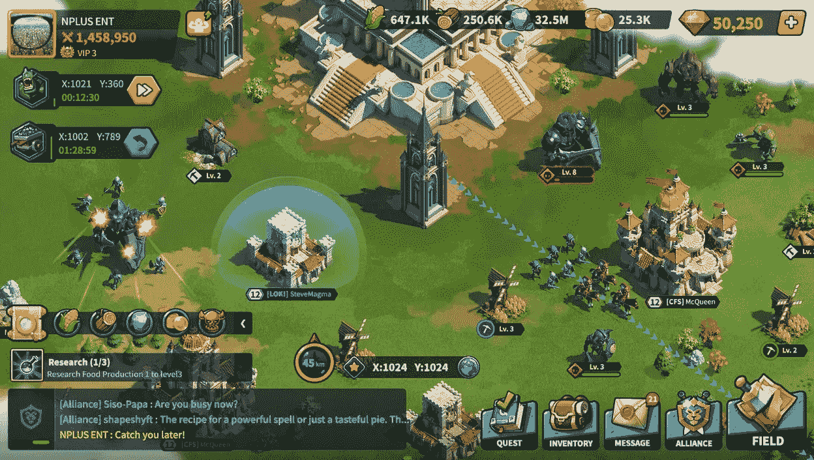

# 元宇宙·兰兹:是什么赋予了它们价值？

> 原文：<https://medium.com/coinmonks/metaverse-lands-what-gives-them-any-value-9f3850952496?source=collection_archive---------39----------------------->

## Web 2 平台和 Web 3 平台的异同

*免责声明:本文中表达的观点和意见完全是个人的，绝不代表任何实体的观点或立场，本文中的所有参考资料都是捏造的，因此没有任何学术价值，所以请阅读本文仅供娱乐。*

## 0.介绍

对于非加密和 NFT 投资者来说，虚拟世界土地一直是一个巨大的问题，因为前者几乎无法认识到一个自相矛盾的术语“虚拟房地产”的存在，而后者，尽管他们已经承认了这个概念，但对他们支付$10K 购买虚拟土地越来越怀疑。

著名的 Web 3 虚拟世界项目，如分散土地和沙盒，成功地将其土地分配给公众，推动了 30 万美元的总交易量，大约相当于 1B 美元，或 S&P500 日交易量的四分之一。

为什么投资者会把他们的月工资放在如此无形的东西上，是什么驱使他们相信这种不存在的东西有巨大的价值？元宇宙的土地是新的，从加密泡沫酿造的庞氏骗局的新形式吗？

在我们深入探讨这个话题之前，我们必须先了解什么是“真正的”土地。我们可以用各种术语来定义不动产——我们可以用法律术语来描述界限，我们可以用术语“不可移动性”和“不可毁坏性”来描述它们，或者我们可以用有形固定资产和不可折旧性质的会计概念来评估它们。

然而，让我们把所有的分类法都砍掉；土地是人类生活所有活动发生的地方。我们在土地上种植庄稼，在土地上经营商业，在土地上睡觉。我们可能会为了纯粹的美学目的而建造摩天大楼，但是我们在哪里建造它们呢？在陆地上。我们可能会画几条白线，然后用球跳过它们去打篮球，在物质‘真实’的土地上。

所有的人类活动，不管是经济的还是娱乐的，都是以土地为基础的，因此土地和在土地上进行的活动一样有价值，这就解释了为什么时代广场的住宅用地比马恩岛同样大小的土地价格要高得多。人们在时代广场做更多的活动。没有土地，就没有生命。

现在我们知道了为什么有形的土地是有价值的，但是为什么是虚拟的土地呢？我们不在虚拟土地上种植作物，因此没有必要在土地上进行生产性交易。虽然我们在星空谷播种，但我们*不在那些土地上种植作物*——星空谷的作物是不可食用的。在非生产性的实现下，我们陷入了这样的印象，元宇宙土地确实是一个被夸大的网络 3 产业的泵和转储计划，不用说缺乏任何价值，每个购买元宇宙土地的人都在传递炸弹。

Stardew Valley

尽管如此，作为 NFTs 的数字土地可能是新的，数字土地的概念已经在 Web 2 游戏行业中流行。并不是所有伟大的 MMORPG 都接受这个想法，但是仍然有许多 MMORPG 向他们的玩家介绍了某种“土地”或“房屋”: Ultima Online 是其中的第一个。有时候，土地本身成为了游戏的核心部分，就像《魔兽世界:德拉诺之战》一样。

World of Warcraft

我们将首先研究 Web 2 游戏项目中的数字土地，然后调查 Web 3 metaverses，看看为什么人们看到了数字土地的价值。

## 1.Web 2 中的数字土地

即使在 NFTs 出现之前，人们仍然在互联网上购买和交易虚拟土地。当然，Web 2 虚拟世界没有正式的市场，所以大多数交易都是场外交易；虚拟世界的主要目的并不像任何人所猜测的那样是为了提高生产力。

**1。终极在线**

追溯到 1997 年，Ultima Online (UO)进军游戏行业。UO 是一个以幻想为主题的 MMORPG，可以容纳几千人互动；事实上，UO 部分是一个社会实验，而不完全是一个游戏。

UO 还在 MMORPGs 中实现了房屋的原始概念:一个拥有众多装饰性和可定制选项的漂亮功能，它充当了一个有效的金水槽。尽管对 UO 来说，这只是一次性的黄金储备。

UO House

UO 将其服务器分成“碎片”，最常见的碎片是大西洋碎片。UO 的房子只是世界地图上的位置，所以自然稀少，因为新玩家不能篡夺先占的居住者。

尽管如此稀缺，每个人都有充足的理由拥有自己的房子——只是不是在任何地方。当玩家直接购买一个完整建造的房子时，他们可能需要在大多数碎片中支付几百万金币，但是一旦他们进入人口最多、最活跃的大西洋碎片，玩家需要花费两位数的铂=几十亿金币来获得一个合适的住房，即使有这样的钱，他们也只能购买一个中等大小的房子，因为没有足够的房间来建造大房子。

在大西洋碎片中玩确实给了其他碎片一些优势:容易进入购物区和更高的加入公会的机会。然而，与现实世界不同，在 UO 世界中，住房本身并不是必需品。房屋仅仅是与友好玩家进行社交的地方，但为此，人们同意花费比其他碎片多几百倍的黄金，只是为了获得邀请虚拟朋友过来的机会。

**2。最终幻想十四**

《最终幻想 XIV 》( FFXIV)是 Square Enix 的 MMORPG，有着标准的、陈词滥调的幻想设置，但却是最好的。FFXIV 是数字世界中位置导致土地稀缺的另一个主要例子——所有的房子都是世界地图上可以参观的地方，因此随着住房居住者的增长，自然地，可供建造房屋的土地越来越少。

FFXIV 的房屋解锁了一些不错的工具，不仅限于:投票、坐骑、公会和传送点，这些应该会给这片土地注入与实际游戏相关的内在价值。尽管有一个简单的问题困扰着土地的整体价值——这些好处并不是拥有房屋所独有的。事实上，玩家可以通过加入其他玩家创建的公会来做完全相同的动作。此外，每个人都有充足的土地来抢房子，所以不存在人为距离导致的稀缺问题，因为传送并不耗时。因此，在市区或郊区拥有一栋房子几乎没有区别。

Housing in FFXIV

尽管如此，在 FFXIV，土地(房屋)的交易是免费的，而且根据地理位置的不同，价格也不贵。为什么这样因为 FFXIV 的住宅不是作为现实生活中的实际使用案例，而是自我表达和审美炫耀的手段，这些看似无用的功能推动了这个幻想世界的土地价值。

**3。江湖**

Runescape 的玩家拥有的房子(POH)是 Gielinor 世界的核心水槽，因为尽管任何人都可以在任何地方拥有房子，但她需要支付搬家费，并且需要很多很多钱来完全装饰一个有房间和家具的房子。

Runescape PoH

再一次，房屋提供了通往传送点和储藏服务的入口，这并不是房屋所有者的专利，所以这里的价值较低。驱使玩家建造和布置房屋的主要原因是房屋聚会，这是一个玩家可以在自己家里举行的聚会。从找平效率来说，房子没用；然而，玩家决定将游戏收入的大部分花在房子上，唯一的目的是为了社交。

**4。失落的方舟&黑色沙漠**

《失落的方舟》和《黑色沙漠》也是非常受欢迎的拥有土地(房屋)系统的 MMORPGs，它们被归入同一类别，因为它们都有无限供应的不可交易房屋。玩家可以支付他们房子里的家具，但不能支付房子本身。

这两个游戏是审美目的房屋的又一个例子。

**5。Web 2 土地汇总**

Web 2 的土地对于核心游戏来说不是必须的，它们通常是为了支线任务和艺术满足感而制作的。尽管如此，人们还是花费时间和金钱在数字世界中得到他们的房子，即使这些房子完全不提供任何效用，人们也不“拥有”它们。仅仅是拥有感和与数字朋友社交的地方就足以成为人们消费的理由。

大多数 Web 2 领域的一个突出特点是“多维性”Web 2 平台的行为不像物理平台:在完全相同的位置上可能有多个平台。彼得和莎莉可能在世界地图上的同一个坐标上，并且会看到不同的房子。在 Web 3 领域，这种多维性基本上消失了，Web 3 游戏开始采用一维性——或者在一个位置的一个领域——更像真实世界。

## 2.Web 3 中的数字土地

Web 3 中的土地通常不被称为数字土地，而是被称为元宇宙土地。但是删掉词汇表，这并不重要。Web 3 中的元宇宙土地主要是由出售笛卡尔“世界地图”上的“地块”的项目驱动的，这意味着土地稀缺是由邻近性和一维性驱动的，这与许多 Web 2 游戏具有多维房屋特征相反。

Web 2 和 Web 3 土地的另一个核心区别是，Web 3 土地通常在实际游戏中扮演更重要的角色；地本身可以使用受限的游戏功能(沙盒创建者)，或者有时地是游戏的基本要求(王国联盟 P2E 游戏模式)。

**1。沙盒**

顾名思义，沙盒是以太坊网络上的沙盒式游戏，现在迁移到多边形网络。沙盒玩家很大程度上分为两类:创作者和玩家。创作者购买土地，并可以像 Minecrafters 一样自由地在上面建造游戏和展览，玩家可以穿越不同的土地，浏览创作者提供的故事和经验。像在 Web 2 中一样，一块土地伴随着社会公用事业，但在 Web 3 中，它也带来了一些经济利益，因为随着更多的人与土地 X 互动，土地 X 的所有者获得了美元的收入。

SANDBOX gameplay

土地存在于笛卡尔平面上，因此它们自然是稀缺的，每块土地都有一个作为“合作伙伴”的大品牌，使土地的稀缺性与品牌认知度和与合作伙伴品牌的空间接近度成比例。为什么？大品牌有更大的客流量，靠近大品牌的土地更有可能分享这些游客，更多的游客等于为土地所有者创造更多的收入。似乎很熟悉，因为土地经济模仿真实世界的经济。

Overview of SANDBOX LANDs

现在，为什么要引入这种人为的稀缺呢？通过应用多维土地，不是会有更多的创造者，从而有更多的 ugc 吗？在 Youtube 上上传 ugc，每个人都可以用 near infinity，每个人都在 Youtube 上玩得很开心。但是 Youtube 上有一个稀缺资源:主屏幕位置。

从这个角度来看，沙盒土地有点类似于 Youtube 主屏幕上的广告点——只能在那个屏幕上显示这么多，所以即使可以在那里堆积很多信息，消费者的注意力也会在瞥几眼后严重恶化。如果我们将沙盒土地视为一个巨大的数字广告牌，那么如果更多的人来玩沙盒，我们自然可以理解它的价值。而这样的价值只有在资源稀缺的情况下才能实现，所以把这种看似不必要的人为稀缺性想象成驱使更好的创造者的动力。

**2。分散地**

分散土地在概念上与沙盒非常相似，但在治理上更加分散，其土地定价无论位置如何都一致为 1000 美元 MANA。这里不多说了，不是因为分散土地在任何方面都不如沙盒，而是因为两个游戏是在同一主题上开发的，谈论分散土地的经济简直是同义反复。

Decentraland

**3。王国联盟**

现在，Web 3 游戏以两种方式利用数字土地，一种是前面提到的沙盒风格的建筑场地，另一种是解锁新游戏模式的游戏内项目。王国联盟(LoK)是一款免费的移动 MMO 战略游戏，其独特之处在于用户可以通过购买 LoK 土地来激活 P2E 功能。

League of Kingdoms

土地显示在土地门户中，每块土地都有开发点，开发点决定了获得的资源数量，玩家可以通过 NFT 市场将资源货币化。自然地，具有较高开发点的土地更有利可图，如果土地 X 与具有高开发点的土地 Y 相邻，土地 X 可以享受涓滴效应。简而言之，位置很重要。

虽然不生产任何生理必需品，LoK 土地，由于供应有限和经济刺激，只要人们付费在游戏中寻找乐趣，就拥有内在价值。

**4。Web 3 土地汇总**

随着 NFTs 的到来，互联网获得了实际的所有权，Web 3 的领地自然在游戏中扮演了更加重要的角色。土地是核心游戏的专属通行证，而不仅仅是酷酷的外观。

Web 3 土地与 Web 2 土地的另一个区别是拥有土地的经济激励。随着越来越多的人涌入，土地变得越来越有价值，土地所有者在经济上受到激励，以提供更好的内容来享受更大的客流量，这有望导致良性循环。

## 3.物理土地与数字土地

我们需要自然土地来进行基本的生存活动。自然土地是食物、商业和住所的基础。从这个意义上说，数字土地没有任何意义，因为它们既不生产食物，也不提供住所。数字土地是相当奢侈的商品，不是在价格弹性的严格经济意义上，而是在最后优先的普通意义上，因为数字土地只有在通过物理土地满足了所有基本需求之后才派上用场。

什么赋予数字土地价值？不管 Web 2 还是 Web 3，人们已经在数字土地上花钱了。因此，赋予数字土地价值的既不是 NFTs，也不是不可信的所有权——人们甚至在可以要求任何可核实的所有权之前就购买了数字土地！

Maslow’s you-know-what

数字土地提供的共同效用是:社交聚会和展示审美愉悦，这属于更高层次的需求。随着元宇宙的体验变得更加身临其境，对数字土地的支付意愿呈指数增长——我们可以很容易地听到现在的孩子是如何在堡垒之夜而不是在商店见面的。如果数字世界的聚会成为常态，那么支付数千美元在数百万人会经过的数字土地上做广告也不是不可能的。有收入就有价值。数字土地是有价值的。

Fortnite X Star Wars — Watch and experience a movie in Fortnite

当然，这样的元宇宙也可能发生在 Web 2 中，因为我们只需要一个沉浸式的体验，这可以通过高级显卡和精心设计的有趣游戏来实现，而不是不可信的区块链。尽管如此，如果 digital land X 的估值为 100 万美元，萨莉不会想把自己的全部身家都交到一家没有保险的游戏工作室手中，因为这家公司可能会破产，或者只需几行代码就能轻易没收她的土地。在这里，区块链技术开始发挥作用，因为 Web 3 创造了价值互联网。将她有价值的土地 X 存放在区块链，虽然不能保证保持土地的美元价值，但是可以保证莎莉永久地要求她的土地所有权。

Web 3 土地往往以比 Web 2 土地高得多的溢价进行交易，因为它们具有某些其对手所没有的特征。Web 2 lands 只适用于没有规模经济的私人小规模聚会。另一方面，Web 3 领域正走向一个更大的受众群体——一个更大的人际网络，导致网络效应的指数级增长。

还有，Web 3 spirit 提倡价值共享。Sally 愿意支付 100 美元购买一块数字土地 X，她将在上面建造一座漂亮的小屋。她的房子变得如此受欢迎，以至于成百上千的人会定期去 X 地参观她的小屋。从她的小屋衍生的商业活动赚取了 500 美元，250 美元被传递给莎莉——价值分享。如果她在 Web 2 中建造了房子，那么她只需为她的有趣体验支付 100 美元。在 Web 3 中，如果她知道她将从初始投资中获得 250 美元，那么她会很乐意为土地支付 350 美元，即使她最初的享受只值 100 美元。

最后,“土地”这个词让人想起一种生产性资产，因此人们倾向于认为数字土地是一个骗局，因为它们天生就不是生产性的。尽管如此，随着越来越多的人加入元宇宙，数字土地的价值必须与网络效应同步增长。

我们都知道实体会花数千美元在 Youtube 上做一个 5 秒钟的广告。同样的心理也适用于数字土地，因为它们只是互联网广告的改良版。人们来是因为好玩。钱来了，因为人们在这里。

## **4。参考文献**

*   [https://www . game developer . com/design/land-value-tax-in-online-games-and-virtual-worlds-a-how-to-guide](https://www.gamedeveloper.com/design/land-value-tax-in-online-games-and-virtual-worlds-a-how-to-guide)
*   【https://www.egirlcapital.com/writings/121401201 
*   [https://a16z crypto . com/元宇宙-房地产-数字-土地-对用户的价值/](https://a16zcrypto.com/metaverse-real-estate-digital-land-value-to-users/)
*   [https://forum . uo . com/discussion/8339/the-high-price-of-living-on-the-Atlantic-shard](https://forum.uo.com/discussion/8339/the-high-price-of-living-on-the-atlantic-shard)
*   [https://www . pcgamesn . com/final-fantasy-XIV-a-realm-reborn/ffxiv-housing-prices-locations-types](https://www.pcgamesn.com/final-fantasy-xiv-a-realm-reborn/ffxiv-housing-prices-locations-types)
*   [https://latest gamestories . com/2022/01/07/big-houses-in-final-fantasy-XIV-sell-for-more-money-than-a-ps5/](https://latestgamestories.com/2022/01/07/big-houses-in-final-fantasy-xiv-sell-for-more-money-than-a-ps5/)
*   [https://papers.ssrn.com/sol3/papers.cfm?abstract_id=1655084](https://papers.ssrn.com/sol3/papers.cfm?abstract_id=1655084)

> 加入 Coinmonks [电报频道](https://t.me/coincodecap)和 [Youtube 频道](https://www.youtube.com/c/coinmonks/videos)了解加密交易和投资

# 另外，阅读

*   [购买比特币印度](/coinmonks/buy-bitcoin-in-india-feb50ddfef94) | [Pionex 审查](/coinmonks/pionex-review-exchange-with-crypto-trading-bot-1e459d0191ea) | [加密交易机器人](/coinmonks/crypto-trading-bot-c2ffce8acb2a)
*   [n 平均零点评审](/coinmonks/ngrave-zero-review-c465cf8307fc) | [Phemex 评审](/coinmonks/phemex-review-4cfba0b49e28) | [PrimeXBT 评审](/coinmonks/primexbt-review-88e0815be858)
*   最佳[区块链分析](https://bitquery.io/blog/best-blockchain-analysis-tools-and-software)工具| [赚比特币](/coinmonks/earn-bitcoin-6e8bd3c592d9)
*   [Cloudbet 赌场评论](https://coincodecap.com/cloudbet-casino-review) | [点火赌场评论](https://coincodecap.com/ignition-casino-review)
*   [加密套利](/coinmonks/crypto-arbitrage-guide-how-to-make-money-as-a-beginner-62bfe5c868f6)指南| [如何做空比特币](/coinmonks/how-to-short-bitcoin-568a2d0b4ae5)
*   [如何在加拿大购买加密货币？](https://coincodecap.com/how-to-buy-cryptocurrency-in-canada)