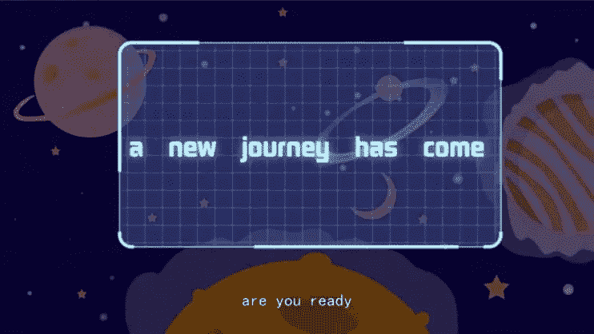

# 元宇宙矿工:什么是元宇宙矿工，我能开采元宇宙吗？

> 原文：<https://medium.com/coinmonks/metaverse-miner-what-is-metaverse-miner-and-can-i-mine-metaverse-a9622ccbc209?source=collection_archive---------10----------------------->

> 元宇宙矿工游戏让你有机会用你的普通电脑挖掘加密令牌。

目前，有大量的元宇宙游戏。

然而，它们大多缺乏固有的循环经济。这意味着这些游戏玩家的利润主要依赖于新的外部玩家的流入。

流入量的下降会造成玩家的经济损失，最终导致大量用户的流失。自然，这也会对游戏不利。为了解决这个问题，**元宇宙矿工**应运而生。所以，让我们来了解一下吧！

# 什么是元宇宙矿工？

元宇宙矿工是 BEP20 区块链上的一款 GameFi+NFT 即玩即赚游戏。这款以太空为主题的游戏将玩家带到更广泛的陌生星系，挖掘并获得各种原始能量(META)。

游戏生态系统由三种资产构成:

*   **$元代币:**$元代币是生态系统的支付和权益代币，最高供应量只有 2100 万。此外，元将用于社区治理，以及发展新的元宇宙矿工生态系统的价值。
*   **矿工 NFT:** 矿工 NFT 相当于采矿钻塔，需要采矿获得$META。拥有矿工 NFT 的玩家可以将他的矿工 NFT 放在任何未满的 NFT 星球上。矿工 NFT 消耗一定量的“能量值”参与采矿。当“能量值”降至 0 时，矿工 NFT 将不再产生$元令牌奖励。
*   NFT 星球:NFT 星球是生态系统中极为罕见的核心资产。采矿在 NFT 星球进行。NFT 行星的持有者不仅从出售矿工中获得收入，还获得一部分采矿作业费和矿工 NFT 持有者支付的一部分采矿产出。

元宇宙矿工是一个基于“双循环”经济模型的非常简单的游戏。

与其他游戏不同，在这里，NFTs 可以用来生成游戏内令牌$META。从而实现“一次性投入，持续受益”。

这意味着，如果你在 NFT 进行一次性投资，你将通过采矿持续获得收益(元)。

这是元宇宙矿工游戏的核心价值。

[***了解更多币安...***](https://accounts.binance.com/en/register?ref=75826706)

# 我能开采元宇宙吗？

是的，元宇宙矿工游戏的全部目的就是从元宇宙的不同星球的 NFT 中挖掘$元代币。要开采$META，玩家需要将矿工 NFT 放置在 NFT 星球上并进行开采。

然而，矿工 NFT 和行星 NFT 就是不给玩家。

你必须在 NFT 拍卖会上购买。

以下是关于如何在元宇宙挖掘$META 令牌的详细指南:

# 第一步:成为明星大师或明星领主

**成为星主:**在 NFT 星球的拍卖中，你可以获得整个星球的领土，成为星主。

之后，你会得到一定数量的来自这个星球的矿工 NFT，同时，NFT 星球会继续产生矿工 NFT。

星球 NFT 是有限的。此外，能够首先拍卖 NFT 的用户将最有机会首先进入该领域！

**成为星主:**如果不拍卖 NFT 星球，只能从 NFT 星球得到矿工 NFT 或者在二级市场交易。

# 第二步:桩矿工 NFT 收集能源

用户将矿工 NFT 押到星球后，终端控制器会被放置在原来的星球上持续获得$META。

玩家拥有的矿工 NFT 开采的$META 的 5%归星际大师(星球所有者)所有，95%归矿工 NFT 所有者所有。

瞧啊。事情就是这样做的。

不可否认的是，这个新的游戏赚钱的元宇宙是完全有趣的一个全新的经济模式。

这款游戏让玩家可以下注他们的 NFT，并从游戏中获得游戏内代币。

此外，您不需要高端 PC 来挖掘这里的令牌。此外，请回来查看元宇宙矿工游戏的更多更新！

***阅读更多:*** [***我在 Exynox 黄牛***](https://www.digistore24.com/redir/357303/mctria/) 拿到了 1200 美金/天

> 加入 Coinmonks [电报频道](https://t.me/coincodecap)和 [Youtube 频道](https://www.youtube.com/c/coinmonks/videos)了解加密交易和投资

# 另外，阅读

*   [南非的加密交易所](https://coincodecap.com/crypto-exchanges-in-south-africa) | [BitMEX 加密信号](https://coincodecap.com/bitmex-crypto-signals)
*   [MoonXBT 副本交易](https://coincodecap.com/moonxbt-copy-trading) | [阿联酋的加密钱包](https://coincodecap.com/crypto-wallets-in-uae)
*   [雷米塔诺审查](https://coincodecap.com/remitano-review)|[1 英寸协议指南](https://coincodecap.com/1inch)
*   [iTop VPN 审查](https://coincodecap.com/itop-vpn-review) | [曼陀罗交易所审查](https://coincodecap.com/mandala-exchange-review)
*   [40 个最佳电报频道](https://coincodecap.com/best-telegram-channels) | [喜美元评论](https://coincodecap.com/hi-dollar-review)
*   [折叠 App 审核](https://coincodecap.com/fold-app-review) | [StealthEX 审核](/coinmonks/stealthex-review-396c67309988) | [Stormgain 审核](https://coincodecap.com/stormgain-review)