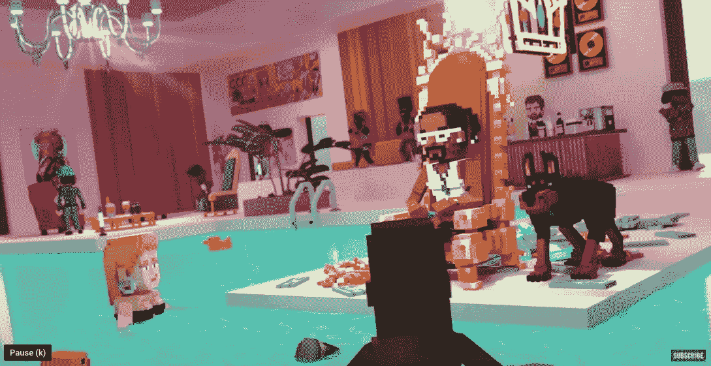
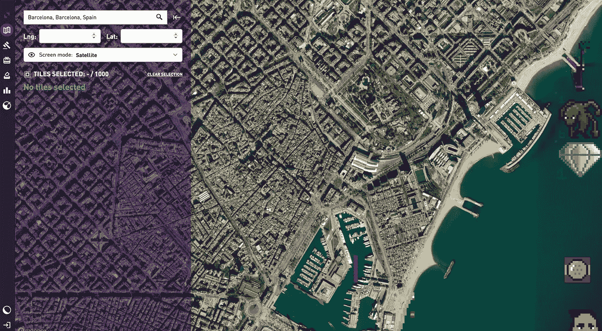

# 元宇宙，混合现实和商业的未来

> 原文：<https://medium.com/coinmonks/metaverse-mixed-reality-and-the-future-of-commerce-bfa33f8f9337?source=collection_archive---------15----------------------->

人们很难避免谈论 NFT 热(可能正在消退)和元宇宙，不仅是在密码圈，甚至是主流媒体。然而，我从许多人那里听到的，特别是在非游戏玩家中，是未来不在元宇宙，因为大多数人不打算购买 VR 头戴设备，花时间在虚拟世界中射击外星人。

这种二元思维是合理的，因为大多数人看到的元宇宙的唯一形象是最类似于 Roblox 和其他纯游戏服务的东西。然而，这种对元宇宙是什么或可能是什么的“懒惰”解释，忽略了更大的图景。几十年来，技术已经成为我们社会越来越重要的一部分。虽然像增强和虚拟现实这样的工具已经存在很长时间了，但它们现在才开始跨越鸿沟。

当然，Covid 加速了更多的远程工作和视频会议工具的使用。

对许多人来说越来越明显的是，工作和商业的未来将转移到虚拟和现实世界的混合模式。

[我喜欢 Kate Mitselmakher](https://www.geekwire.com/2021/we-asked-seven-venture-capitalists-if-the-metaverse-is-the-next-big-thing-or-just-a-lot-of-hype/) 的回答，她是来自西雅图的 Bloccelerate VC 的 GP，当被要求描述元宇宙的未来时:

> 在目前的形式下，元宇宙将主要限于数字原生对象——游戏资产或数字艺术。从长远来看，元宇宙将类似于现实世界的数字孪生兄弟，其中大多数物理对象——从房地产到商品——将在元宇宙拥有数字表示和独特的自我主权身份，最有可能驻留在区块链。最终，数字和物理世界将融合成一个可互操作的生态系统，由人工智能、VR/AR、智能合同、NFTs、DeFi、DAOs 和其他创新提供支持。
> 
> 随着大多数经济活动将迁移到元宇宙，我们今天所知的旧经济将不复存在。旧经济将转变为新元宇宙经济——有自己的规则、自己的货币和自己的治理。

**从元宇宙博彩到娱乐**

不要再看沙盒中发生的事情，沙盒是顶级领先的元宇宙平台之一。由于 True Global Ventures 领导了我们最近的一轮融资，并且是沙盒的早期投资者，我最近有幸获得了他们最新一季的 alpha 版本。虽然我不是游戏玩家，但沙盒是元宇宙的主要玩家之一，并开始进入非游戏玩家社区。

史努比狗狗把沙箱当成了他的新虚拟家。他购买虚拟土地，将邻近的土地卖给出价最高的人，并开始在沙盒内外推广他的真实音乐。他甚至刚刚发布了一首新歌和音乐视频《我建造的房子》,在沙盒中设计。

[House I Built, Snoop Dogg](https://www.youtube.com/watch?v=AzwLybCKlzc)

虽然这是一种可以在元宇宙大量消费的娱乐，但这是一个真实世界的艺术家利用元宇宙来扩展他的品牌并到达元宇宙内部。这可以反过来提高他的 IRL(现实生活)收入，也可以吸引人们购买更多现实世界的商品或增加对实体音乐会门票的需求(这些音乐会可以在元宇宙同时播放)。

**从元宇宙到混合现实**

鞋类公司很早就进入了元宇宙，希望更多地关注混合现实商业模式。耐克建立了自己的元宇宙商店，并声称自 2021 年底推出以来，已经接待了超过 700 万游客。耐克收购了一家设计工作室 RTFKT，使元宇宙的人们能够为他们的虚拟形象获得真实耐克鞋的数字版本。然后，人们可以看到其他人的头像，上面有他们喜欢的鞋子设计，点击它可以了解更多信息，甚至可以通过他们头像的 NFT，还可以获得相同鞋子的真实实物版本，供他们在现实生活中使用。

RTFKT designed Nike shoe for a16z

许多传统的实体和网络公司正在元宇宙建立虚拟商店。今年 2 月，摩根大通成为第一家进入元宇宙的大银行。2021 年，超过[5 亿美元用于购买元宇宙的虚拟房地产。这显然没有被现实生活中寻求现金的房地产机构忽视，不仅是对虚拟土地买家，也对元宇宙的真实世界房地产买家。](https://www.cnbc.com/2022/02/01/metaverse-real-estate-sales-top-500-million-metametric-solutions-says.html)

**下一个地球:为混合现实打造的元宇宙？**

到目前为止，我已经命名了两个最大的元宇宙项目，沙盒和分散的土地。但是，更多的挑战已经出现，其中一个似乎已经成熟，可以实现未来的混合现实愿景的是下一个地球。与在与地球分离的虚拟世界中出售土地相反，Next Earth 通过地球的卫星图像出售虚拟土地。

Buying virtual land in The Next Earth (Barcelona)

作为基于真实地球的主要当前元宇宙，我相信他们能够在实现混合现实商业模式中发挥重要作用。想买你的房子，你的酒店或你最喜欢的旅游景点的虚拟版本吗？那是应该去的地方。酒店运营商可以提供真实酒店的沉浸式体验，允许用户查看房间等。并在元宇宙预定它们以备后用。

查看您希望购买的 IRL 音乐会或游戏门票的视图？你也可以这样做。或者当然可能只是虚拟地实时观看。或者两者都有。获得在元宇宙购买的 NFT 作为门票和座位所有权的证明，并获得亲自出席和私人访问在元宇宙观看的演出后台录像的好处。

“下一个地球”并不羞于表达其成为此类商业活动平台的雄心。在其网站的“平台即服务”部分，他们声明:

> 无论你希望在元宇宙建立什么——一种生活方式，一种投资工具，一个企业，甚至一个行业——Next Earth 都是你需要的一体化平台。

我相信这种 IRL 和元宇宙的无缝融合将在这十年成为主流，大多数老牌品牌将寻求进入元宇宙的方式来获得新客户，并提供独特的混合用户体验。例如，我最近[与 Phocuswire](https://www.phocuswire.com/Iomob-on-blockchain-NFT-evolution-travel) 谈论了如何将世界交通生态系统的数字双胞胎带到元宇宙，让人们在元宇宙预订之前沉浸式地探索他们的旅程，但体验 IRL。

元宇宙的未来是光明的。摩根大通[最近预测元宇宙的年收入将达到 1 万亿美元。](https://www.jpmorgan.com/content/dam/jpm/treasury-services/documents/opportunities-in-the-metaverse.pdf)

**关于作者**

*Boyd Cohen 是 Iomob 的首席执行官和联合创始人，Iomob 是一个面向企业的全球按需移动平台。自 2001 年在科罗拉多大学获得战略和创业博士学位以来，他在过去的二十年里致力于加速实现低碳可持续经济。这包括出版了 3 本书，多篇同行评审的文章，经常为 Fast Company 投稿，并在智能城市和可持续发展领域创办了一些企业。在 Iomob，Boyd 领导着一支不断壮大的移动和技术专家团队，为企业部署了世界上第一个分散式移动按需平台。早期客户遍布欧洲、亚洲和北美等多个大洲。*

> 加入 Coinmonks [电报频道](https://t.me/coincodecap)和 [Youtube 频道](https://www.youtube.com/c/coinmonks/videos)了解加密交易和投资

# 另外，阅读

*   [币安期货交易](https://coincodecap.com/binance-futures-trading)|[3 commas vs Mudrex vs eToro](https://coincodecap.com/mudrex-3commas-etoro)
*   [如何购买 Monero](https://coincodecap.com/buy-monero) | [IDEX 评论](https://coincodecap.com/idex-review) | [BitKan 交易机器人](https://coincodecap.com/bitkan-trading-bot)
*   [尤霍德勒 vs 科恩洛 vs 霍德诺特](/coinmonks/youhodler-vs-coinloan-vs-hodlnaut-b1050acde55a) | [Cryptohopper vs 哈斯博特](https://coincodecap.com/cryptohopper-vs-haasbot)
*   [顶级付费加密货币和区块链课程](https://coincodecap.com/blockchain-courses)
*   [MXC 交易所评论](/coinmonks/mxc-exchange-review-3af0ec1cba8c) | [Pionex vs 币安](https://coincodecap.com/pionex-vs-binance) | [Pionex 套利机器人](https://coincodecap.com/pionex-arbitrage-bot)
*   [如何在印度购买比特币？](/coinmonks/buy-bitcoin-in-india-feb50ddfef94) | [瓦济克斯审查](/coinmonks/wazirx-review-5c811b074f5b)