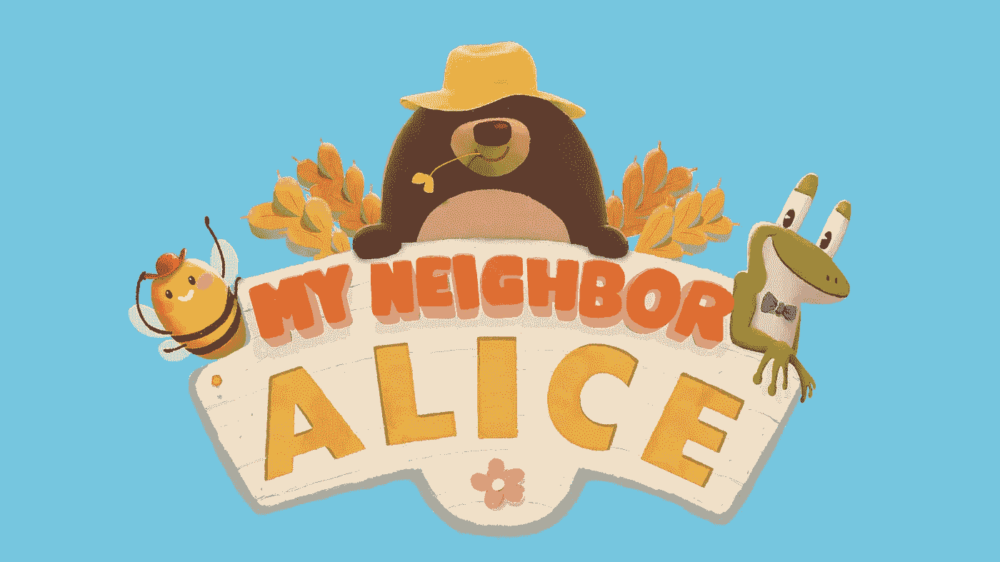
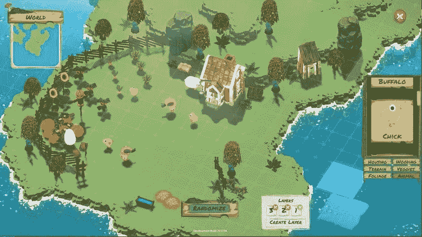
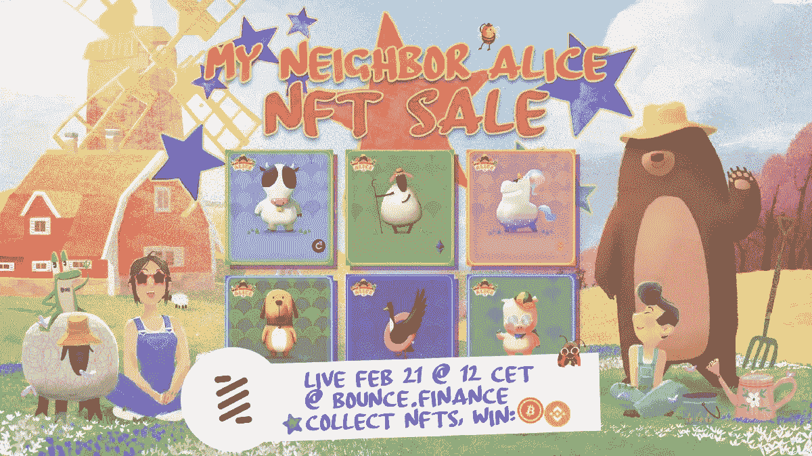
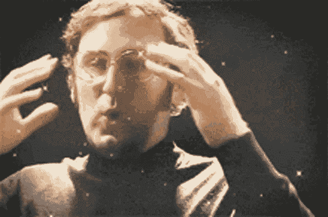

# 与元宇宙相关的硬币——爱丽丝

> 原文：<https://medium.com/coinmonks/metaverse-related-coin-alice-6f03f8f70332?source=collection_archive---------33----------------------->

你好！

今天，我将向你介绍“爱丽丝硬币”，一个巨大的硬币元宇宙，它可以让你在虚拟世界中建造自己的土地，并与你的邻居互动。​

如果你对硬币和元宇宙的联系感到好奇，

*我们开始吧！*

## 爱丽丝硬币

可能会有人疑惑，“爱丽丝币？那是什么？”

from MyNeighborAlice.com

不是大家熟悉的比特币或者以太坊之类的币。

爱丽丝币是游戏中使用的一种代币，用于在虚拟世界中建造自己的土地，与邻居互动，获得奖励。

*我怎么能用硬币玩游戏？硬币不就是用来交易的吗？你可能会这样想，但是爱丽丝·柯恩通过元宇宙完成了一件困难的事情！*

GIF from Giphy

除了创新的硬币用法，爱丽丝硬币吸引了更多的关注，因为它是一种结合了迪菲和 NFT 的硬币。

爱丽丝，这枚令人惊叹的硬币，预计发行 1 亿枚，但目前发行量仅为 1740 万枚😢

*(300 万枚通过币安发射池发行，但明显少于其他硬币。)*

但不管怎样，发行总量是固定的，所以现在投资也许更好……？

## 我的邻居爱丽丝

from My Neighbor Alice Medium

还记得我们关于元宇宙的帖子吗？ ↓

[https://coin monster . medium . com/元宇宙是什么-7e9029c1a3ff](https://coinmonster.medium.com/what-is-the-metaverse-7e9029c1a3ff)

元诗句有很多种，其中爱丽丝币属于“虚拟世界”。

在虚拟世界中，你可以制造土地，并与一个创造土地的匿名人成为邻居。而且，如果有土地，岂不是就有村庄了？

By Contributor from Phemex

在虚拟世界中，您可以进行各种活动，例如建立村庄、建造建筑物以及收集用于建筑物管理或居民管理的物品。

除了从物品收集中获得令牌，爱丽丝币还为收集和交易 NFT 的玩家创建了一个生态系统。

事实上，2021 年 2 月，爱丽丝在币安智能连锁商店将村里的农场动物卖给了 NFT 拍卖行，赚了 7 亿多韩元。

from My Neighbor Alice Medium

## 现实生活中的游戏内代币？

爱丽丝币的最大优势是 NFT 所有权使用元宇宙。

我在游戏中创造的土地实际上变成了我的 NFT，同时可以交易。可以通过各种服务赚取佣金，这样就可以玩游戏赚钱了。那是一举两得！

GIF from Tenor

同样，这是一种允许通过使用元宇宙硬币进行交易和拥有 NFT 的硬币！​

与其他元宇宙游戏相比,《我的邻居》( MyNeighborAlice)非常容易上手，我认为这是一个平台，即使是那些刚刚开始使用硬币的人也可以毫无负担地投资。

> 我们学习了爱丽丝，元宇宙硬币。怎么样？
> 
> 如果你有更多的问题或想获得硬币相关的信息，请随时来和我们下面的社区交谈。:)
> 
> 推特:[https://twitter.com/el_coinmonster](https://twitter.com/el_coinmonster)
> 
> 然后，下一个故事再见！

> 加入 Coinmonks [电报频道](https://t.me/coincodecap)和 [Youtube 频道](https://www.youtube.com/c/coinmonks/videos)了解加密交易和投资

# 另外，阅读

*   [OKEx vs KuCoin](https://coincodecap.com/okex-kucoin) | [摄氏替代品](https://coincodecap.com/celsius-alternatives) | [如何购买 VeChain](https://coincodecap.com/buy-vechain)
*   [币安期货交易](https://coincodecap.com/binance-futures-trading)|[3 comas vs Mudrex vs eToro](https://coincodecap.com/mudrex-3commas-etoro)
*   [如何购买 Monero](https://coincodecap.com/buy-monero) | [IDEX 评论](https://coincodecap.com/idex-review) | [BitKan 交易机器人](https://coincodecap.com/bitkan-trading-bot)
*   [CoinDCX 评论](/coinmonks/coindcx-review-8444db3621a2) | [加密保证金交易交易所](https://coincodecap.com/crypto-margin-trading-exchanges)
*   [红狗赌场评论](https://coincodecap.com/red-dog-casino-review) | [Swyftx 评论](https://coincodecap.com/swyftx-review) | [CoinGate 评论](https://coincodecap.com/coingate-review)