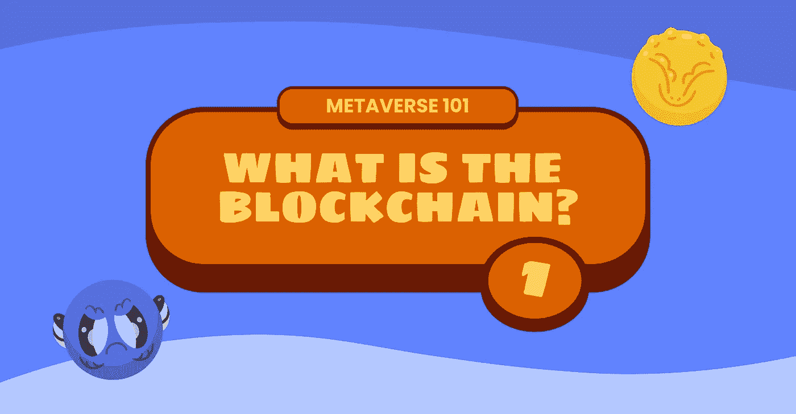
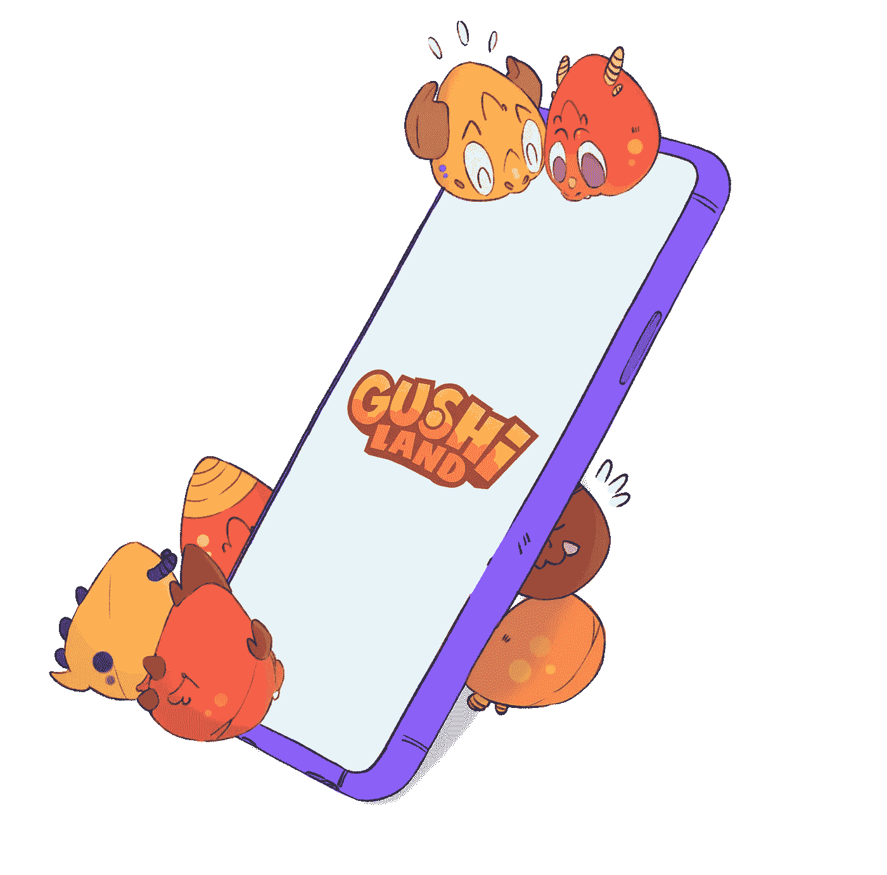

# 什么是区块链？元宇宙 101

> 原文：<https://medium.com/coinmonks/metaverse101-what-is-the-blockchain-f263193dbec?source=collection_archive---------41----------------------->

《孤岛惊魂》是一个以区块链为基础的游戏项目，这是一项创新技术，其操作可能看起来很复杂。然而，我们的目的是确保我们的整个社区了解它所包含的潜力。

 [## Gushi land——algrand 上第一个从玩到建的游戏生态系统

### 元宇宙最疯狂的游乐园即将开放，为休闲游戏玩家提供新的游戏体验…

medium.com](/@gushiland/gushiland-the-first-play-to-build-gaming-ecosystem-on-algorand-6ce0f6ee14b2) 

区块链是一种允许在不需要第三方中介的情况下处理交易的技术。它是一个开放的分布式分类账，能够以一种**高效、可验证和永久的方式**记录双方之间的交易。一串按时间顺序排列的信息块。

区块链经常与比特币等加密货币联系在一起，但它有**许多其他与加密货币世界无关的应用**。例如，它在医疗领域用于归档病历或安全管理一些政府选举的数据。

**区块链是价值互联网世界的一部分。**该定义用于表示数字连接节点(计算机、智能手机、打印机等)的网络。)通过**算法和密码规则系统**进行通信。该系统允许您验证(以自由和共享的方式，无需控制实体)对跟踪唯一数字资产转移的**分布式寄存器**所做的更改。

# **它是如何工作的？**

区块链是一种可用于存储任何类型数据的技术，如交易、合同或数字资产。我们可以把它定义为**一个不断增长的分布式数据库**，一种由信息块组成的链。这个链中的每个块都包含已注册的事务和数据串(称为“记录”)的数据。

每个事务在加入链中的新块之前必须由网络的所有成员验证。验证完成后，每个成员的工作都会得到加密令牌的奖励。

区块链为**提供了一种极其安全的方式**在没有集中控制的情况下创建数字记录。为了更好地理解这种操作，了解每个块中包含的三个关键元素非常重要:

*   **您的散列码:**散列码是数据的字母数字表示。数据块的哈希是唯一的，如果与该数据块相关的任何数据发生变化，哈希也会发生变化。
*   **链中位于其之前的块的散列码:**该散列用作保持块线性时间顺序的参考。如果每个块引用它前面的块的唯一散列，则链保持不变。此外，如果块中的信息发生变化，哈希也会发生变化。
*   **一个时间戳:**这个时间戳指定了块被创建的时刻，并帮助维护链的时间顺序。

这三个元素结合起来确保了区块链的块不能被改变，因此是不可变的。如果有人试图修改数据块，他们也会更改该数据块的哈希和时间戳。结果，链中的下一个块将不再包括它前面的块的散列，这使得区块链被篡改的情况立即变得明显。

# **安全吗？**

区块链的优势恰恰在于它的**安全性和透明性。在里面，一个不可变的和不可移动的记录被保存，用于在其上执行的每一个交易。添加到链中的每个数据块都会加强前面的数据块。这意味着**不可能丢失**数据，因为即使其中一个数据块丢失，其他数据块也能够根据它们包含的信息重建它。**

此外，网络内多个节点的使用允许区块链上控制权的分散化。这个特性使得恶意的人不可能进行任何形式的篡改。

# 优势

区块链的使用带来了众多优势，使其成为一种适用于多种用途的技术:

*   **数据安全性:**区块链是不可变的，这意味着它不能被黑客攻击或篡改。
*   **透明:**任何人都可以看到进行了哪些交易。
*   **分发:**区块链是分布式的，这意味着它在世界上成千上万的计算机上被复制，而不是存储在一个单一的位置。
*   **匿名:**不需要提供姓名或个人信息就可以使用。
*   **精度:**大部分操作由计算机完成。这使得技术更加精确，最大限度地减少了人为干预。

# **区块链使用中的疑点**

作为一项新技术，它不可避免地会引起不了解它的人的不确定性。特别是，对它的功能有一些相当普遍的怀疑:

*   **非法活动:**保持交易的匿名性和完全安全性的可能性表明，区块链可以支持非法活动。
*   **成本和时间:**在某些类型的区块链中，交易处理的维护成本可能非常高，而且随着用户的大幅增加，每笔交易的处理时间带来的不便可能会增加。
*   **环境可持续性:**许多区块链仍在工作证明阶段工作，这意味着要执行的每一项交易都需要大量的计算能力。这导致了大量的电力浪费。

但是，这个领域有保证安全可靠的技术。 **Gushiland 将使用 Algorand 网络**，新一代区块链，它保持了其他区块链的所有优势，但减少了时间、成本和环境资源的浪费。除此之外，从明年开始，Algorand 正在努力成为*“碳负”*，这一品质使其成为目前存在的最安全和最生态的替代品之一。

总之，不可避免地要认识到**今天的区块链在许多领域代表着一种革命性和有用的技术**，不仅仅是在加密货币领域。只有时间才能揭示这项技术的进一步发展会带来什么。

我们今天能做的是观察这个系统当前的应用领域，首先是游戏和娱乐领域。

在下一篇文章中，我们将更详细地介绍这些应用领域，同时也将具体分析什么是不可替换的令牌(NFT)。

# 关于古士兰

古士兰是元宇宙最疯狂的游乐园，是阿尔格兰德[上一种新的区块链游戏体验。从玩到建的生态系统中的策略、动作和乐趣对于休闲游戏玩家和专业玩家来说都是可行且有利可图的。在我们的](https://medium.com/u/bb4a269b69c3?source=post_page-----6ce0f6ee14b2--------------------------------)[第一个故事](/@gushiland/gushiland-the-first-play-to-build-gaming-ecosystem-on-algorand-6ce0f6ee14b2)中发现更多。

我们才刚刚开始。加入我们的部落，第一个听到令人兴奋的消息和发展。

你可以在 [Discord](https://discord.gg/68Tu6k7MHr) 、 [Twitter](https://twitter.com/gushi_land) 和 [Instagram](https://www.instagram.com/gushi.land/) 上找到我们。