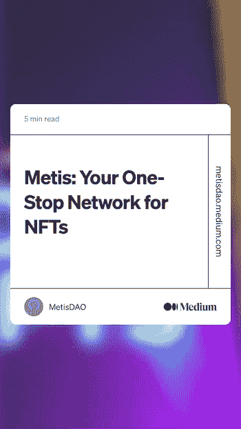
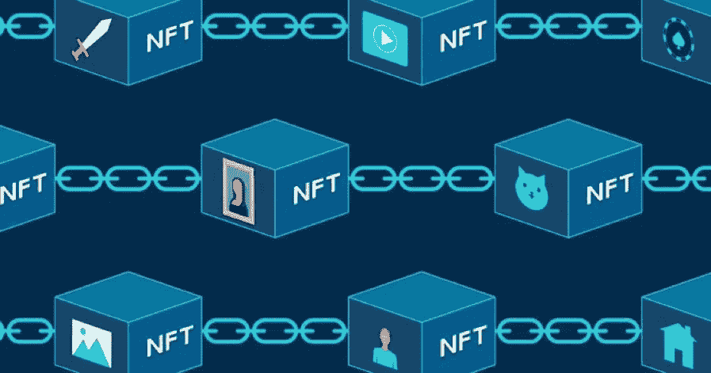
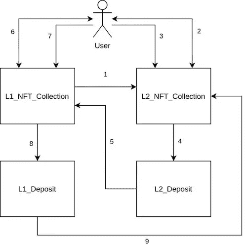
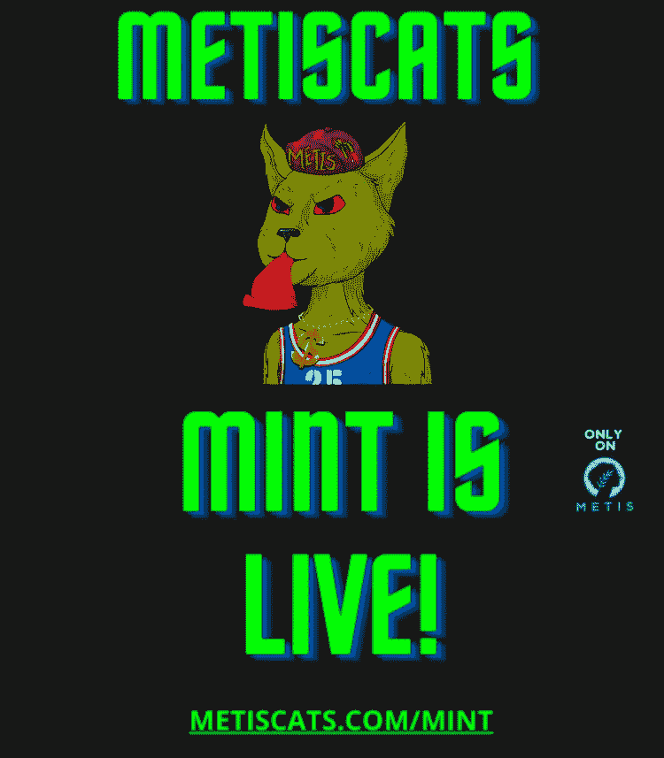

# 梅蒂斯 NFT 枢纽:是时候“超速行驶”了

> 原文：<https://medium.com/coinmonks/metis-nft-hub-time-for-overdrive-2af2577164d2?source=collection_archive---------65----------------------->

Metis NFT Hub on Medium

# 梅蒂斯 NFT 枢纽

如果你还没有听说过 MetisDAO，现在是时候了📢

[$METIS](https://www.metis.io/) 是一个 L2，旨在通过构建下一代工具和基础设施来支撑整个 Web3 生态系统，从而解决$ETH 的可扩展性问题。他们今天刚刚发布了他们最大的工具之一——梅蒂斯 NFT 中心。

今天 Web3 最大的问题之一是互操作性。这意味着链和层不能相互作用，这对网络 3 经济是有害的。在今天之前，$ ETH NFTs 是跨层分割的，这意味着它们被粘在它们被铸造的层上。

NFTs segmented on separate blockchains

进来的是$梅蒂斯👷‍♀️🛠️

Metis 集成经理 Pavel Sinelnikov 借鉴 [Vitalik 最初的“包装的 NFTs”](https://ethresear.ch/t/cross-rollup-nft-wrapper-and-migration-ideas/10507)的想法，开发了一个模型，$METIS 开发团队花了几个月的时间来建造今天的 [Metis NFT 枢纽](https://ethresear.ch/t/bridging-nfts-across-layers/10799)，这是 L1 和 L2 之间的一座 NFT 大桥🌉

现在，NFT 用户可以在$ETH ⛽️逃避难以忍受的“燃气战争”,并在$METIS 上铸造他们的 NFT，只需花费一小部分费用！💸然后，当他们选择时，他们可以将他们的非关税壁垒转移回 L1(尽管我认为 NFT 的活动在未来仍将保持在 METIS)

到目前为止，你一次只能桥接一个 NFT，但是团队正在努力工作，以允许一次桥接多个 NFT🙀该团队还在努力工作，以发布一个本地数据存储层，这样像 NFT 桥接这样的交易将只需花费美分！！！🥳

哦，我有没有提到这也适用于 L2 到 L2😱🤝

## NFT 社区，欢迎来到互操作 NFTs 的新时代。

不再有资产孤岛🎁

从 L1 到 L2 只需要几分钟，但从 L2 到 L1 需要 7 天。Metis 团队正在努力尽快缩短等待时间👷‍♀️🛠️

# 梅蒂斯 NFT 生态系统

现在$METIS NFT 正处于萌芽阶段，新的项目不断出现。NFT 社区每天都在增长，用户开始看到仙女座网络无与伦比的力量。我目前感兴趣的一些项目是@ MetisCats

你可以从@CryptoKaduna 的这个伟大的帖子中了解关于梅蒂斯猫项目[的一切](https://twitter.com/CryptoKaduna/status/1505967062669266950?s=20&t=hrNPU6y2oq9vX7lnuCL2SQ)

其他落在$METIS 上的伟大项目是@ [StarLedgerNFT](https://www.starledger.org/) 他们正在建造一个银河元宇宙！@ [BinaryDAO_fi](https://binarydao.finance/) 是另一个伟大的 NFT 项目，从他们的收益率令牌提供增加的 APY！🤑💰

现在，在这个全新的 NFT 市场上，你在哪里可以找到这些非功能性食物呢？🤔

## 梅蒂斯 NFT 市场

你可以从@ [tofuNFT](https://tofunft.com/metis) 、@ [MetisMarket](https://www.metis.market/) 和 [@Andromeda Station](https://andromedastation.io/) 上的$METIS eco 中找到这些和更多的内容，这些内容将由@ [AndromedaToadz](https://andromedatoadz.xyz/) 在未来发布。这不是$METIS 上所有项目的完整列表——它每天都在增长！🤯

早点进来！⏳

我会尽我所能更新$梅蒂斯 NFT 生态车，因为它在加速行驶！🚀🚀🚀

## 离别礼物🎁

我将为您留下一些很好的资源来了解$METIS 在 NFTs 方面的发展方向

1.  [NFTs 已解释](https://www.youtube.com/watch?v=obJMjAFScwY)
2.  [Metis 将如何改变 NFT 的景观](https://www.youtube.com/watch?v=bZsKSwnqg6o)
3.  [具有 Metis 的非关税壁垒的未来](https://www.youtube.com/watch?v=V9VVuvMZoSY)

> 加入 Coinmonks [电报频道](https://t.me/coincodecap)和 [Youtube 频道](https://www.youtube.com/c/coinmonks/videos)了解加密交易和投资

# 另外，阅读

*   [如何在 Bitbns 上购买柴犬(SHIB)币？](https://coincodecap.com/buy-shiba-bitbns)
*   [最佳加密分析或链上数据](https://coincodecap.com/blockchain-analytics) | [Bexplus 评论](https://coincodecap.com/bexplus-review)
*   [NFT 十大市场造币集锦](https://coincodecap.com/nft-marketplaces)
*   [iTop VPN 审查](https://coincodecap.com/itop-vpn-review) | [曼陀罗交易所审查](https://coincodecap.com/mandala-exchange-review)
*   [最佳期货交易信号](https://coincodecap.com/futures-trading-signals) | [期交所评论](https://coincodecap.com/liquid-exchange-review)