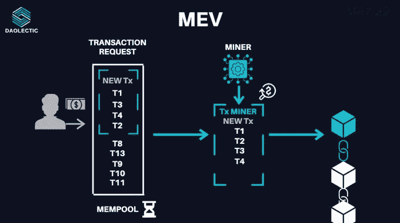

# MEV:森林有多黑？

> 原文：<https://medium.com/coinmonks/mev-how-dark-is-the-forest-74bcc40d185d?source=collection_archive---------8----------------------->

TLDR:

*   **MEV** 是矿工通过对一个区块中的交易进行排序而提取的**值。**
*   DeFi 的智能合同系统提供了几个**收入流**，利用了**的低效率**。
*   **套利**是最常见的**链上机会发挥作用的**方式。
*   对于矿工来说，使用 **Flashbots 减少了负外部性**，同时也**产生了更多的收入**。

# MEV

首字母缩写 MEV 代表 ***Miner*** 或 ***最大可提取价值。***

它衡量一个矿商通过任意包含、排除或重新排序区块内的交易可能获得的利润。矿工必须能够优先处理事务，以防止垃圾邮件和拒绝服务攻击的无权限区块链。

内存池概念是理解矿工活动的基础。

**内存池**

[mempool](https://mempool.space/it/) 是包含*未确认交易*的电子文件。每个区块代表有限的数量。**矿工**有**完全的自主权**来选择哪个未决事务将被包括在块中。一旦选择，交易将存储在分类帐广播的新块&中。

矿商选择收费最高的交易，实现利润最大化。

这促使他们去寻找其他可能给他们带来更多钱的途径。

然而，他们并不孤单:机器人扫描内存池，将其事务放在用户事务的前面或后面，以提取价值。

想想有人在你之前买了代币。

同样的可以卖更高的价钱给你！

为了减轻主链的影响，一个 MEV 研究小组创造了 Flashbots。

**flash bot**

通常，矿工通过以太坊公共 mempool 竞标 MEV。

通过 Flashbots，研究团队创建了一个开放的通信渠道，使拍卖和 MEV 投标可以在私有内存池中进行。

搜索者是这一过程中的重要参与者:他们利用 DeFi 市场中的信息不对称。由于激烈的搜索竞争，矿商可能会选择支付最高的 tx 包。搜索者向矿商支付高额的交易费来执行捆绑销售。

在这一点上，搜索者:

*   直接向矿商出价购买区块空间，由矿商分析报价。
*   将汽油费用降至最低，以获得最大的 MEV 回报
*   在不减少 MEV 结果的情况下，为块空间出价更多。

像 MEV 这样的矿工激励是多样化的，这是非常重要的。如果一个矿工有一个循环的优势来获得奖励，它可能会成为主要的区块生成器，产生弱点。

如果 MEV 提取没有民主化，获利回吐可能会集中财富分配和积累。

Flashbots 拍卖通过让搜索者和矿工获得利润而使 MEV 民主化。该频道还创建了行为准则，以保护搜索者免受矿工的攻击，这些矿工在跟踪搜索者的活动后试图执行他们的交易。

# 连锁机会

普华永道在他们关于加密对冲基金的报告中详细介绍了像套利这样的链上交易。

此外，散户对链上利润的认识也在提高。

套利和清算是可以通过链上低效和差异与 MEV 联系起来的技术。

> **套利:**

投资者利用[套利](https://twitter.com/hnt_guy/status/1529648237157621761)来:

*   在一个交易所购买货币
*   迅速在另一个网站上卖出更高的价格。

跨平台套利技术可能使用同步或延迟交易。使用同步交易，用户必须在所有交易所都有余额才能交易。这种方法最大限度地降低了价格风险，同时保持了敞口。

*如何在 dex 中发现套利的可能性？*

*   在 mempool 中搜索价格变动的大订单。
*   确定能产生最高利润的交易规模，领先对手一个街区。

在下面的[示例中，用户在 UniSwap v2 上将 USDC 换成十六进制，然后通过 UniSwap v3 将十六进制换成 USDC。结果，用户通过利用价格差异赚了将近 8k 美元。](https://etherscan.io/tx/0x1aab0e28f18397e76ce098509e89bc5570cd73e775e32a2ddcfa02468cd8928f)

> 清算

[清算](https://twitter.com/WClementeIII/status/1490704458589908997)发生在交易者**无法履行杠杆头寸规格**时，没有足够的资金来维持交易。

大多数贷款协议都涉及**超额抵押**。用户的抵押品必须比其贷款价值更高。当抵押品价值低于特定水平时，保管人可能会偿还债务并获得抵押品的减少。

由于部分或全部损失，交易所关闭交易者的杠杆头寸。Oracles 扮演着重要的角色，因为它们提供价格更新。

[下面是一个典型的清算案例](https://etherscan.io/tx/0xdc96931df69d2de99ace4d34e8bf836a5c33f944c38776f4a0fa7bd35bf4a1fc):某 bot 向 AAVE v2 偿还 135k USDC，换取 11k 链接。这个机器人以 159 ETH 价格出售了这些链接，自己拿走了 12 ETH。

# MEV: $$$情况点

以太坊的 DeFi 市场受到套利、清算和高频交易的毒害。随着 DeFi 交易量的增长，这些交易变得更有价值。

**根据**[**flash bots**](https://explore.flashbots.net)**，自 2020 年 1 月 1 日起，MEV 利润值估计为 6.35 亿美元。**

根据他们的见解，**套利**是使用的主要方法，收集了所有事件(交易)的 **99%** 。套利机会总是存在，而**平仓**机会**在**价格下跌或做空时**出现。**

另一方面，提取的 MEV 利润由**搜索者**和**采矿者**平分，前者拿走 64%(**【4 . 05 亿美元**)，后者拿走剩余的 36%(**【2 . 3 亿美元**)。

> 合并对 MEV 有什么影响？

以太坊将转移到股权证明，不再需要矿工。

此时，验证器、搜索器和机器人将提取 MEV。为了降低未来数据块重组的可能性，PoS 更新中包含了提议者提升。

第二层汇总是一种不断发展的网络可扩展性方法:它们批量处理事务，并且只向以太坊公共的内存池发送证明。

这降低了交易权重，以适应更多的块，并可能对搜索者和矿工隐藏 MEV 的机会。

# 链上恶意活动

针对用户执行的恶意活动的示例有**抢先运行**和**三明治攻击。**

在处理 dex 时，流动性接受者不知道执行时间和定价。订单数量在价格影响之前就已经知道了。

这个时间差允许 bot/trader 在预先宣布的购买指令之前和之后发出购买和出售指令。

通过这种方式，恶意交易者的卖出订单将以高于其买入订单的价格执行，从而产生利润。

大型验证器喜欢前置运行，因为它们可以采用后续块，更好地安排它们的事务。

一旦用户在公共内存池中发出一个事务，机器人就会扫描它，寻找可能的攻击。

如果用户交易有吸引力:

*   机器人将重放相同的执行逻辑
*   如果 tx 有利可图，机器人会将其 tx 放在前面，将资金转移到它的地址

Flashbots 的联合创始人之一斯科特·毕格罗(Scott Bigelow)制作了一个非常棒的关于抢先运营的解释性视频，可能会帮助你理解他们。

在**三明治攻击**中，机器人:

*   执行一项主要掉期交易
*   等待它完成
*   进行对销贸易。

交易者面临着重大的滑点，特别是当基础参数配置错误的时候。

[https://www.youtube.com/watch?v=Zt15wrSDVxc](https://www.youtube.com/watch?v=Zt15wrSDVxc)

# 最终考虑

所有共享的主要数据都来自 Flashbots 团队创建的庞大数据库。

如果你想更多地了解 MEV-exporter，我们推荐你看看[罗伯特·米勒](https://www.linkedin.com/in/bertcmiller/)是如何介绍他们的工作的！

关于 MEV 利弊的辩论已经广泛展开:虽然**三明治** **攻击以交易者为代价创造收益**，**套利提高了市场效率和流动性**。然而，**矿工在组织交易**中的权限**有助于避免垃圾信息**。

Flashbots 团队开发了第一个面向优化 MEV 问题的工具。这可以帮助用户在降低费用的同时防止垃圾交易。将大多数搜索者的出价移出链外降低了以太坊内存池的拥塞，并建立了一个**集中式 MEV 看门人。**