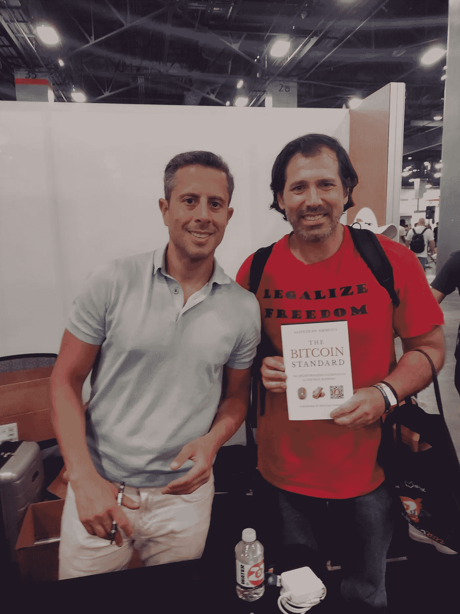

# 迈阿密比特币 2022 大会总结

> 原文：<https://medium.com/coinmonks/miamis-bitcoin-2022-conference-wrap-up-ab2103d1fad?source=collection_archive---------36----------------------->

对于我们中少数有幸偶然发现“奥地利经济学”的人来说，迈阿密比特币 2022 会议是一个机会，可以真正看到“奥地利经济学派”的重要思想在主流中走了多远。在我看来，这次会议最棒的两件事是:

1.  为了得到签名本，人们排起了长队，他们要看《赛弗迪安·阿摩斯》(Saifedean Ammous )的书，他的经典之作《T2》(The Bitcoin Standard:The Decentralized Alternative to Central Banking)以及他的新书《T4》(The Fiat Standard:The Debt Slavery Alternative to Human Civilization》。对比特币的兴趣促使数百万人了解它，从而无意中了解了货币和一个重要事实，即价格上涨是因为政府创造了更多的货币来资助其竞争免疫扩张的官僚机构，最终带来了社会经济混乱。如果一个岛上有 10 个人，每个人有 10 美元，那么岛上总共有 100 美元，任何东西都能卖到 150 美元吗？当然不是，即使他们凑齐了钱，也不够达到 150 美元。如果每个人都有 100 万美元，那么现在总共有 1000 万美元。是的，这些东西可以卖到 150 美元，甚至 1000 万美元。那么，要让总体价格上涨，需要发生什么呢？你显然需要更多的钱，谁创造了允许价格上涨的钱？是政府通过他们的中央银行。这个简单的教训正在让数百万人对比特币产生兴趣，它正帮助人们认识到，正是央行的“经济专家”神职人员要对价格上涨负责，并最终对社会经济秩序的大部分问题负责。预期的 25，000 多名与会者中的每一个人都知道，由于政府的货币创造，价格上涨了。但他们的好奇心最终会让他们变得更加敏锐和理智，愿意更深入地挖掘和“阅读”关于比特币的书籍，这将我们带到了塞弗迪安的经典/畅销书《比特币标准》,该书出色地将读者引向了卡尔·门格尔，以及社会科学中最重要的见解之一(如果不是最重要的话)、货币的进化，以及像语言一样，货币是自发进化而非“计划”的重要事实。这是帮助我们理解我们如何生活在这个令人难以置信的复杂的电影般的矩阵或“社会有机体”(借用赫伯特斯潘塞的聪明术语)的关键，但大众和他们的政治家仍然是稍微聪明的部落主义猿，准备使用政府力量通过 CovidMania lockdows，共产主义或部落世界战争来瘫痪和摧毁社会。我建议阅读[“卡尔·门格尔:至关重要的进化思想家和他的‘奥地利经济学派’”](https://hayekian.medium.com/carl-menger-the-vital-evolutionary-thinker-and-his-austrian-school-of-economics-b1480344e5ac)，这篇 30 分钟的文章总结了这些观点和更多内容
2.  我从会议中得到的第二个最好的东西是,“奥地利经济学”是如何占据主导地位的，以至于在一次由著名心理学家乔丹·彼得森(Jordan Peterson)参与的主题讨论中被反复提及

采访者称赞乔丹是一个好学生，同时从路德维希·冯·米塞斯学院的罗伯特·墨菲那里上了一堂精彩的“奥地利经济学”课，并推荐人们观看这一集(如下)

我应该补充一点，乔丹·彼得森(Jordan Peterson)越来越多的自由市场知识，在很大程度上是一些人幕后努力的结果，这些人意识到了“奥地利经济学”的至关重要性，并做出了巨大努力来接触他。几年前，自由党的“米塞斯核心小组”[的创始人、自由主义者迈克尔·海泽亲自给了乔丹一本罗伯特·墨菲的优秀著作《选择:合作、企业和人类行动》，这本书是米塞斯的论文](https://lpmisescaucus.com/)[《人类行动》](https://cdn.mises.org/Human%20Action_3.pdf)的摘要。罗伯特·布里德洛夫(Robert Breedlove)很快就升到了比特币世界的顶端，由于他对“奥地利经济学”的深刻理解，他再次成为了与乔丹·彼得森(Jordan Peterson)接触最多的人之一。

Breedlove 与 Lex Friedman 就货币、比特币、奥地利经济学等话题进行了长达 4 小时的讨论，精彩绝伦。

再说一次……breed love，Ammous……所有的密码领导人本质上都是发现那些远远领先于他们那个时代的人的想法的人，看起来我们可能开始迎头赶上了。是否有足够多的人赶上来，并受到激励，以某种方式推动这些想法，使其能够及时传达给有影响力的人，以防止文明的毁灭……目前看起来不太好，依我看。哈耶克在 20 多年前提到了以下方式:

> “我认为，如果政治家们不在未来 20 年内毁灭世界，这是非常可能的，我认为之后还有希望，但我们必须为这个遥远的日期而努力，我认为这不会发生。也许 20 年太短了”

> 加入 Coinmonks [电报频道](https://t.me/coincodecap)和 [Youtube 频道](https://www.youtube.com/c/coinmonks/videos)了解加密交易和投资

# 另外，阅读

*   [3 商业评论](/coinmonks/3commas-review-an-excellent-crypto-trading-bot-2020-1313a58bec92) | [Pionex 评论](https://coincodecap.com/pionex-review-exchange-with-crypto-trading-bot) | [Coinrule 评论](/coinmonks/coinrule-review-2021-a-beginner-friendly-crypto-trading-bot-daf0504848ba)
*   [莱杰 vs n rave](/coinmonks/ledger-vs-ngrave-zero-7e40f0c1d694)|[莱杰 nano s vs x](/coinmonks/ledger-nano-s-vs-x-battery-hardware-price-storage-59a6663fe3b0) | [币安评论](/coinmonks/binance-review-ee10d3bf3b6e)
*   [Bybit Exchange 审查](/coinmonks/bybit-exchange-review-dbd570019b71) | [Bityard 审查](https://coincodecap.com/bityard-reivew) | [Jet-Bot 审查](https://coincodecap.com/jet-bot-review)
*   [3 commas vs crypto hopper](/coinmonks/3commas-vs-pionex-vs-cryptohopper-best-crypto-bot-6a98d2baa203)|[赚取加密利息](/coinmonks/earn-crypto-interest-b10b810fdda3)
*   最好的比特币[硬件钱包](/coinmonks/hardware-wallets-dfa1211730c6) | [BitBox02 回顾](/coinmonks/bitbox02-review-your-swiss-bitcoin-hardware-wallet-c36c88fff29)