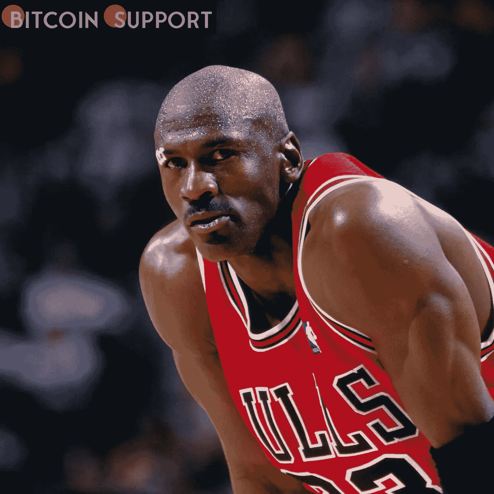

# 迈克尔·乔丹的不可替代的代币(NFT)将在 Ripple 的 XRPL 上开发

> 原文：<https://medium.com/coinmonks/michael-jordans-non-fungible-tokens-nft-to-be-developed-on-ripple-s-xrpl-617998517496?source=collection_archive---------6----------------------->

**Visit our website:-** [**https://bitcoinsupports.com/**](https://bitcoinsupports.com/)

迈克尔·乔丹的不可替代代币(NFT)将在 2022 年 Q2 的 Ripple 的 XRPL 上出售。

[https://twitter.com/Ripple/status/1512166656520372228](https://twitter.com/Ripple/status/1512166656520372228)

Ripple 的 XRPL 在创新的不可替代代币生产中的使用继续以极快的速度增长。全球最知名的区块链企业 Ripple 宣布，稀有航空媒体和 VSA 合作伙伴将在《XRP 纪事报》(XRPL)上合作创建一套独特的不可替代代币(NFT)。此次合作将创造一个独一无二的数字收藏品，记录前 NBA 巨星迈克尔·乔丹的生活和职业生涯。根据今天的公告，第一套 NFT 将于 2022 年第二季度上市，将包括一系列罕见的，不朽的，原创的 NBA 伟大的照片，以及他自己在拍照前捕捉到的想法。

**非功能性测试在各种应用中获得了越来越多的关注。**

随着这项技术的发明，NFT 得到了广泛的应用，尤其是在娱乐和体育行业的运动员中。Snoop Dogg、LeBron James、Paris Hilton、Madonna、小内马尔等当红名人都投资了 NFT 的各种产业，这表明这一新的资产类别的应用是无限的。

**Ripple 对采用的承诺扶植**

随着不可替代令牌的使用越来越多，Ripple 进入该领域是为了让开发人员更容易创建他们的 NFT 或完全沉浸在元宇宙中。Ripple 最近宣布了其 2.5 亿美元创造者基金的首批接受者，该基金旨在支持希望在 XRPL 基础上构建不可替代令牌的开发者。

除了 Creator Fund 之外，由于 XRPL 平台提供了多种选择，Ripple 一直在吸引 NFT 开发者在 XRPL 上进行开发。NFT 创作者可以利用 Ripple 的 XRPL，从该技术的速度、低成本交易、可持续性和简单性中获益。与此同时，Ripple 上个月向 Feeturre music marketplace 提供了 10 万美元的资助，以便在 XRPL 上生产不可替代的代币。

**访问我们的网站:-**[**https://bitcoinsupports.com/**](https://bitcoinsupports.com/)

**免责声明:以上为作者观点，不应视为投资建议。读者应该自己做研究。**

> 加入 Coinmonks [电报频道](https://t.me/coincodecap)和 [Youtube 频道](https://www.youtube.com/c/coinmonks/videos)了解加密交易和投资

# 另外，阅读

*   [CoinFLEX 评论](https://coincodecap.com/coinflex-review) | [AEX 交易所评论](https://coincodecap.com/aex-exchange-review) | [UPbit 评论](https://coincodecap.com/upbit-review)
*   [AscendEx 保证金交易](https://coincodecap.com/ascendex-margin-trading) | [Bitfinex 赌注](https://coincodecap.com/bitfinex-staking) | [bitFlyer 审核](https://coincodecap.com/bitflyer-review)
*   [麻雀交换评论](https://coincodecap.com/sparrow-exchange-review) | [纳什交换评论](https://coincodecap.com/nash-exchange-review)
*   [支持卡审核](https://coincodecap.com/uphold-card-review) | [信任钱包 vs MetaMask](https://coincodecap.com/trust-wallet-vs-metamask)
*   [Exness 回顾](https://coincodecap.com/exness-review)|[moon xbt Vs bit get Vs Bingbon](https://coincodecap.com/bingbon-vs-bitget-vs-moonxbt)