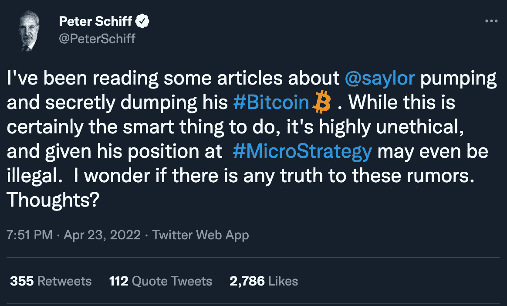
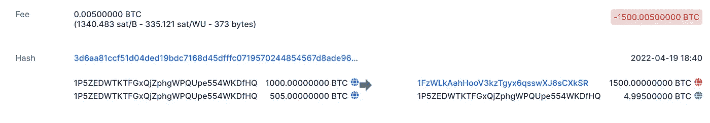
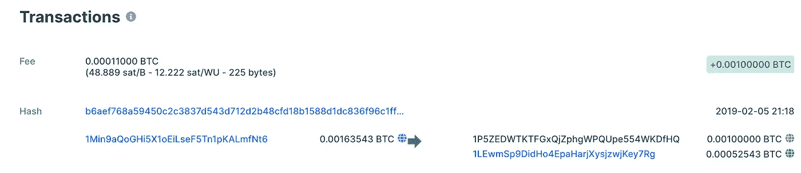

# 迈克尔·塞勒没有出售比特币

> 原文：<https://medium.com/coinmonks/michael-saylor-has-not-been-selling-bitcoin-3b8708dd00c5?source=collection_archive---------14----------------------->

最近有传言称迈克尔·塞勒一直在秘密出售比特币。

这不是真的。我看到的文章和推文做了一个假设，钱包地址“1 p5zedwtktfgxqjzphgwpqupe 554 wdf HQ”属于 MicroStrategy (MSTR)。这个钱包动了 1500 比特币。

这个钱包从 2019 年就开始活动了。

基于此，对我来说，很明显这不是 MicroStrategy 的钱包，因为他们从 2020 年 8 月开始购买比特币。这很可能是某个交易所的钱包。这是一个教训，永远要对你听到的关于比特币的一切持怀疑态度。crypto 的神奇之处在于，任何人都可以访问这种类型的信息，因此，请始终自行研究比特币相关话题的任何正面或负面信息。感谢阅读。

> 加入 Coinmonks [电报频道](https://t.me/coincodecap)和 [Youtube 频道](https://www.youtube.com/c/coinmonks/videos)了解加密交易和投资

# 另外，阅读

*   [3 商业评论](/coinmonks/3commas-review-an-excellent-crypto-trading-bot-2020-1313a58bec92) | [Pionex 评论](https://coincodecap.com/pionex-review-exchange-with-crypto-trading-bot) | [Coinrule 评论](/coinmonks/coinrule-review-2021-a-beginner-friendly-crypto-trading-bot-daf0504848ba)
*   [莱杰 vs n rave](/coinmonks/ledger-vs-ngrave-zero-7e40f0c1d694)|[莱杰 nano s vs x](/coinmonks/ledger-nano-s-vs-x-battery-hardware-price-storage-59a6663fe3b0) | [币安评论](/coinmonks/binance-review-ee10d3bf3b6e)
*   [Bybit Exchange 审查](/coinmonks/bybit-exchange-review-dbd570019b71) | [Bityard 审查](https://coincodecap.com/bityard-reivew) | [Jet-Bot 审查](https://coincodecap.com/jet-bot-review)
*   [3 commas vs crypto hopper](/coinmonks/3commas-vs-pionex-vs-cryptohopper-best-crypto-bot-6a98d2baa203)|[赚取加密利息](/coinmonks/earn-crypto-interest-b10b810fdda3)
*   最好的比特币[硬件钱包](/coinmonks/hardware-wallets-dfa1211730c6) | [BitBox02 回顾](/coinmonks/bitbox02-review-your-swiss-bitcoin-hardware-wallet-c36c88fff29)