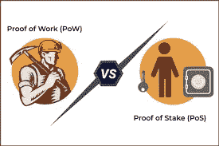

# 迈克尔·塞勒:工作的证明就是金钱。利害关系的证明就是信用。

> 原文：<https://medium.com/coinmonks/michael-saylor-proof-of-work-is-money-proof-of-stake-is-credit-3422b74d44d0?source=collection_archive---------11----------------------->

你有没有参加过这样一个会议，与会者必须就一个特定的动议达成一致？

如果是；

这就是所谓的**共识。**

**Consensus.**

在密码的世界里；共识是区块链节点(运行区块链软件的计算机)有效达成协议的标准化方式。区块链达成共识的主要目的是防止重复支出的情况；由此一个人同时向两个或多个钱包地址发送一定数量的代币。由于区块链采用的共识机制，每个区块都必须经过证明或验证，这使得不良行为者很难操纵区块链的交易。

> 就区块链而言；两个主要的共识机制是:**工作证明(PoW)和利益证明(PoS)。**

正是联系到上述背景，微策创始人兼 CEO 迈克尔·j·塞勒 2022 年 6 月 5 日发推文；[“权力就是金钱。PoS 就是信用。”](https://twitter.com/saylor/status/1533072638268035074?s=20&t=_VIkVMxHyd9X5erD-9XveQ)

**Official Tweet by Michael Saylor: “PoW is money. PoS is stake”.**

众所周知的事实是，Saylor Academy 的唯一受托人是一个全面的比特币马克思主义者(除了比特币什么都不知道的人)，并且由于比特币采用 PoW 共识机制；他支持它的生态系统是很正常的。

单看他的 Twitter 手柄就能看出他有多爱比特币，以及他是如何将比特币视为世界经济的未来。

**什么是 PoW 和 PoS？。**

**Proof of Work (PoW) vs Proof of Stake (PoS).**

PoW 是工作证明的简称，这是强大的比特币采用的共识机制。PoW 的工作方式是，挖掘者(验证者)必须想出正确的散列(一长串字符)来匹配比特币的当前目标。找到正确的散列组合是非常困难的，但是因为全世界有数百万台计算机在做这件事；这个过程通常需要 10 分钟。当矿工得到正确的哈希组合时，一个区块(简单的交易)被验证并添加到比特币网络，矿工在 BTC 获得奖励。

从本质上讲，Pow 就像一场比赛，成千上万的计算机为了获得奖励，不得不相互竞争以获得正确的哈希组合。矿工赢得这场比赛的机会取决于他们在采矿过程中使用了多少计算能力。**计算能力越强，获得正确哈希的几率越高。**

利益证明(PoS)是一种共识机制，与工作证明有些不同。事实上，它被认为是 PoW 的更好的替代品，因为它需要更少的计算能量。有了 PoS，加密货币的所有者将不得不锁定他们的硬币(股份)；建立他们自己的验证器节点，并希望有机会被选中来验证一个块，如果被选中的验证器正确地审查了一个块中的交易，他将获得一个奖励(这是更加密的),但如果他没有；他会失去他的硬币。要理解 PoS 的流程，需要采用一个例子；

本质上，本先生把他的卡达诺(阿达)作为赌注，并建立了他自己的节点；每当 Cardano 网络需要处理一个数据块时，它的协议将选择一个验证器来检查交易，然后将数据块添加到 Cardano 区块链中。如果幸运的话，Ben 先生被选为验证者，他正确地检查了交易；他得到了更多的 ADA，但是如果有不准确的信息，他就失去了他的 ADA。

被选为验证者的几率取决于你押了多少加密货币；你的赌注越高，你成为验证者的机会就越大。

> 赌注周期是验证者锁定其加密货币、通过块验证过程(如果正确完成)然后取回其密码和赌注奖励(更具加密性)所需的时间。这意味着。在下注周期的持续时间内，验证者既不能访问他最初下注的代币，也不能访问他的下注奖励。

工作共识机制的证明需要数以吨计的矿工竞相获得准确的哈希组合，谁先获得它，谁就为区块链增加一个区块，并获得奖励。利益一致机制的证明要求验证者保证他们的密码，以换取向区块链添加块的机会，如果他们做对了，他们将得到奖励，如果他们做错了，他们将失去他们的利益一致的密码。本质上，PoW 需要大量的挖掘器来验证一个块，PoS 只需要一个挖掘器，从而选择所需的验证器。

**回到他的推特。“权力就是金钱。PoS 就是信用。”**

基于对两种共识机制的分析；迈克尔·塞勒推特的概念是这样的:

在 PoW 工作的矿工根据他们验证区块的工作量获得报酬；把这看作是一种“挣得你的工作”的共识机制，没有承诺，没有风险。鉴于 PoS 需要验证器来锁定他们的加密货币，如果验证器被接受向网络添加新块并且正确完成，他们将获得奖励，但如果不是这样，他们将失去他们承诺的硬币。

**结论。**

截至本文撰写之时，没有任何共识机制被证明是最佳的；这种动力很慢，而且要消耗大量能量，而这些能量中只有很少一部分是可再生的，然而它被证明是最可靠的共识机制。另一方面，PoS 是可扩展的和地球友好的，但是在安全性方面，它不是最佳选择。

我们仍然是密码空间的早期鸟类，希望在未来，一个新的和完美的共识机制将被发明，一个解决区块链共识机制的 3 个需求(速度，安全和地球友好)。

> 加入 Coinmonks [Telegram group](https://t.me/joinchat/Trz8jaxd6xEsBI4p) 并了解加密交易和投资