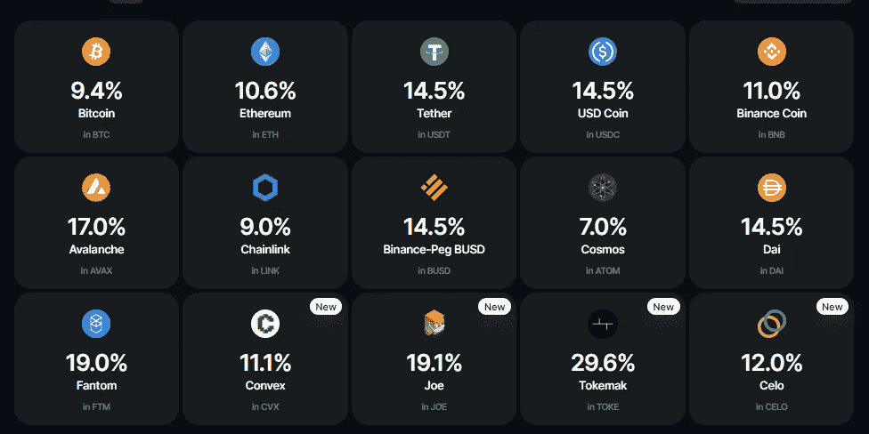
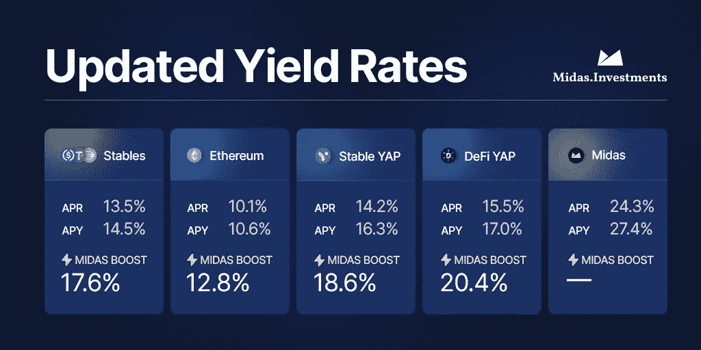
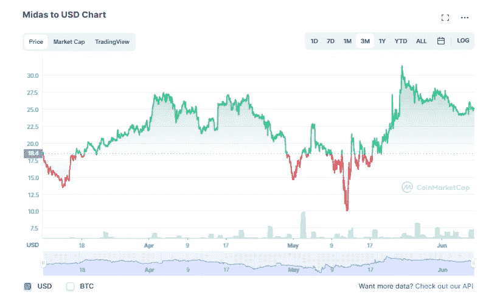

# MIDAS Investments——深入审查(2022 年更新)

> 原文：<https://medium.com/coinmonks/midas-investments-an-in-depth-review-updated-june-2022-fbda7b01a12a?source=collection_archive---------3----------------------->

Still the go-to for Stables

# 什么是迈达斯投资？—简短回顾

与其他投资平台类似， [Midas Investments](https://midas.investments/?p=0191) 是一个加密投资平台，你可以通过各种不同的加密货币获得被动收入。但是它与其他平台的区别是什么呢？APY 汇率。如果你关注过我在 T2 的其他帖子，你会知道我是 Midas 投资的忠实粉丝。它们的收益率已经更新，我将很快介绍，但尽管有这些变化，它们仍然继续提供一些最好的自然回报(甚至比之前的 Midas Boost 略有增加)，这些回报每天都在复合和增加:

几个月前，Midas 迎来了他们的[四周年纪念日](https://www.youtube.com/watch?v=KjtH3r5ckf4)，这在加密领域是一个令人印象深刻的壮举。(这相当于狗年的几十年，对吗？)而且他们一直提供比任何非托管平台都高的回报。尽管市场在 2 月和 5 月崩盘，但 Midas 获得了指数级的新资本，这最终导致他们一次又一次地重新制定和降低策略风险，以提供持续稳定的回报。随着市场在这一点上内爆，毫不奇怪的是，在 4 月底，他们宣布他们的利率必须调整，以保持其用户的可持续性，随着 5 月份的另一次大幅下降，他们不得不再次降低部分利率。然而，尽管有这些变化，他们仍然继续为稳定的硬币提供一些最好的本地利率(都是 14.5%)，或者现在大约 17.6%的 APY，如果你通过他们的 Midas boost 支付的话。没有人喜欢听到利率下调，但看着我投资组合中其余部分的所有红色，我完全理解为什么提供比市场其他部分高出 2 倍以上的利率从长期来看是不可持续的。

在使用 Midas 近 7 个月之后，我很难再认真对待任何其他“知名”平台，如 Blockfi 和 Gemini，它们充其量只能在蓝筹股上提供微不足道的 take any，或者如果你幸运的话，在 stables 上可能提供 9%左右的利率。通过他们的 AMA、youtube 视频和 discord，该团队继续努力保持非常透明，并且他们继续就他们已经做出或计划做出的步骤或改变给出相当充分的通知(我将进一步深入了解)，这最终增加了我对他们生态系统的信任度。

# 更新的费率

简而言之，最大的新闻是 5 月 23 日生效的利率变化。这些措施如下:

[https://blog.midas.investments/rate-updates-for-stablecoins-eth-and-midas-future-plans/](https://blog.midas.investments/rate-updates-for-stablecoins-eth-and-midas-future-plans/)

你也会注意到，虽然稳定的货币利率下降了，但实际上他们的利率却上升了。并且尽管马厩有所减少，但仍明显高于其他大多数非托管平台。

没有人喜欢听到利率下降，但利率下降基本上允许他们继续经营风险降低。从本质上讲，他们已经重建了投资组合，以降低所持资产的风险，确保可持续性。除此之外，你还可以通过 Midas boost 获得同样的收益(如果不是更高的话)。稍后我会更深入地探讨 Midas 的代币学，但如果你想选择 Midas 增强而不是原生代币/硬币利息，只需点击一个按钮。

自 2 月份以来，他们还增加了几个不同的令牌，如乔，CVX 和托克，同时保持了一些最高的 APY 老歌，如 AVAX 在 17%的 APY(我还没有在其他地方看到)。然而，一些代币的回报率没有 7% APY 的 ATOM 好，只有你把它放在自己的 Keplr 钱包里所能得到的一半。尽管如此，Midas 确实提供了一种便捷的方式，可以持续获得蓝筹股密码以及稳定硬币的相对较高的利率。

# 他们是如何产生回报的？

如果你像我一样，你可能会想的第一件事是:他们到底是怎么得到这些收益率的？顺便说一句，这也是几个月前在与首席执行官的[采访中被问到/回答的第一个问题，答案似乎很深刻，但简言之:流动性池、收益率保险库、动态贷款和杠杆。主要是对于流动性池部分，他们通过 sushiswap 或 uniswap 等地方配对许多蓝筹股密码。虽然他们没有提供细节，但是他们在他们的](https://www.youtube.com/watch?v=dtoHzDT2FJw)[维基页面上提供了一个鸟瞰图。](https://wiki.midas.investments/introduction/how-does-midas-generate-yield)

顺便说一句，由于市场条件和新资本的大量涌入，Midas 投资部门(现在由 16 人组成，其中大多数是被解雇的人)正在微调自动化策略，这将有望使他们的规模达到数十亿美元的 TVL。简而言之，Midas 的大部分股份都分散在多个第 1 层协议上，并特别强调分散稳定的硬币农场。他们投资组合中的一小部分 5-10%通常被投入风险较高的资产，但正如我稍后将谈到的那样，总体而言，他们正在系统地降低风险，并降低头寸的杠杆比率。考虑到这一点，他们表示，近期不应进行利率调整，即使有，也不应像过去几个月那样大幅下调，这意味着他们只能根据市场情况在名义上提高或降低利率 5-10%。

几个月前，他们的新策略之一是增加 CVX，目的是利用他们的凸控股参与曲线的流动性战争。如果你不熟悉 Curve，它本质上是一个稳定的硬币中心，在这里，Curve/Convex 持有者可以投票决定他们的流动性池中哪些可以获得更高的回报。

说到曲线，我也很欣慰地发现，在 Terra 死亡螺旋之后，Midas 没有把他们的任何资金投资到 Anchor 或 UST，这实际上让我个人感到惊讶，因为我只是做了一个总括的假设，这就是他们如何能够在他们的马厩中产生如此高的利率。他们还多次宣布，他们纳入的去风险战略的一部分涉及到他们资产的去杠杆化，我也很高兴听到这一点，因为我知道在当前的市场上有这么多的人正在经历[的清算](https://www.coinglass.com/LiquidationData)。如果你从未听说过杠杆，它本质上是提供抵押品以借入更多抵押品，如果你是德根，你可以一次又一次地这样做。杠杆头寸有很大的好处，因为它允许你用更大的资金获得更大的收益，但它们也有很大的坏处，即更大的损失和清算。

迈达斯对他们所有的方法 100%透明吗？没有。但随着我了解到他们的策略对不同市场条件的适应性和数量，我明白了为什么很难做到这一点——许多可能给出的细节可能会不断变化。尽管如此，我不得不说，我已经搜索了 YouTube 视频、discord 频道和其他独立评论，有一点是肯定的——使用 Midas 的人正在为他们的存款获得报酬，他们也一直在 Midas 来回存款和提取他们的加密货币，没有任何问题……多年来一直如此。重申一遍，我没有发现任何一项审查中他们不能提取或使用他们的资金。

# **安全措施**

审计:Midas Investments 计划让 [Armanino](https://www.armaninollp.com/) 进行审计，但这是在他们获得瑞士资产管理执照和/或阿联酋(迪拜)营业执照之后，他们预计这将在今年夏天完成。如果你没听说过阿玛尼诺，他们就是去年[审计 Nexo 的人。](https://nexo.io/blog/nexo-passes-real-time-armanino-audit-becomes-the-first-crypto-lender-to-shed-light-on-reserves)

保险:今年早些时候，为了增强安全性，尽管迈达斯本身没有保险，但所有资产现在都被放在了有保险的[防火墙上。我不是责任专家，但我的假设是，如果你的迈达斯持有的资产被黑客入侵，那么会有保障，但如果你自己被黑客入侵，那就没有保障了。对于包括 BlockFi 和 Celsius 在内的许多不同平台来说，这是一个非常相似的设置。我读到的一件有趣的事情是，当他们主要专注于 Masternodes 时，](https://www.fireblocks.com/platforms/security/) [Midas Investments 确实经历了一次黑客攻击](https://www.reddit.com/r/midas_community/comments/soa0wn/comment/hx9w87w/?utm_source=share&utm_medium=web2x&context=3)，但 Midas 用户从未感受到影响，因为该公司自己吸收了损失。虽然这是令人担忧的，因为黑客意味着漏洞，但我很欣慰的是，他们正计划接受审计，以帮助进一步识别潜在的漏洞。此外，对我来说，他们在将损失转嫁给他们的用户之前遭受了严重的财务损失，这一事实显示了他们的诚信，也更加增加了我对迈达斯的信任。

2-FA:与 1 月份相比，他们现在已经将 2-FA 电子邮件登录身份验证和 KYC 整合到了他们的平台中。从 5 月份开始，他们还引入了使用 google authenticator 的 2-FA 移动认证，并正在开发一个选项，允许用户将取款地址列入白名单。虽然它确实增加了平台本身的安全性，但我知道像 KYC 和谷歌登录这样的事情对一些人来说是一个巨大的威慑，尤其是对那些希望尽可能少地透露个人信息的人来说。唉，安全是有代价的。

# 有什么风险？

像任何非托管平台一样，最大的风险是**如果不是你的钥匙，也不是你的密码**。这就是为什么你一定要做自己的研究，看看你个人是否信任这个平台，并把你的资产交给它，这一点非常重要。也就是说，正如我之前提到的，他们已经在这个领域存在了四年多，从我发现的情况来看，他们有着非常出色的记录。如果你发现任何相反的情况，请联系我，因为我非常想听听。

**没有利率会永远持续下去，**尤其是如果市场继续低迷，我也无法想象这些利率会持续下去。话虽如此，我确实相信我们还没有看到当前熊市的底部，所以我确实相信利率在未来将不得不重新调整，但不是因为迈达斯缺乏尝试。此外，我过去在 BlockFi、Nexo 和 Celsius 等地方持有更多资产，但正如我们在这三家公司中看到的那样——你的规模越大，就越有可能受到监管。如果 Midas 继续吸引更多的用户和更多的增长，随着加密市场随着更多的监管而成熟，我无法想象这个肥缺会永远存在。

**俄罗斯**:乌克兰战争爆发前，迈达斯的总部原本在俄罗斯。自那以后，他们报告说，该小组的大部分成员已经转移到俄罗斯境外，其余成员也同意在必要时这样做。正如我之前提到的，他们正在瑞士和迪拜申请许可，以进一步分离他们以前的联系。在最后一次 AMA 中，首席执行官特雷弗更进一步报告说，他将于 5 月前往以色列，正式将自己的国籍改为以色列。也就是说，迈达斯团队的主要成员已经在 AMA 和他们的[维基页面](https://wiki.midas.investments/introduction/team)上公开了自己的身份，很明显，他们的团队正在变得越来越国际化。

# 迈达斯令牌

虽然这可能会有所改变，但目前$MIDAS 令牌除了作为 MIDAS 平台的储值工具之外，并没有真正的用途。换句话说，如果你在投资$MIDAS 代币，你就是在投资 MIDAS 本身。如果 Midas 赚的钱比预期的多，额外的价值将被转移到 Midas 流动性池，这反过来又增加了$MIDAS 代币的价值。在 Midas 中，代币的价值基本上是从 Midas boosts 循环到流动性池，然后再回到 Midas boosts。2 月下旬，他们报告说，目前的令牌发放速度大约为每天 1600 个令牌，然后在未来 3-5 年内限制在 500 万个左右，其中 150 万个押注于 Midas 本身。迄今为止，大约有 270 万本在流通。

我个人并没有在$MIDAS token 上投入太多，因为市值相对较低，对我来说风险有点太大，至少对目前的市场来说是这样。尽管如此，看看$MIDAS 过去几个月的价格走势，我可能是这个房间里最大的白痴，这让我们看起来甚至不像是在熊市:

One of the many reasons why there’s a TON of people on Midas’ discord channel that are diehard fans.

此外，现在另一个对我的威慑是令牌在 fantom 上，它最近受到了相当多的打击。今年 1 月，我对 fantom 的看法稍微乐观一些，但现在没那么乐观了。如果你有兴趣阅读更多关于代币本身的内容，我推荐你去看他们的最后一个视频。

# 结论

到现在一共七个月了，到目前为止我印象非常深刻的不仅仅是 Midas 团队，还有 Midas 社区本身。他们真的营造了一种环境，帮助像我这样的普通零售商通过他们的每周报告了解市场，并教会人们如何通过被动收入实现利润最大化。我对 Midas 越来越信任，随着市场变得越来越糟糕，我发现 Midas 是我持有和积累稳定硬币的第一选择，尤其是像 Anchor 这样的地方不再可行。

如果你还有任何问题，我强烈建议你看看他们最新的 youtube 视频，[最后一个](https://www.youtube.com/watch?v=a0GO3j-C2OQ)是在五月下旬与迈达斯的首席执行官特雷弗进行的。在这里，他深入回答了人们对迈达斯未来的许多潜在预期。如果你还没有尝试过 Midas 但是感兴趣，请考虑支持我的博客，使用我的会员链接: [https://midas.investments？p=0191](https://midas.investments/?p=0191)

否则，如果您有任何问题或意见，请随时在下面留下。感谢您的阅读，请务必关注我的新 twitter 账户:[https://twitter.com/CryptosWith](https://twitter.com/CryptosWith)

> 加入 Coinmonks [电报频道](https://t.me/coincodecap)和 [Youtube 频道](https://www.youtube.com/c/coinmonks/videos)了解加密交易和投资

声明:提醒一下，这不是财务建议，仅用于教育和娱乐目的。请一如既往地做自己的研究，找到最适合你的投资。干杯大家！

**资源**

1.  [https://midas.investments？p=0191](https://midas.investments/?p=0191)
2.  [https://nexo . io/blog/nexo-passes-real-time-armanino-audit-been-first-crypto-lender-shed-light-on-reserves](https://nexo.io/blog/nexo-passes-real-time-armanino-audit-becomes-the-first-crypto-lender-to-shed-light-on-reserves)
3.  [https://www.armaninollp.com/](https://www.armaninollp.com/)
4.  [https://www . Reddit . com/r/MIDAS _ community/comments/soa0wn/comment/hx9w 87 w/](https://www.reddit.com/r/midas_community/comments/soa0wn/comment/hx9w87w/?utm_source=share&utm_medium=web2x&context=3)
5.  [https://www.coinglass.com/LiquidationData](https://www.coinglass.com/LiquidationData)
6.  [https://blog . MIDAS . investments/rate-updates-for-stable coins-eth-and-MIDAS-future-plans/](https://blog.midas.investments/rate-updates-for-stablecoins-eth-and-midas-future-plans/)