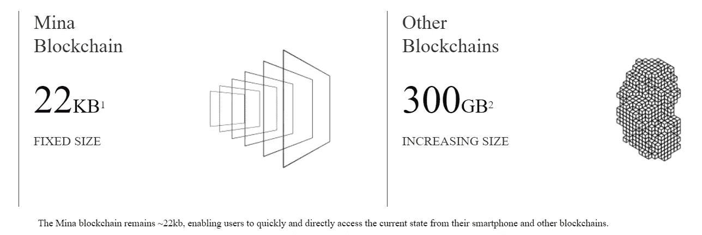
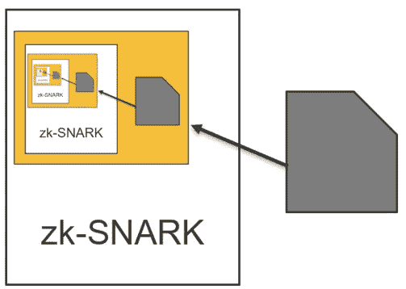
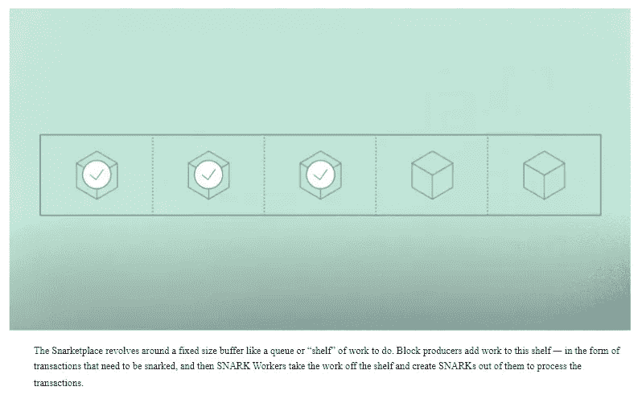
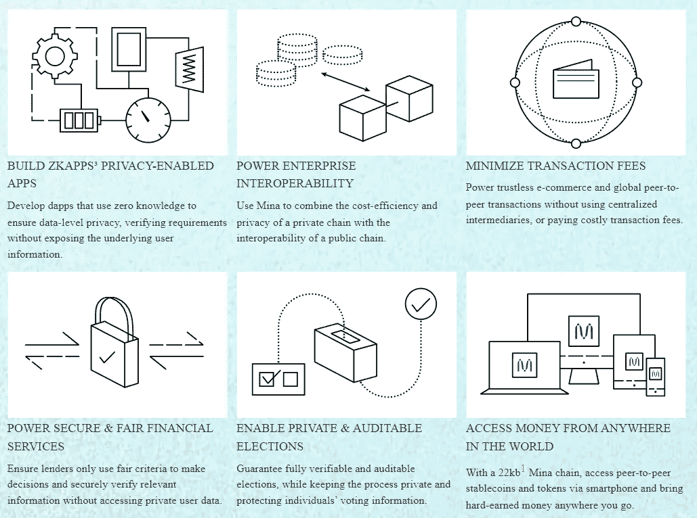

# 米娜:世界最轻的区块链

> 原文：<https://medium.com/coinmonks/mina-worlds-lightest-blockchain-154a04cae2f3?source=collection_archive---------61----------------------->

## 真正去中心化、数据主权、可扩展和简洁的区块链

## 概观

米娜是世界上最轻的第一层区块链。它被设计为保持 22 Kb 的固定大小，而其他 PoS 区块链的大小为 300GB 以上，并且还在增加。这使得最终用户甚至可以使用他们的智能手机运行实际的节点并验证网络。

目前，大多数最终用户自己并不与区块链交互。它们依赖于运行完整节点并充当 API 网关的基础设施公司，如 Infura、Alchemy 等。运行一个完整的节点是非常昂贵的，因为硬件要求非常高，因为为了验证交易，它们必须维护网络的完整历史。当涉及到节点操作时，大多数区块链不是分散的。这些中介或 API 网关可能会关闭，导致 dApps 在底层区块链运行时离线。最近有 [**Infura 断电**](https://decrypt.co/98457/metamask-ethereum-apps-down-infura-outage) 导致 metamask 做 down。这使得 Mina 在真正意义上是分散的，因为每个用户甚至可以使用他们的智能手机运行节点并验证区块链。

> 交易新手？试试[密码交易机器人](/coinmonks/crypto-trading-bot-c2ffce8acb2a)或[复制交易](/coinmonks/top-10-crypto-copy-trading-platforms-for-beginners-d0c37c7d698c)

## 技术

Mina 使用递归零知识证明来制作简洁的区块链。无论有多少事务或多少数据块，区块链大小都保持**恒定在 22Kb** 。zk-SNARK 是*零知识简洁非交互式知识论证*的首字母缩写。零知识证明就像在*瓦尔多在哪里*游戏中找到瓦尔多，而不透露他的位置或任何其他关于谁在他前面、后面或两边的信息。

Mina 使用 **zk-SNARKS** 将块组合成一个小的证书证明。这个证据证实了区块链状态。它确保所有交易都是有效形成和签署的，并且所有共识规则都得到正确遵守。Mina 使用 [Pickle 的](https://minaprotocol.com/blog/meet-pickles-snark-enabling-smart-contracts-on-coda-protocol) zk-SNARK 来维护递归验证证明，如证明中的证明。在高层次上，来自时间步长 n+1 的证明也可以验证区块链在时间步长 n 的状态，这意味着全部节点只需要维护最近的证明来验证整个历史。这允许 Mina 保持固定的大小，而不管有多少事务。因此，为了验证区块链状态，完整节点只需要访问单个证明，这比管理区块链的整个历史要容易得多，也小得多。

Mina 在 PoS 中使用来自 Cardano 协议的 **Ouroboros Samisika 共识机制**，略有修改。这是一个分散的、包容的和可扩展的机制，因为对参与者的数量没有限制。在块产生之前，不需要在节点之间通信，因为在块产生之前，没有人知道获胜者。因为没有人知道块生产者是谁，所以它是可证明安全的。没有像其他区块链那样的切割或粘合机制。

为块内的所有事务创建证明或标记需要一些计算工作。这将需要块生产者是超级计算机，这将导致集中化。由于 Mina 希望在商用硬件上进行批量生产，他们通过 **Snarketplace** 将工作分散到整个网络中。这是一个在整个网络中激励这些交易证明的市场。无论块中有多少个事务，它都可以消除块生成器的硬件需求。

在**snarketplace 中有两个主要角色:Snarkworkers 和 Block producer**。进行交易证明的节点称为 Snarkworks。区块生产者是指那些在网络中生产区块，并在他们创建的任何区块旁边创建区块链的 snark 证明的人。snarketpalce 围绕着一个固定大小的队列，这是一种“要做的工作”的架子。块生产者不断添加需要标记或验证的事务。Snarkworkers 通过从货架上取下作品并使用一种特殊的不可伪造的数字签名(称为“知识签名”)创建 SNARKs 来处理交易。这个签名包含 Snark 提供的费用以及钱包地址。然后，砌块生产商必须从 snarkworker 购买 SNARKS，然后才能向货架添加更多作品。如果一个交易块有多个报价，生产者选择最便宜的一个。试图改变公钥或窃取他人的作品本身将会破坏 SNARK，因为签名是嵌入在 SNARK 中的。

## 发展

Mina 团队目前正在构建**SDK**(软件开发工具包)，让他们在 Mina 上构建 dApps 变得容易。这些 dApps 被称为**SNAPPs(Snark powered decentralized Apps)**，使用由零知识技术支持的智能合约。一旦 SDK 发布，开发人员将能够用简单的**类型脚本**编写快照，使项目更容易开始。米娜的团队还在建立一个跨链桥，将米娜与以太坊和其他 EVM 兼容链如 Polygon，Arbitrium，Avax-C chain 等连接起来。这不仅会给 Mina 生态系统带来大量的开发者和 dApps，还会给 EVM 兼容生态系统带来利用 Mina 的 zk-proof 技术的能力。

## 用例

Mina 与其他 L1 区块链不同，因为它的大小是固定的，这使得用户可以轻松运行完整的节点，并与区块链本身进行实际交互。这使得它成为一个真正的分散式区块链，因为每个用户都在大规模运行其节点。这有助于维护区块链的完整性和数据隐私。一些用例围绕着跨链通信和数据主权。

**跨链通信**非常复杂、昂贵且有风险，因为它涉及从源链验证目标链的状态。Mina 的轻量级设计使链很容易桥接并能够访问隐私相关的功能。

Mina 通过让用户共享数据的所有权证明而不是共享真实数据来提供数据隐私。此外，用户运行一个完整的节点，因此数据永远不会离开用户的设备，他们只需共享证据。

目前，在线世界和连锁世界生活在筒仓。没有办法在不暴露他们的个人数据和侵犯他们的隐私的情况下与网络世界互动。有了 Mina 端到端系统，**数据隐私就成为可能**，用户可以使用 Mina 私下访问在线数据，以满足网络世界的要求。

在米娜上建造的可能性是无限的。例如:要登录一个帐户，你需要提供一个电子邮件 id 和密码，但通过 Mina，你可以证明你是电子邮件 id 的所有者，应用程序可以验证它。这对于在线和非在线世界都适用。对于贷款申请，Mina 的 snapps 可以连接到信用评分提供商，提供你的分数高于阈值限制的证明，而不是分享信用评分。

Mina 可以提供**免许可和可验证的网络神谕。** Mina snapps 可以在数据从线上转移到链上时，在不泄露数据的情况下与现实世界的应用安全地进行私下互动。

## 结论

Mina 正在尝试解决一个其他第 1 层区块链都没有讨论过的问题。其轻便的设计和固定的尺寸使其成为真正的大规模分散产品。大多数加密 dApps 和链远没有我们想象的那么分散。除了去中心化，Mina 的零知识技术允许应用利用各种新功能，包括经过验证的链外计算。数据隐私和跨链的高效跨链桥。然而，该技术仍在开发中，用户采用情况有待观察，但 Mina 提供的技术和用例代表了第一层区块链发展的重要一步。

**资源:**

[https://minaprotocol.com/use-cases](https://minaprotocol.com/use-cases)[https://Mina protocol . com/blog/what-are-snark-workers-and-the-snarke place](https://minaprotocol.com/blog/what-are-snark-workers-and-the-snarketplace)[https://Mina protocol . com/WP-content/uploads/economics white paper . pdf](https://minaprotocol.com/wp-content/uploads/economicsWhitepaper.pdf)