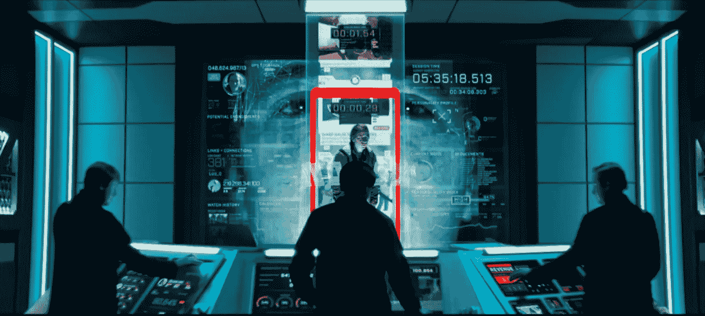

# 思维病毒、迷因和朋友

> 原文：<https://medium.com/coinmonks/mind-viruses-religion-and-memes-4ba3c06e84e7?source=collection_archive---------32----------------------->

这个世界充满了思想病毒。沃克、卡农、宗教、金钱都是病毒迷因，它们劫持了人类的思想，并利用它达到自己的目的。这是一个危险的世界。随着宗教失去影响力(新一代人类已经形成免疫力)，新的思维病毒劫持了控制迷因传播网络的个人，从而超越了教会、国家政府，最重要的是，甚至超越了为其传播提供便利的大学、科技和新闻公司。

有两种方式来管理人们——乐趣(胡萝卜)和恐惧(大棒)。历史上大多数政权和组织(教会、政府、公司..)一直偏爱后者。或许恐惧才是更有效的动力。“我必须做 X，而不是被[取消/解雇/扔进监狱/烧死在火刑柱上]。”

The Church violently imposing the Christianity mind virus onto Muslims at Acre (1191)

精神病毒是开源的。Satoshi 在发布 GitHub 知识库的那一刻就完全控制了比特币。与 Dogecoin 分叉比特币(增加了额外的功能——有趣的柴犬，与莱特币合并采矿和每块 10，000 多吉的不变奖励)非常相似，马丁·路德在 1546 年分叉天主教，创造了新教。在接下来的几年中，增加了一些新的功能，最重要的是财富作为“上帝爱你”的指示器

Doge, the funniest fork of money

一个世纪后，荷兰人——新教商人——在金钱迷因的基础上建立了他们那个时代最大的全球帝国。随后的英美帝国(两国都坚定地站在新教阵营)成功地在全球传播了货币迷因(以其当前的形式——石油美元)。

Tyler Durden, the Pope of 21st century

任何模因的最终价值只是它“让人做事”的程度。在前谷歌时代，金钱是最终的动力——因为它在新生活的创造和发展中不可或缺。

> “我会从 10 岁开始非常努力地学习，在 16 门 AP 课程中获得所有 A，进入哈佛，在高盛找到一份工作，赚很多钱，买房，买车，结婚，生子，快乐地退休。”

在一个信息和联系极难获取的世界(2010 年以前的时代)，上述经济学完美无缺。在当今世界，信息是免费的，维基百科是我们这个时代的亚历山大图书馆——人类知识的总和。LinkedIn 拥有 8 亿份任何人都可以联系的职业资料。哈佛的特权已经被仲裁剥夺了。几年后，目前形式的高盛将不复存在。

free and open-source fork of Goldman Sachs

Airbnb 和优步催生了共享经济，人类已经意识到友谊大于金钱——香港的富人开着特斯拉 Model X 在优步布莱克大街上兜风，不是为了钱(对千万富翁来说 15 美元是多少)，而是因为他们喜欢这种人际关系。金钱迷因正在灭绝。

OnlyFrens.gg — the first decentralized gamer fren-only network

在金钱思维病毒(Petrodollar 的所有权)不再有效激励人们的世界里，注意力集中的俘虏观众成为最受追捧的资源。思维病毒“挖掘”观众的注意力，并在人类头脑中复制自己，成功程度各不相同，直接取决于它们的 r0。

mind virus r0 is a function of its limbic resonance

沃克或卡农背后的策划者并没有控制它的意识形态分叉(“突变”)，就像他没有控制思想病毒网络中的个体人类“节点”一样。大型技术公司(以及在较小程度上的传统媒体网络)已经变得类似于教会，在迷因空间中定义正统和异端。他们是决定任何迷因传播速度(r0)的守门人。

在迷因传播至上运动中，开源社交网络和视频游戏迄今尚未被利用。社区拥有的开源网络(Dao)承诺与社区利益保持一致。视频游戏主宰了注意力集中的精神空间，它们为其俘虏观众提供了稳定的高质量天然多巴胺流，这种多巴胺是由对游戏中压力情景的真正战斗或逃跑反应分泌的。Onlyfrens 将尝试合并上述内容，创建一个只适用于 Fren 的开源分散式游戏网络。

> *加入 Coinmonks* [*电报频道*](https://t.me/coincodecap) *和* [*Youtube 频道*](https://www.youtube.com/c/coinmonks/videos) *了解加密交易和投资*

# 另外，阅读

*   [3 商业评论](/coinmonks/3commas-review-an-excellent-crypto-trading-bot-2020-1313a58bec92) | [Pionex 评论](https://coincodecap.com/pionex-review-exchange-with-crypto-trading-bot) | [Coinrule 评论](/coinmonks/coinrule-review-2021-a-beginner-friendly-crypto-trading-bot-daf0504848ba)
*   [莱杰 vs n 格拉夫](/coinmonks/ledger-vs-ngrave-zero-7e40f0c1d694) | [莱杰纳诺 s vs x](/coinmonks/ledger-nano-s-vs-x-battery-hardware-price-storage-59a6663fe3b0) | [币安评论](/coinmonks/binance-review-ee10d3bf3b6e)
*   [Bybit Exchange 审查](/coinmonks/bybit-exchange-review-dbd570019b71) | [Bityard 审查](https://coincodecap.com/bityard-reivew) | [Jet-Bot 审查](https://coincodecap.com/jet-bot-review)
*   [3 commas vs Cryptohopper](/coinmonks/3commas-vs-pionex-vs-cryptohopper-best-crypto-bot-6a98d2baa203)|[赚取加密利息](/coinmonks/earn-crypto-interest-b10b810fdda3)
*   最好的比特币[硬件钱包](/coinmonks/hardware-wallets-dfa1211730c6) | [BitBox02 回顾](/coinmonks/bitbox02-review-your-swiss-bitcoin-hardware-wallet-c36c88fff29)