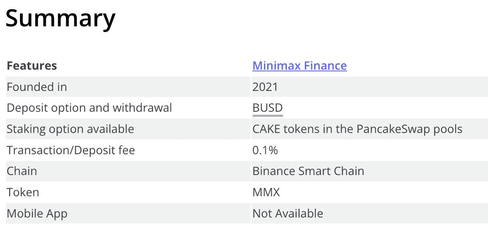
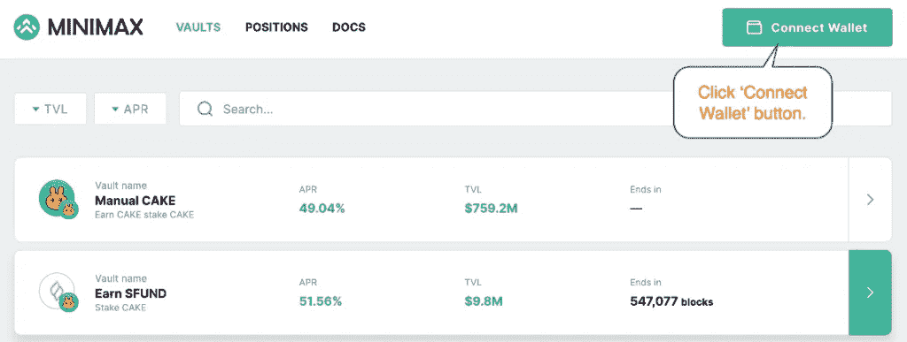

# Minimax 金融评论:安全还是合法？

> 原文：<https://medium.com/coinmonks/minimax-finance-review-995aacc8bbd9?source=collection_archive---------11----------------------->

分散融资为投资者提供了新的收入来源。Minimax.finance 是一个带有止损和获利的赌注、贷款和收益农业机会的聚合器。该平台让您享受 DeFi 的巨大好处(高 APYs 和易于资产操纵)，而不必担心其风险(非永久性损失或急剧令牌贬值)。然而，这对投资者来说公平吗？让我们在这篇 Minimax 财经评论中找到答案。

# 关键特征

*   [Minimax Finance](https://coincodecap.com/go/minimax-finance) 为[的赌注](https://coincodecap.com/staking-crypto)，贷款和农业存款(以前没有的东西)引入了止损和获利功能。
*   当股份的价值低于止损水平或高于获利水平时，它会被转换为稳定的硬币(目前是 BUSD，以后会增加更多的选项)。
*   BUSD 会自动发送到用户的钱包中。
*   当前版本允许从 PancakeSwap、Beefy 和 Venus 平台下注，同时设置止损和止盈水平。
*   独立的 CEX 式位置，用于打桩和耕作，具有独立的用户定义参数
*   截至目前，Minimax Finance 已在[币安智能链](https://coincodecap.com/binance-chain-vs-binance-smart-chain) (BSC)上推出，其他区块链也将很快推出。

# Minimax 财务评论:概览

Minimax Finance 是一个[去中心化应用](https://coincodecap.com/what-are-dapps-an-ultimate-guide)，它允许你获得 [DeFi](https://coincodecap.com/best-defi-apps) 的好处，同时避免或至少最小化风险。使用 Minimax Finance，用户将能够为他们的赌注和养殖存款设置止损和盈利参数，如果存款价值大幅下降或暴涨，将立即从赌注/养殖池中删除，并转换为稳定的硬币。此外，Minimax 将在不久的将来扩展到其他区块链，首先是在 Polygon 上集成 Aave 平台。

***亦作阅读，*** [***前 5 名为***](https://coincodecap.com/top-5-defi-tokens-to-look-out-for-in-2022) 的 DeFi Tokens

[访问 MINIMAX FINANCE](https://coincodecap.com/go/minimax-finance)

# Minimax 财务评论:界面

Minimax Finance 刚刚推出了其平台的第二个版本。用户界面简单易懂。

# Minimax 金融如何入门？

按照以下步骤开始:

## 如何连接 Minimax？

*   要开始使用 Minimax，用户必须首先将他们的钱包链接到该平台。

[开始使用 MINIMAX FINANCE](https://coincodecap.com/go/minimax-finance)

*   一旦用户点击“连接钱包”按钮，就会出现一个带有钱包选项的弹出窗口。

*   选择钱包后，用户需要验证钱包中的链接，Minimax 即可使用。

## 如何在 Minimax 建仓？

*   要开立头寸，请转到“金库”选项卡并选择一个金库。
*   当您单击一个存储库时，将出现下面的表单。

*   点击“存款”按钮后，等待几秒钟以建立头寸。完成必要的交易并在币安智能链上记录头寸数据需要时间。

## 如何在 Minimax 中管理一个职位？

*   您可以在“职位”页面查看您的未结职位。
*   任何职位都可以改变或撤销。单击您想要更改的位置，将出现以下表单。

[参观 MINIMAX 金融](https://coincodecap.com/go/minimax-finance)

*   可以在“位置”页面上查看最新的位置数据。

# Minimax 金融是如何运作的？

*   首先，客户通过将密码存入金库来创建头寸。创建头寸时，客户可以指定止损和止盈水平(可选)。
*   这些头寸受到持续监控。当头寸达到止损或获利水平时，清算开始。我们的平台使用 Chainlink 价格反馈来验证止损和止盈是否正确启动。
*   一旦通过验证，止损或止盈事件将在意式冰淇淋网络的帮助下处理——代币将被转换为稳定的硬币(目前是 BUSD，以后会有更多选项)。
*   转换后，稳定的硬币被转移到客户端的钱包。
*   Minimax 的智能合约可能会升级，以提供新的功能和解决小问题。
*   一旦平台成熟，DAO 将被部署。MMX 是治理的象征；它将兼容标准的 DAO 特性，比如提议等等。每个客户的投票权将由 MMX 的数量决定。

***亦读，*** [***3 款最佳期货交易 Bot |期货 Bot***](https://coincodecap.com/futures-trading-bot)

# Minimax 财务评论:费用

目前该平台没有相关费用，用户只需为交易付费。稍后将对存款收取 0.1%的费用。该费用不适用于 MMX 或 MMX-BNB LP 代币的赌注。

# Minimax 财务评论:费用

目前，Minimax 收取的唯一费用是 0.005 BNB，这是支付给意式冰淇淋网络的可靠处理止损和获利事件。

稍后将对存款收取 0.1%的费用。该费用不适用于 MMX 或 MMX-BNB LP 代币的赌注。

# Minimax 金融评论:其他奖金

*   **面向早期用户。**

部署智能代理合同会导致一定的天然气支出。所以在平台上线之前，极小金融会预部署一百个代理智能合约。因此，产生前 100 个头寸的幸运客户将支付交易费用，并获得免费的代理合约。该系统将重新利用当头寸达成时变得可用的代理智能合约，以降低客户费用。

*   **空投**

除了上面列出的奖励，平台客户将根据在 Minimax 存入的资金数量定期获得空投。

[从 MINIMAX FINANCE 中获益](https://coincodecap.com/go/minimax-finance)

# 用 Minimax Finance 投资安全吗？

Minimax 是一家早期初创企业；因此，用极小极大投资可能有风险，但它也能带来难以置信的利润。网站信任分数较低，但它具有有效的 SSL 证书。因为是新平台，所以很难预测其可信任度。如果你想投资 Minimax，随时更新他们的公告，并从它的创造者那里了解更多关于这个项目的信息。

# Minimax 金融评论:替代方案

*   **KillSwitch。金融** : KillSwitch 是一款智能产量聚合器，旨在为高产农民提供便利和安全。它还提供了止损/止盈功能，这是一个自动化系统，可以根据用户预设来简化订单。
*   **YieldShiled.com:** 使用智能合约和人工智能功能，发现新的最大收益农场，自动销售用户的收益率以获得复合收益，并快速进入下一个最佳机会，同时保持在指定的风险参数内。

***亦读，*** [***前 5 名 Crypto.com 另类赚利息***](https://coincodecap.com/crypto-com-alternatives)

# Minimax 金融评论:利弊

# 赞成的意见

*   这是可能的股份所有受欢迎的令牌，包括 BTC，瑞士联邦理工学院，BNB，总督等，止损和盈利
*   用户可以在一个赌注池中开立多个赌注头寸。
*   平台上不需要支付服务费。
*   一家名为 Hacken 的领先网络安全咨询公司仔细审核了 Minimax 的智能合同，并授予其“安全良好”的评级，使其不存在安全问题。

# 骗局

*   在某些情况下，一旦代币价格达到止损或获利水平，头寸可能不会立即清算。当滑动量高于用户允许值时，就会发生这种情况。
*   因为 Minimax 是一个分散的应用程序，所有位置数据都存储在区块链上，因此是公开可用的。

它没有移动应用程序(但可以通过 dApp 浏览器访问，如 Trust Wallet)。

# 结论

收益率制定者的主要担忧是他们的赌注头寸价值大幅下降。Minimax Finance 是一个分散式应用程序，它提出了一个解决方案，为用户提供了一个简单的界面来建立带有止损/获利功能的赌注头寸，以保护他们的资产，使他们能够享受高 apy 而不用担心风险。它正在开发解决方案，让投资者更容易获得无风险收益。因为它是一个新的平台，预测它的可靠性、合法性和可信度是具有挑战性的。

[访问 MINIMAX FINANCE](https://coincodecap.com/go/minimax-finance)

# 常见问题

*   【Minimax 有手机应用吗？

不，它只有一个网络应用程序。

*   **极小极大平台有代币吗？**

是的，它的代币代号为 MMX，总共供应 1 亿枚代币。

*   赌 MMX 代币有奖励吗？

下注 MMX 30 天或 90 天的平台用户将有资格获得基于下注令牌的平台费用折扣。
1。基本级别 0–1，000 MMX 赌注— 0.1%的费用(无折扣)
2。青铜级 1，000–5，000 MMX 赌注— 0.09%的费用(10%的折扣)
3。白银级 5000–10000 MMX 赌注— 0.08%手续费(20%折扣)
4。黄金级别 10，000–50，000 MMX 赌注— 0.07%手续费(30%折扣)
5。Prime 级别 50，000+ MMX 赌注— 0.05%的费用(50%的折扣)

*   **我为什么不直接在 Pancakeswap 上下注呢？**

你应该首先使用 Minimax Finance
有两个主要原因——你可以在平台上建立止损和止盈水平。如果蛋糕价格低于止损水平或高于你选择的止盈水平，它会立即提取你的赌注存款，并将其转换为 BUSD。另一个原因是，你将有资格获得 MMX 令牌空投。

**亦读，**

*   RevenueBot 评论:它是安全的还是合法的？
*   无聊猿游艇俱乐部(BAYC)评论:这是最好的 NFT 收藏吗？
*   《CBET 评论》:比特币赌场是安全的还是合法的？
*   [KuCoin 点评|安全还是合法？](https://coincodecap.com/kucoin-review)
*   [Cloudbet 赌场评论:它是安全和合法的吗？](https://coincodecap.com/cloudbet-casino-review)

